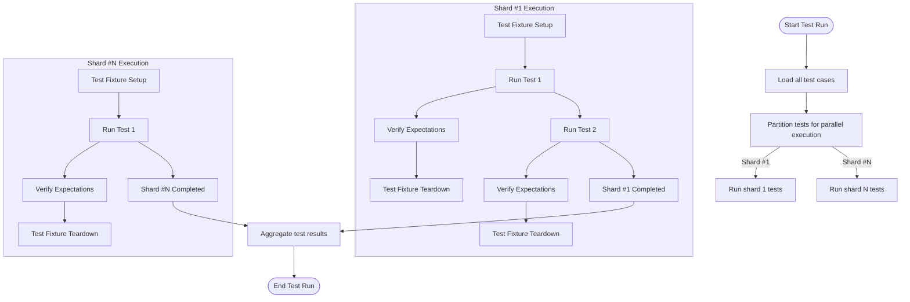

# Scalability and Performance Fundamentals

Understanding a testing framework's scalability and performance is essential to maintaining both developer productivity and test reliability as your codebase grows. This guide introduces the key concepts impacting test scalability in GoogleTest, focusing on test case isolation, parallel test execution, and strategies for managing large test suites effectively.

---

## Why Scalability and Performance Matter

As projects expand, test suites can balloon, increasing the time needed to run them and the resources they consume. Efficient test execution ensures quick feedback cycles, enabling faster development and safer refactorings. Poorly scaled tests can lead to flaky behavior, slow CI pipelines, and decreased developer confidence.

---

## Core Concepts Impacting Scalability

### 1. Test Case Isolation

Every test should run independently to avoid interference:

- **Complete Isolation:** Tests shouldn't share or mutate global or static states that affect others.
- **Fixtures:** Use test fixtures to set up and tear down state per test.

*Example:* If you test a component that interacts with a configuration object, mock that configuration separately per test to prevent state bleed.

<Check>
Always ensure your tests clean up side effects. Sharing state can cause intermittent failures and hard-to-debug issues.
</Check>

### 2. Test Parallelism

GoogleTest supports running tests in parallel, leveraging multicore CPUs to reduce overall execution time:

- **Independent Tests:** Ensure tests don't depend on shared mutable state or external resources that can't be concurrently accessed.
- **Test Sharding:** Divide tests into shards to distribute among parallel workers.

*Practical tip:* Use `--jobs` flag or test runners integrating with GoogleTest to execute tests concurrently.

<Info>
Parallel tests accelerate CI but require careful resource management, such as isolating file I/O or mocking external services to avoid race conditions.
</Info>

### 3. Handling Large Test Suites

Large test suites can be difficult to maintain and slow to execute:

- **Test Selection:** Run only affected tests during local development.
- **Test Categories:** Use labels and filters to focus on fast or critical tests.
- **Test Fixtures Reuse:** Avoid expensive setup operations by reusing fixtures when possible.

*Example:* Use `--gtest_filter` to execute tests matching a pattern.

<Warning>
Beware of tests with heavy dependencies or lengthy setups. They can bottleneck your test suite.
</Warning>

---

## GoogleTest Strategies for Fast and Maintainable Tests

GoogleTest incorporates several design choices and features that enhance scalability:

- **Scoped Setup and Teardown:** Using fixtures ensures only necessary setup is performed per test.
- **Mocking with gMock:** Efficient mocks let you isolate dependencies, eliminating slow external interactions.
- **Expectation Management:** Using `ON_CALL` and `EXPECT_CALL`, you control exactly which interactions are verified, preventing over-specification that slows tests.
- **Uninteresting and Unexpected Calls:** gMock allows choosing strictness modes (`NiceMock`, `NaggyMock`, `StrictMock`) that balance performance and feedback noise.

---

## Recommended Best Practices

- **Design for Isolation:** Write tests as independent units to maximize parallelism.
- **Use Mock Objects:** Mock out slow or nondeterministic external dependencies.
- **Focus Your Expectations:** Use `ON_CALL` liberally for default behaviors; use `EXPECT_CALL` only when verifying interactions.
- **Leverage Test Filters:** Run subsets of tests regularly to speed up development cycles.
- **Profile and Optimize:** Measure test execution time to identify bottlenecks.

---

## Common Pitfalls and Troubleshooting

### Pitfall: Tests Failing Sporadically When Run in Parallel

Cause: Shared global state or external resource contention.

Solution: Refactor tests to avoid shared state, use mocks, or serialize affected tests.

### Pitfall: Test Suite Growing Unmanageably Large

Cause: Lack of test categorization, too many slow tests.

Solution: Introduce test labels, prioritize fast tests, break large suites into smaller logical units.

### Pitfall: Mock Expectations Over-restricting Tests

Cause: Excessive `EXPECT_CALL` statements causing brittle tests and slower execution.

Solution: Prefer `ON_CALL` for default behavior; use `EXPECT_CALL` for behavior verification only.

---

## Diagram: Test Execution Flow with Parallelism and Mocking

---

## Summary

This guide has outlined the fundamental principles that impact GoogleTest’s scalability and performance. By isolating tests, leveraging parallel execution, carefully managing expectations with gMock, and organizing tests efficiently, you maximize speed and reliability of your test suite. Following these practices prevents common pitfalls like flaky tests and slow feedback loops.

---

## Related Documentation

- [gMock Cookbook](https://google.github.io/googletest/gmock_cook_book.html) — Practical recipes for mocking complex interactions.
- [gMock for Dummies](https://google.github.io/googletest/gmock_for_dummies.html) — Beginner-friendly guide to GoogleMock.
- [Mocking Reference](https://google.github.io/googletest/reference/mocking.html) — Detailed API documentation for mocking features.
- [Advanced Mocking Patterns](https://google.github.io/googletest/guides/advanced-mocking-patterns.html) — For sophisticated test setups and performance strategies.
- [Test Performance Optimization](https://google.github.io/googletest/guides/integration-and-realworld/performance-tips.html) — In-depth performance tuning advice.

---