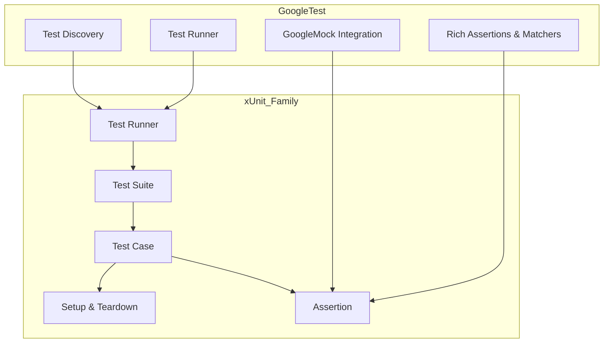

# xUnit Patterns and GoogleTest’s Place

GoogleTest stands as a prominent member of the xUnit family, embraced widely in the C++ ecosystem for unit testing and mocking. Understanding GoogleTest in the context of the xUnit architectural ideas illuminates its design motivations, conventions it embraces, and unique adaptations tailored to C++ developers.

---

## What is the xUnit Family?

The xUnit family refers to a category of unit testing frameworks that share architectural patterns and design principles originally popularized by JUnit (for Java). These frameworks provide a structured approach to writing, organizing, and executing automated tests with qualities such as:

- Test discovery and organization via test suites and test cases.
- Clear separation of test setup, execution, and teardown.
- Assertion macros for validating expectations.
- Test runners to automate running tests and reporting results.

xUnit frameworks aim to simplify the process of writing repeatable, maintainable, and automatable tests.

## GoogleTest’s Inheritance of xUnit Architectural Ideas

GoogleTest has been purpose-built to align with the xUnit paradigm while addressing the specifics of C++ development:

- **Test Discovery & Structure:** GoogleTest automatically discovers test cases and suites through macros (`TEST`, `TEST_F`) without requiring explicit registration, conforming to the xUnit convention of structured test hierarchies.

- **Test Fixtures:** Supports test fixtures allowing common setup/teardown, matching xUnit’s lifecycle management.

- **Assertions:** Provides a rich set of assertion macros developed specifically for expressive, clear test validations.

- **Test Runner Integration:** Out of the box, GoogleTest includes a flexible test runner that integrates test discovery, execution, result collection, and reporting. This aligns with the runner concept at the heart of xUnit tools.

## GoogleTest’s Test Discovery and Runner within xUnit Conventions

The test discovery mechanism works by scanning for `TEST` and `TEST_F` registrations via static initialization, in accordance with xUnit practices of automatic test collection.

The runner, activated via `RUN_ALL_TESTS()`, delegates test execution in the discovered test suites, managing lifecycle callbacks, assertion tracking, and failure diagnostics.

Unlike some older xUnit tools that pushed for writing boilerplate code to register tests, GoogleTest’s automatic paradigm fits modern C++ workflows elegantly.

## What Makes GoogleTest Unique in the C++ Ecosystem?

GoogleTest’s uniqueness arises from marrying xUnit principles with the intricacies and idioms of C++:

- **Seamless Mocking Integration (GoogleMock):** GoogleTest includes a powerful mocking framework that extends xUnit concepts to interaction-based testing, providing `MOCK_METHOD`, `EXPECT_CALL`, and other constructs rooted in xUnit’s structural foundations but advanced for C++’s type system.

- **Support for C++11 and Beyond:** GoogleTest leverages modern C++ features such as smart pointers, move semantics, and lambdas to provide expressive and resource-safe test constructs while maintaining xUnit design patterns.

- **Rich Assertions & Matchers:** GoogleTest expands typical xUnit assertions with domain-specific matchers and predicates, tailored for C++’s challenges and idiomatic testing needs.

- **Flexible Test Organization:** Supports parameterized tests, typed tests, and value-parameterized tests, pushing beyond the basics of traditional xUnit frameworks in structuring tests for generic and template-based code.

- **Cross-Platform and Multi-Compiler Support:** GoogleTest’s portability across popular platforms, including Windows, Linux, and macOS, coupled with robust multi-compiler support, brings xUnit patterns effectively to C++ environments.

---

## User Workflow: Seeing GoogleTest in Action within the xUnit Model

1. **Write Tests Using Macros:** Use the `TEST` or `TEST_F` macros to create test cases that belong to named test suites (fixtures).

2. **Define Mock Objects (Optional):** For interaction testing, define mock classes using `MOCK_METHOD` macros and set expectations.

3. **Build and Run:** Compile the test binary and execute it. GoogleTest auto-discovers tests; no need to manually register.

4. **Test Runner Executes Tests:** The runner invokes each test with setup and teardown, collects assertion results.

5. **View Test Results:** Results are reported with clear pass/fail information, stack traces, and useful diagnostics.

By following this flow, developers experience the established xUnit pattern enlivened with C++-focused automation and expressiveness.

---

## Practical Example of GoogleTest’s xUnit-Style Test

```cpp
#include <gtest/gtest.h>

// Sample test suite with a test case.
TEST(MathTest, Addition) {
  EXPECT_EQ(2 + 2, 4);
  EXPECT_NE(2 + 2, 5);
}

// Using a test fixture.
class CalculatorTest : public ::testing::Test {
 protected:
  void SetUp() override {
    value = 42;
  }

  int value;
};

TEST_F(CalculatorTest, ValueIsSet) {
  EXPECT_EQ(value, 42);
}

int main(int argc, char **argv) {
  ::testing::InitGoogleTest(&argc, argv);
  return RUN_ALL_TESTS();
}
```

This example adheres directly to xUnit conventions:
- Organized tests (`TEST`, `TEST_F`).
- Use of setup methods (`SetUp()`)
- Assertions for validation.
- The test runner entry point.

---

## Summary Diagram: Conceptual Map of GoogleTest in the xUnit Framework



---

## Best Practices and Common Pitfalls in GoogleTest’s xUnit Use

- **Prioritize test isolation:** Keep tests small and focused on one behavior, as inspired by xUnit’s unit testing philosophy.

- **Leverage Fixtures for Shared Setup:** Use `TEST_F` to set up common test environments cleanly.

- **Avoid Over-Specification:** Only assert what matters; too strict tests may break for irrelevant code changes.

- **Set Expectations in Mock Before Usage:** When using GoogleMock, expectations (`EXPECT_CALL`) must be declared before exercising the mock.

- **Use Built-in Matchers:** Utilize matchers (`_`, `Eq()`, `Gt()`, etc.) to write readable assertions aligned with xUnit’s declarative style.

- **Manage Test Dependencies:** Keep dependencies explicit and lightweight to maximize test stability and speed.

- **Beware of Non-Virtual Destructors:** Must mark destructors of interfaces as virtual to avoid undefined behavior in mocks.

- **Keep Tests Independent:** xUnit recommends independent and repeatable tests; GoogleTest supports this through its clean lifecycle management.

---

## Summary

GoogleTest fully embraces the xUnit architectural paradigm by providing structured test discovery, rich assertions, automatic test execution, and fixture support, optimized specifically for C++. Its integration with GoogleMock furthers xUnit principles into interaction-based testing for C++ projects. For C++ developers aiming to adopt or understand unit testing within GoogleTest, recognizing its place in xUnit helps anchor its conventions and practices in a well-established testing tradition.

---

## For More Information

- Explore the [xUnit design patterns and principles](https://xunitpatterns.com/).
- See GoogleTest’s [official feature overview](overview/getting-started-intro/feature-overview.md).
- Learn mocking patterns in [Mocking Reference](reference/mocking.md) and [gMock for Dummies](gmock_for_dummies.md).
- Dive into test discovery and runners with [Core API and Entry Points](api-reference/core-testing-interfaces/main-header-entrypoints.md).

---