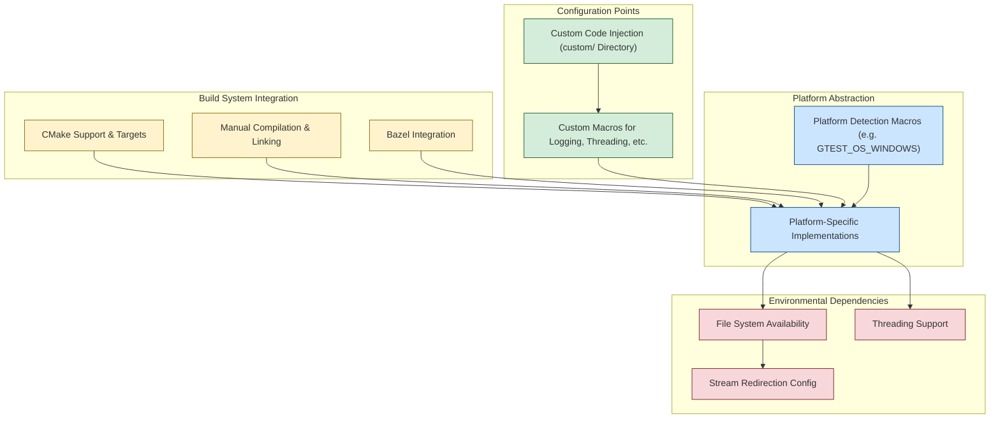

# Integration, Portability, and Configuration

Explore how GoogleTest achieves seamless integration with diverse build systems and platforms, emphasizing foundational concepts such as platform abstraction, configuration flexibility, and handling environmental dependencies. This guide reveals how portability and platform support are deeply embedded in GoogleTest's design, ensuring it runs reliably and efficiently across many environments.

---

## Introduction

Developers integrating GoogleTest into their C++ projects often face the challenge of dealing with multiple platforms, compilers, and build tools. GoogleTest is built with these concerns at its core, offering abstractions and configurations that enable it to work portably and integrate smoothly with a variety of build ecosystems.

This page focuses on the core concepts behind this versatility, helping you understand:

- How GoogleTest detects and adapts to your target platform.
- Configuration points that allow tailoring behavior for different environments.
- Key environmental dependencies and abstractions that increase portability.
- Common integration approaches with popular build systems.


## Platform Abstraction and Detection

GoogleTest maintains portability by automatically detecting the platform it is being compiled on and adapting its behavior accordingly. It uses a centralized system of macros defined in internal headers (notably `gtest-port-arch.h`) to identify the operating system and environment.

### Core Platform Macros

The platform detection logic sets macros such as `GTEST_OS_WINDOWS`, `GTEST_OS_LINUX`, `GTEST_OS_MAC`, and others to 1 or leaves them undefined for unsupported platforms. This enables the framework to conditionally include and execute platform-specific code without manual intervention.

For example:

```cpp
#ifdef GTEST_OS_WINDOWS
  // Windows-specific code
#elif defined(GTEST_OS_LINUX)
  // Linux-specific code
#endif
```

GoogleTest supports a large variety of platforms including but not limited to:

- Windows (Desktop, Mobile, MinGW)
- Linux (including Android)
- macOS and iOS
- BSD variants (FreeBSD, OpenBSD, NetBSD, DragonFlyBSD)
- Various embedded platforms such as ESP8266 and ESP32


## Configuration Points for Integration

To accommodate diverse project requirements and build systems, GoogleTest exposes various configuration macros and options.

### Customizable Macros

Users can define macros to customize critical aspects of GoogleTest’s operation, such as:

- **Logging Macros:** Customize log message handling with `GTEST_LOG_` and assertion checking with `GTEST_CHECK_`.
- **Threading Support:** Define `GTEST_HAS_PTHREAD` and related macros to control threading behavior and synchronization primitives.
- **Symbol Exporting:** Control symbol visibility on different platforms using `GTEST_API_`.

These controls allow tailoring the framework to unique build environments or integrating with user-provided implementations of threading and logging.

### Custom Header Injection

The `custom` directory within GoogleTest’s source provides injection points for user overrides. By placing header files there and defining macros accordingly, users can inject custom implementations before the standard GoogleTest code.

For instance, a project might override the temporary directory retrieval function by defining `GTEST_CUSTOM_TEMPDIR_FUNCTION_`.


## Environmental Dependency Management

GoogleTest is aware of platform-specific environmental dependencies and adapts accordingly.

### File System and Stream Handling

Most GoogleTest features require access to file systems and support for stream redirection. GoogleTest checks availability and configures support dynamically:

- If a file system is unavailable (e.g., on some embedded platforms), features relying on file I/O are disabled.
- Stream redirection support (`GTEST_HAS_STREAM_REDIRECTION`) is enabled or disabled based on platform capabilities.

### Thread-Safety and Parallelism

GoogleTest's thread safety depends on underlying platform support for threading libraries such as pthreads or Windows native APIs:

- The macro `GTEST_IS_THREADSAFE` indicates whether thread-safe primitives are enabled.
- If your environment does not support required threading features, GoogleTest disables such support gracefully, documenting limitations.


## Integration with Build Systems

GoogleTest provides straightforward integration paths tailored to major build systems.

### CMake

- **Standalone Build:** GoogleTest can be built in isolation using CMake's native build generation. A typical workflow involves cloning the repo, creating a build directory, then running `cmake` and `make` or the equivalent.

- **Subdirectory Inclusion:** Projects can include GoogleTest via `add_subdirectory()` to build it as part of their project, ensuring consistent compiler and linker settings.

- **FetchContent Usage:** CMake’s `FetchContent` module allows fetching and embedding GoogleTest dynamically at configure time.

Key CMake variables like `gtest_force_shared_crt` provide control over runtime linkage especially for Windows.

### Bazel

While this page focuses on build-system agnostic concepts, GoogleTest also supports popular monolithic build systems such as Bazel with specific integration guides elsewhere.

### Manual Build and Linking

For custom build environments, users can compile and link GoogleTest using standard compiler commands and link against the static or shared GoogleTest libraries.


## Portability and Platform Support Architecture

GoogleTest’s core portability is architected through:

- A fleet of platform detection macros.
- Modular code partitions conditionally compiled based on these macros.
- Extensive use of configuration macros to adapt to platform capabilities.

This design allows GoogleTest to support a wide range of operating systems, architectures, and compiler toolchains without requiring changes in user tests.


## Tips and Best Practices for Integration

- **Define macros thoughtfully:** When using custom threading models or logging, define the appropriate macros early in your build to instruct GoogleTest.

- **Use provided CMake targets:** Prefer linking with the official imported targets like `GTest::gtest` and `GTest::gtest_main` to avoid mismatch in compiler flags.

- **Avoid mixing runtimes on Windows:** Use `gtest_force_shared_crt` when building on Windows to ensure consistency between your application and GoogleTest’s run-time linkage.

- **Respect the required C++ standard:** GoogleTest requires a C++17 capable compiler for recent versions.

- **Override cautiously:** Use the custom injection points for advanced tweaks but maintain clarity on why overrides are necessary.


## Troubleshooting Common Integration Issues

<AccordionGroup title="Common Integration Issues and Solutions">
<Accordion title="Symbol Not Found or Linker Errors on Windows">
This usually arises from linking mismatched runtime libraries (e.g., static vs dynamic CRT). Ensure `gtest_force_shared_crt` is enabled if your project uses dynamic CRT linkage.
</Accordion>
<Accordion title="Thread Safety Not Working">
Verify that `GTEST_HAS_PTHREAD` or equivalent macros are set correctly. On some platforms, manual definition may be required to enable threading.
</Accordion>
<Accordion title="Build System Cannot Locate Headers or Libraries">
Double-check include and library paths. With CMake, use imported targets or FetchContent to manage dependencies automatically.
</Accordion>
<Accordion title="Custom Macros Not Taking Effect">
Ensure macro definitions are passed correctly via compiler flags or included headers before any GoogleTest headers.
</Accordion>
</AccordionGroup>


## Summary

Understanding GoogleTest’s integration, portability, and configuration concepts empowers you to embed robust testing seamlessly into your diverse C++ projects. Through platform detection macros, configuration injection points, careful management of environment dependencies, and adaptable build system support, GoogleTest achieves unmatched flexibility and consistency.


---

## References and Further Reading

- [GoogleTest README - Generic Build Instructions](./googletest/README.md)
- [Platform Detection - gtest-port-arch.h](./googletest/include/gtest/internal/gtest-port-arch.h)
- [Customization Points - custom/README.md](./googletest/include/gtest/internal/custom/README.md)
- [Supported Platforms](./docs/platforms.md)
- [Configuration & Project Integration Guide](/getting-started/installation-setup/configuration-integration)
- [CMake Integration Best Practices](/guides/getting-started/setup-project)


---

## Diagram: Conceptual Overview of Integration and Portability in GoogleTest



