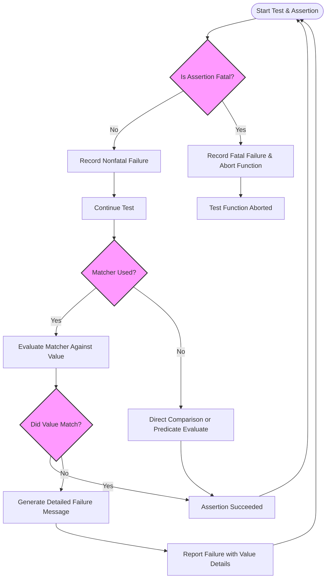

# Assertions & Matchers

This guide presents a thorough explanation of GoogleTest's assertion system, detailing how to verify conditions, compare values, and express expectations in tests with clarity and precision. It covers both built-in assertions and the power of matchers—built-in and user-defined—and demonstrates how they enhance the expressiveness and maintainability of your C++ tests.

---

## Understanding Assertions in GoogleTest

Assertions form the core mechanism by which GoogleTest checks program correctness. They come in two flavors:

- **EXPECT_** assertions: nonfatal; they report a failure but allow the test to continue
- **ASSERT_** assertions: fatal; they abort the current function on failure

These assertions verify that values or conditions meet certain criteria and provide detailed feedback if they do not.

### Using Assertions Effectively

- Always choose `ASSERT_` when failure means continuing the test would be meaningless or dangerous.
- Use `EXPECT_` when you want to continue testing after failures to find multiple issues in one run.
- Stream custom messages into assertions using the `<<` operator to clarify failure causes:

```cpp
EXPECT_EQ(x.size(), y.size()) << "Vectors have unequal sizes";
```

### Types of Assertions

- **Boolean assertions**: Validate true or false conditions (`EXPECT_TRUE`, `EXPECT_FALSE`)
- **Equality and comparison assertions**: Check equivalence or relational conditions (`EXPECT_EQ`, `EXPECT_NE`, `EXPECT_LT`, etc.)
- **String assertions**: Compare C strings for equality or inequality, optionally ignoring case.
- **Floating-point assertions**: Provide approximate equality checks for floating-point values.
- **Exception assertions**: Test whether code throws expected exceptions or throws none.
- **Predicate assertions**: Use custom predicates with detailed messages.

---

## Introduction to Matchers

Matchers offer a robust way to specify conditions on values passed to assertions or mock expectations. They allow expressive and readable formulations of checks, such as verifying that a number is greater than zero or a string contains a substring.

### Benefits of Using Matchers

- Compose complex criteria with logical combinators (`AllOf`, `AnyOf`, `Not`).
- Work naturally with STL containers and complex objects.
- Write more maintainable tests that clearly express intent.

### Basic Usage

Using `EXPECT_THAT` combined with matchers lets you write expressive tests:

```cpp
EXPECT_THAT(value, StartsWith("Hello"));
EXPECT_THAT(numbers, ElementsAre(1, _, 3));  // Match vector with 3 elements
```

### Available Matchers

GoogleTest ships with a rich set of built-in matchers for:

- Simple types (equality, comparison)
- Strings and substrings
- Containers (e.g., `ElementsAre`, `UnorderedElementsAre`)
- Pointer-based checks (`IsNull`, `NotNull`, `Pointee`)

---

## Writing Custom Assertions and Matchers

GoogleTest permits users to create custom assertions and matchers that integrate seamlessly with its diagnostic system.

### Custom Assertion Functions

Write a function returning `::testing::AssertionResult` to generate detailed pass/fail results:

```cpp
::testing::AssertionResult IsEven(int n) {
  if (n % 2 == 0) return ::testing::AssertionSuccess();
  else return ::testing::AssertionFailure() << n << " is odd";
}
```

Use with:

```cpp
EXPECT_TRUE(IsEven(4));
```

### Defining Matchers Using Macros

Quickly define matchers with descriptive failure messages:

```cpp
MATCHER(IsDivisibleBy7, "divisible by 7") {
  return (arg % 7) == 0;
}
```

Use in assertions or expectations:

```cpp
EXPECT_THAT(x, IsDivisibleBy7());
```

### Parameterized Matchers

Create matchers taking parameters with `MATCHER_P` macros:

```cpp
MATCHER_P(InRange, range, "within range") {
  return arg >= range.first && arg <= range.second;
}
```

### Implementing Matcher Classes

For more complex scenarios, implement the matcher interface by defining:

- `bool MatchAndExplain(const T& val, std::ostream* os) const;`
- `void DescribeTo(std::ostream* os) const;`
- `void DescribeNegationTo(std::ostream* os) const;`

and a factory function returning `::testing::Matcher<T>`.

---

## Boolean Predicate Assertions

GoogleTest supports assertions that use arbitrary predicates, enhancing message clarity when standard assertions fall short.

- `EXPECT_PREDn` and `ASSERT_PREDn` where `n` is the number of arguments
- Predicate functions return `bool`
- You can also use predicate-format assertions (`EXPECT_PRED_FORMATn`) returning `AssertionResult` for richer diagnostics

Example:

```cpp
bool IsPositive(int n) { return n > 0; }
EXPECT_PRED1(IsPositive, x);
```

---

## Floating-Point Assertions

Due to rounding errors, specialized assertions exist:

- `EXPECT_FLOAT_EQ` and `EXPECT_DOUBLE_EQ` test approximate equality within ULPs.
- `EXPECT_NEAR` tests approximation within a fixed absolute error.

Example:

```cpp
EXPECT_FLOAT_EQ(3.1415926f, 3.1415f);
EXPECT_NEAR(value, expected_value, 0.01);
```

---

## Exception Assertions

Test expected exception behavior:

- `EXPECT_THROW(statement, ExceptionType)` expects a throw
- `EXPECT_NO_THROW(statement)` expects no exceptions
- `EXPECT_ANY_THROW(statement)` expects any exception

Example:

```cpp
EXPECT_THROW(ThrowError(), std::runtime_error);
EXPECT_NO_THROW(CorrectCode());
```

---

## Matchers in Mocks

Matchers are essential in GoogleMock's `EXPECT_CALL` and `ON_CALL` to specify flexible expectations on argument values.

Example:

```cpp
EXPECT_CALL(mock_obj, Foo(Ge(5), _))
    .WillOnce(Return(true));
```

- Use `_` as a wildcard matcher matching any argument
- Combine matchers to express complex argument constraints
- Use `With` clause for multi-argument matching as a tuple

---

## Ordering and Cardinalities in Expectations

- Control call order using `InSequence` scope or `Sequence` objects with `.InSequence()` clause.
- Use `Times()` clause to specify expected number of calls:
  - Numbers (e.g., `Times(3)`) or predefined cardinalities (`AnyNumber()`, `AtLeast(n)`, etc.)
- Use `.RetiresOnSaturation()` to retire expectations after saturation

Example for ordered calls:

```cpp
{
  InSequence seq;
  EXPECT_CALL(mock, Foo(1));
  EXPECT_CALL(mock, Foo(2));
}
```

---

## Setting Default Mock Behavior with ON_CALL

`ON_CALL` defines actions for mock methods that are used when no explicit expectations match.

Example:

```cpp
ON_CALL(mock, GetX(_))
    .WillByDefault(Return(42));
```

`ON_CALL` sets default behavior but does not impose call count or argument expectations.

---

## Using Actions to Define Mock Method Behavior

Actions specify what a mock method does when called:

- `WillOnce(action)` sets behavior for a single call
- `WillRepeatedly(action)` sets behavior for all subsequent calls

Actions can be built-in (e.g., `Return`, `ReturnRef`, `SetArgPointee`) or custom lambdas.

Example:

```cpp
EXPECT_CALL(mock, GetVal())
    .WillOnce(Return(5))
    .WillRepeatedly(Return(10));
```

---

## Practical Tips and Best Practices

- Mock methods must be declared `public` even if they mock protected or private base class methods.
- Prefer using `NiceMock` for suppressing warnings about uninteresting calls.
- Use `StrictMock` to treat uninteresting calls as errors for strict verification.
- Avoid overusing `EXPECT_CALL` for all calls; instead use `ON_CALL` for common behaviors and `EXPECT_CALL` for required expectations.
- Use `SCOPED_TRACE` to augment failure messages with context when testing helper functions.
- For mocking methods with move-only types, use `MOCK_METHOD` as usual, but ensure proper action usage (e.g., lambdas for repeated return of move-only objects).

---

## Troubleshooting Common Issues

- Commas in method types or arguments must be parenthesized or aliased in `MOCK_METHOD`.
- If overloaded methods cause ambiguity, disambiguate with `using` or explicit matcher casting.
- Ensure mock destructors are virtual if using `NiceMock` or `StrictMock` to avoid unexpected behavior.
- Use `Mock::VerifyAndClearExpectations(mock_obj)` if mock destruction is uncertain.

---

## Summary Diagram: Assertions and Matchers in Use


```

---

<Info>
This page focuses specifically on how assertions and matchers enable expressive, maintainable, and effective verification in your tests. For a deeper dive into mocking techniques, see the [Mocking Basics guide](https://google.github.io/googletest/gmock_for_dummies.html) and [Mocking Reference](https://google.github.io/googletest/reference/mocking.html).
</Info>

---

## Recommended Next Steps

- Explore the [Assertions Reference](../reference/assertions.md) for a full listing and details of assertion macros.
- Learn to write custom matchers and actions in the [gMock Cookbook](../gmock_cook_book.md).
- Study advanced assertion patterns in the [Advanced GoogleTest Topics](../advanced.md).
- For integration and test lifecycle details, review the [Test Discovery & Lifecycle Concepts](../concepts/core-architecture/test-discovery-lifecycle.md).

---

## Frequently Asked Questions

- **Q:** Can I mock overloaded methods?
  
  **A:** Yes, `MOCK_METHOD` supports mocking overloaded methods by fully specifying their signatures. Use `using` declarations to avoid hiding other overloads if mocking selectively.

- **Q:** How to skip tests or assertions conditionally?

  **A:** Use `GTEST_SKIP()` to skip at runtime with custom messages.

- **Q:** How to verify partial argument matches on mocks?

  **A:** Use matchers like `_`, `Field()`, and `Property()` to specify flexible argument constraints.

- **Q:** Why do I get warnings about uninteresting calls?

  **A:** Mock methods without expectations generate warnings to alert potential oversights. Use `NiceMock` to suppress.

---

End of Assertions & Matchers Guide.
