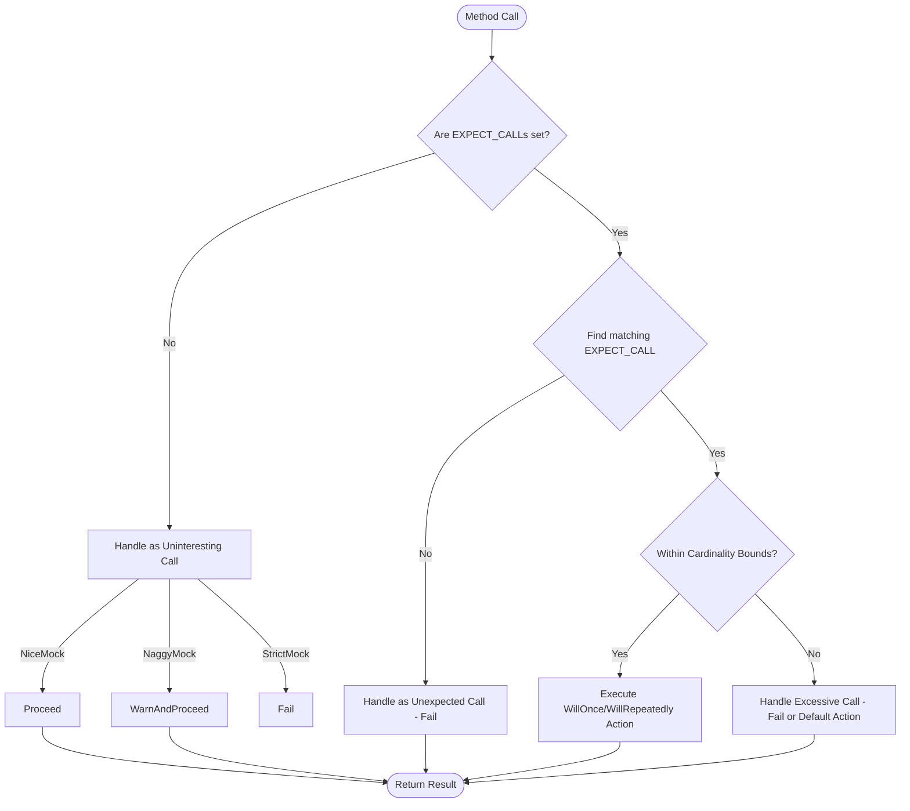

# Custom Actions, Cardinalities, and Flexible Mocks

GoogleMock (gMock) empowers you with precise control over mock behaviors and verification in your C++ tests. This page explains how to harness **custom actions**, **call count cardinalities**, and flexible handling of **uninteresting calls** — vital features that adapt mocks to complex, real-world code bases where behavior and usage patterns evolve.

---

## Introduction

Mock objects stand at the heart of interaction-based testing, letting you specify *what* method calls to expect and *how* they behave. While basic mocking covers straightforward scenarios, real systems often require nuanced controls:

- Custom actions on calls enable elaborate behaviors and side effects.
- Cardinalities specify flexible expectations on how many times methods are called.
- Modifiers like `NiceMock`, `NaggyMock`, and `StrictMock` adjust how unanticipated or uninteresting calls are handled.

This page lays out these advanced concepts focusing solely on these extensibility and control mechanisms within GoogleMock.

---

## Call Cardinalities: Defining Call Count Expectations

Cardinalities define how many times a mock method is expected to be called. These are used with `.Times()` in `EXPECT_CALL` to express precise or fuzzy expectations.

**Key Built-in Cardinalities:**

- `Exactly(n)`: Expect **exactly** `n` calls (including zero).
- `AtLeast(n)`: Expect **at least** `n` calls (no upper bound).
- `AtMost(n)`: Expect **at most** `n` calls (including zero).
- `Between(m, n)`: Expect between `m` and `n` inclusive.
- `AnyNumber()`: Expect **any number** of calls (no bounds).

### How They Behave

- **Satisfaction:** Determines if the current number of calls meets the expectation.
- **Saturation:** Determines if the upper bound is reached, meaning further calls may be excessive.
- **Oversaturation:** Occurs when call count exceeds allowed bounds.

### Practical Examples

```cpp
using ::testing::Exactly;
using ::testing::AtLeast;
using ::testing::AtMost;
using ::testing::Between;
using ::testing::AnyNumber;

EXPECT_CALL(mock_obj, FooMethod())
    .Times(Exactly(3));  // Call must be made exactly 3 times

EXPECT_CALL(mock_obj, BarMethod())
    .Times(AtLeast(2));  // Call must be made 2 or more times

EXPECT_CALL(mock_obj, BazMethod())
    .Times(Between(1, 4));  // Call must be made between 1 and 4 times

EXPECT_CALL(mock_obj, QuuxMethod())
    .Times(AnyNumber());  // Call can be made any number of times
```

### Custom Cardinalities

You can implement your own cardinality by subclassing `CardinalityInterface` and overriding:

- `IsSatisfiedByCallCount(int)`
- `IsSaturatedByCallCount(int)`
- `DescribeTo(std::ostream*)`

Then wrap your implementation in a `Cardinality` using `MakeCardinality`:

```cpp
class EvenCallCount : public testing::CardinalityInterface {
 public:
  bool IsSatisfiedByCallCount(int count) const override {
    return count % 2 == 0;
  }
  bool IsSaturatedByCallCount(int /*count*/) const override {
    return false;  // No saturation logic
  }
  void DescribeTo(std::ostream* os) const override {
    *os << "called even number of times";
  }
};

Cardinality EvenCardinality() {
  return MakeCardinality(new EvenCallCount);
}
```

Then use `Times(EvenCardinality())` to expect calls in even counts.

---

## Custom Actions: Controlling Mock Behavior

Actions tell a mock method *what to do* when invoked, replacing a real implementation. GoogleMock provides many built-in actions (e.g., `Return()`, `SetArgPointee()`, `Invoke()`), but custom actions let you encode arbitrary behavior, side effects, or call delegation.

### Specifying Actions

- `.WillOnce(action)` sets the action for one matching call.
- `.WillRepeatedly(action)` sets the action for subsequent matching calls.

If multiple `WillOnce()` are used, actions are performed sequentially for successive calls.

### Examples of Custom Actions

- Lambda functions:

```cpp
EXPECT_CALL(mock_obj, Compute(_))
    .WillOnce([](int x) { return x * 2; })
    .WillRepeatedly([](int) { return 42; });
```

- Invoking callbacks passed as arguments:

```cpp
using ::testing::Invoke;
EXPECT_CALL(mock_obj, LoadData(_, _))
    .WillOnce(Invoke([](int id, std::function<void(int)> cb) {
      cb(id + 10);
    }));
```

- Combining actions (perform side effect and return value):

```cpp
using ::testing::DoAll;
using ::testing::SetArgPointee;
using ::testing::Return;

EXPECT_CALL(mock_obj, GetValue(_, _))
    .WillOnce(DoAll(SetArgPointee<1>(10), Return(true)));
```

### Delegating Calls

Useful for forwarding mock calls to a *fake* or *real* implementation for partial mocking:

```cpp
ON_CALL(mock_obj, Foo(_))
    .WillByDefault([&real](int x) { return real.Foo(x); });
```

This preserves behavior consistency while validating interactions.

---

## Flexible Handling of Uninteresting Calls

### What Are Uninteresting Calls?

An *uninteresting call* is a call to a mock method with **no matching `EXPECT_CALL()` expectation**. gMock distinguishes these from *unexpected calls* where an expectation exists but arguments don't match.

By default, uninteresting calls produce warnings but allow the test to continue—helping discover possible oversights without failing immediately.

### Controlling Uninteresting Call Behavior

GoogleMock supports three mock wrappers that control responses to uninteresting calls:

- `NiceMock<T>`: suppresses warnings for uninteresting calls (quiet acceptance).
- `NaggyMock<T>`: default, warns on uninteresting calls.
- `StrictMock<T>`: treats uninteresting calls as test failures.

Example:

```cpp
using ::testing::NiceMock;
using ::testing::StrictMock;
...
NiceMock<MockFoo> mock1;  // No warnings for uninteresting calls
StrictMock<MockFoo> mock2; // Uninteresting calls cause failures
```

### Uninteresting Calls in Practice

If you expect some calls but don't care about others, use a broad `EXPECT_CALL` with `Times(AnyNumber())` as a "catch-all" for those calls:

```cpp
EXPECT_CALL(mock_obj, Method(_))
    .Times(AnyNumber());  // Accepts any argument, any number of calls
EXPECT_CALL(mock_obj, Method(5))
    .Times(2);  // Specifically expect 2 calls with argument 5
```

This setup prevents warnings or errors from unexpected argument values beyond your explicit expectations.

---

## Workflow: Setting Expectations with Cardinalities and Actions

1. Define expectations on mock methods with `EXPECT_CALL(mock_obj, Method(matchers))`.
2. Use `.Times(cardinality)` to specify expected call counts precisely.
3. Use `.WillOnce()` and `.WillRepeatedly()` to define the behavior or return values.
4. Use `.RetiresOnSaturation()` to retire an expectation after it is fulfilled.
5. Use mock wrappers (`NiceMock`, `StrictMock`) to control uninteresting call behavior.

Example:

```cpp
EXPECT_CALL(mock_obj, OpenFile("config.txt"))
    .Times(Exactly(1))
    .WillOnce(Return(true));

EXPECT_CALL(mock_obj, ReadData(_))
    .Times(AtLeast(0))
    .WillRepeatedly(Return(0));
```

Here, the test passes if `OpenFile` is called exactly once and `ReadData` any number of times.

---

## Troubleshooting

### Expectation Failures Due to Cardinalities

- **Too few calls:** A method was called fewer times than the `.Times()` cardinality minimum.
- **Too many calls:** A method was called more times than the `.Times()` cardinality maximum.

Check call sites and `.Times()` settings balance.

### Excessive `WillOnce` Actions

If `.WillOnce()` calls exceed the `.Times()` upper bound, gMock warns that there are "Too many actions specified".

Reduce the number of `.WillOnce()` actions or adjust `.Times()` accordingly.

### Missing `WillRepeatedly`

If `.Times()` cardinality allows more calls than `.WillOnce()` actions present and no `.WillRepeatedly()` is specified, gMock will perform default actions after `.WillOnce()` actions are exhausted, which may be unintended.

Add `.WillRepeatedly()` explicitly if you want consistent behavior beyond the `.WillOnce()` list.

### Understanding Uninteresting Call Warnings

If your test prints "Uninteresting mock function call" warnings:

- Determine if the call should be expected. If yes, add an `EXPECT_CALL`.
- If not interesting, consider switching to `NiceMock` or adding a broad `EXPECT_CALL` with `Times(AnyNumber())`.

Avoid suppressing warnings by indiscriminately adding `EXPECT_CALL`s without intent.

---

## Additional Resources

- [GoogleTest Mocking Reference](../api-reference/mocking-framework/mock-methods-and-classes.md)
- [gMock for Dummies](https://google.github.io/googletest/gmock_for_dummies.html)
- [gMock Cookbook](https://google.github.io/googletest/gmock_cook_book.html)
- [Cardinalities and Strictness Reference](../api-reference/mocking-framework/cardinalities-strictness.md)
- [Actions and Stubbing Reference](../api-reference/mocking-framework/actions-and-stubbing.md)

---

## Diagram: Mock Call Cardinality Check Flow



---

## Practical Tips and Best Practices

- Specify `Times()` explicitly if you require precise call counts or prefer not to rely on inference.
- Use `AnyNumber()` for catch-all expectations to prevent uninteresting call warnings in partially mocked objects.
- Delegate unmocked method calls to real or fake objects via `ON_CALL` and `WillByDefault` for partial mocking.
- Use `RetiresOnSaturation()` when expectations should cease matching calls once fulfilled to avoid failures on excess calls.
- Wrap mocks in `NiceMock` to suppress uninteresting call warnings in large test suites where some methods are irrelevant.
- Use sequences (`InSequence`) and partial orders (`After`, `InSequence` clause) to enforce call order when needed.

---

This page aims to help you advance from basic mocking to sophisticated control over mock behaviors, expectations, and handling, enabling you to maintain robust and flexible tests even as your codebase evolves.