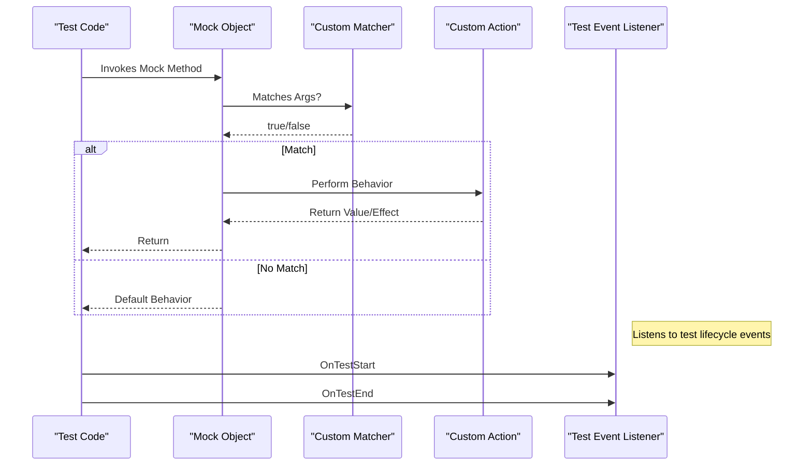

# Customization & Extension Points

Unlock the full power of GoogleTest and GoogleMock by leveraging their built-in customization and extension points. This guide helps you tailor the frameworks’ behavior, reporting, and test verification to perfectly fit your project’s unique requirements.

Whether you need to create custom matchers and actions to express complex conditions in your tests, or want to implement your own event listeners for detailed observation of test execution, this page guides you through the extensibility interfaces you can use.

---

## Why Customize and Extend?

GoogleTest and GoogleMock come with rich defaults designed to satisfy most use cases. However, no two projects are the same. Custom behaviors enable:

- Expressing domain-specific conditions with custom matchers
- Implementing complex interactions and side effects in tests via custom actions
- Tailoring test event handling, logging, and reporting with user-defined listeners
- Integrating GoogleTest and GoogleMock more deeply with your application or tooling ecosystem


## Custom Matchers

### What Are Matchers?
Matchers are predicates that specify the expectations on mock method arguments or assertion values. While GoogleMock offers a comprehensive set of built-in matchers for common types and comparisons, your application domain may require more specialized logic.

### How To Create Custom Matchers?
GoogleMock provides the `MATCHER` and `MATCHER_P` macros to quickly define new matchers. These macros let you implement complex matching logic with helpful diagnostic messages.

#### Basic Custom Matcher Example

```cpp
MATCHER(IsDivisibleBy7, "Checks if a number is divisible by 7") {
  return (arg % 7) == 0;
}

// Usage:
EXPECT_CALL(mock, SomeMethod(IsDivisibleBy7()));
```

#### Parameterized Matcher Example

```cpp
MATCHER_P(InClosedRange, range, "Checks if value is in the closed range") {
  return arg >= range.first && arg <= range.second;
}

// Usage:
EXPECT_CALL(mock, Foo(InClosedRange(std::make_pair(3, 10))));
```

### Writing Matcher Classes

For more advanced cases with reusable state or polymorphism, implement the matcher interface manually. This gives precise control over argument types and descriptions.

### Best Practices

- Keep matchers purely functional with no side effects.
- Provide clear, descriptive failure messages.
- Use built-in matchers to compose new matchers where possible.

For a deeper dive, see the [Creating Custom Matchers](https://google.github.io/googletest/gmock_cook_book.html#NewMatchers) section in the gMock Cookbook.


## Custom Actions

### What Are Actions?
Actions specify the behavior of a mocked method when invoked—such as returning a value, invoking a callback, or modifying arguments.

### Defining Custom Actions

- Use lambdas or functors with `EXPECT_CALL().WillOnce()` or `.WillRepeatedly()` for lightweight custom behavior.
- Use the `ACTION` and `ACTION_P` macros for concise custom action definitions.
- For sophisticated scenarios requiring template parameters, utilize `ACTION_TEMPLATE`.

#### Example: Increment Argument Action

```cpp
ACTION(IncrementArg0) {
  ++(*arg0);
}

EXPECT_CALL(mock, Modify(_)).WillOnce(IncrementArg0());
```

### Combining Multiple Actions
Use `DoAll()` to combine multiple actions, ensuring the return value is from the last action in the sequence.


## User-Defined Event Listeners

GoogleTest supports user-defined listeners that observe test execution events such as test start, success, failure, and teardown. This extension point is invaluable for customized logging, metrics collection, and integrating with external systems.

### How to Implement a Listener

Subclass `::testing::TestEventListener` and override the events of interest. Then register your listener with GoogleTest’s event manager.

#### Basic Listener Skeleton

```cpp
class MyTestListener : public ::testing::TestEventListener {
public:
  void OnTestStart(const ::testing::TestInfo& test_info) override {
    // Your code here
  }
  void OnTestEnd(const ::testing::TestInfo& test_info) override {
    // Your code here
  }
  // Override other events as needed
};

int main(int argc, char** argv) {
  ::testing::InitGoogleTest(&argc, argv);
  ::testing::TestEventListeners& listeners = ::testing::UnitTest::GetInstance()->listeners();
  listeners.Append(new MyTestListener());
  return RUN_ALL_TESTS();
}
```

### Listener Event Hooks
- `OnTestProgramStart`, `OnTestProgramEnd`
- `OnTestSuiteStart`, `OnTestSuiteEnd`
- `OnTestStart`, `OnTestEnd`
- `OnTestPartResult` for per-assertion results
- `OnEnvironmentSetUpStart`, `OnEnvironmentSetUpEnd`, and teardown equivalents


## Customization Macros and Build Configuration

The `googlemock/include/gmock/internal/custom/README.md` outlines where you can define custom macros to influence GoogleMock behavior, primarily around flag definition and configuration.

Examples include:
- `GMOCK_DECLARE_bool_` and related flag macros
- `GMOCK_FLAG_GET` and `GMOCK_FLAG_SET` to query and change flag values

This is useful if you want to integrate with your own flag management system or need to tweak internal behaviors at compile time.


## Best Practices for Customization

- Always start with built-in matchers and actions; customize only when necessary.
- Ensure user-defined matchers and actions remain side-effect free and performant.
- Register and deregister event listeners judiciously to avoid memory leaks.
- Utilize sequences and expectations ordering before resorting to complex custom logic.


## Troubleshooting Common Customization Issues

- If your custom matcher or action behaves unexpectedly, verify that it operates purely functionally — no external state mutation during matching.
- Listeners might not behave as expected if not properly registered before tests run.
- Be cautious when mixing different types of mocks (e.g., `NiceMock`, `StrictMock`) with customized behaviors to avoid unintended interactions.


## Related Documentation

- [gMock Cookbook - Writing New Matchers and Actions](https://google.github.io/googletest/gmock_cook_book.html#NewMatchers)
- [Mocking Reference](https://google.github.io/googletest/docs/reference/mocking.md)
- [Creating and Using Mock Classes](https://google.github.io/googletest/api/gmock_cook_book.html)
- [GoogleTest Event Listeners](https://google.github.io/googletest/reference/testing_test_event_listener.html)
- [GoogleMock Cheat Sheet](https://google.github.io/googletest/docs/gmock_cheat_sheet.html)

---

For comprehensive information about the mechanics and internal workings of EXPECT_CALL and ON_CALL macros, consult `googlemock/include/gmock/gmock-spec-builders.h`.


---

### Visualization: Extension Point Integration Flow



This flow illustrates how test code interacts with mock objects, applying custom matchers and actions, and how event listeners observe the test lifecycle.
