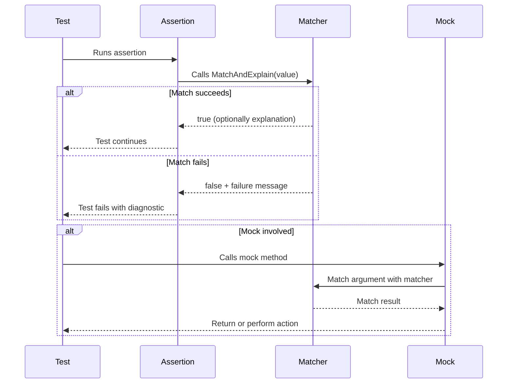

# Assertions, Matchers, and Writing Custom Matchers

Explore the role of assertions and matchers in expressing test intent. This guide introduces built-in assertions, the matcher system, and offers guidance for crafting custom matchers to capture domain-specific logic cleanly and safely.

---

## Understanding Assertions and Matchers

Assertions and matchers are fundamental to writing expressive and maintainable tests with GoogleTest and GoogleMock. They help you state _what_ your test expects and produce clear, actionable feedback when those expectations are not met.

- **Assertions** are statements in your test code that verify specific conditions.
- **Matchers** are object-oriented predicates used within assertions to check complex conditions on values, arguments, or returned results.

Matchers augment assertions by providing flexible and composable ways to specify _how_ values are validated.

## Built-in Assertions in GoogleTest

GoogleTest provides a variety of assertion macros which serve as the entry point for validation in your tests. The standard macros include:

- `EXPECT_*` (non-fatal): Continue test after failure
- `ASSERT_*` (fatal): Abort current function on failure

Most assertions print informative messages that include the values tested, helping you understand failure causes immediately.

### Examples of Common Assertions

```cpp
// Simple equality check
EXPECT_EQ(actual_result, expected_result);

// Verify a condition is true
ASSERT_TRUE(pointer != nullptr);

// Verify string contains substring using built-in matcher
EXPECT_THAT(message, ::testing::HasSubstr("error"));
```

### Advanced Assertions

GoogleTest supports advanced assertions for more specialized scenarios:

- **Exception assertions** (`EXPECT_THROW`, `ASSERT_NO_THROW`, etc.): For verifying exception behavior.
- **Predicate assertions** (`EXPECT_PRED_FORMAT*`): Use predicate functions returning rich results with custom failure messages.
- **Death assertions** (`EXPECT_DEATH`): For confirming program terminates as expected.

Refer to the [Assertions Reference](reference/assertions.md) for full details.

## Matchers: The Powerhouse for Expressive Tests

Matchers make your assertions precise and readable, especially for complex value checks, without writing cumbersome predicate code.

### Using Matchers With Assertions

GoogleMock provides the macros `EXPECT_THAT(value, matcher)` and `ASSERT_THAT(value, matcher)` which assert that a given `value` satisfies a `matcher` predicate.

Example:

```cpp
using ::testing::StartsWith;
EXPECT_THAT(username, StartsWith("admin_"));
```

Here, `StartsWith` is a matcher that checks whether a string begins with the given prefix.

### Built-in Matchers

GoogleMock offers an extensive set of built-in matchers:

- **Comparison Matchers:** `Eq()`, `Ne()`, `Lt()`, `Le()`, `Gt()`, `Ge()`
- **Logical Matchers:** `Not()`, `AllOf()`, `AnyOf()`
- **Pointer Matchers:** `IsNull()`, `NotNull()`, `Pointee()`
- **Container Matchers:** `Contains()`, `ElementsAre()`, `UnorderedElementsAre()`, `Each()`, `SizeIs()`
- **String Matchers:** `HasSubstr()`, `MatchesRegex()`, `StartsWith()`, `EndsWith()`

These can be composed and nested to express intricate conditions elegantly.

### Custom Matchers in gMock

When built-in matchers are insufficient or when verifying domain-specific logic, you can write custom matchers.

There are two streamlined approaches:

#### 1. Using the `MATCHER` Macros

These macros enable quick creation of matchers with minimal boilerplate:

```cpp
MATCHER(IsEven, "") { return (arg % 2) == 0; }
```

Usage:

```cpp
EXPECT_THAT(value, IsEven());
```

The description string can be customized to improve failure messages and support negations.

To add parameters, use `MATCHER_P` and its variants:

```cpp
MATCHER_P(IsDivisibleBy, divisor, "") { return (arg % divisor) == 0; }
```

Then:

```cpp
EXPECT_THAT(n, IsDivisibleBy(3));
```

#### 2. Defining Matcher Classes Manually

For more complex matchers requiring richer interfaces or reusable implementations, define a matcher class with the following members:

- `using is_gtest_matcher = void;`
- A polymorphic `MatchAndExplain` method to check if the value matches and optionally explain results.
- `DescribeTo` and `DescribeNegationTo` to produce human-readable description texts.

Example:

```cpp
class BarPlusBazEqMatcher {
 public:
  using is_gtest_matcher = void;

  explicit BarPlusBazEqMatcher(int expected_sum) : expected_sum_(expected_sum) {}

  bool MatchAndExplain(const Foo& foo, std::ostream* os) const {
    bool matched = (foo.bar() + foo.baz()) == expected_sum_;
    if (!matched && os) {
      *os << "bar() + baz() is " << (foo.bar() + foo.baz());
    }
    return matched;
  }

  void DescribeTo(std::ostream* os) const {
    *os << "bar() + baz() equals " << expected_sum_;
  }

  void DescribeNegationTo(std::ostream* os) const {
    *os << "bar() + baz() does not equal " << expected_sum_;
  }

 private:
  const int expected_sum_;
};

::testing::Matcher<const Foo&> BarPlusBazEq(int expected) {
  return BarPlusBazEqMatcher(expected);
}
```

### Best Practices for Writing Custom Matchers

- Keep matchers **pure functions**—no side-effects.
- The **predicate** should only depend on the matcher's parameters and the value tested.
- Strive for **clear, meaningful failure messages** by streaming explanations.
- Use parameters and descriptive messages to increase readability.
- Use matchers within `EXPECT_THAT()` for expressive assertions.

---

## Guiding Principles for Effective Use

### Express Intent Clearly

Use matchers and assertions to express what your test verifies, not how it internally checks the condition.

### Avoid Over- or Under-Specification

- Use `EXPECT_CALL` to set expectations only when necessary.
- Use `ON_CALL` to define default behaviors without imposing call-count requirements.

### Keep Tests Maintainable

- Use custom matchers to encapsulate complex logic and prevent duplication.
- Compose matchers for modular, readable checks.

### Understand Matchers’ Evaluation Semantics

- Matchers may be evaluated multiple times; do not embed side-effects.
- Failures inside matchers result in expressive diagnostics.

### Integrate Matchers with Mock Expectations

Matchers serve as argument checkers inside mock expectations, providing fine-grained control over method call validation.

## Troubleshooting Common Issues

- **Matchers not matching:** Verify types are correct, consider using `SafeMatcherCast<T>()` for type mismatches.
- **Poor failure messages:** Improve `DescribeTo` and stream explanations in `MatchAndExplain`.
- **Side-effects inside matchers:** Refactor matchers to avoid modifying external state.
- **Confusing negation messages:** Customize the description string to clarify negated status.

## Example: Writing a Custom Parameterized Matcher

```cpp
MATCHER_P(IsDivisibleBy, divisor, \
          absl::StrCat(negation ? "isn't" : "is", " divisible by ", divisor)) {
  if ((arg % divisor) == 0) {
    return true;
  }
  *result_listener << "the remainder is " << (arg % divisor);
  return false;
}

// Usage
EXPECT_THAT(number, IsDivisibleBy(3));
```

Clear failure messages become:

```
Value of: number
Expected: is divisible by 3
  Actual: 10 (the remainder is 1)
```

## Conclusion

Assertions and matchers are the expressive tools that make your tests precise and maintainable. Use built-in assertions for common checks and employ matchers for flexible, readable predicates on values and arguments. When your needs extend beyond built-ins, leverage custom matcher definitions to encapsulate domain logic elegantly while producing insightful diagnostics. This approach unlocks the full power of the GoogleTest and GoogleMock frameworks, enabling you to write tests that communicate intent clearly, fail informatively, and endure change gracefully.

---

<AccordionGroup title="Additional Resources">
<Accordion title="Built-in Assertions Reference">
Refer to the [Assertions Reference](reference/assertions.md) for detailed macros like `EXPECT_EQ`, `EXPECT_THROW`, `EXPECT_DEATH`, etc.
</Accordion>
<Accordion title="Matchers Reference">
Learn about a rich library of built-in matchers in the [Matchers Reference](reference/matchers.md), including string, container, and pointer matchers.
</Accordion>
<Accordion title="Writing Custom Matchers (gMock Cookbook)">
Explore detailed examples and best practices in the [gMock Cookbook](docs/gmock_cook_book.md#NewMatchers) for defining new matchers and matcher classes.
</Accordion>
<Accordion title="GoogleMock for Dummies">
A gentle introduction to mocking and expectations: [gMock for Dummies](docs/gmock_for_dummies.md).
</Accordion>
<Accordion title="Mocking Reference">
Comprehensive API information for mocks, expectations, and matchers: [Mocking Reference](docs/reference/mocking.md).
</Accordion>
</AccordionGroup>

<Check>
Custom matchers must be functionally pure and provide clear, informative messages to help diagnose test failures efficiently.
</Check>

<Note>
Use `SafeMatcherCast<T>()` to handle situations where matcher and argument types differ but are safely convertible.
</Note>

---

<Steps>
<Step title="Step 1: Understand the Assertion Needed">
Identify what your test needs to verify and whether an existing assertion macro suffices.
</Step>
<Step title="Step 2: Choose a Matcher or Build One">
If complex checking is needed, select a built-in matcher or write a custom one using `MATCHER` or matcher classes.
</Step>
<Step title="Step 3: Use in EXPECT_THAT or EXPECT_CALL">
Use the matcher within `EXPECT_THAT` for simple assertions or inside `EXPECT_CALL` for argument validation in mocks.
</Step>
<Step title="Step 4: Run and Observe Failures">
Run your test and examine failure messages to confirm they are informative and help locate issues.
</Step>
<Step title="Step 5: Refine as Needed">
Adjust matcher descriptions or logic for clarity and correctness, ensuring maintainable tests.
</Step>
</Steps>

---

## Mermaid Diagram: The Matcher Evaluation Flow



This diagram illustrates how an assertion invokes matchers to verify values and how mocks use matchers to validate method arguments before performing specified actions.

---

<Source url="https://github.com/google/googletest" paths={[{"path": "docs/gmock_cook_book.md", "range": "#NewMatchers"},{"path": "docs/reference/assertions.md", "range": "#EXPECT_THAT"},{"path": "googlemock/include/gmock/gmock-matchers.h", "range": "#MATCHER"}]}/>
