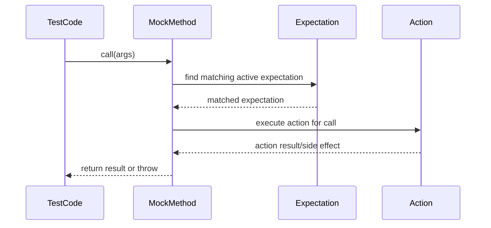

# Actions: Orchestrating Mock Behavior

Actions in GoogleMock define how your mock objects behave when their methods are called during tests. They determine the responses your mocks produce — returning values, triggering side effects, throwing exceptions — and enable you to tailor mock behavior to fit diverse test scenarios with precision and expressiveness.

Understanding and harnessing actions unlocks the full power of mocking, allowing you to simulate complex interactions, verify contract adherence, and craft tests that are both robust and expressive.

---

## What Are Actions?

An action is a directive linked to a mocked method that specifies what should happen **when that method is invoked** during testing. Instead of implementing the method’s logic, you define actions to simulate outcomes or side effects consistent with your testing goals.

For example, actions can:

- Return specific values or references.
- Save or transform input arguments.
- Throw exceptions to simulate error conditions.
- Delegate calls to real objects or other functions.

Actions can be composed and chained, letting you build nuanced behavior sequences for repeated calls.


## Using Actions: Setting Behavior for Mocked Methods

Actions are primarily specified in the `.WillOnce()` and `.WillRepeatedly()` clauses of the `EXPECT_CALL()` macro or in `.WillByDefault()` for default behaviors with `ON_CALL()`.

```cpp
using ::testing::Return;

EXPECT_CALL(mock_object, GetValue())
    .WillOnce(Return(10))
    .WillRepeatedly(Return(20));
```

This example means the first call to `GetValue()` returns 10; subsequent calls return 20.


## Core Built-in Actions

GoogleMock provides a rich set of built-in actions covering most common needs:

### Returning Values

| Action                 | Description                                                                            |
|------------------------|----------------------------------------------------------------------------------------|
| `Return()`             | Return from a `void` function.                                                         |
| `Return(value)`        | Returns the specified `value`. Be aware the value is copied at expectation setup time. |
| `ReturnArg<N>()`       | Returns the N-th argument to the mock method.                                         |
| `ReturnNew<T>(...args)`| Creates and returns a new object of type T with constructor args provided.             |
| `ReturnNull()`         | Returns a null pointer (for pointer return types).                                    |
| `ReturnPointee(ptr)`   | Returns the value pointed to by `ptr`.                                                |
| `ReturnRef(variable)`  | Returns a reference to `variable`.                                                   |
| `ReturnRefOfCopy(v)`   | Returns a reference to a copy of `v`. The copy is owned by the action.                |
| `ReturnRoundRobin({a1,...})` | Cycles through values in the list on successive calls.                               |


### Side Effects

| Action                    | Description                                                                   |
|---------------------------|-------------------------------------------------------------------------------|
| `Assign(&var, value)`     | Assigns `value` to the variable `var`.                                        |
| `DeleteArg<N>()`          | Deletes the N-th argument, which must be a pointer.                           |
| `SaveArg<N>(ptr)`         | Copies the N-th argument to the location pointed by `ptr`.                    |
| `SaveArgByMove<N>(ptr)`   | Moves the N-th argument to the location pointed by `ptr`.                     |
| `SaveArgPointee<N>(ptr)`  | Copies the value pointed to by the N-th argument to `*ptr`.                   |
| `SetArgReferee<N>(value)` | Assigns `value` to the variable referenced by the N-th argument.              |
| `SetArgPointee<N>(value)` | Assigns `value` to the variable pointed to by the N-th argument.              |
| `SetArrayArgument<N>(first, last)` | Copies a range of elements to the array pointed to by the N-th argument.     |
| `SetErrnoAndReturn(error, value)` | Sets `errno` and returns `value`, useful for simulating system call failures. |
| `Throw(exception)`         | Throws the given exception to simulate error conditions.                      |


### Invoking Callables and Functions

| Action                                              | Description                                                      |
|-----------------------------------------------------|------------------------------------------------------------------|
| `f`                                                 | Invokes a callable `f` with the mock function's arguments.       |
| `Invoke(f)`                                         | Invokes function or functor `f` with mock function arguments.    |
| `Invoke(object_pointer, &class::method)`            | Invokes a method on the given object with mock function arguments. |
| `InvokeWithoutArgs(f)`                              | Invokes `f` with no arguments (ignores mock function arguments).  |
| `InvokeWithoutArgs(object_pointer, &class::method)` | Invokes method taking no arguments on object.                     |
| `InvokeArgument<N>(args...)`                        | Calls the N-th argument (which must be callable), passing `args...` to it. |


### Composite Actions

- `DoAll(a1, a2, ..., an)`: Executes multiple actions in order, returning the result of the last one.
- `IgnoreResult(a)`: Executes action `a` but ignores its return value (useful for void requirements).
- `WithArg<N>(a)`: Passes the N-th argument to action `a`.
- `WithArgs<N1, N2, ..., Nk>(a)`: Selectively passes multiple arguments to `a`.
- `WithoutArgs(a)`: Executes action `a` without arguments.


## Action Chaining and Cardinality

Action clauses in `EXPECT_CALL()` can be chained to specify scenarios with multiple calls:

- `.WillOnce(action1)`: Defines action for the first matching call.
- `.WillOnce(action2)`: Defines action for the second matching call.
- `.WillRepeatedly(action)`: Defines action for all subsequent matching calls.

When chained, GoogleMock automatically infers how many times the method is expected to be called unless you explicitly specify a `.Times(cardinality)` clause.


## Defining Custom Actions

If built-in actions do not meet your needs, you can define custom actions by:

- Writing a callable object (class or lambda) with an `operator()` matching the mock function signature.
- Using the `ACTION` macros to define simple actions.
- Implementing `ActionInterface<F>` for advanced use cases.
- Using `MakePolymorphicAction` to create generic actions usable across multiple mock methods.

Example defining a simple custom action with `ACTION` macro:

```cpp
ACTION(IncrementArg) {
  return ++(*arg0);
}

EXPECT_CALL(mock_obj, Foo(_)).WillOnce(IncrementArg());
```

## Important Usage Tips

- Avoid side effects in actions unless intentional; side effects occur during action execution.
- When returning values, be cautious with temporaries and move-only types.
- Use `ReturnPointee` to defer evaluation to call time.
- Use `RetiresOnSaturation()` on expectations when necessary to retire an expectation once its upper bound is reached.
- Use `ON_CALL()` for defining default behavior without imposing call count expectations.
- Use `EXPECT_CALL()` to set explicit expectations and actions.


## Example: Combining Actions and Expectations

```cpp
using ::testing::Return;
using ::testing::DoAll;
using ::testing::SetArgPointee;
using ::testing::_;

class MockDatabase {
 public:
  MOCK_METHOD(bool, Read, (int key, std::string* value), (override));
};

TEST(DatabaseTest, ReadsCorrectly) {
  MockDatabase mock_db;

  EXPECT_CALL(mock_db, Read(42, _))
      .WillOnce(DoAll(SetArgPointee<1>("data"), Return(true)))
      .RetiresOnSaturation();

  std::string val;
  EXPECT_TRUE(mock_db.Read(42, &val));
  EXPECT_EQ(val, "data");
}
```

This example sets an expectation that calling `Read` with key `42` will:

- Set the output parameter (argument 1) to "data".
- Return `true`.
- Retire that expectation after saturation.


## Summary Diagram: Mock Method Call with Expectation and Actions



This flow captures how a call to a mock method triggers evaluation of the most recent matching expectation and then executes the associated actions before returning control to the test.


## Troubleshooting and Best Practices

<AccordionGroup title="Common Action-Related Issues">
<Accordion title="Unexpected Behavior Despite Defining WillOnce/WillRepeatedly">
Make sure to define all expectations and actions **before** invoking the mock method; gMock requires that expectations be set up **prior** to usage.
</Accordion>
<Accordion title="Actions Seem to Return Stale or Incorrect Values">
Remember that actions like `Return(value)` copy `value` **once** when the expectation is declared. Use `ReturnPointee(ptr)` or lambdas to produce fresh values on each call.
</Accordion>
<Accordion title="Need to Simulate Exceptions or Side Effects">
Use the `Throw(exception)` action to raise exceptions, and compose actions using `DoAll` to bundle side effects with return values.
</Accordion>
<Accordion title="Mock Method Called More Times Than Expected">
Add `.RetiresOnSaturation()` to expectations to ensure that they are deactivated after hitting their upper-call limit, to allow fallback to other expectations or default actions.
</Accordion>
</AccordionGroup>


## Extending Actions: Writing Your Own

GoogleMock’s action framework is extensible to support any custom behavior you require.

### Creating a Monomorphic Action

Implement a class with `Perform(const ArgumentTuple& args)` method template where `ArgumentTuple` is a tuple of mock method arguments and `Perform` returns the result.

Example snippet:

```cpp
class ReturnSecondArg {
 public:
  template <typename Result, typename ArgumentTuple>
  Result Perform(const ArgumentTuple& args) const {
    return std::get<1>(args);  // Return second argument
  }
};

Action<SomeMethodType> ReturnSecond() {
  return MakePolymorphicAction(ReturnSecondArg());
}
```

### Creating a Polymorphic Action

Use `MakePolymorphicAction()` with your implementation class to define actions usable across multiple method signatures.

Refer to `gmock-actions.h` and `gmock-spec-builders.h` for internal examples.


## Additional Resources

- [gMock for Dummies](https://google.github.io/googletest/gmock_for_dummies.html) – Gentle introductory guide.
- [Actions Reference](../reference/actions.md) – Comprehensive listing of built-in actions.
- [Mocking Reference](../reference/mocking.md) – Details on mocking and expectations.
- [gMock Cookbook](docs/gmock_cook_book.md) – Recipes for advanced mocking scenarios.

---

Mastering actions equips you to design precise, maintainable, and powerful tests using GoogleMock. With this knowledge, mock objects become dynamic collaborators, imitating real components faithfully within your testing environment.