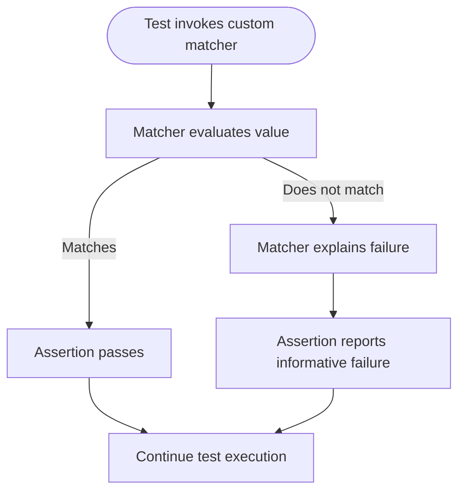

# Custom Assertions and Matchers

Extend GoogleTest's power by crafting your own assertions and matchers that express your domain's logic more precisely. This guide walks you through defining custom assertions and matchers, providing meaningful feedback in test failures, and enabling cleaner, more maintainable test code for large or complex codebases.

---

## Why Custom Assertions and Matchers?

Standard assertions like `EXPECT_EQ` and built-in matchers handle most test needs. However, when you want tests to:

- Express domain-specific semantics clearly,
- Provide richer failure explanations,
- Simplify complex validation logic,
- Or combine multiple checks into a reusable predicate,

custom assertions and matchers become invaluable.

Crafting domain-focused matchers leads to tests that read naturally and pinpoint causes of failures precisely.

---

## Writing Custom Assertions

Custom assertions are functions or macros that evaluate conditions and report test results with clear messages.

### Predicate Assertions Using `AssertionResult`

GoogleTest supports predicates that return `::testing::AssertionResult`, enabling rich success or failure messages.

```cpp
::testing::AssertionResult IsEven(int n) {
  if ((n % 2) == 0) {
    return ::testing::AssertionSuccess();
  } else {
    return ::testing::AssertionFailure() << n << " is odd";
  }
}

TEST(MyTest, CheckEven) {
  EXPECT_TRUE(IsEven(4));  // Passes silently.
  EXPECT_TRUE(IsEven(5));  // Fails with message "5 is odd".
}
```

- Use `AssertionSuccess()` for passing.
- Use `AssertionFailure()` streaming a descriptive error message for failing.

### Implementing Assertion Macros

You can wrap such functions in macros for usage consistency:

```cpp
#define EXPECT_IS_EVEN(val) \
  EXPECT_PRED_FORMAT1(IsEven, val)
```

Use with:

```cpp
EXPECT_IS_EVEN(7);  // Prints an informative failure message if false.
```

This approach lets you encapsulate complex logic and report errors clearly.

---

## Defining Custom Matchers

Matchers verify that values meet criteria and integrate with `EXPECT_THAT` and mock expectations `EXPECT_CALL` for argument checking.

### Using the `MATCHER` Macro

GoogleMock provides the `MATCHER` family of macros for quick custom matcher definitions.

#### Simple Matcher Example

```cpp
MATCHER(IsDivisibleBy3, "Checks if a number is divisible by 3") {
  return (arg % 3) == 0;
}

TEST(MyTest, DivisibleBy3) {
  EXPECT_THAT(9, IsDivisibleBy3());  // Passes.
  EXPECT_THAT(10, IsDivisibleBy3());  // Fails with message 'Checks if a number is divisible by 3'.
}
```

- `arg` refers to the matched value.
- The macro auto-generates matcher classes with descriptive failure messages.

#### Parameterized Matcher with `MATCHER_P`

```cpp
MATCHER_P(IsDivisibleBy, divisor, "") {
  return (arg % divisor) == 0;
}

TEST(MyTest, DivisibleByN) {
  EXPECT_THAT(10, IsDivisibleBy(5));  // Passes.
  EXPECT_THAT(10, IsDivisibleBy(3));  // Fails.
}
```

- You can access parameters like `divisor`.
- The empty description `""` means the macro auto-generates a message including the parameter.

### Writing Detailed Failure Messages

You can stream extra context via the `result_listener` pointer:

```cpp
MATCHER_P(IsFactorOf, n, "") {
  if (n == 0) {
    *result_listener << "(invalid factor: 0)";
    return false;
  }
  if (arg % n == 0) return true;
  *result_listener << arg << " is not divisible by " << n;
  return false;
}
```

This enriches failure diagnostics when match fails.

### Defining Polymorphic Matchers for Multiple Types

If your matcher must work with multiple types (e.g., all integers or numeric types), implement a polymorphic matcher by implementing the matcher interface class with template `MatchAndExplain` method, or rely on `MATCHER` macro which supports this inherently by using `arg_type` based on usage.

---

## Using Custom Matchers

Custom matchers work seamlessly with GoogleTest assertions:

```cpp
EXPECT_THAT(value, IsDivisibleBy(4));
```

Or as arguments in mock expectations:

```cpp
EXPECT_CALL(mock_obj, Foo(IsDivisibleBy(2))).Times(3);
```

You keep your test code clean and expressive.

---

## Best Practices

- **Keep matchers pure:** They must not have side effects because GoogleMock may call them multiple times or out-of-order.
- **Descriptive messages:** Include helpful diagnostics for failures to speed debugging.
- **Reuse matchers:** Define reusable matchers for common domain concepts.
- **Parameterize sensibly:** Granular parameters help cover multiple scenarios.
- **Prefer matchers over raw predicates:** Because of better integration with GoogleTest's failure reporting.

---

## Common Pitfalls

- Using non-pure predicates in matchers causing flaky failures.
- Omitting descriptions resulting in cryptic failure messages.
- Overly complex matchers that confuse more than clarify.

---

## Advanced Techniques

### Composing Matchers
Combine matchers with `AllOf()`, `AnyOf()`, `Not()`, and others for complex conditions:

```cpp
EXPECT_THAT(value, AllOf(Gt(0), Lt(10)));
```

### Delegating to Predicates
Use `Truly()` to wrap arbitrary predicates:

```cpp
EXPECT_THAT(value, Truly([](int x){ return x % 2 == 0; }));
```

### Custom Parameterized Actions
Create custom actions to provide special side-effects or return values in mocks (see related actions documentation).

---

## Useful Reference Links

- [Matchers Reference](/api-reference/mocking-framework/matchers)
- [gMock Cookbook](gmock_cook_book.md#NewMatchers)
- [Writing New Matchers Quickly](gmock_cook_book.md#NewMatchers)
- [Assertions Reference](reference/assertions.md)

---

## Summary

Custom assertions and matchers let you express rich, domain-specific test logic clearly and concisely. GoogleTest and GoogleMock provide flexible macros and interfaces to help you define them, plus best practices and tips to maximize their utility and maintainability. Use custom matchers to transform your test suite into a powerful, easy-to-understand specification of your system's expected behavior.

---

<Callout>
**Tip:** Always start with simple matchers and enhance incrementally for clarity and effectiveness.
</Callout>

---

## Diagram: Custom Matcher Usage Flow



---

## Troubleshooting

- **Matcher not called?** Make sure the matcher is passed to `EXPECT_THAT` or used inside `EXPECT_CALL` correctly.
- **Cryptic failure messages?** Add descriptive messages or use `result_listener` in matchers.
- **Compiler errors with complex matchers?** Check template parameter types and refer to the `MATCHER` macro usage.

---

## Next Steps

- Explore the [Matchers Reference](/api-reference/mocking-framework/matchers) for rich built-in matchers.
- Combine with custom actions for advanced mock behavior ([Expectations & Actions](/api-reference/mocking-framework/expectations-actions)).
- Deepen your testing skills with the [GoogleTest Primer](primer.md) and [gMock Cookbook](gmock_cook_book.md).

---

<Accordion title="Example: Building and Using a Custom Matcher">
```cpp
MATCHER_P(IsDivisibleBy, divisor, "") {
  return (arg % divisor) == 0;
}

TEST(NumberTest, Divisible) {
  EXPECT_THAT(10, IsDivisibleBy(5));  // Passes.
  EXPECT_THAT(10, IsDivisibleBy(3));  // Fails; message includes 'IsDivisibleBy(3)'.
}
```
</Accordion>

<Accordion title="Example: Custom Predicate Assertion">
```cpp
::testing::AssertionResult IsPositive(int value) {
  if (value > 0) return ::testing::AssertionSuccess();
  return ::testing::AssertionFailure() << value << " is not positive";
}

TEST(MyTest, PositiveCheck) {
  EXPECT_TRUE(IsPositive(-1));  // Fails with message.
}
```
</Accordion>
