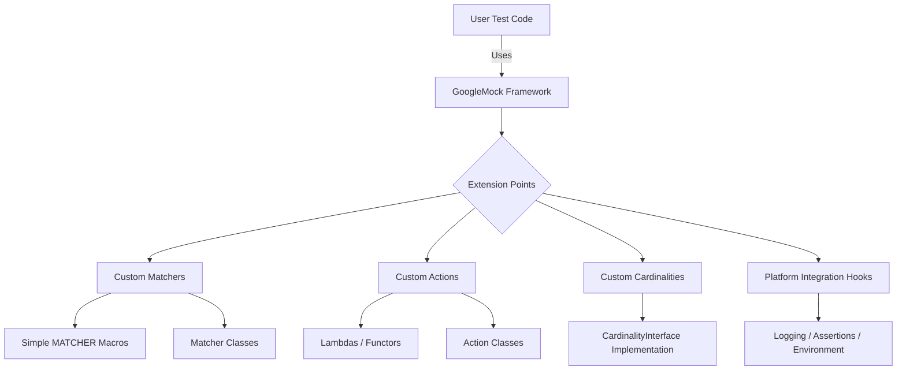

# Customization and Extension Points

GoogleTest and GoogleMock are designed to be extensible, enabling advanced users to tailor the framework for their specific requirements and integrate with platform-specific features. This guide explains the key interfaces and strategies for extending the testing framework, providing you with the tools to build custom matchers, actions, cardinalities, and platform-specific hooks.

---

## Overview of Extension Points

GoogleTest and GoogleMock offer multiple extension points that empower users to customize or augment default behaviors:

- **Custom Matchers:** Define predicates to match arguments in mock methods based on your domain-specific criteria.
- **Custom Actions:** Implement specialized behaviors for mock methods beyond the built-in actions.
- **Custom Cardinalities:** Set bespoke call count expectations beyond the standard ones such as `Times()`, `AtLeast()`, etc.
- **Platform Abstractions:** Hook into platform-specific features such as logging, error handling, or environment adaptation.

These extensibility interfaces allow you to capture complex test requirements with expressive, reusable components.

---

## Writing Custom Matchers

Matchers control how mock method arguments are verified. While GoogleMock provides many built-in matchers, in many scenarios you need to define custom matchers that best describe your domain logic.

### When to Write a Custom Matcher

- Argument matching requires conditions not covered by built-in matchers.
- You want clear, descriptive failure messages tailored to your predicate.
- You intend to reuse complex matching logic across multiple tests.

### Types of Matchers

- **Simple Matchers (Using `MATCHER` Macros):** Quick way to write stateless matchers.
- **Parameterized Matchers:** Accept arguments to customize behavior.
- **Monomorphic Matchers:** Write matcher classes for specific argument types.
- **Polymorphic Matchers:** Create matchers that work with multiple argument types.

### Basic Example: Custom Matcher for Values Divisible by 7

```cpp
MATCHER(IsDivisibleBy7, "Checks if a value is divisible by 7") {
  return (arg % 7) == 0;
}
```

Use it with:

```cpp
EXPECT_CALL(mock, Foo(IsDivisibleBy7()));
```

### Matcher Class Example

```cpp
class DivisibleBy7Matcher {
 public:
  using is_gtest_matcher = void;

  bool MatchAndExplain(int n, std::ostream* os) const {
    if ((n % 7) != 0 && os != nullptr) {
      *os << "remainder is " << (n % 7);
      return false;
    }
    return true;
  }

  void DescribeTo(std::ostream* os) const { *os << "is divisible by 7"; }
  void DescribeNegationTo(std::ostream* os) const { *os << "is not divisible by 7"; }
};

::testing::Matcher<int> IsDivisibleBy7() {
  return ::testing::MakeMatcher(new DivisibleBy7Matcher());
}
```

### Best Practices

- Ensure matchers are **pure functions** without side effects.
- Provide informative descriptions explaining both positive and negated matches.
- Use `MatchAndExplain()` to add detailed failure diagnostics.
- Prefer the `MATCHER` macros for simple use cases and implement interfaces for complex logic.

---

## Writing Custom Actions

Actions define what happens when a mock method is invoked, such as returning values, invoking callbacks, or modifying parameters.

### When to Write a Custom Action

- Built-in actions like `Return()`, `SetArgPointee()`, or `Invoke()` don't cover the required mock behavior.
- Composite behaviors like modifying several outputs, performing side effects, or conditional responses.

### Basic Example: Lambda Action

```cpp
EXPECT_CALL(mock, Foo(_))
    .WillOnce([](int x) { return x * 2; });
```

### Implementing an Action Class

Implement the call operator compatible with the mocked method signature:

```cpp
struct MultiplyBy {
  int factor;
  
  template<typename T>
  T operator()(T arg) { return arg * factor; }
};

EXPECT_CALL(mock, Foo(_))
    .WillRepeatedly(MultiplyBy{7});
```

### Using Legacy Macros

Legacy `ACTION()` and `ACTION_P()` macros are available but discouraged for new code in favor of lambdas or callable objects.

---

## Defining Custom Cardinalities

Cardinalities specify how many times a mock method is expected to be called. GoogleMock includes built-in cardinalities like `Exactly()`, `AtLeast()`, `Between()`, and `AnyNumber()`. You may need custom cardinalities to represent complex validation logic such as "called an even number of times".

### Cardinality Interface

```cpp
class CardinalityInterface {
 public:
  virtual ~CardinalityInterface();
  virtual bool IsSatisfiedByCallCount(int call_count) const = 0;
  virtual bool IsSaturatedByCallCount(int call_count) const = 0;
  virtual void DescribeTo(std::ostream* os) const = 0;
};
```

### Example: Custom Even Number Cardinality

```cpp
class EvenNumberCardinality : public CardinalityInterface {
 public:
  bool IsSatisfiedByCallCount(int call_count) const override {
    return call_count % 2 == 0;
  }
  bool IsSaturatedByCallCount(int /*call_count*/) const override {
    return false;  // Never saturated
  }
  void DescribeTo(std::ostream* os) const override {
    *os << "called even number of times";
  }
};

::testing::Cardinality EvenNumber() {
  return ::testing::MakeCardinality(new EvenNumberCardinality());
}

EXPECT_CALL(mock, Foo()).Times(EvenNumber());
```

---

## Integrating Platform-Specific Hooks

GoogleTest can be adapted to leverage platform-specific features for improved integration, such as custom logging, assertion handling, and environment setup.

### Scenarios for Platform Integration

- Redirecting test output to platform loggers
- Invoking custom cleanup on test failures
- Adapting to restrictions of embedded environments

### Strategies

- Override logging functions or macros
- Leverage existing platform APIs in test fixtures' setup/teardown
- Customize error reporting behavior via APIs

While specific integration points depend on your platform, GoogleTest's modular design allows inserting these hooks cleanly.

---

## Tips for Successful Customization

- Thoroughly test your custom matchers and actions independently.
- Keep matchers pure and free from side effects to avoid flaky tests.
- Use descriptive names and message strings for diagnostics.
- Document your extensions clearly for other test authors.
- Leverage GoogleTest and GoogleMock's built-in support where possible before extending.

---

## Resources

- [gMock Cookbook - Writing New Matchers and Actions](https://google.github.io/googletest/gmock_cook_book.html#WritingNewMatchers)
- [Matchers Reference](reference/matchers.md)
- [Actions Reference](reference/actions.md)
- [Mocking Reference](docs/reference/mocking.md)
- [gMock Cheat Sheet](docs/gmock_cheat_sheet.md)

---

## Summary Diagram: gMock Extension Points


```

---

By leveraging the extension points described here, you can adapt GoogleTest and GoogleMock to complex testing scenarios that demand unique verification logic or integrate tightly with specialized platforms and infrastructure.

If you are new to these concepts, refer to the gMock Cookbook for practical recipes and examples on writing custom matchers and actions before implementing complex extensions.
