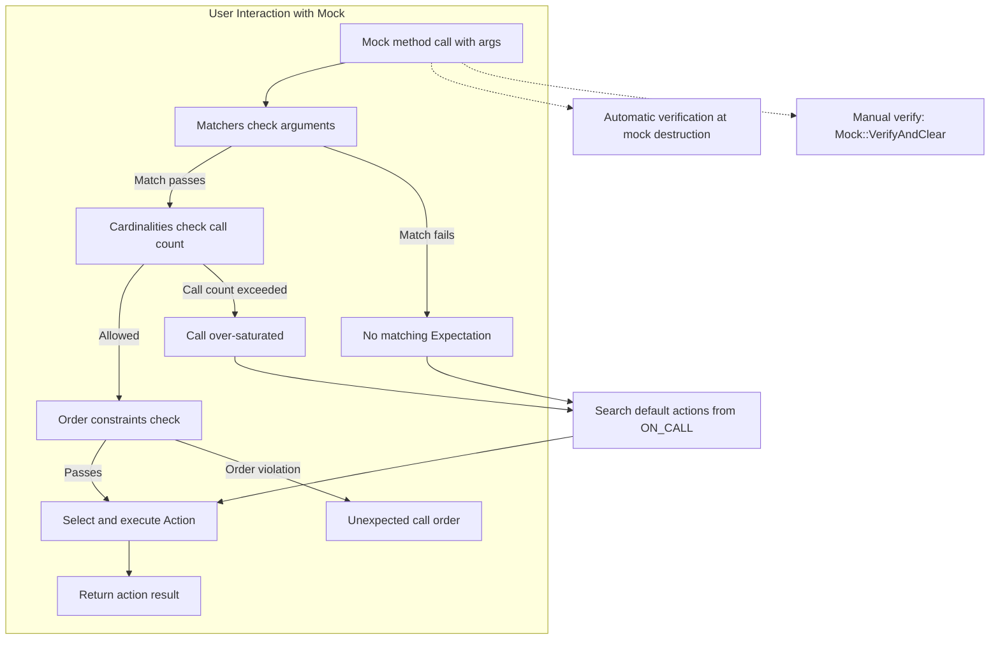

# Matchers, Actions, and Cardinalities: Data Models

Understanding the fundamental data models behind GoogleMock is essential for effective mocking and test verification. This guide breaks down the core abstractions of **Matchers**, **Actions**, and **Cardinalities**, explaining how they represent mock interactions and govern verification logic within `ON_CALL`, `EXPECT_CALL`, and related constructs.

---

## Introduction to the Core Data Models

At the heart of GoogleMock's ability to verify mock function calls lie three key abstractions:

- **Matchers**: Define which function arguments satisfy an expectation or default behavior.
- **Actions**: Specify what a mocked method should *do* when invoked.
- **Cardinalities**: Specify how many times a call matching the expectation should happen.

These models collaborate to express detailed expectations and default behaviors, enforce call sequencing, and provide rich test diagnostics.

---

## Matchers: Defining Argument Expectations

Matchers serve as predicates that determine whether given function arguments satisfy test expectations.

- **Role**: Matchers check whether an argument or an entire tuple of arguments matches criteria defined by the user.
- **Usage**:
  - Passed as arguments in `EXPECT_CALL` or `ON_CALL` to specify what input values are expected or defaulted.
  - Combined via clauses such as `.With()`, which allows expressing conditions on multiple or all arguments as a single tuple.

### Key Matcher Concepts

- **Basic Matchers**: Examples include `_` (wildcard), `Eq()`, `Ge()`, `Ne()` etc., which test argument equality or relational properties.
- **Composite Matchers**: Built from simpler matchers using logical operators like `AllOf()` or `AnyOf()`.
- **Multi-Argument Matching**: `.With()` uses a matcher on the tuple of all arguments, enabling conditions involving multiple parameters at once.

### Practical Example

```cpp
EXPECT_CALL(mock_object, SetPosition(_, _))
    .With(Lt());  // Matches if the 1st argument < 2nd argument.
```

Here, `Lt()` is a matcher on the argument tuple, imposing a relationship between two arguments beyond individual matchers.

---

## Actions: Specifying Mock Method Behaviors

While matchers define *what* calls are recognized, actions define *what happens* when these calls occur.

- **Role**: Actions specify the behavior of the mocked method invocation. This can range from returning a value, modifying arguments, invoking callbacks, or delegating to real or fake implementations.
- **Usage**:
  - Given in `EXPECT_CALL` clauses `.WillOnce()` and `.WillRepeatedly()`, or in `ON_CALL` through `.WillByDefault()`.
  - Multiple `WillOnce()` clauses define a sequence of behaviors for consecutive calls.
  - `WillRepeatedly()` defines behavior after exhausting specified `WillOnce()` actions.

### Examples of Actions

- `Return(value)`: Returns a fixed value.
- `ReturnRef(variable)`: Returns a reference to a variable.
- `Invoke(function_or_lambda)`: Calls a user-provided callable.
- `SetArgPointee<N>(value)`: Modifies the Nth pointer argument’s pointee.

### Example: Defining Behavior with Actions

```cpp
EXPECT_CALL(mock, GetNumber())
    .WillOnce(Return(1))
    .WillOnce(Return(2))
    .WillRepeatedly(Return(3));
```

This sets up the mock method to return `1` on the first call, `2` on the second, then always `3` thereafter.

---

## Cardinalities: Controlling Call Frequency

Cardinalities specify *how many times* a mock function call should occur matching a given expectation.

- **Role**: They define constraints such as "exactly once", "at least n times", "any number of times", etc.
- **Usage**: Declared using the `.Times()` clause in `EXPECT_CALL`.

### Common Cardinalities

| Cardinality       | Meaning                               |
|-------------------|-------------------------------------|
| `Exactly(n)` or `n` | Call is expected exactly `n` times. |
| `AnyNumber()`     | Call can occur any number of times (including zero). |
| `AtLeast(n)`      | Call should occur at least `n` times. |
| `AtMost(n)`       | Call should occur at most `n` times. |
| `Between(m, n)`   | Call should occur between `m` and `n` times (inclusive). |

### Cardinality Inference

If `.Times()` is omitted, GoogleMock infers cardinality based on presence of actions:

- No `WillOnce` or `WillRepeatedly`: `Times(1)`
- `n` `WillOnce` clauses and no `WillRepeatedly`: `Times(n)`
- `n` `WillOnce` clauses and one `WillRepeatedly`: `Times(AtLeast(n))`

### Example

```cpp
EXPECT_CALL(mock_obj, Foo()).Times(AtLeast(2));
```

This expects `Foo()` to be called two or more times.

---

## How These Models Work Together in Expectation Statements

When you write an expectation:

```cpp
EXPECT_CALL(mock_object, Method(args...))
    .With(multi_argument_matcher)
    .Times(cardinality)
    .InSequence(...)  // specifies order
    .After(...)       // imposes partial order
    .WillOnce(action)
    .WillRepeatedly(action)
    .RetiresOnSaturation();
```

Here is how the models collaborate:

1. **Argument Matching:** The call must match the specified individual matchers (e.g., in `Method(args...)`) and the optional `.With()` multi-argument matcher.
2. **Cardinality Check:** The call count is checked against the cardinality to detect under- or over-call scenarios.
3. **Ordering Constraints:** Calls must respect the ordering imposed by `InSequence` and `After` clauses.
4. **Action Execution:** On a matching call, the appropriate action (`WillOnce` in sequence or `WillRepeatedly`) is executed.
5. **Retirement:** If enabled, the expectation retires after the specified cardinality saturates, removing it from future consideration.

---

## Lifecycle and Verification

GoogleMock automatically verifies all expectations associated with mock objects upon their destruction, ensuring all specified calls were made as expected. 

You can manually force verification and clearing of expectations and default actions using:

```cpp
Mock::VerifyAndClearExpectations(&mock_object);
Mock::VerifyAndClear(&mock_object);
```

This is especially useful if mocks live on the heap or their lifetime is controlled externally.

---

## Best Practices and Tips

- Use **Matchers** to express intent precisely, but avoid over-specification that causes brittle tests.
- Use **Actions** to simulate realistic behaviors or side effects.
- Leverage **Cardinalities** to control test robustness and enforce correct call counts.
- Use `.RetiresOnSaturation()` to make expectations "not sticky" when appropriate.
- Use `ON_CALL` to set *default behaviors* without imposing call expectations.
- Use `EXPECT_CALL` to set *expectations* for *verification purposes*.
- Use **Sequences** (`InSequence`, `After`) judiciously for ordering constraints to avoid brittle tests.

---

## Troubleshooting Common Issues

- **Uninteresting Calls Warnings:** When a mock method is called with no `EXPECT_CALL` set, GoogleMock prints a warning but continues. Suppress using `NiceMock` or explicit catch-all `EXPECT_CALL(...).Times(AnyNumber())`.
- **Unexpected Calls Errors:** Calls not matching any `EXPECT_CALL` produce errors.
- **Too Many / Too Few Actions:** Configure `WillOnce` and `WillRepeatedly` actions consistent with `Times()` cardinality.
- **Action Exhaustion:** Without a `WillRepeatedly()`, `WillOnce()` calls are exhausted at the cardinality limit; calls beyond this invoke default behavior or cause errors.
- **Conflicting Matchers or Ordering:** Use `.With()`, `InSequence()`, and `.After()` carefully in correct order.

---

## Summary Diagram



---

## Additional Resources

- [Mocking Reference](../reference/mocking.md) — In-depth syntax and usage.
- [gMock Cookbook](../gmock_cook_book.md) — Recipes and patterns.
- [Matchers Reference](../reference/matchers.md) — Built-in matchers and usage.
- [Actions Reference](../reference/actions.md) — Built-in actions.
- [Cardinalities](../reference/mocking.md#EXPECT_CALL.Times) — Cardinality details.
- [Understanding Uninteresting vs Unexpected Calls](../gmock_cook_book.md#uninteresting-vs-unexpected) — Helps clarify call classification.

---

By mastering these data models, you gain powerful control over your mocks, ensuring your tests precisely express your intent and robustly detect contract violations.

---

*Documentation generated from GoogleMock core mocking source: [spec-builders.h](https://github.com/google/googletest/blob/main/googlemock/include/gmock/gmock-spec-builders.h) and related guides.*
