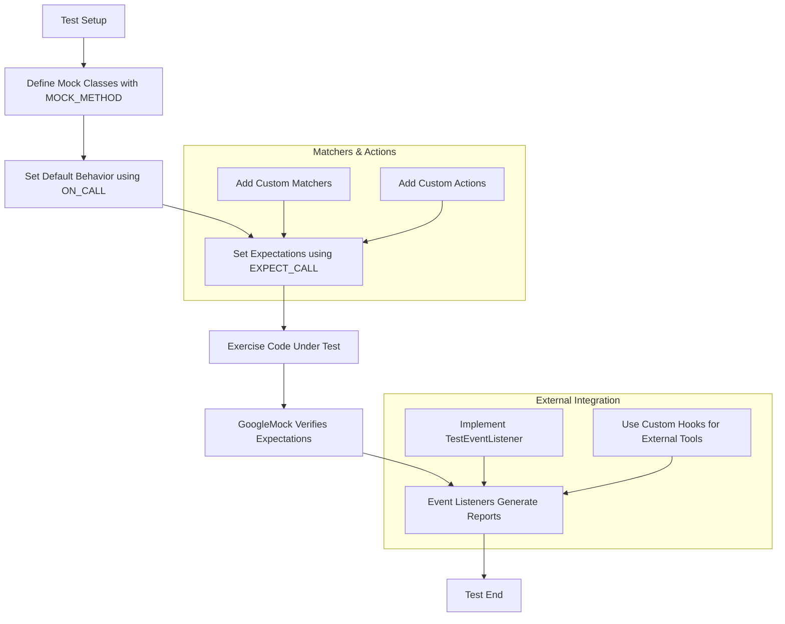

# Advanced Extensibility Points in GoogleTest & GoogleMock

Explore the key architectural hooks and interfaces designed to extend and customize GoogleTest and GoogleMock beyond their default capabilities. This guide is tailored for advanced users and teams building atop the framework to tailor test behaviors, integrate with external tooling, or build domain-specific extensions.

---

## 1. Introduction to Extensibility

GoogleTest and GoogleMock offer powerful, flexible testing primitives out-of-the-box. Still, advanced scenarios often require users to extend the framework via:

- Custom actions and matchers for tailored verification and behavior control.
- Event listeners and test event monitoring for deep integration with CI pipelines or custom reporting.
- Integration hooks to connect mocks and tests with external systems.

This page explains how these extension points work from a user perspective — focusing on their intent and usage rather than internal implementations.


## 2. Custom Actions and Matchers

The essence of mock extensibility lies in how users define:

- **Matchers**: Specify precise, custom argument validations, enabling expressive, domain-specific criteria beyond built-in predicates.
- **Actions**: Define what a mock method does when called (e.g., returning dynamic values, invoking callbacks, side effects).

### 2.1 Creating Custom Matchers

Matchers are objects or functors that determine whether an argument meets given criteria. GoogleMock supports: 

- Writing simple custom matchers using the `MATCHER` or `MATCHER_P` macros for quick predicates.
- Defining monomorphic matchers for specific types.
- Creating polymorphic matchers valid across types via templated `MatchAndExplain` functions.

**Example (Simple Matcher):**

```cpp
MATCHER(IsPositive, "Checks if the argument is positive") {
  return arg > 0;
}

// Usage:
EXPECT_CALL(mock_obj, SomeMethod(IsPositive()));
```

Advanced matchers can provide detailed failure explanations to improve test diagnostics.

For multi-argument functions, `.With()` accepts a multi-argument matcher (e.g., tuple matcher) to examine the entire argument set cohesively.

### 2.2 Writing Custom Actions

Actions specify behavior when a mock method matches an expectation. Options include:

- Lambda functions or callable objects:

  ```cpp
  EXPECT_CALL(mock_obj, Foo())
      .WillOnce([]() { return 42; });
  ```

- Using `ACTION` or `ACTION_P` macros for parameterized reusable actions.
- Polymorphic actions with templates to support varied mock method signatures.

Actions can perform side effects, modify output arguments, or chain multiple operations with `DoAll()`.

**Example (Side Effect and Return):**

```cpp
ACTION_P(SetAndReturn, value) {
  *arg0 = value; // Set output argument point 0
  return true;
}
EXPECT_CALL(mock_obj, Mutate(_))
    .WillOnce(SetAndReturn(42));
```


## 3. Event Listener Architecture

GoogleTest offers event listeners to track and respond to the lifecycle of tests and test suites programmatically, enabling:

- Custom logging or report generation.
- Integration with non-standard test harnesses or CI monitoring services.
- Performance measurement or dynamic test flow alteration.

### 3.1 Using Test Event Listeners

You can implement the `::testing::TestEventListener` interface or inherit from `EmptyTestEventListener` to override phases such as:

- `OnTestProgramStart()` and `OnTestProgramEnd()`
- `OnTestSuiteStart()` and `OnTestSuiteEnd()`
- `OnTestStart()` and `OnTestEnd()`
- `OnTestPartResult()` for assertion results

Then register your listener via:

```cpp
::testing::TestEventListeners& listeners = ::testing::UnitTest::GetInstance()->listeners();
listeners.Append(new MyCustomListener);
```

### 3.2 Listener Ordering

Listeners are invoked in order. You can also replace default listeners (like the default console printer) to fully customize output.


## 4. Integration with External Systems

Advanced extensibility includes seamless integration with external test management, coverage, or monitoring tools. You can interject in various points:

- Use listeners to stream results or emit custom structured events.
- Use custom matchers and actions to interface with hardware simulators, databases, or distributed systems.
- Inject test filters programmatically to build selective or dynamic test runs.


## 5. Advanced Mocking Hooks

GoogleMock supports some nuanced extensibility features:

### 5.1 Delegation to Real or Fake Objects

Mocks can delegate calls to actual or fake objects for realistic default behavior, combining interaction-based testing with functional correctness.

```cpp
ON_CALL(mock_obj, SomeMethod(_))
    .WillByDefault([this](ArgType arg) { return real_.SomeMethod(arg); });
```

### 5.2 Mocking Non-Virtual Methods

High-perf dependency injection enables mocking non-virtual methods by defining mock classes unrelated to real classes but mimicking method signatures.

### 5.3 Mock Method Qualification

Using qualifiers like `const`, `override`, `noexcept`, and `ref(&)` is critical in `MOCK_METHOD` declarations to properly mock complex C++ method signatures.

### 5.4 Controlling Behavior of Uninteresting Calls

`NiceMock`, `NaggyMock`, and `StrictMock` control how mocks react to uninteresting calls:

- `NiceMock` suppresses warnings.
- `NaggyMock` (default) warns.
- `StrictMock` treats as fatal errors.

This helps enforce strict or relaxed mock behaviors depending on test needs.


## 6. Practical Tips and Best Practices

- **Set expectations before exercising mocks:** Ensure `EXPECT_CALL` statements precede mock method uses to avoid undefined behavior.
- **Use `ON_CALL` to define default behavior without expectations:** Reduces test brittleness and explicitness.
- **Sequence your expectations for order-sensitive tests:** Use `InSequence` or `After` to enforce call order.
- **Retire expectations (`RetiresOnSaturation`) to avoid sticky expectations overriding newer ones.**
- **Write custom matchers and actions that are pure and side-effect free:** Avoid calling mock methods inside matchers.


## 7. Summary Diagram of Extension Workflow




## 8. Troubleshooting and Common Pitfalls

- Incorrect use of `MOCK_METHOD` qualifiers leads to compilation warnings or broken mocks.
- Expectation mismatches often arise from misunderstanding matcher precedence and ordering.
- Defining multiple overlapping expectations requires careful ordering; last matching expectation wins.
- Always verify mocks timely using `Mock::VerifyAndClearExpectations` when not relying on destructor verification.
- Use `--gmock_verbose=info` for detailed mock call traces to diagnose expectation failures.


## 9. Further Reading and Resources

- [gMock for Dummies](https://google.github.io/googletest/gmock_for_dummies.html) — beginner-friendly introduction to mocks.
- [Mocking Reference](reference/mocking.md) — detailed API reference for mocks, expectations, and configurations.
- [gMock Cookbook](https://google.github.io/googletest/gmock_cook_book.html) — advanced usage recipes.
- [Matchers Framework](concepts/mocking-abstractions/matchers-framework.mdx) — conceptual guide on matchers.
- [Actions and Matchers](api-reference/mocking-framework/actions-matchers.mdx) — API reference and usage patterns for actions and matchers.
- [Mock Definition](api-reference/mocking-framework/mock-definition.mdx) — defining mock classes and methods correctly.


---

**Note:** This guide focuses on extensibility from a user intent perspective, emphasizing how to achieve specific test customization goals and integrations.


---

<AccordionGroup title="Additional Tips and Common Pitfalls">
<Accordion title="Beware of Macro Expansion Issues">
`MOCK_METHOD` must carefully handle nested parentheses especially for complex template types. Use extra parentheses or type aliases in declarations containing commas.
</Accordion>
<Accordion title="Don't Mock Non-Virtual Methods Without Care">
Mocking non-virtual methods requires specific patterns; avoid modifying existing production code just to make methods virtual unless necessary.
</Accordion>
<Accordion title="Use RetiresOnSaturation Wisely">
Sticky expectations (default) can cause confusing 'too many calls' failures; use `.RetiresOnSaturation()` to disable stickiness when appropriate.
</Accordion>
<Accordion title="Debugging Failing Expectations">
Enable `--gmock_verbose=info` to get complete traces of mock calls and matched expectations, including stack traces, for effective debugging.
</Accordion>
</AccordionGroup>


## 10. Summary

Extensibility in GoogleTest and GoogleMock provides the necessary hooks for sophisticated test designs, enabling:

- Tailored validation logic through custom matchers.
- Customized mock behaviors and side effects via user-defined actions.
- Lifecycle event tracking with listeners for custom test flows and reporting.
- Practical mechanisms to integrate mocks with real or fake objects.
- Control and customization of mock call strictness.

Mastering these extension points empowers teams to create maintainable, robust, and deeply integrated tests tailored to their unique environments and requirements.

---

<Check>
Remember:
- Always define expectations before exercising mocks.
- Use `ON_CALL` for default method behaviors without tight expectations.
- Implement custom matchers/actions for complex verification.
- Use event listeners for custom test monitoring.
- Take advantage of mock strictness modes to balance feedback and test brittleness.
</Check>
