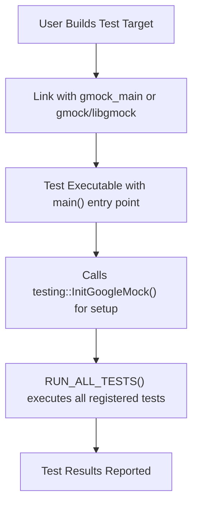

# Build System Integration

This guide provides a conceptual overview of how GoogleTest and GoogleMock integrate with modern C++ build systems, focusing on CMake and Bazel. You'll learn about the main entry points used for test initialization, the portability design considerations embedded in the integration, and the essential files involved to make this process seamless.

---

## Understanding the Integration Landscape

GoogleTest and GoogleMock are designed to integrate tightly yet flexibly with your existing C++ build environment. Their architecture embraces common build tools and systems, making it straightforward to incorporate automated testing and mocking into your development workflow without intrusive modifications.

### Why Integration Matters

The value of automated testing frameworks hinges not only on their functionality but also on how smoothly they fit into your build and deployment pipeline. GoogleTest and GoogleMock ensure value by providing:

- **Main Entrypoints for Initialization**: A simple, unified interface for starting tests across diverse platforms and build setups.
- **Portability Across Systems**: Design choices that support compilation and execution consistency whether on Linux, Windows, embedded systems, or cross-platform environments.
- **Integration-Friendly Files and Targets**: Easily linkable binaries and libraries tailored to common build tools like CMake and Bazel.

---

## Main Entry Points in Testing Binaries

When building and running your tests, understanding the main entry points provided by GoogleMock (which encompass GoogleTest functions) is critical for successful integration.

### `gmock_main` Library

GoogleMock offers a convenient `gmock_main` target that provides a default `main()` function. This simplifies test executables by eliminating the need to write your own main function; it initializes GoogleMock and runs all registered tests automatically.

#### How It Works

- The `gmock_main` implementation initializes GoogleMock and GoogleTest simultaneously using `testing::InitGoogleMock()`.
- It then triggers the test runner via `RUN_ALL_TESTS()`.
- This behavior is consistent over supported platforms including embedded environments, where specialized `setup()` and `loop()` functions may be used instead.

By linking against `gmock_main`, your test binary is immediately ready to run.

#### Sample Build File Snippet (for CMake)

```cmake
add_executable(my_tests test_example.cc)
target_link_libraries(my_tests gmock_main)
```

Linking to `gmock_main` bundles in the main function automatically.

---

## Portability Model

GoogleTest and GoogleMock prioritize portability and ease of integration. Key portability aspects include:

- **Platform Abstractions**: Code handles platform-specific differences internally, so your tests don't need to manage these.
- **Embedded Platform Support**: Common embedded platforms like ESP8266 and NRF52 have specialized entry points and linking considerations.
- **Consistent Initialization**: The core initialization function—`testing::InitGoogleMock()`—is designed to work with various command-line argument styles and platform constraints.

### Initialization Considerations

- The `InitGoogleMock` function parses all GoogleMock and GoogleTest-specific flags from the command line, removing them to avoid interference with the application.
- It seamlessly initializes both GoogleMock and GoogleTest, allowing you to focus on your tests without manual flag or setup management.

---

## Integration with CMake

CMake is among the most popular build systems, and GoogleTest provides explicit support to make integration effortless.

### Recommended CMake Targets

- **`gmock`**: The core GoogleMock library.
- **`gmock_main`**: GoogleMock along with a default `main()` function.
- **`gtest`** and **`gtest_main`** targets also exist for GoogleTest.

Using `add_subdirectory` in your CMakeLists and linking desired targets gives convenient access.

#### Example CMake Usage

```cmake
add_subdirectory(path/to/googletest)

add_executable(my_tests test_suite.cc)

target_link_libraries(my_tests gmock_main)
```

`gmock_main` ensures the binary has the proper main entry and links against `gmock` and `gtest` libraries.

### Important Files

Among the installation artifacts, the `gmock_main.pc` file is notable for pkg-config support, specifying include directories, libraries, and dependencies for external tools:

```pkgconfig
Name: gmock_main
Description: GoogleMock (with main() function)
Version: <Project Version>
URL: https://github.com/google/googletest
Requires: gmock = <Project Version>
Libs: -L${libdir} -lgmock_main @CMAKE_THREAD_LIBS_INIT@
Cflags: -I${includedir} @GTEST_HAS_PTHREAD_MACRO@
```

---

## Integration with Bazel

Bazel users can integrate GoogleTest and GoogleMock using pre-defined rules within workspace configuration.

### Bazel Build Targets

- Use `cc_test` Bazel rules to define your tests.
- Declare dependencies on `@com_google_googletest//:gmock_main` or `@com_google_googletest//:gmock` for linking.

### Example Bazel Test Rule

```starlark
cc_test(
    name = "my_test",
    srcs = ["my_test.cc"],
    deps = ["@com_google_googletest//:gmock_main"],
)
```

Bazel handles test execution and discovery when running `bazel test`.

---

## Build System Integration Flow



- **User Builds Test Target**: Developers configure their build scripts to compile test source files.
- **Link**: Test binaries link to required testing libraries (`gmock_main` provides main).
- **Binary**: Resulting executables contain test registration and main function.
- **Init**: On execution, tests initialize frameworks and parse flags.
- **Run**: All tests are discovered and run.
- **Result**: Results are output to console or CI tools.

---

## Best Practices for Build Integration

- Prefer linking your test executables with `gmock_main` when you want default main functionality.
- Use the official CMake and Bazel integration setups to avoid platform-specific pitfalls.
- Pass through command-line flags (like `--gmock_verbose`) via your test runners to customize behavior.
- Customize build scripts to include necessary headers such as `<gmock/gmock.h>` and `<gtest/gtest.h>` depending on your test source needs.
- Ensure that your build configuration enables required flags for portability, such as exceptions and RTTI if applicable.

---

## Troubleshooting Integration Issues

- **Undefined Symbols on Link**: Verify that you link against `gmock_main` or the combination of `gmock` and `gtest` as needed.
- **Multiple mains Detected**: Avoid linking both your own `main()` and `gmock_main` simultaneously.
- **Incorrect Initialization Flags**: Confirm your test runner passes arguments correctly and that `testing::InitGoogleMock()` processes and removes GoogleMock flags.

For deeper guidance, view [Troubleshooting Common Installation Issues](/getting-started/first-run-validation/troubleshooting-common-issues).

---

## Summary

GoogleTest and GoogleMock integration with modern C++ build systems such as CMake and Bazel centers around seamless initialization, portability, and leveraging provided main functions from `gmock_main`. By linking correctly and setting up build targets appropriately, developers can execute tests effortlessly across platforms while harnessing powerful mocking and testing primitives.

For comprehensive build integration guidance, practical examples, and troubleshooting, consult related sections on [Integration with Build Systems & Tools](/overview/architecture_and_integration/integration_points) and the [Build Integration Guide](/guides/integration-and-advanced-usage/build-integration).

---