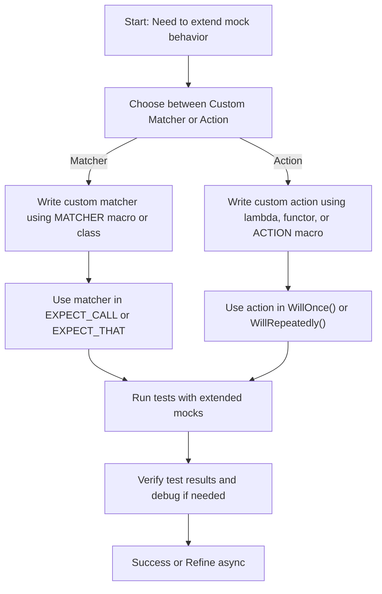

# Custom Actions and Matchers

Extend your testing capabilities by creating custom actions and matchers. This page guides you through writing your own GoogleMock actions and matchers, empowering you to tailor your mocks to handle unique codebases and domain-specific behavior beyond built-in helpers.

---

## Why Create Custom Actions and Matchers?

GoogleMock's built-in matchers and actions cover a wide range of common testing needs, but every project has its unique requirements. By creating custom actions and matchers, you gain:

- **Expressiveness:** Verify complex argument conditions that built-in matchers cannot express.
- **Behavior Control:** Define mock behaviors with actions that go beyond simple returns.
- **Reusability:** Package custom logic for reuse across many tests.
- **Readability:** Make expectations clearer through localized, intention-revealing matchers.

This guide shows you how to write custom matchers and actions effectively.

---

## Custom Matchers

### What Is a Matcher?

A matcher is a predicate object used in `EXPECT_CALL` or `EXPECT_THAT` to specify the criteria an argument must satisfy. GoogleMock provides a rich set of built-in matchers, but sometimes you need finer control.

### Writing a Quick Custom Matcher with Macros

For straightforward cases, use the `MATCHER` family of macros to define custom matchers succinctly.

```cpp
#include <gmock/gmock.h>

MATCHER(IsDivisibleBy7, "Checks if a number is divisible by 7") {
  return (arg % 7) == 0;
}

// Usage in test:
EXPECT_CALL(mock_obj, SomeMethod(IsDivisibleBy7()));
```

You can also add parameterized matchers:

```cpp
MATCHER_P(HasAbsoluteValue, value, "Checks absolute value") {
  return std::abs(arg) == value;
}

// Usage:
EXPECT_THAT(obj, HasAbsoluteValue(10));
```

These macros enable you to keep your matchers concise while still generating informative failure messages.

### Advanced Matcher Classes

When you need full control or more complex logic, implement a matcher class manually by:

- Providing a `MatchAndExplain()` method that returns true if matched.
- Providing `DescribeTo()` and `DescribeNegationTo()` methods to print matcher descriptions for better test diagnostics.

Example:

```cpp
class BarPlusBazEqMatcher {
 public:
  using is_gtest_matcher = void;  // Marker used by GoogleMock

  explicit BarPlusBazEqMatcher(int expected_sum) : expected_sum_(expected_sum) {}

  bool MatchAndExplain(const Foo& foo, std::ostream* os) const {
    int sum = foo.bar() + foo.baz();
    if (sum != expected_sum_ && os != nullptr) {
      *os << " (sum is " << sum << ")";
    }
    return sum == expected_sum_;
  }

  void DescribeTo(std::ostream* os) const {
    *os << "bar() + baz() equals " << expected_sum_;
  }

  void DescribeNegationTo(std::ostream* os) const {
    *os << "bar() + baz() does not equal " << expected_sum_;
  }

 private:
  int expected_sum_;
};

::testing::Matcher<const Foo&> BarPlusBazEq(int expected_sum) {
  return ::testing::Matcher<const Foo&>(BarPlusBazEqMatcher(expected_sum));
}
```

### Best Practices for Matchers

- Implement `MatchAndExplain()` as a const method.
- Use the optional `result_listener` argument to provide detailed failure explanations.
- Keep matchers pure functional; avoid side effects.
- Support polymorphism by templating or using macros.

---

## Custom Actions

### What Is an Action?

Actions specify the behavior a mock function should exhibit when called, such as returning a value, invoking another function, or modifying an argument. Actions complement matchers by controlling the mock's reaction.

### Writing Quick Actions with Lambdas or Functor Objects

The simplest way to define custom behavior is to use lambdas or callable structs directly in `WillOnce()` or `WillRepeatedly()`:

```cpp
MockFunction<int(int)> mock;
EXPECT_CALL(mock, Call)
    .WillOnce([](int x) { return x * 7; });
EXPECT_EQ(mock.AsStdFunction()(2), 14);
```

Custom functors also work:

```cpp
struct MultiplyBy {
  int multiplier;
  template <typename T>
  T operator()(T arg) { return arg * multiplier; }
};

EXPECT_CALL(mock, Call).WillOnce(MultiplyBy{7});
```

Lambdas may also omit arguments if unused.

### Using Legacy `ACTION*` Macros

For backwards compatibility, GoogleMock provides `ACTION()`, `ACTION_P()`, and related macros, which generate action classes.

Example:

```cpp
ACTION(IncrementArg1) { return ++(*arg1); }
EXPECT_CALL(foo, Bar(_)).WillOnce(IncrementArg1());
```

Parameterizing actions:

```cpp
ACTION_P(Add, n) { return arg0 + n; }
EXPECT_CALL(foo, Baz(_)).WillOnce(Add(5));
```

### Writing New Monomorphic Action Classes

For precise control or more complex logic, implement your own action classes by inheriting from `ActionInterface<F>` where `F` is the mock function signature.

For example:

```cpp
class IncrementArgumentAction : public testing::ActionInterface<int(int*)> {
 public:
  int Perform(const std::tuple<int*>& args) override {
    int* p = std::get<0>(args);
    return ++(*p);
  }
};
Action<int(int*)> IncrementArgument() {
  return testing::MakeAction(new IncrementArgumentAction);
}

EXPECT_CALL(foo, Baz(_)).WillOnce(IncrementArgument());
```

### Writing Polymorphic Actions

To reuse actions across different function signatures, define an implementation class with a template `Perform()` method and wrap it with `MakePolymorphicAction()`:

```cpp
class ReturnSecondArgumentAction {
 public:
  template <typename Result, typename ArgumentTuple>
  Result Perform(const ArgumentTuple& args) const {
    return std::get<1>(args);
  }
};

PolymorphicAction<ReturnSecondArgumentAction> ReturnSecondArgument() {
  return testing::MakePolymorphicAction(ReturnSecondArgumentAction());
}

EXPECT_CALL(foo, DoThis).WillOnce(ReturnSecondArgument());
```

---

## Practical Tips and Common Pitfalls

- **Avoid side effects in matchers**: Matchers may be called multiple times and out of order.
- **Beware of binding temporary objects in actions**: `Return()` captures the value when the expectation is set, not when executed; use lambdas for dynamic values.
- **Delegate complex actions with lambdas**: For complicated behavior, lambdas offer maximum flexibility and better readability.
- **Use `RetiresOnSaturation()` carefully**: To retire expectations after they are matched, preventing unexpected call errors.
- **Naming**: Use intention-revealing names for custom matchers and actions.

---

## Example: Custom Matcher and Action

Suppose you want to verify that a string argument contains only uppercase letters, and when called, the mock should transform the string to uppercase and return its length.

Custom matcher:

```cpp
MATCHER(IsAllUppercase, "Checks if a string contains only uppercase letters") {
  for (char c : arg) {
    if (!std::isupper(static_cast<unsigned char>(c))) {
      return false;
    }
  }
  return true;
}
```

Custom action:

```cpp
struct ToUpperThenLength {
  int operator()(std::string& str) {
    std::transform(str.begin(), str.end(), str.begin(), ::toupper);
    return static_cast<int>(str.size());
  }
};

// Usage in EXPECT_CALL
EXPECT_CALL(mock_obj, Transform(_))
    .WillOnce(ToUpperThenLength());
```

This combination verifies argument contents and defines precise function behavior.

---

## Summary

Extending GoogleMock with your own custom actions and matchers gives you full control over testing criteria and mock behavior, adapting effortlessly to your project's unique needs. Use quick macros for straightforward cases or full class implementations for complex requirements.

For more advanced patterns, including steps to combine multiple matchers or compose actions, consult the related guides below.

---

## See Also

- [gMock for Dummies](https://google.github.io/googletest/gmock_for_dummies.html#setting-expectations)
- [gMock Cookbook: Custom Matchers & Actions](https://google.github.io/googletest/gmock_cook_book.html#NewMatchers)
- [Writing Custom Matchers and Actions API Reference](/api-reference/matchers-actions/custom-matchers-and-actions)
- [Built-in Matchers Reference](/api-reference/matchers-actions/builtin-matchers)
- [Built-in Actions Reference](/api-reference/matchers-actions/builtin-actions)
- [Setting Expectations: EXPECT_CALL and ON_CALL](/api-reference/mocking-framework/setting-expectations)
- [Mock Class Definition and MOCK_METHOD Macros](/api-reference/mocking-framework/mock-class-definition)

---

## Troubleshooting

<AccordionGroup title="Troubleshooting Custom Matchers and Actions">
<Accordion title="Why does my custom matcher fail even when the argument looks correct?">
Make sure your matcher is **purely functional** and does not rely on mutable state or side effects. Remember that a matcher may be called multiple times and out-of-order by GoogleMock.
</Accordion>
<Accordion title="I get compilation errors when defining parameterized matchers or actions. What should I check?">
Verify that you properly use the `MATCHER_P` or `ACTION_P` macros with correct syntax, and that the template parameter types are deducible or explicitly specified if needed.
</Accordion>
<Accordion title="My custom action returns a value but the mock method has void return type. I get errors.">
Use `IgnoreResult()` to convert a returning action to a void one or ensure your action returns `void` when matching the mock method signature.
</Accordion>
<Accordion title="How do I debug complex matchers with composite logic?">
Use streaming to the `result_listener` in `MatchAndExplain()` to output detailed failure explanations for easier diagnosis.
</Accordion>
</AccordionGroup>

---

## Mermaid Diagram: User Workflow for Custom Actions and Matchers



