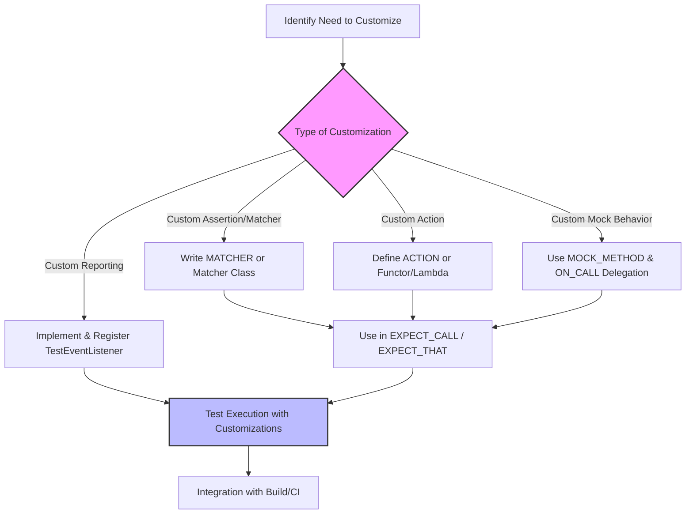

# Customization and Extending the Framework

GoogleTest and GoogleMock provide powerful capabilities not only out-of-the-box but also through well-defined architectural hooks that let you extend and customize the framework. This page details how you can create custom assertions, matchers, actions, and reporters to tailor the framework’s behavior to specialized workflows, integrate with larger build and CI/CD systems, or support domain-specific testing needs.

---

## Why Customize?

Out-of-the-box, GoogleTest and GoogleMock cover a broad set of testing needs, but real-world projects often require extending:

- To express domain-specific semantics through **custom assertions and matchers** that improve test clarity and diagnostics.
- To control mock behavior beyond built-in patterns using **custom actions**.
- To integrate with sophisticated reporting and CI workflows by plugging in **custom reporters or event listeners**.
- To support specialized parameterization, filtering, or environment control.

Customization ensures tests remain expressive, maintainable, and tightly aligned with project requirements.

---

## Custom Assertions and Matchers

Custom assertions and matchers allow you to define new conditions for validating test results and mock call arguments, improving test expressiveness.

### Writing Custom Matchers Quickly

Use the `MATCHER` and `MATCHER_P` macros to write matchers succinctly:

```cpp
MATCHER(IsDivisibleBy7, "") {
  return (arg % 7) == 0;
}

MATCHER_P(InClosedRange, range, "") {
  return (range.low <= arg) && (arg <= range.high);
}
```

These macros let you focus on the core matching logic. Use these inside `EXPECT_CALL` or `EXPECT_THAT` to check arguments with domain semantics.

### Implementing Matcher Classes

For fine control, write a matcher class implementing `MatchAndExplain`, `DescribeTo`, and `DescribeNegationTo` methods. This approach gives precise control over matching logic and failure messages.

### Polymorphic Matchers

Define polymorphic matchers that work over multiple argument types by templating the matcher’s `MatchAndExplain` method, allowing your matcher to seamlessly adapt to test contexts.

### Best Practices

- Keep matchers **functional and side-effect free**.
- Provide meaningful descriptions to help diagnose failures.
- Use existing matchers as building blocks.

For detailed recipes and examples, see the [Writing Custom Assertions and Matchers guide](../guides/advanced-testing-patterns/custom-assertions-matchers.mdx).

---

## Creating Custom Actions

Beyond matching arguments, you often need custom behavior when a mock method is called.

### Simple Custom Actions

Define actions as structs or lambdas with the appropriate call operator:

```cpp
struct MultiplyByTwo {
  int operator()(int x) const { return x * 2; }
};

EXPECT_CALL(mock, Multiply(_))
    .WillOnce(MultiplyByTwo());
```

Or with lambdas:

```cpp
EXPECT_CALL(mock, Add(_, _))
    .WillOnce([](int a, int b) { return a + b; });
```

### Parameterized Actions

Use `ACTION_P` macros to create actions with parameters:

```cpp
ACTION_P(AddN, n) {
  return arg0 + n;
}

EXPECT_CALL(mock, Add(_))
    .WillOnce(AddN(5));
```

### Advanced: Template-Parameterized Actions

If action behavior depends on template parameters that can’t be inferred naturally, use `ACTION_TEMPLATE` to define such actions, enabling powerful generic action implementations.

### Using Callables and Delegate Actions

You can pass arbitrary functions, functors, or lambdas to `Invoke()` for delegation.

### Notes on Move-only Types

Actions supporting move-only argument types or return values require care. Prefer lambdas and struct-based actions over macro-based actions for best compatibility.

For detailed guidance, see the [Actions Reference](../docs/reference/actions.md) and the [gMock Cookbook](../docs/gmock_cook_book.md#WritingNewActions).

---

## Extending Mock Classes

### Creating Mock Classes

Use the `MOCK_METHOD` macro to define methods in your mock classes, remembering to place them in a `public:` section regardless of the base access level.

### Supporting Complex Cases

- Mock overloaded methods carefully by specifying signatures.
- Handle const and noexcept methods by adding the appropriate specifiers.
- Use `NiceMock`, `NaggyMock`, and `StrictMock` wrappers to control uninteresting call behaviors.

### Delegating Calls

You can delegate default behaviors to fakes, real objects, or parent classes using `ON_CALL` with lambdas, as shown:

```cpp
ON_CALL(mock, MethodName).WillByDefault([this](Args... args) {
  return real_.MethodName(args...);
});
```

### Simplifying Interfaces in Mocks

To make mocks friendlier, you can delegate complex original methods to lightweight mock methods with simpler signatures.

See [Mock Object Creation & Configuration](../docs/reference/mocking.md#MOCK_METHOD) for comprehensive usage.

---

## Customizing Test Reporting

GoogleTest supports plugging custom event listeners and reporters to integrate with external CI systems or to produce specialized reports.

### Event Listeners

By implementing the `TestEventListener` interface, you can hook into granular test lifecycle events, such as test start, success, failure, and suite completion.

### Using Custom Listeners

Register custom listeners by using `TestEventListeners::Append()` during initialization, to add or replace existing listeners.

### Use Cases

- Custom XML or JSON reporting formats
- Integration with build dashboards
- Specialized failure logging or metrics

Refer to the [GoogleTest Primer](../overview/introduction-core-value/what-is-googletest.mdx) for event listener details.

---

## Integration with Build & CI Systems

The framework is designed to support integration with various build systems such as CMake and Bazel, enabling smooth automation.

### Build System Compatibility

GoogleTest and GoogleMock require a C++17-capable compiler and support Linux, Windows, and MacOS broadly.

### Customization Tips

- Configure test filters and sharding for parallel execution.
- Use custom test reporters for CI feedback.
- Set environment macros or override platform abstractions if needed.

See [Integration & Compatibility](../overview/architecture-key-concepts/integration-with-build-and-tools.mdx) and [Test Integration Guide](../guides/integration-and-best-practices/test-integration.mdx) for full details.

---

## Troubleshooting and Best Practices

### Common Pitfalls

- Ensure your custom assertions and matchers are side-effect free.
- Be cautious when sharing actions with internal state.
- Always set expectations before exercising mocks.

### Performance Considerations

- Move mock class constructor/destructor definitions out-of-line to speed builds.
- Use sequences and retirement to manage expectation lifetimes precisely.

### Helpful Tips

- Suppress or adjust mock warnings using `NiceMock` or verbosity flags.
- Use `InvokeArgument` to call mock function arguments that are callable.
- Leverage `DefaultValue<T>` for custom default return values.

---

## Resources and Further Reading

- [Writing Custom Assertions and Matchers](../guides/advanced-testing-patterns/custom-assertions-matchers.mdx)
- [Actions Reference](../docs/reference/actions.md)
- [Mock Object Creation & Configuration](../docs/reference/mocking.md)
- [gMock Cookbook](../docs/gmock_cook_book.md)
- [Integration & Compatibility](../overview/architecture-key-concepts/integration-with-build-and-tools.mdx)

Explore these to master tailoring GoogleTest and GoogleMock to your unique workflows.

---

## Summary Diagram: Customization Workflow


