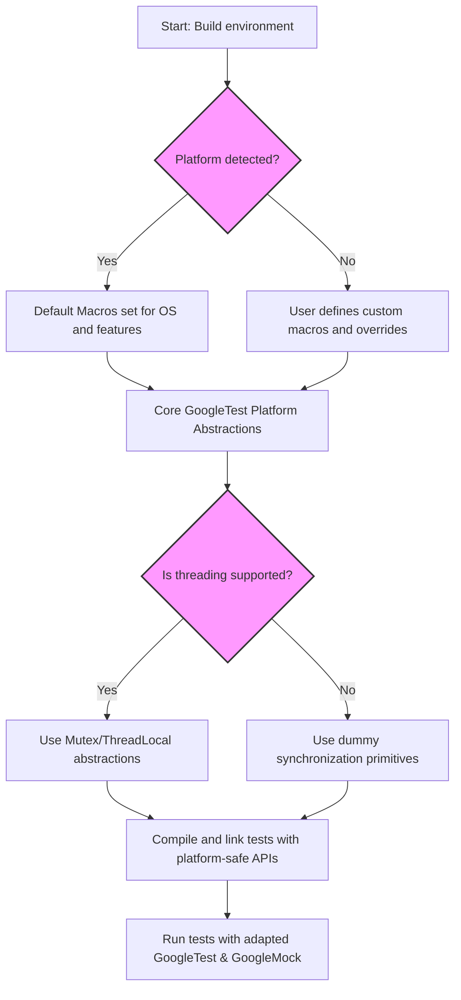

# Customization and Portability Model

GoogleTest and GoogleMock are designed for wide-ranging use across different C++ platforms and compilers, from desktop environments to embedded systems. This page uncovers the key mechanisms empowering their adaptability through custom port headers, feature detection macros, and platform abstraction layers. Understanding these concepts enables you to harness the framework’s flexibility in your own environment and troubleshoot portability challenges effectively.

---

## Why Customization and Portability Matter

Imagine you want to run your tests on Linux, Windows, macOS, or even an embedded CPU with limited runtime capabilities. Each platform has its unique threading APIs, file system conventions, exception support, and compiler idiosyncrasies. GoogleTest and GoogleMock solve the dilemma by defining layers of abstraction and configurable points that encapsulate these differences.

This model allows seamless support for a broad spectrum of environments without burdening you with rewriting or patching the testing code for each platform.

---

## Key Concepts in the Model

### 1. Custom Port Headers

At the heart of adaptability are specialized headers where platform-specific customizations are injected:

- **`gtest-port.h`** for GoogleTest
- **`gmock-port.h`** for GoogleMock

These files provide:

- **Macro definitions to describe environment properties** (e.g., whether exceptions are enabled, or if POSIX APIs are available).
- **Hooks to plug in user-defined implementations** for key operations like logging or thread synchronization.
- **Mechanisms for symbol export/import directives** to accommodate shared library usage.

Users or integrators can customize behaviors simply by defining certain macros or providing their own implementations in corresponding `custom` directories. This approach isolates platform-specific code and avoids changes to the core testing logic.

#### Example Customization Points in `gtest-port.h`

- `GTEST_OS_STACK_TRACE_GETTER_`: Override stack trace capture implementation.
- `GTEST_CUSTOM_TEMPDIR_FUNCTION_`: Specify a custom temporary directory function.
- Threading support flags (`GTEST_HAS_NOTIFICATION_`, `GTEST_HAS_MUTEX_AND_THREAD_LOCAL_`).
- Logging macros like `GTEST_LOG_`.

For GoogleMock, `gmock-port.h` adds facilities to define runtime flags controlling mock behavior.

### 2. Feature Detection Macros

GoogleTest executes compile-time environment detection via carefully crafted macros:

- **Platform indicators:** Such as `GTEST_OS_WINDOWS`, `GTEST_OS_LINUX`, `GTEST_OS_MAC`.
- **Feature indicators:** Flags like `GTEST_HAS_EXCEPTIONS`, `GTEST_HAS_PTHREAD`, `GTEST_HAS_RTTI`, and `GTEST_HAS_POSIX_RE`.
- **Capability flags:** To detect support for threading, filesystem, stream redirection, and regular expressions.

This feature discovery enables conditional compilation paths, automatically tailoring the library’s behavior without requiring manual user intervention in most cases.

### 3. Platform Abstraction Layers

Rather than littering the code with platform-specific `#ifdef`s, GoogleTest and GoogleMock centralize platform-dependent implementations behind abstractions. For example:

- **Synchronization primitives:** Classes like `Mutex`, `MutexLock`, and `ThreadLocal` abstract underlying threading APIs such as pthreads or Win32 critical sections.
- **Filesystem operations:** Wrapper functions around native file APIs manage path separators, directory operations, and file handling uniformly.
- **Regular expressions:** Multiple regex engines are supported (RE2, POSIX regex, custom simple regex), chosen based on environment capabilities.
- **Logging and Streams:** Abstracted to support various platform output mechanisms.

This layered design allows the core test and mock logic to remain platform-agnostic and highly maintainable.

---

## How It Fits in Your Development Flow

### Typical User Intent Scenario:

- You want to run GoogleTest/GoogleMock on a new or embedded platform.
- You check if the platform is detected by the existing macros.
- If it is not or if you need to tweak a feature (e.g., a custom logging solution), you provide overrides in the `custom` headers.
- You ensure your build defines appropriate flags (e.g., `-DGTEST_HAS_PTHREAD=1` for pthread support).
- Your test code remains standard, and the framework adapts behind the scenes.

This results in minimal friction on porting and maximum reuse.

---

## Practical Tips and Best Practices

- **Use the `custom` directories:** These are your entry points for any platform-specific adjustments.
- **Rely on feature-detection macros:** Check flags like `GTEST_HAS_EXCEPTIONS` or `GTEST_HAS_PTHREAD` to write portable test code or guard platform-specific extensions.
- **Prefer provided abstractions:** Use `Mutex`, `ThreadLocal`, and other classes rather than raw platform APIs for threading in helper code.
- **Handle exceptions and RTTI carefully:** Platforms without these require some test code adaptations.
- **Be mindful of file system semantics:** Use path helpers and environment macros to ensure cross-platform correctness.

---

## Common Pitfalls and Troubleshooting

- **Missing or incorrect macro definitions:** The platform might not be properly detected; explicitly defining detection macros can fix build issues.
- **Threading support misconfiguration:** If GoogleTest is not thread-safe on your system, verify `GTEST_HAS_PTHREAD` or mutex availability.
- **Shared library symbol visibility:** When building GoogleTest as a DLL, define `GTEST_CREATE_SHARED_LIBRARY` and `GTEST_LINKED_AS_SHARED_LIBRARY` appropriately.
- **Stack trace and logging not customized:** If default logging or stack trace capture fails or is undesirable, provide overrides in `custom/gtest-port.h`.

Check the [Customization Points documentation](https://github.com/google/googletest/tree/main/googletest/include/gtest/internal/custom) for detailed macro lists and customization strategies.

---

## Illustrative Flow of Portability Integration

---

## References and Further Reading

- [GoogleTest Customization Points (`gtest/internal/custom/README.md`)](https://github.com/google/googletest/blob/main/googletest/include/gtest/internal/custom/README.md)
- [GoogleMock Customization Points (`gmock/internal/custom/README.md`)](https://github.com/google/googletest/blob/main/googlemock/include/gmock/internal/custom/README.md)
- [GoogleTest Port Header (`gtest/internal/gtest-port.h`)](https://github.com/google/googletest/blob/main/googletest/include/gtest/internal/gtest-port.h)
- [Platform and Feature Detection (`gtest/internal/gtest-port-arch.h`)](https://github.com/google/googletest/blob/main/googletest/include/gtest/internal/gtest-port-arch.h)
- [Guide to Running Tests Across Platforms](../../guides/integration-and-advanced-usage/platforms-and-portability.md)
- [Build Integration Concepts](../../concepts/extensibility-integration/build-integration.md)

---

This model is the backbone of GoogleTest’s wide platform reach and informs advanced use-cases such as embedded testing and specialized build environments. By embracing these customization and portability mechanisms, you can confidently extend and adapt GoogleTest and GoogleMock to your unique development needs.
