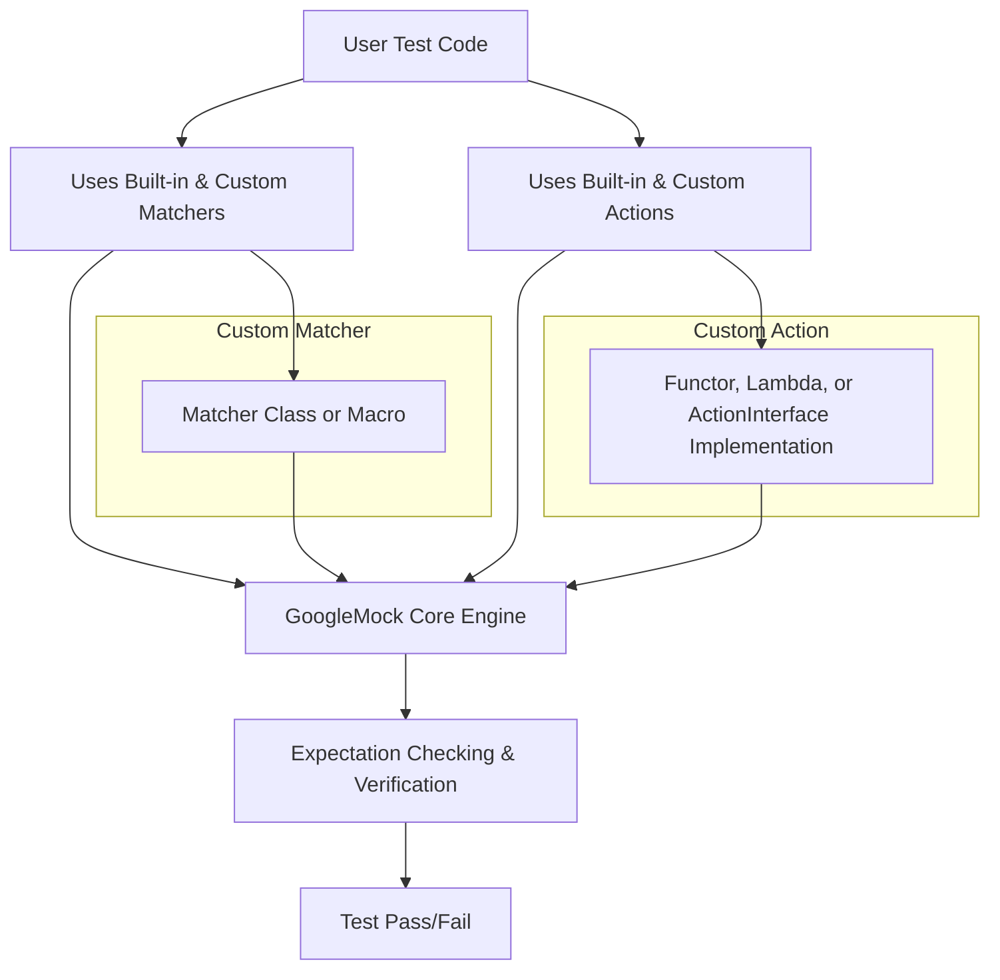

# Custom Matchers, Actions, and Assertions

Explore how to extend GoogleTest and GoogleMock with your own matchers, actions, and assertions, making your tests fit the needs of your domain or codebase architecture.

---

## Introduction

In the realm of C++ testing with GoogleMock, customizing matchers, actions, and assertions empowers you to build tests that express your domain-specific requirements precisely and elegantly. While GoogleMock offers a powerful set of built-in capabilities, there are times when your testing needs exceed what default matchers and actions provide. This guide will walk you through the concepts and workflows that enable you to seamlessly create your own extensions.

Custom components act as bridges between your unique application logic and the standardized testing framework, ensuring your tests remain clear, maintainable, and robust.

---

## Why Customize?

Imagine you’re testing a complex data structure or a protocol implementation where verifying the exact values isn’t enough — you need to check invariants or properties of arguments or tailor how mock methods respond to certain calls.

Out-of-the-box matchers and actions may not capture these nuances. Customization lets you:

- Define **precise validation logic** for function arguments by writing your own matchers.
- Program **complex behaviors and side effects** for mocked methods using custom actions.
- Express **specific assertions** that fit your domain’s unique constraints and error conditions.

This approach keeps your tests expressive and prevents cluttering them with verbose or fragile boilerplate code.

---

## Custom Matchers

### What Is a Matcher?

A matcher specifies the condition an argument must satisfy in an expectation. GoogleMock ships with many built-in matchers like `_` (wildcard), `Eq()`, `Gt()`, `Contains()`, and container matchers.

However, for domain-specific checks, you may want to define your own predicate with tailored logic and descriptive failure messages.

### Ways to Define Custom Matchers

#### 1. Using the `MATCHER` and `MATCHER_P` Macros

These macros allow quick creation of simple or parameterized matchers without boilerplate, providing automatic descriptions.

```cpp
MATCHER(IsDivisibleBy7, "checks if a number is divisible by 7") {
  return (arg % 7) == 0;
}

MATCHER_P(HasAbsoluteValue, value, "checks if absolute value equals") {
  return abs(arg) == value;
}
```

Usage in expectations:

```cpp
EXPECT_CALL(mock, Func(IsDivisibleBy7()));
EXPECT_CALL(mock, Func(HasAbsoluteValue(10)));
```

#### 2. Implementing Matcher Classes

For more control or reusable matchers, write a class implementing:

- `bool MatchAndExplain(arg_type, std::ostream*) const`
- `void DescribeTo(std::ostream*) const`
- `void DescribeNegationTo(std::ostream*) const`

Then provide a factory function returning a `testing::Matcher`.

Example:

```cpp
class BarPlusBazEqMatcher {
 public:
  using is_gtest_matcher = void;
  explicit BarPlusBazEqMatcher(int expected_sum) : expected_sum_(expected_sum) {}

  bool MatchAndExplain(const Foo& foo, std::ostream* os) const {
    return foo.bar() + foo.baz() == expected_sum_;
  }

  void DescribeTo(std::ostream* os) const {
    *os << "bar() + baz() equals " << expected_sum_;
  }

  void DescribeNegationTo(std::ostream* os) const {
    *os << "bar() + baz() does not equal " << expected_sum_;
  }

 private:
  const int expected_sum_;
};

::testing::Matcher<const Foo&> BarPlusBazEq(int expected_sum) {
  return BarPlusBazEqMatcher(expected_sum);
}
```

---

## Custom Actions

### What Is an Action?

An action defines what a mock method does when invoked: returning a value, invoking a callback, setting output parameters, or more complex behaviors.

While GoogleMock provides many built-in actions (`Return()`, `Invoke()`, `SetArgPointee()`, `DoAll()`, etc.), custom actions allow you to define unique side effects or return logic.

### Simple Custom Actions Using Lambdas or Functors

You can use lambdas or functors with `WillOnce()` or `WillRepeatedly()` when built-in actions are insufficient:

```cpp
EXPECT_CALL(mock, Func(_))
    .WillOnce([](int arg) { return arg * 2; });
```

Functors enable stateful or templated custom behavior:

```cpp
struct MultiplyBy {
  int factor;
  template <typename T>
  T operator()(T val) { return val * factor; }
};

EXPECT_CALL(mock, Func(_)).WillOnce(MultiplyBy{5});
```

### Defining Monomorphic and Polymorphic Actions

For advanced control, implement your own action class by inheriting from `testing::ActionInterface<F>` (monomorphic) or use `MakePolymorphicAction()` to create polymorphic actions usable across different mock function types.

Example of a polymorphic action:

```cpp
class ReturnSecondArgumentAction {
 public:
  template <typename Result, typename ArgTuple>
  Result Perform(const ArgTuple& args) const {
    return std::get<1>(args);
  }
};

auto ReturnSecondArgument() {
  return testing::MakePolymorphicAction(ReturnSecondArgumentAction());
}

EXPECT_CALL(mock, Func).WillOnce(ReturnSecondArgument());
```

### Composite Actions with `DoAll()`

Chain multiple actions to perform several steps on a mock call:

```cpp
EXPECT_CALL(mock, Func(_))
    .WillOnce(DoAll(SetArgPointee<0>(5), Return(true)));
```

The last action’s return value is used as the mocked method's return.

---

## Custom Assertions

In addition to matchers and actions, you can embed your custom validation logic into assertions by writing matchers or directly using GoogleTest’s `EXPECT_` macros inside your matchers’ code to provide detailed messages and checks.

This integration ensures rich feedback during tests, tailored precisely to your domain’s semantics.

---

## Best Practices and Tips

- **Start Simple:** Use built-in matchers and actions until you reach limitations.
- **Use `MATCHER` Macros for Quick Cases:** When you only need simple predicates and messages.
- **Ensure Purity:** Custom matchers must be pure functions without side effects.
- **Leverage Descriptions:** Provide helpful `DescribeTo` messages for easy debugging.
- **Re-use Complex Matchers:** Store matchers in variables to avoid rebuilding.
- **Use Lambdas for Custom Actions:** They offer concise and powerful custom behaviors.
- **Delegate to Fakes or Real Objects:** Use delegation when appropriate to avoid duplication.

---

## Troubleshooting Common Pitfalls

- **Matcher Invocation Side Effects:** Matchers are called multiple times; avoid changin state.
- **Action Evaluation Only Once:** Be careful with actions capturing mutable state; use callable objects or lambdas to defer computation.
- **Unexpected Calls:** Carefully set expectations with `EXPECT_CALL` and default behaviors with `ON_CALL`.
- **Over-Specification:** Avoid brittle tests by not matching overly specific argument values.

---

## Further Reading and References

- [gMock Cookbook – Custom Actions and Matchers](https://google.github.io/googletest/gmock_cook_book.html#NewMatchers)
- [Matchers Reference](https://google.github.io/googletest/reference/matchers.html)
- [Actions Reference](https://google.github.io/googletest/reference/actions.html)
- [Mocking Reference](https://google.github.io/googletest/reference/mocking.html)
- [gMock for Dummies](https://google.github.io/googletest/gmock_for_dummies.html)

---

## Diagram: Extending GoogleMock Through Custom Matchers and Actions


```

---

## Summary

By mastering custom matchers, actions, and assertions, you unlock the full expressive power of GoogleMock, tailoring tests to your project’s unique requirements. This capability helps create robust, maintainable, and readable tests that not only verify behavior but capture complex domain concepts with clarity and precision.

---

For implementation details and examples, please explore the related guides, references, and samples embedded within the full GoogleTest and GoogleMock documentation suite.

<Source url="https://github.com/google/googletest" paths={[{"path": "docs/gmock_cook_book.md", "range": "#NewMatchers-#NewPolyActions"},{"path": "docs/reference/mocking.md", "range": "#EXPECT_CALL-#WritingNewActions"}]}/>