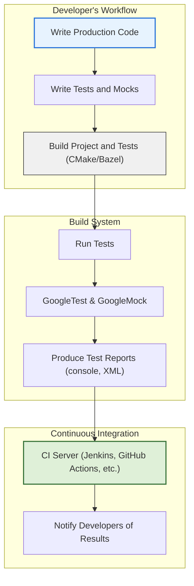

# Integration with Build Systems and CI

Integrating GoogleTest into your development environment is essential for achieving consistent, reliable unit testing across diverse platforms and builds. This guide presents best practices for incorporating GoogleTest with modern build systems such as **CMake** and **Bazel**, and outlines strategies for embedding tests into continuous integration (CI) pipelines. Following these practices ensures uniform test execution, effective test result reporting, and maintainable build configurations.

---

## 1. Integrating GoogleTest with Build Systems

### 1.1 Using CMake for GoogleTest

CMake is the most widely used cross-platform build system. Proper configuration allows GoogleTest and GoogleMock to be seamlessly built and linked with your project.

#### Key Steps:

1. **Fetch GoogleTest:**
   - Prefer using GoogleTest's source as a submodule or external project.
   - Example using `FetchContent`:

   ```cmake
   include(FetchContent)
   FetchContent_Declare(
     googletest
     URL https://github.com/google/googletest/archive/refs/tags/release-1.12.1.zip
   )
   FetchContent_MakeAvailable(googletest)
   ```

2. **Add Your Test Executable:**
   ```cmake
   add_executable(my_tests test_main.cpp test_suite1.cpp ...)
   ```

3. **Link against GoogleTest and GoogleMock Libraries:**
   ```cmake
   target_link_libraries(my_tests PRIVATE gtest gmock gtest_main gmock_main)
   ```

4. **Enable Testing and Register Tests:**
   ```cmake
   enable_testing()
   add_test(NAME MyUnitTests COMMAND my_tests)
   ```

#### Best Practices:
- Use `gtest_main` or `gmock_main` as part of the linked libraries to utilize the default `main()` provided by GoogleTest/GoogleMock (see `/googlemock/src/gmock_main.cc` and `/googletest/src/gtest_main.cc`).
- Leverage `FetchContent` or add GoogleTest as a submodule for reproducible builds.
- Ensure the minimum C++ standard is set to C++17 or higher for compatibility.
- Use `CTest` integration for easy CI reporting.

### 1.2 Using Bazel for GoogleTest

Bazel is a high-efficiency build tool especially popular in large-scale C++ environments.

#### Key Points:
- Import GoogleTest and GoogleMock via Bazel WORKSPACE rules.
- Define `cc_test` targets that depend on `@com_google_googletest//:gtest_main` or `@com_google_googletest//:gmock_main`.

Example BUILD target:
```bazel
cc_test(
    name = "my_tests",
    srcs = ["test_main.cc", "test_suite1.cc"],
    deps = [
        "@com_google_googletest//:gtest_main",
        "@com_google_googletest//:gmock",
    ],
)
```

#### Best Practices:
- Use prebuilt GoogleTest binaries to speed up builds.
- Configure test caching and remote execution features of Bazel to optimize CI runs.
- Use Bazel's test runner to incorporate robust test and coverage reporting.

---

## 2. Continuous Integration Best Practices

Integrating GoogleTest-powered suites into CI pipelines improves test reliability and feedback speed. The following practices maximize the effectiveness of automated testing.

### 2.1 Consistent Test Execution Across Environments

- Always invoke tests via your build system, e.g., `ctest` for CMake or `bazel test` for Bazel.
  This guarantees the correct environment, flags, and dependencies are established.

- Use the default `main()` implementations (`gtest_main` or `gmock_main`) provided with the libraries to simplify test entrypoints and unify test execution.

- Pass consistent command-line flags to control test behavior (e.g., output formats, filters).

### 2.2 Harnessing Test Reporting and Artifacts

- Use GoogleTest's built-in support to output results in XML format with flag `--gtest_output=xml:report.xml`.
- Configure your CI server (Jenkins, GitHub Actions, GitLab CI, etc.) to parse these XML reports for rich test insights.

- For Bazel, enable test result listeners and cache uploads.

### 2.3 Handling Environment Dependencies

- Ensure your build environment matches production or development configurations.
- Document and manage required system dependencies through containerization or infrastructure-as-code.

### 2.4 Managing Flaky and Long-Running Tests

- Isolate flaky tests by tagging or separate test targets.
- Configure retry or timeout behavior at the CI layer.

### 2.5 Integrating gMock Expectations and Mock Behavior

- When using GoogleMock extensively, verify that mock expectations are set before test execution to prevent undefined behavior (see [gMock for Dummies](https://google.github.io/googletest/gmock_for_dummies.html)).
- Use strictness modes (`NiceMock`, `NaggyMock`, `StrictMock`) wisely to control uninteresting call warnings or failures.

---

## 3. Practical Tips and Troubleshooting

### 3.1 Linking and Symbol Issues

- Ensure you link both GoogleTest and GoogleMock libraries, especially if you utilize mocking features.
- When overriding main(), link explicitly against `gmock_main` or `gtest_main`.

### 3.2 Test Discovery

- GoogleTest automatically discovers tests linked into the test executable.
- Use filters (`--gtest_filter`) to select tests or subsets during CI runs.

### 3.3 Command-Line Initialization

- Use `testing::InitGoogleTest(&argc, argv)` or `testing::InitGoogleMock(&argc, argv)` at the start of your test executable to parse flags and initialize frameworks correctly.

- With `gmock_main`, this initialization is done automatically in the default main.

### 3.4 Diagnosing Test Failures in CI

- Enable verbose logs via `--gmock_verbose=info` or `warning` to troubleshoot mock expectation violations.
- Confirm that all expectations are met before test termination; unsatisfied or unexpected calls will cause failures.

### 3.5 CMake and Bazel Setup Verification

- For CMake, verify with `cmake --build . --target RUN_TEST` or `ctest`.
- For Bazel, use `bazel test //path/to:target_test` and examine the test XML outputs.

---

## 4. Summary Diagram of Integration Flow



---

## 5. Additional Resources

- [GoogleTest Primer](https://github.com/google/googletest/blob/main/docs/primer.md) — Start with writing tests.
- [GoogleMock Cookbook](https://google.github.io/googletest/gmock_cook_book.html) — Advanced mocking scenarios.
- [Integration with Build Systems](guides/integration-scenarios/build-system-integration.mdx) — Step-by-step integration guide.
- [Continuous Integration Best Practices](guides/integration-scenarios/ci-best-practices.mdx) — Recommended CI workflows.
- [Troubleshooting Common Issues](getting-started/troubleshooting-help/common-issues.mdx) — Diagnosing frequent problems.
- Reference: `/googlemock/src/gmock_main.cc` and `/googletest/src/gtest_main.cc` — Default main implementations simplicity.

---

By following the practices outlined here, developers ensure that GoogleTest integrates smoothly with their build and CI systems, providing reliable, consistent, and actionable test results that empower high-quality C++ software development.
