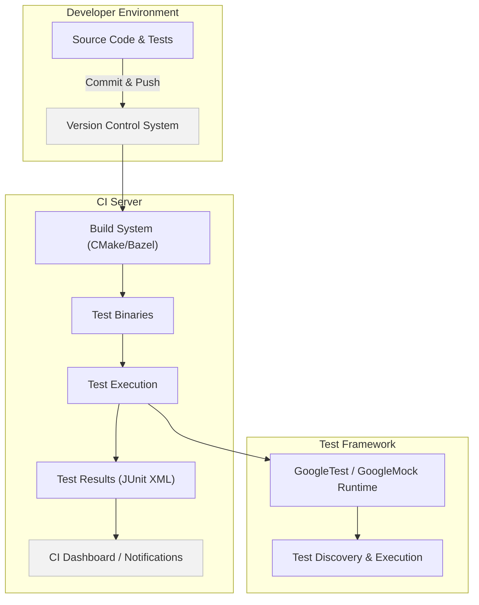

# Integration with Build Systems and Continuous Integration (CI)

Integrating GoogleTest and GoogleMock into your build systems and continuous integration (CI) workflows is essential for efficient development and automated quality assurance. This guide explains how to incorporate test binaries into popular build systems like CMake and Bazel, how tests are constructed and executed across different platforms, and key considerations when embedding GoogleTest into CI pipelines.

---

## Why Integration Matters

Test automation thrives on seamless integration between your test framework and your build and CI systems. By integrating GoogleTest properly:

- You enable automatic test discovery, building, and execution as part of your development lifecycle.
- Your CI environment can reliably report test results, detect failures early, and enforce quality gates.
- You gain control over test execution strategies, like selective runs and parallelization, to optimize performance.

Consider integration as the bridge that connects your code validation with the broader software delivery process.

---

## Integration with CMake

### Standalone GoogleTest Build

GoogleTest includes a community-supported CMake build setup that can be used:

- To build GoogleTest and GoogleMock as independent projects.
- To integrate GoogleTest as a subproject within your own CMake-based build.

### Typical Usage

1. **Cloning and building GoogleTest:**

   ```bash
   git clone https://github.com/google/googletest.git -b v1.17.0
   cd googletest
   mkdir build && cd build
   cmake ..
   make
   sudo make install
   ```

   > By default, GoogleMock is included. To build only GoogleTest, configure with `-DBUILD_GMOCK=OFF`.

2. **Embedding into your CMake project:**

   The recommended approach is to add GoogleTest as a subdirectory to keep compiler and linker settings consistent and avoid incompatible builds (especially on Windows). For example:

   ```cmake
   add_subdirectory(path/to/googletest)

   add_executable(my_test my_test.cc)
   target_link_libraries(my_test gtest_main)  # or gtest
   add_test(NAME my_test COMMAND my_test)
   ```

3. **Using FetchContent for automatic download:**

   To automatically fetch GoogleTest during your build configure step:

   ```cmake
   include(FetchContent)
   FetchContent_Declare(
     googletest
     URL https://github.com/google/googletest/archive/5376968f6948923e2411081fd9372e71a59d8e77.zip
   )
   set(gtest_force_shared_crt ON CACHE BOOL "" FORCE)  # Especially for Windows
   FetchContent_MakeAvailable(googletest)

   add_executable(my_test my_test.cc)
   target_link_libraries(my_test gtest_main)
   add_test(NAME my_test COMMAND my_test)
   ```

### Important CMake Options

- `BUILD_GMOCK`: Enable to build GoogleMock alongside GoogleTest (default ON)
- `gtest_force_shared_crt`: When ON, makes GoogleTest link against the shared C runtime library on Windows, avoiding linker mismatches if your project uses dynamic runtimes.
- `BUILD_SHARED_LIBS`: Controls building static or shared GoogleTest/GMock libraries.
- `INSTALL_GTEST`: Enables installation commands for GoogleTest and GMock.

### Compiler and Linker Configuration

GoogleTest’s CMake setup applies compiler options to ensure compatibility:

- Uses strict warning level settings.
- On MSVC, uses `/MT` or `/MD` depending on shared CRT usage.
- Detects pthread support on platforms and links appropriately.

This ensures your test binaries are built with reliable and consistent settings.

---

## Integration with Bazel

Bazel users typically add GoogleTest as a dependency via `http_archive` or as a submodule.

Typical steps:

- Declare GoogleTest repository in your `WORKSPACE`.
- Reference the GoogleTest targets in your `BUILD` files.
- Write test targets linking to `@com_google_googletest//:gtest_main` or equivalent.

GoogleTest’s Bazel integration supports test binaries and is fully compatible with Bazel's test execution and reporting mechanisms.

---

## Continuous Integration Workflows

### Building Test Binaries in CI

- Your CI pipeline should invoke your build system (e.g., CMake or Bazel) to build your test binaries.
- Ensure dependencies such as GoogleTest are fetched or available.
- Use consistent compiler flags for reproducibility.

### Running Tests and Collecting Results

- Run the test executables during the CI job.
- Use GoogleTest’s built-in XML output support to generate machine-readable test reports:

  ```bash
  ./my_test --gtest_output=xml:report.xml
  ```

- Integrate these XML reports with your CI system’s test report parsing to visualize failures and statistics.

### Optimizing CI Test Execution

- Use test filtering to run only relevant subsets with `--gtest_filter=...`.
- Parallelize test runs when feasible (splitting tests across multiple agents or using test sharding).
- Cache build artifacts and avoid rebuilding unchanged targets to speed up CI.

### Handling Failures

- Ensure test exit codes reflect test pass/fail status. A zero exit code means success.
- Use verbose output options on failure for diagnostics.

---

## Test Binary Construction: What You Need to Know

GoogleTest test binaries:

- Are regular executables linking against `gtest` or `gtest_main` libraries.
- Can be compiled with or without GoogleMock depending on your needs.
- Contain a `main()` function if linked to `gtest_main` or `gmock_main`, which kicks off automated test discovery and execution.

To build your test executable manually, link these libraries appropriately using your build tool. With CMake, this is typically done by linking `gtest_main` and your test sources.

---

## Troubleshooting Common Integration Pitfalls

<AccordionGroup title="Troubleshooting Tips for Build System and CI Integration">
<Accordion title="Linker Errors Due to Runtime Mismatch">
Ensure you enable the `gtest_force_shared_crt` option on Windows and verify that your project and GoogleTest agree on using static or dynamic runtimes.
</Accordion>
<Accordion title="Tests Not Being Discovered or Run in CI">
Confirm that test binaries are properly built and not missing dependencies. Use `--gtest_list_tests` to check test discovery manually.
</Accordion>
<Accordion title="Missing pthreads on Unix-like Systems">
Verify that your build system links with pthread libraries correctly. GoogleTest CMake scripts detect and link pthread automatically if available.
</Accordion>
<Accordion title="Build Failures Due to Missing Source Files or Headers">
Check that GoogleTest source directories and include paths are correctly added to your build configurations.
</Accordion>
<Accordion title="Incorrect C++ Standard Version">
Make sure your build uses C++17 or higher, as GoogleTest requires this standard level.
</Accordion>
</AccordionGroup>

---

## Practical Example: Adding a GoogleTest Test Executable Using CMake

```cmake
cmake_minimum_required(VERSION 3.14)
project(MyProject LANGUAGES CXX)

# Fetch GoogleTest at configure time
include(FetchContent)
FetchContent_Declare(
  googletest
  URL https://github.com/google/googletest/archive/refs/tags/release-1.17.0.zip
)
set(gtest_force_shared_crt ON CACHE BOOL "" FORCE)  # Windows runtime compatibility
FetchContent_MakeAvailable(googletest)

add_executable(my_test tests/my_test.cc)
# Link against GoogleTest main (includes main())
target_link_libraries(my_test gtest_main)

# Enable CTest to run tests
enable_testing()
add_test(NAME MyTest COMMAND my_test)
```

This configuration will build a test binary and integrate it into the CTest framework used by many CI systems.

---

## Summary

Proper integration of GoogleTest and GoogleMock with your build system and CI workflows empowers you to automatically compile, discover, and run tests with meaningful results and performance optimizations. Whether using CMake or Bazel, following best practices and configuration options ensures reliable behavior across platforms and environments.

For deeper dives, consult related sections on installation, running tests, and continuous integration in this documentation suite.

---

## Additional Resources

- [GoogleTest Installation: CMake & Bazel](/getting-started/setup-installation/installation-cmake-bazel)
- [Continuous Integration and Test Automation Guide](/guides/advanced-and-integration/ci-integration)
- [Troubleshooting Setup Issues](/getting-started/quickstart-validation/troubleshooting-common-issues)
- [Running and Validating Tests](/getting-started/quickstart-validation/run-validate-tests)

---

## Diagram: Overview of Test Integration with Build Systems and CI Pipeline



This flowchart illustrates how source code and tests pushed by developers enter the CI server, where the build system compiles test binaries, executes them within the GoogleTest framework, generates test reports, and provides feedback via the CI dashboard.

---

## Best Practices

- Always keep the GoogleTest version used in CI consistent with local development to prevent discrepancies.
- Use CMake’s `FetchContent` or Bazel workspace mechanisms to tightly control dependency versions.
- Leverage GoogleTest’s XML output to integrate cleanly with CI reporting tools.
- Adjust build and test parallelization settings in CI to optimize runtime without overwhelming build infrastructure.
- Use CMake options like `gtest_force_shared_crt` to resolve linker/runtime issues early.

## Wrapping Up

Integration between GoogleTest, build systems, and CI is key to building reliable, maintainable, and scalable automated testing pipelines. This guide arms you with the practical knowledge and configuration patterns to embed testing smoothly into your development workflows.

---