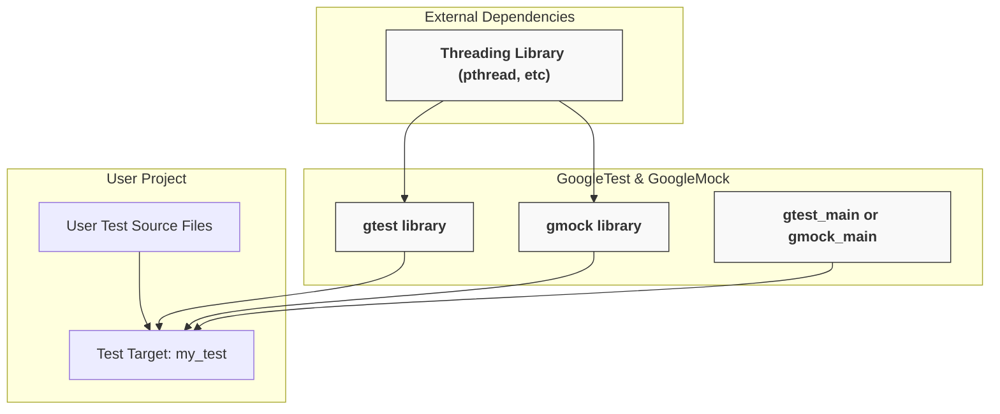

# Build System Integration Patterns

Integrating GoogleTest and GoogleMock into your build system is a foundational step to unlock their full potential in testing and mocking C++ applications. This guide provides clear guidance on how to effectively manage dependencies, configure builds, and enable multi-platform support using modern build tools, primarily CMake and Bazel.

---

## Why Proper Build Integration Matters

A robust integration ensures:

- Seamless compilation and linkage of GoogleTest and GoogleMock with your source code.
- Correct initialization and availability of all testing and mocking features.
- Portability across platforms, including Linux, Windows, MacOS, and embedded targets.
- Maintainability and ease of upgrading.

By designing your build system following best practices, you save time, reduce platform-specific issues, and create consistent environments for all developers and CI pipelines.

---

## Core Principles of Integration

### 1. Dependency Management

googleTest and googleMock have clear dependencies that must be satisfied within the build configuration:

- Headers and sources of GoogleTest and GoogleMock components (including the mock framework)
- Threading libraries (e.g., pthread on Unix-like systems)
- Main entrypoints (`gtest_main` or `gmock_main`) for automatic test registration and execution

Maintaining these dependencies ensures smooth linkage and test execution.

### 2. Reusable and Modular Configuration

Structure your build setup so that GoogleTest and GoogleMock are:

- Built once and linked wherever needed
- Encapsulated in dedicated targets or modules
- Configured with clear include paths and compile options


### 3. Multi-Platform Support

Design cross-platform C++ projects carefully by:

- Using CMake's platform detection and abstractions
- Managing platform-specific flags and definitions
- Controlling runtime library settings on Windows (e.g., dynamic vs static CRT linkage)

This approach prevents build conflicts and runtime errors.

---

## CMake Integration Patterns

CMake is the most common build system used with GoogleTest and GoogleMock. GoogleTest provides first-class support and idiomatic usage patterns.

### Building GoogleTest and GoogleMock

#### Option 1: Standalone Build

1. Clone the repository including GoogleMock (default):

```shell
  git clone https://github.com/google/googletest.git -b main
  cd googletest
  mkdir build && cd build
  cmake ..
  make
```

2. Optionally, disable GoogleMock if you only want GoogleTest:

```shell
  cmake .. -DBUILD_GMOCK=OFF
```

3. Install system-wide (optional):

```shell
  sudo make install
```

#### Option 2: Embedded in Your Project

Add GoogleTest as a subdirectory:

```cmake
include(FetchContent)
FetchContent_Declare(
  googletest
  URL https://github.com/google/googletest/archive/main.zip
)
FetchContent_MakeAvailable(googletest)

add_executable(my_test test.cpp)
target_link_libraries(my_test gtest_main gmock)
```

This keeps versioning consistent and ensures your build uses compatible compiler settings.

### Linking Targets

- Use `gtest` and `gmock` for core libraries
- Link `gtest_main` or `gmock_main` for an automatic `main()` implementation

Example:

```cmake
target_link_libraries(my_test PRIVATE gmock_main)
```

### Handling Threading Dependencies

- By default, GoogleTest requires pthread on POSIX systems
- CMake scripts handle this by linking `${CMAKE_THREAD_LIBS_INIT}`
- On Windows, this may be a no-op but requires care for CRT linkage

### Configuring Compiler and Linker Options

- Set `CMAKE_CXX_STANDARD` to 17 or higher
- Use `gtest_force_shared_crt` when using dynamic CRT on Visual Studio

Example:

```cmake
set(CMAKE_CXX_STANDARD 17)
set(CMAKE_CXX_STANDARD_REQUIRED ON)
set(gtest_force_shared_crt ON CACHE BOOL "" FORCE)
```

---

## Bazel Integration

Bazel users can add GoogleTest as an external dependency and define test targets
that depend on `@com_google_googletest//:gtest` and `@com_google_googletest//:gmock`.

Example `BUILD` snippet:

```python
cc_test(
    name = "my_test",
    srcs = ["my_test.cc"],
    deps = [
        "@com_google_googletest//:gtest",
        "@com_google_googletest//:gmock",
    ],
)
```

Refer to Bazel repositories for setting up external dependencies correctly.

---

## Managing Platform and Runtime Variations

### Windows Specifics

- Static versus dynamic runtime library can cause linker conflicts.
- CMake variable `gtest_force_shared_crt` controls this.
- Linking with `-DGTEST_LINKED_AS_SHARED_LIBRARY=1` may be necessary.

### Embedded and Cross-Compiled Environments

- GoogleTest supports embedded platforms like ESP8266 and ESP32.
- Initialization and main entrypoints are adapted accordingly.

Example from `gmock_main.cc` shows platform-conditional `main()` implementation.

---

## Best Practices and Tips

- Always use `gtest_main` or `gmock_main` when possible to leverage the built-in `main()` entrypoint.
- Avoid duplicating test binary entrypoints.
- Use `FetchContent` in CMake for controlled versioning.
- Keep your GoogleTest and GoogleMock versions aligned.
- Explicitly set compiler standard to C++17 or later.
- Use `target_link_libraries` with `PRIVATE` or `PUBLIC` to control visibility.

---

## Troubleshooting Build Issues

- Missing `pthread` linkage on Linux results in linker errors.
- Linker errors on Windows related to CRT mismatches.
- Undefined references to `RUN_ALL_TESTS()` often mean missing main linkage.
- Use verbose build logs to identify missing dependencies or flags.

Refer to the [Troubleshooting & Quick Validation](getting-started/configuration-first-test-validation/troubleshooting-validation.md) guide for detailed help.

---

## Summary Diagram: Integration Flow with CMake



---

## Further Reading and Resources

- [CMake Installation Guide](getting-started/setup-prerequisites-installation/installation-cmake.md)
- [GoogleTest Primer](primer.md) to get started with tests after setting up
- [Mocking Workflow Guide](guides/core-workflows/mocking-workflow.md) integrating mocks
- [Continuous Integration and Test Automation](guides/integration-and-scenarios/ci-cd-practices.md) for automated builds
- [Troubleshooting Build Issues Guide](getting-started/configuration-first-test-validation/troubleshooting-validation.md)
- [GoogleTest GitHub Repository](https://github.com/google/googletest) for latest updates and source

---

This page positions you to confidently integrate GoogleTest and GoogleMock into your modern C++ build environment, ensuring reliable, efficient, and maintainable testing infrastructure.
