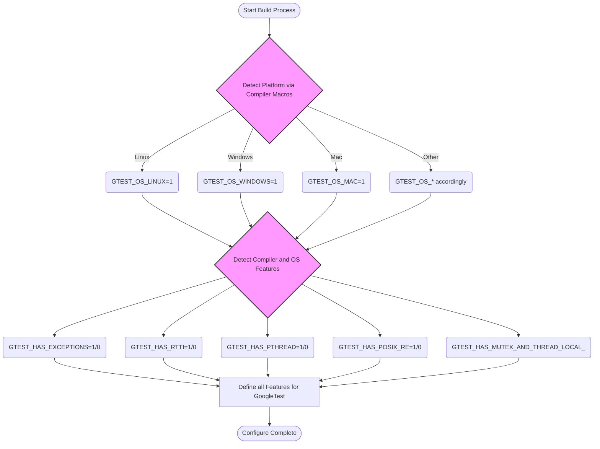

# Platform Abstraction and Portability

GoogleTest and GoogleMock are designed to work seamlessly across a diverse range of platforms, operating systems, compilers, and configurations. This document explains the core concepts and mechanisms that enable their platform abstraction and portability. Users will gain insight into how GoogleTest detects environment capabilities, manages threading support, and adapts to platform-specific features to provide consistent behavior and API availability regardless of underlying deployment targets.

---

## 1. Understanding GoogleTest's Platform Abstraction

### 1.1. Why Platform Abstraction Matters

Writing tests that run on multiple operating systems (Linux, Windows, Mac OS), embedded platforms, or various compiler toolchains requires the testing framework itself to be portable. GoogleTest abstracts differences such as:

- Operating system APIs
- Compiler capabilities (e.g., exception support, RTTI)
- Threading and synchronization primitives
- File system availability
- Regular expression engine implementations

By handling these differences internally, GoogleTest allows test authors to focus exclusively on their tests without worrying about platform discrepancies.

### 1.2. Configuration via Environment-Describing Macros

GoogleTest uses a suite of macros, automatically detected or user-defined, to understand the capabilities of the build and execution environment. These macros guide conditional compilation and feature enablement.

Key macros include:

| Macro                      | Purpose                                                       |
|----------------------------|---------------------------------------------------------------|
| `GTEST_HAS_CLONE`          | Indicates availability of Linux `clone(2)` system call         |
| `GTEST_HAS_EXCEPTIONS`     | Whether C++ exceptions are enabled                             |
| `GTEST_HAS_POSIX_RE`       | POSIX regular expression support                               |
| `GTEST_HAS_PTHREAD`        | Availability of POSIX threads (pthreads)                      |
| `GTEST_HAS_RTTI`           | Runtime type information support                               |
| `GTEST_HAS_STD_WSTRING`    | Whether `std::wstring` works on the platform                   |
| `GTEST_HAS_FILE_SYSTEM`    | File system support availability                               |
| `GTEST_HAS_SEH`            | Microsoft Structured Exception Handling support                |
| `GTEST_HAS_STREAM_REDIRECTION` | Support for redirecting streams (stdout/stderr)               |

These macros are internally set to `1` or `0` after platform detection unless overridden manually by users via build flags. They influence which portions of GoogleTest are active, enabling smooth operation across environments as varied as desktop Linux to Windows Mobile or embedded devices.

### 1.3. Platform Identification Macros

GoogleTest defines platform indicators automatically to reflect the OS environment being targeted. These are used internally and should not be altered.

Example platform macros (set to 1 if applicable, undefined otherwise):

- `GTEST_OS_LINUX` and `GTEST_OS_LINUX_ANDROID`
- `GTEST_OS_WINDOWS` and specialized Windows variants like `GTEST_OS_WINDOWS_DESKTOP` or `GTEST_OS_WINDOWS_MINGW`
- `GTEST_OS_MAC` and `GTEST_OS_IOS`
- Others for BSD variants, Solaris, AIX, Haiku, Fuchsia, QNX, and embedded platforms like ESP32 and Xtensa

Platform detection enables GoogleTest to select the correct system calls, features, and workarounds.

<Info>
Users generally do not need to manually set these macros; they are auto-determined by build systems and compiler predefined macros. If detection is incorrect, environment-specific overrides may be configured.
</Info>

## 2. Threading and Synchronization Support

### 2.1. Thread Safety in GoogleTest

GoogleTest’s internal implementation attempts to provide thread safety for multi-threaded test executions where supported. The key macro `GTEST_IS_THREADSAFE` indicates whether thread-safe synchronization is active. It is set to `1` if GoogleTest detects mutex and thread-local storage support:

- On POSIX platforms, detected by presence of pthreads (`GTEST_HAS_PTHREAD`)
- On Windows, through native critical sections and mutex implementations

If `GTEST_IS_THREADSAFE` is not defined, GoogleTest compiles with dummy synchronization primitives, and concurrent use of assertions across threads is unsafe.

### 2.2. Mutexes and Locks

GoogleTest provides internal mutex abstractions encapsulating platform-specific synchronization:

- Windows platforms use `CRITICAL_SECTION` or its equivalent with lazy initialization
- POSIX platforms use `pthread_mutex_t` and pthread API calls

Users writing multi-threaded tests benefit from GoogleTest’s internal synchronization, ensuring serialized access to shared resources and test framework data.

### 2.3. Thread-Local Storage (TLS)

GoogleTest implements thread-local variable support abstracted via:

- Windows-specific TLS APIs
- POSIX-based thread-local keys with `pthread_key_t`

This abstraction enables GoogleTest to maintain thread-specific data such as assertion states, output streams, or flags.

<Note>
On platforms where thread safety is not available, GoogleTest provides trivial (no-op) TLS and mutex implementations, supporting only single-threaded test environments.
</Note>

## 3. File System and I/O Portability

GoogleTest assumes the presence of a file system on most platforms but gracefully disables features dependent on it when unsupported (e.g., on some embedded platforms).

Internal wrappers adapt system calls such as:

- `fopen`, `freopen`, `fdopen` mapped to appropriate platform variants
- `stat`, `rmdir` and directory existence checks to platform-specific APIs
- Standard I/O functions (`read`, `write`, `close`) with necessary casts and conversions
- Environment variable fetching with safe fallbacks

These wrappers ensure consistent behavior for tests involving file-based operations or environment setup.

## 4. Regular Expressions and Logging Support

### 4.1. Regular Expression Engines

To support flexible matchers and death tests, GoogleTest provides multiple regex implementations based on platform capabilities:

- When compiled with Abseil support, uses RE2 library
- Otherwise, POSIX Extended Regular Expressions if available
- Falls back to a built-in simple regex engine otherwise

Users writing tests involving regex matchers benefit from this adaptive choice ensuring compatibility and good performance.

### 4.2. Logging Facilities

GoogleTest provides logging macros and utilities:

- `GTEST_LOG_(severity)` macro to produce log messages at various severities
- Redirect logs to STDERR or flush logs explicitly as needed

Logging is configured for portability, working across compilers and platforms with minimal dependencies.

## 5. Compiler and Language Feature Detection

GoogleTest detects critical compiler features to adapt its implementation:

- C++17 or later standard enforcement
- Exception support enablement
- Run-time type information (RTTI) availability
- Macro and compiler-specific attributes like `noinline`, `format`, and sanitizers

This detection prevents compilation or runtime issues by tailoring code paths based on available compiler capabilities.

<Warning>
GoogleTest requires C++17 support. Attempts to build with earlier standards will fail.
</Warning>

## 6. User Control and Customization

GoogleTest allows users to override defaults and control behavior via macros or build flags. Common use cases include:

- Manually enabling or disabling threading support (`-DGTEST_HAS_PTHREAD=1/0`)
- Selecting shared library versus static linkage (`-DGTEST_CREATE_SHARED_LIBRARY=1`)
- Adjusting exception and RTTI usage flags

Such overrides help adapt GoogleTest to unusual or constrained build environments like embedded systems.

## 7. Summary of Configuration and Detection Flow

The following sequence illustrates how GoogleTest configures itself:

## 8. Troubleshooting Common Portability Issues

### 8.1. Build Fails Due to Missing C++17 Support

Ensure your compiler and build environment target at least C++17. Pass appropriate flags such as `-std=c++17` and verify with your build tools.

### 8.2. Thread-Safety Not Enabled Unexpectedly

Confirm the presence of pthread libraries or suitable threading support.
Use `-DGTEST_HAS_PTHREAD=1` to force pthread support if your platform offers it but detection fails.

### 8.3. File System Functions Unavailable

Embedded platforms may lack file system support. Some GoogleTest features (like death tests or stream redirection) may not work. Check platform macros and adapt tests accordingly.

### 8.4. Exceptions or RTTI Disabled

If your compiler disables exceptions or RTTI, some GoogleTest features will be limited. Use appropriate flags or adjust your test design.

## 9. Practical Tips

- Avoid manually defining platform macros unless necessary; rely on GoogleTest’s detection.
- Use provided compiler flags and CMake options to ensure correct configuration.
- When cross-compiling, test compiled binaries on the target platform for runtime correctness.
- If integrating GoogleTest as a shared library, set both `GTEST_CREATE_SHARED_LIBRARY` and `GTEST_LINKED_AS_SHARED_LIBRARY` appropriately.
- Check `GTEST_IS_THREADSAFE` macro after including GoogleTest headers to confirm thread safety support.

## 10. Additional Resources

- [GoogleTest Primer](https://google.github.io/googletest/primer.html)
- [Supported Platforms Overview](https://github.com/google/oss-policies-info/blob/main/foundational-cxx-support-matrix.md)
- [Platform Detection Implementation Source (`gtest-port-arch.h`)](https://github.com/google/googletest/blob/main/googletest/include/gtest/internal/gtest-port-arch.h)
- [Platform Portability Utilities (`gtest-port.h`)](https://github.com/google/googletest/blob/main/googletest/include/gtest/internal/gtest-port.h)
- [Thread Safety and Synchronization Details](https://github.com/google/googletest/blob/main/googletest/include/gtest/internal/gtest-port.h#L500-L800)

---

This document equips users with critical understanding of how GoogleTest abstracts platform differences and safeguards portability, enabling robust, consistent testing across environments.

<AccordionGroup title="Frequently Asked Questions">
<Accordion title="Can I override platform detection manually?">
Yes. While GoogleTest automatically detects platform features, you can define override macros (e.g., `-DGTEST_HAS_PTHREAD=0`) if auto-detection is incorrect or incomplete.
</Accordion>
<Accordion title="What if my platform lacks threading support?">
GoogleTest still compiles but disables thread-safety features — multi-threaded assertion use is unsafe and not recommended on such platforms.
</Accordion>
<Accordion title="Are all GoogleTest features available on embedded systems?">
Not all. Features dependent on file systems, threading, or advanced OS APIs may be disabled. You can check feature macros like `GTEST_HAS_FILE_SYSTEM` at compile time.
</Accordion>
</AccordionGroup>