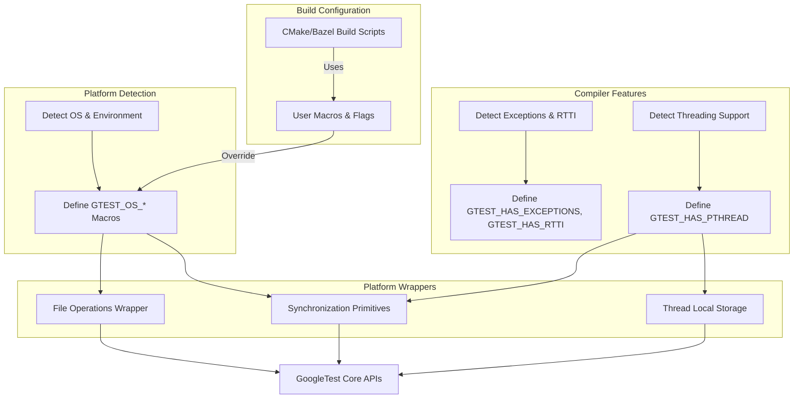

# Platform Portability and Cross-Compilation

GoogleTest and GoogleMock are designed to work seamlessly across a wide variety of compilers, operating systems, and build environments. This page explains how the frameworks achieve portability and provides insight into the platform abstractions, compiler checks, and integration strategies that enable support for embedded systems and cross-compilation setups.

---

## Understanding Platform and Compiler Portability

At its core, GoogleTest aims to enable developers to write tests in C++ that run reliably on multiple platforms without requiring changes to the test code itself. This is achieved through:

- **Platform Detection Macros:** GoogleTest internally detects the operating system and environment at compile time using dedicated macros (e.g., `GTEST_OS_WINDOWS`, `GTEST_OS_LINUX`, `GTEST_OS_MAC`). This allows conditional compilation of platform-specific code that adapts functionality such as file and thread handling.

- **Compiler Feature Checks:** The framework detects language feature support such as exceptions, RTTI, threading, and standard library peculiarities. This ensures that GoogleTest correctly compiles with supported compiler versions and adapts behavior where features are missing or disabled.

- **Abstraction Layers:** Functions that differ between platforms, like file operations and synchronization primitives, are encapsulated in utility functions and classes under internal namespaces. For example, thread synchronization is implemented using `pthread` on UNIX-like systems or Windows critical sections on Microsoft platforms.

- **Configurable Macros:** Users can override or fine-tune build characteristics by defining macros such as `GTEST_HAS_PTHREAD` to force-enable or disable threading support, or `GTEST_CREATE_SHARED_LIBRARY` for shared library builds.

Together, these mechanisms create a flexible, environment-aware toolkit.

## Supported Platforms and Environments

GoogleTest supports a broad swath of platforms aligned with Google's foundational C++ policies. Some key platforms include:

- Desktop: Windows (including MinGW), Linux, macOS
- BSD variants: FreeBSD, OpenBSD, NetBSD, DragonFly
- Embedded and Mobile: Android, iOS, Windows Mobile/Phone/RT
- Others: Solaris, AIX, QNX, Fuchsia, Haiku, GNU/Hurd, z/OS

See the [Supported Platforms documentation](/docs/platforms.md) for the complete list and details.

## Platform Detection and Macro Usage

Platform detection occurs early during compilation with the help of `gtest-port-arch.h`, which defines environment-specific macros:

```cpp
#ifdef _WIN32
  #define GTEST_OS_WINDOWS 1
#elif defined(__APPLE__)
  #define GTEST_OS_MAC 1
#elif defined(__linux__)
  #define GTEST_OS_LINUX 1
// ...and so forth for many others
#endif
```

These macros enable GoogleTest and GoogleMock to conditionally compile code according to the platform capabilities, e.g., enabling POSIX threads on Linux or Windows synchronization primitives on Windows.

## Compiler and Feature Support Checks

GoogleTest determines the availability of important compiler features for robustness:

- **Exception Handling**: Detected by macros like `GTEST_HAS_EXCEPTIONS`.
- **RTTI**: Runtime type information support is checked with `GTEST_HAS_RTTI` to conditionally include dynamic cast-related code.
- **Thread Support**: Using `GTEST_HAS_PTHREAD` or Windows API as relevant.
- **Regular Expression Engines**: Chooses POSIX regex, RE2, or a simple internal regex depending on platform and availability.

This approach avoids compilation attempts on unsupported or misconfigured environments and ensures safe, consistent behavior.

## Platform-Specific Implementations and Wrappers

Many key operations that vary by OS are implemented through platform-specific wrappers found primarily in `gtest-port.h`. Examples include:

- **File Handling**: Wrappers like `posix::FOpen()`, `posix::Stat()`, and `posix::RmDir()` abstract differences in file APIs.
- **Threading and Synchronization:** GoogleTest defines `Mutex`, `MutexLock`, and `ThreadLocal` abstractions which map to native primitives (e.g., `CRITICAL_SECTION` on Windows, `pthread_mutex_t` on POSIX).
- **Standard Library Compatibility:** Conditional inclusion and adjustments are made to accommodate quirks, like wide string encoding differences on Windows.

Users rarely interact directly with these internals but gain seamless cross-platform support.

## Cross-Compilation and Embedded Systems Support

For embedded platforms and cross-compilation, GoogleTest offers flexibility:

- **Custom Macros & Build Flags:** Build configurations can be explicitly tuned by defining macros such as `GTEST_HAS_PTHREAD=0` for platforms without threading.

- **Limited or No OS Support:** On platforms without standard OS support (e.g., some embedded targets without file systems), GoogleTest disables features like stream redirection and death tests (`GTEST_HAS_STREAM_REDIRECTION=0`).

- **Minimal Dependencies:** GoogleTest avoids unnecessary dependencies and supports static linking, crucial for embedded deployment.

- **Portable Build Scripts:** Using CMake or Bazel, GoogleTest can be compiled as part of your cross-compilation toolchain, respecting your compiler and linker options.

This ensures GoogleTest remains functional on resource-constrained or special-purpose environments.

## How to Use or Adjust Portability Settings

If you encounter issues with environment detection or library support, you can manually define relevant macros either via your build system or directly on the compiler command line.

For example, to force disable pthread support:

```bash
-DGTEST_HAS_PTHREAD=0
```

To build GoogleTest as a shared library:

```bash
-DGTEST_CREATE_SHARED_LIBRARY=1

# And when compiling tests:
-DGTEST_LINKED_AS_SHARED_LIBRARY=1
```

Refer to [googletest/README.md](https://github.com/google/googletest/blob/main/README.md#generic-build-instructions) for detailed build customization instructions.

## Visual Studio and Windows Notes

Windows comes with specifics worth noting:

- GoogleTest by default statically links the runtime libraries to avoid mismatches; you may need to define `gtest_force_shared_crt` in CMake to dynamically link runtimes matching your project.

- Windows uses UTF-16 for wide strings; GoogleTest adapts its internal string handling accordingly.

- Synchronization primitives use `CRITICAL_SECTION` wrapped in a Mutex abstraction.

## Multithreading and Thread Safety

GoogleTest is thread-safe on platforms with threading support, primarily through:

- Mutexes and locks backed by native OS primitives.

- Thread-local storage abstractions (`ThreadLocal<T>`) compatible with Windows TLS and pthread keys for POSIX.

When multithreading support is unavailable, GoogleTest provides no-op implementations but disables concurrent assertion safety.

## Summary Diagram of Portability Abstractions



## Troubleshooting Portability Issues

- **Wrong platform detection:** Verify your compiler and platform macros. Override with build flags if necessary.
- **Missing threading support:** If your platform lacks pthread or Windows threading, define `-DGTEST_HAS_PTHREAD=0`.
- **Linker errors on Windows:** Match runtimes between your project and GoogleTest. Use `gtest_force_shared_crt` CMake option.
- **Unsupported features on embedded:** Disable features not available by building with appropriate macro flags.

## Practical Tips for Cross-Compilation

- Always build GoogleTest with the same compiler and toolchain as your project.
- Use `add_subdirectory()` in CMake or fetch GoogleTest source dynamically to avoid version mismatches.
- Verify that platform-specific dependencies like pthread or system libraries are properly linked.
- Test and validate on target or simulator environments to confirm portability.

---

# Related Documentation

- [GoogleTest README - Build Instructions](https://github.com/google/googletest/blob/main/README.md)
- [Supported Platforms](../docs/platforms.md)
- [Getting Started with Bazel](../getting-started/prerequisites-installation/installation-bazel.mdx)
- [Getting Started with CMake](../getting-started/prerequisites-installation/installation-cmake.mdx)
- [GoogleTest Portability Utilities](../api-reference/infrastructure-support/portability-utilities.mdx)


---

Proper understanding of GoogleTest's cross-platform abstractions lets you seamlessly adopt testing in heterogeneous environments — from desktop to embedded systems — without sacrificing test reliability or build flexibility.


---