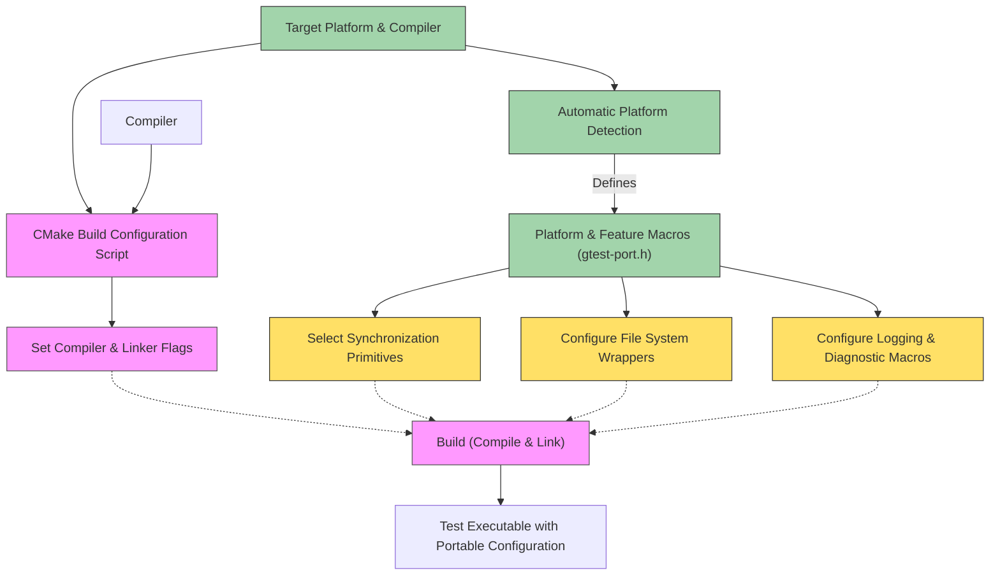

# Platform Portability and Configuration

GoogleTest is designed to provide a consistent, reliable testing framework across a multitude of compilers, operating systems, and platforms. This page explains how GoogleTest achieves portability through carefully designed porting layers, configuration macros, and build system flags. These mechanisms enable users to seamlessly build and run tests while supporting extensibility and maintainability across diverse development environments.

---

## Understanding Portability in GoogleTest

Imagine writing a test once and having it work flawlessly whether you compile on Windows with MSVC, on Linux with GCC, or on MacOS with Clang. GoogleTest makes this vision a reality by abstracting platform differences behind carefully crafted layers.

Portability here means:

- **Compiler Support:** Handling differences between MSVC, GCC, Clang, Intel LLVM, and others
- **Operating System Differences:** Adapting to nuances in Windows, Linux, MacOS, and others
- **Feature Detection:** Deciding what platform features are available and configuring accordingly
- **Build Configuration:** Applying correct compiler and linker flags suitable for each environment

These aspects ensure that developers can focus on writing tests, confident that platform-specific complexities are handled gracefully.

## Porting Layers: The Backbone of Platform Agnosticism

GoogleTest's porting layers act as adapters that harmonize platform-specific APIs and behaviors.

### Key Components of Porting Layers

- **Macros and Flags in `gtest-port.h`:** These determine the environment features available, such as thread support, exception handling, RTTI, and filesystem capabilities. For example, macros like `GTEST_HAS_PTHREAD`, `GTEST_HAS_EXCEPTIONS`, and `GTEST_OS_WINDOWS` conditionally enable or disable features at compile time.

- **Platform Detection in `gtest-port-arch.h`:** This header sets platform macros (e.g., `GTEST_OS_WINDOWS`, `GTEST_OS_LINUX`) automatically based on compiler predefined macros, enabling conditional compilation.

- **Synchronization Primitives:** Based on detected platform features, GoogleTest uses the appropriate synchronization mechanisms. For example, on POSIX-like platforms with pthreads, it uses `pthread_mutex_t`, whereas on Windows it uses Windows API critical sections.

- **File System Wrappers:** Functions like `ChDir()`, `Stat()`, and `FOpen()` provide a consistent interface despite underlying differences.

By encapsulating platform-specific details here, GoogleTest maintains a single codebase that works everywhere.

## Configuring Compiler and Linker Flags

Configuration flags are essential to ensure the compiler behaves in ways compatible with GoogleTest's requirements.

### How Flags Are Managed

- GoogleTest uses CMake macros (`config_compiler_and_linker()`) to set compiler flags dynamically depending on the compiler and platform detected.

- Compiler-specific settings are applied, such as:
  - For **MSVC**, flags adjust runtime library linkage (`/MT` vs `/MD`), warning levels, and UTF-8 source encoding.
  - For **Clang** and **GCC**, flags enable strict warnings (`-Wall -Wshadow`), configure exception and RTTI support, and disable problematic warnings.

- Threading support detection toggles inclusion of pthread libraries and macros like `GTEST_HAS_PTHREAD`.

- Flags are separated according to exception support, RTTI, and strictness.

This setup ensures the library builds correctly and efficiently, reducing runtime crashes and linker errors.

### Best Practices

- Always build GoogleTest with **C++17** or above to meet the library's minimal standard requirements.

- When building as shared libraries (DLLs) on Windows, enable `-DGTEST_CREATE_SHARED_LIBRARY=1`.

- Use CMake options like `gtest_force_shared_crt` to control how runtimes are linked, ensuring compatibility with your project's settings.

<Tip>
GoogleTest’s CMake build scripts manage most compiler and linker flags automatically. When integrating manually, review these settings to avoid conflicts.
</Tip>

## Customization and Extensibility

For advanced use cases or unusual platforms, GoogleTest provides injection points allowing user-defined macros and overrides.

### Customization Points Include:

- **Macros in `custom/gtest-port.h`:** Users can override feature-detection macros, logging implementations, threading primitives, and API exporting symbols.

- **Threading and Synchronization Customization:** If your platform provides native notification or mutex implementations, you can enable them via macros like `GTEST_HAS_NOTIFICATION_` or `GTEST_HAS_MUTEX_AND_THREAD_LOCAL_`.

- **Stack Trace and Temp Directory Functions:** Overrides for stack trace retrieval and temporary directory location can be defined.

These points empower users to adapt GoogleTest to environments with specialized constraints or requirements.

<Warning>
Overrides in the custom directory should be used judiciously to avoid breaking expected behavior or compatibility.
</Warning>

## User Workflow: Building GoogleTest Portably

1. **Select Platform and Compiler:** GoogleTest automatically detects the environment when building via CMake.

2. **Run CMake Configuration:** The `config_compiler_and_linker()` macro sets the appropriate flags.

3. **Compile with Correct Flags:** Flags manage runtime linkage, exceptions, RTTI, warnings, and threading.

4. **Link Dependencies:** Pthreads or Windows threading libraries are linked conditionally based on platform macros.

5. **Run Tests Confidently:** Tests built this way behave consistently across supported platforms.

This flow minimizes manual configuration and platform-specific code in user projects.

## Troubleshooting Common Portability Issues

- **Missing pthread Library:** If tests fail to link on Unix-like systems, verify that `-pthread` is included. When using CMake, GoogleTest normally handles this.

- **Runtime Library Conflicts on Windows:** Mismatched static/dynamic CRT linkage might cause linker errors or crashes. Use the `gtest_force_shared_crt` CMake option to align GoogleTest’s CRT settings with your project.

- **Unsupported Compiler or Version:** GoogleTest enforces a minimum of C++17 and specific compiler compatibility. Ensure your compiler version is supported (see [Supported Platforms](https://github.com/google/oss-policies-info/blob/main/foundational-cxx-support-matrix.md)).

- **Platform-Specific Macros Missing:** If you manually build without CMake, ensure relevant macros like `GTEST_HAS_PTHREAD` are properly defined.

<Check>
Always check compiler warnings and CMake output for information about platform detection and flag application.
</Check>

## Illustrative Overview of Portability Architecture

## Related Resources

- [Supported Platforms & Compatibility](/overview/integration-platforms/platform-support) for detailed platform information
- [Custom Actions and Matchers](/concepts/extensibility-integration/custom-actions-matchers) for extending GoogleTest
- [CMake Build System Internals](googletest/cmake/internal_utils.cmake) for flag configurations
- [Customization Points](googletest/include/gtest/internal/custom/README.md) for user overrides

---

By mastering platform portability and configuration, you ensure your tests run reliably wherever your code goes — whether on your local machine, CI servers, or production-like environments.

Harness these mechanisms to achieve scalable, maintainable, and extensible testing that transcends platform boundaries.

---

## Quick Tips

- Build GoogleTest with at least **C++17** support.
- Use the provided CMake build scripts to benefit from automatic flag and platform handling.
- Define or override macros only if you have platform-specific needs.
- Enable shared runtime on Windows by setting `gtest_force_shared_crt`.
- Keep your build system (e.g., CMake version) up to date to ensure compatibility.

## Summary
This page focused exclusively on how GoogleTest manages portability and configuration to support a wide range of platforms and compilers consistently and efficiently. Users learn about platform detection, porting layer abstractions, compiler and linker flag management, customization points, and common pitfalls.

---

# Further Reading

- [Supported Platforms](docs/platforms.md)
- [GoogleTest Primer](docs/primer.md)
- [Customization Points](googletest/include/gtest/internal/custom/README.md)
- [GoogleMock Porting](googlemock/include/gmock/internal/gmock-port.h)
- [CMake Build Internal Utilities](googletest/cmake/internal_utils.cmake)

---