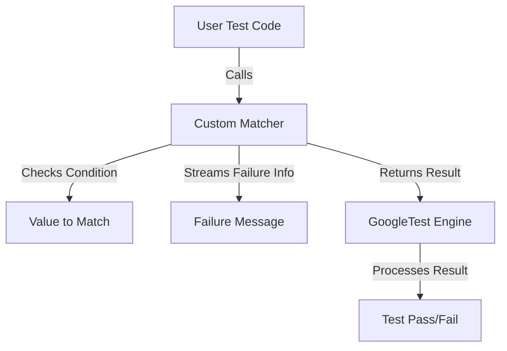

# User-Defined Assertions and Matchers

Extend the power of GoogleTest and GoogleMock by crafting your own custom assertions and matchers tailored to your code domain. This guide empowers you to write precise, readable, and maintainable test checks that communicate your testing intent clearly and help enforce complex invariants with ease.

---

## Why Extend Assertions and Matchers?

GoogleTest provides a rich set of built-in assertion macros and GoogleMock offers a comprehensive matcher library. However, every application domain has unique properties that generic matchers cannot fully capture. Writing custom assertions and matchers enables you to:

- Express domain-specific validation rules naturally
- Produce clear, actionable error messages on test failures
- Reduce duplication by encapsulating complex checks
- Improve test readability and maintainability

Imagine you are testing a `Point` class and want to assert that a point lies within a certain range in 2D space. A well-crafted matcher can encapsulate this semantic validation, making tests self-explanatory and debugging easier.

## Overview of Custom Assertions

An assertion validates a condition or property during test execution. GoogleTest macros like `EXPECT_TRUE` or `ASSERT_EQ` are examples. You can also define custom assertions that:

- Return success or failure explicitly
- Stream custom failure messages
- Integrate seamlessly with existing GoogleTest machinery

### Boolean Assertions vs AssertionResult

- Plain boolean assertions (`EXPECT_TRUE(condition)`) merely indicate pass/fail.
- Custom assertions returning `::testing::AssertionResult` give fine-grained control over success, failure, and associated failure messages.

Example defining a custom assertion checking if a number is even:

```cpp
#include <gtest/gtest.h>

// Returns AssertionSuccess or AssertionFailure with a message.
testing::AssertionResult IsEven(int n) {
  if (n % 2 == 0) {
    return testing::AssertionSuccess();
  } else {
    return testing::AssertionFailure() << n << " is odd";
  }
}

TEST(MyTest, EvenCheck) {
  EXPECT_TRUE(IsEven(4));  // Passes
  EXPECT_TRUE(IsEven(3));  // Fails and prints "3 is odd"
}
```

### Tips for Custom Assertions

- Prefer returning `AssertionResult` as it provides richer feedback.
- Stream contextual data to `AssertionFailure()` to clarify failure causes.
- Ensure assertions are side-effect free and idempotent.
- Use `SCOPED_TRACE` to add trace context when invoking assertions inside helper functions.

## Understanding GoogleMock Matchers

Matchers let you specify expected argument values for mock method calls. They form the core of expressive mock expectations, allowing you to describe argument constraints beyond simple equality.

GoogleMock provides built-in matchers like `_` (wildcard), `Eq()`, `Lt()`, `StartsWith()`, and container matchers.

### Benefits of Using Matchers

- Read like natural language predicates
- Generate informative error messages explaining why the expectation failed
- Compose complex matching logic via combinators like `AllOf()`, `AnyOf()`, `Not()`, and more

### When to Write Custom Matchers

You should consider writing a custom matcher when:

- The built-in matchers cannot express your domain's conditions clearly
- You need tailored failure messages that explain your domain logic
- You want to abstract repetitive argument validation logic

## How to Write a Custom Matcher Class

Custom matchers can be monomorphic (match one specific type) or polymorphic (work with multiple types). The recommended way is to define a matcher class implementing specific methods.

### Matcher Interface Requirements

A custom matcher class must declare:

- `using is_gtest_matcher = void;` (marker for gMock)
- `bool MatchAndExplain(const T& value, std::ostream* os) const;` — checks if `value` matches, optionally streaming failure explanation
- `void DescribeTo(std::ostream* os) const;` — describes what the matcher expects
- `void DescribeNegationTo(std::ostream* os) const;` — describes the negated matcher

### Example: Simple Monomorphic Matcher

```cpp
#include <gmock/gmock.h>

class DivisibleByMatcher {
 public:
  using is_gtest_matcher = void;

  explicit DivisibleByMatcher(int divisor) : divisor_(divisor) {}

  bool MatchAndExplain(int n, std::ostream* os) const {
    if (n % divisor_ == 0) {
      return true;
    }
    if (os) {
      *os << "which leaves remainder " << (n % divisor_);
    }
    return false;
  }

  void DescribeTo(std::ostream* os) const {
    *os << "is divisible by " << divisor_;
  }

  void DescribeNegationTo(std::ostream* os) const {
    *os << "is not divisible by " << divisor_;
  }

 private:
  int divisor_;
};

inline ::testing::Matcher<int> DivisibleBy(int divisor) {
  return ::testing::MakeMatcher(new DivisibleByMatcher(divisor));
}

// Usage in test:
TEST(NumberTest, DivisibleBy7) {
  EXPECT_THAT(21, DivisibleBy(7));  // Pass.
  EXPECT_THAT(23, DivisibleBy(7));  // Fails with message "which leaves remainder 2"
}
```

### Polymorphic Matchers

You can make `MatchAndExplain` a template to accept multiple types, enabling your matcher to match a range of related types:

```cpp
class NotNullMatcher {
 public:
  using is_gtest_matcher = void;

  template <typename T>
  bool MatchAndExplain(T* p, std::ostream* os) const {
    return p != nullptr;
  }

  void DescribeTo(std::ostream* os) const { *os << "is not null"; }
  void DescribeNegationTo(std::ostream* os) const { *os << "is null"; }
};

inline ::testing::PolymorphicMatcher<NotNullMatcher> NotNull() {
  return ::testing::MakePolymorphicMatcher(NotNullMatcher());
}
```

### Notes on Custom Matchers

- Prefer polymorphic matchers if you want your matcher to be usable with different but related types.
- To simplify your implementation, use `::testing::ExplainMatchResult` for composing explanations.

## Writing Parameterized Matchers for Reusability

When a matcher needs to accept parameters (e.g., a threshold value), define parameterized matchers with `MATCHER_P` or `MATCHER_Pn` macros:

### Example: Parameterized Matcher Using `MATCHER_P`

```cpp
#include <gmock/gmock.h>

MATCHER_P(IsWithinRange, range, "") {
  return arg >= -range && arg <= range;
}

TEST(RangeTest, ValuesWithinRange) {
  EXPECT_THAT(5, IsWithinRange(10));  // Passes
  EXPECT_THAT(15, IsWithinRange(10)); // Fails
}
```

- The second argument in `MATCHER_P` is the name of the parameter accessed via `range` inside the matcher body.
- The matcher can reference `negation` in the description string to adjust messages for negated matchers.

### More Parameters

Use `MATCHER_P2`, `MATCHER_P3`, ..., up to `MATCHER_P10` for multiple parameters.

### Crafting Clear Descriptions

Include parameter values in the description string to improve failure messages. For example:

```cpp
MATCHER_P2(InClosedRange, low, high, "") {
  return arg >= low && arg <= high;
}

// Usage
EXPECT_THAT(x, InClosedRange(1, 5));
```

## Integrating Custom Matchers in Your Tests

- Use `EXPECT_THAT(value, Matcher)` and `ASSERT_THAT(value, Matcher)` to apply matchers.
- Custom matchers produce detailed error messages showing what was expected and what was actually observed.
- Combine with existing matchers using `AllOf()`, `AnyOf()`, `Not()`, etc.

## Writing Custom Actions (For Mocks)

While this guide focuses on assertions and matchers, often you also want to define custom *actions* for mock methods that extend the code's functional behavior:

- Actions specify what a mock method does when called.
- Use lambdas or functors to implement custom actions inline, or create action classes.
- Combine multiple actions with `DoAll()`, use predefined actions like `Return()`, `SetArgPointee()`, and more.

See the [GoogleMock Actions Reference](reference/matchers-actions/actions.md) and [gMock Cookbook](docs/gmock_cook_book.md) for detailed guidance.

## Best Practices and Tips

- **Write clear failure messages.** Custom assertions/matchers/messages should help the developer understand why a test failed at a glance.
- **Keep matchers pure.** They must have no side effects and always produce consistent results.
- **Use existing matchers and compose.** Avoid reinventing the wheel unless necessary.
- **Test your matchers.** Write unit tests for matchers and assertions themselves.
- **Use `SCOPED_TRACE`** in assertion helper functions to add contextual trace messages.
- **Manage complexity progressively.** Start with simple matchers and add parameterization and richer messages incrementally.

## Troubleshooting Common Issues

- If your custom matcher doesn't compile, verify method signatures and use proper template parameters.
- If failure messages are not informative, enhance `DescribeTo` and `MatchAndExplain` methods.
- Avoid side effects in matchers to prevent flaky or confusing test results.

## Summary

Extending GoogleTest and GoogleMock with user-defined assertions and matchers transforms your tests into precise, readable, and resilient expressions of your domain logic. By following best practices and leveraging the extensibility APIs, you empower your team to write better tests that document intent and facilitate debugging.

---

## Additional Learning Resources

- [Writing New Matchers Quickly](docs/gmock_cook_book.md#NewMatchers)
- [Matchers Reference](reference/matchers-actions/matchers.md)
- [Assertions Reference](reference/assertions.md)
- [gMock Cookbook](docs/gmock_cook_book.md) for practical recipes
- [Basic Mocking with GoogleMock](guides/getting-started/basic-mocking.md)

These linked documents provide deep dives, examples, and advanced guidance to help you master custom extensions.

---

## Diagram: Flow of Custom Matcher Usage



This simple flow shows how a custom matcher interacts with your test code and GoogleTest's core engine.

---

## Example: Using a Custom Matcher in EXPECT_THAT

```cpp
#include <gmock/gmock.h>

// Matcher: Checks if integer is even.
MATCHER(IsEven, "Checks if a number is even") {
  return (arg % 2) == 0;
}

TEST(ExampleTest, EvenNumberCheck) {
  int val = 4;
  EXPECT_THAT(val, IsEven());  // Passes

  int odd_val = 3;
  EXPECT_THAT(odd_val, IsEven());  // Fails, prints descriptive message
}
```

This is the kind of expressive check that boosts test clarity.

---

## Troubleshooting Checklist

- Ensure your matcher class has `is_gtest_matcher` typedef.
- Verify `MatchAndExplain` signature matches expected argument types.
- Implement both `DescribeTo()` and `DescribeNegationTo()` for full reporting.
- Avoid mutations or side effects in matcher methods.
- Use the GoogleTest error messages to pinpoint description or matching logic issues.

---

## Summary

By creating user-defined assertions and matchers, you gain full control on test validation logic, making tests targeted, expressive, and easier to debug. Adopt these techniques to align your tests perfectly with your domain semantics and improve overall software quality.