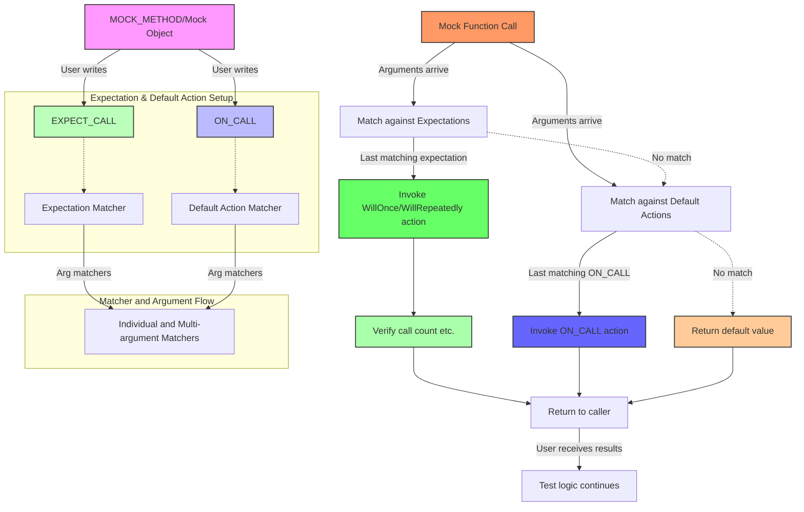

# Match Expressions and Matcher Design

GoogleTest's and GoogleMock's matcher system forms the backbone for crafting expressive, flexible assertions and expectations. This page delves into the design of matchers—their compounding nature, built-in facilities, and the underlying mechanisms that empower users to precisely specify which function calls they expect or allow during testing.

---

## Understanding the Matcher System

Matchers in GoogleMock are objects that determine whether function arguments satisfy certain conditions. They allow fine-grained control and validation of mock method calls. Fundamentally, a matcher corresponds to a *single* argument and can be simple (e.g., matching any value) or complex (e.g., matching the contents of a container or a property of an object).

Match expressions are used to define behaviors and constraints on mock functions via macros like `ON_CALL` and `EXPECT_CALL`. These match expressions can be built from reusable building blocks called *matchers*, which can be combined, nested, and customized.

### Core Uses of Matchers

- **`ON_CALL(mock, method(matchers))`**: Specifies default actions for calls matching the argument matchers, without asserting that the call must happen.
- **`EXPECT_CALL(mock, method(matchers))`**: Sets expectations that certain calls will happen, optionally with cardinalities, sequences, and actions.

Both macros use the matcher system to select which calls they apply to and to verify precise argument matching.

---

## Built-in Matchers

GoogleMock provides an extensive, versatile library of built-in matchers, enabling users to specify argument constraints succinctly:

### Wildcard Matchers
- `_` matches any argument of the proper type.
- `A<T>()` or `An<T>()` matches any value of type `T`.

### Generic Comparison Matchers
- `Eq(val)` or just `val`: Matches equal to `val`.
- `Ne(val)`: Not equal.
- `Lt(val)`, `Le(val)`, `Gt(val)`, `Ge(val)`: Relational matchers.
- `IsNull()`, `NotNull()`: Matches null (raw or smart) pointers.
- `Ref(variable)`: Matches an argument that is a reference to the specific variable.

### Floating-Point Matchers
- `DoubleEq()`, `FloatEq()`: Approximate equality using ULPs.
- `NanSensitiveDoubleEq()`, `NanSensitiveFloatEq()`: Same but treat NaNs as equal.
- Variants with tolerances such as `DoubleNear()` and `FloatNear()`.

### String Matchers
- `StrEq()`, `StrNe()`, `StrCaseEq()`, `StrCaseNe()` for string equality and case insensitive.
- `StartsWith()`, `EndsWith()`, `HasSubstr()`, `MatchesRegex()`, `ContainsRegex()` for substring and regex matching.
- `IsEmpty()` matches empty strings or containers.

### Container Matchers
- `ElementsAre()`, `ElementsAreArray()`: Match a container's elements in order.
- `UnorderedElementsAre()`, `UnorderedElementsAreArray()`: Match elements unordered.
- `Contains()`, `Each()`, `SizeIs()`, `IsSubsetOf()`, `IsSupersetOf()` for container membership and size properties.
- `Pointwise()`, `UnorderedPointwise()` for element-wise matching with another container.

### Member Matchers
- `Field(&Class::member, matcher)`: Matches an object whose member field satisfies the matcher.
- `Property(&Class::getter, matcher)`: Matches an object whose property (via getter method) matches.
- `Key(m)`: Matches the `.first` key in pairs.
- `Pair(m1, m2)`: Matches a `std::pair` with matchers on first and second.
- `Pointee(m)`: Matches a pointer or smart pointer whose pointed-to value matches `m`.
- `Pointer(m)`: Matches pointers themselves rather than pointees.
- `WhenDynamicCastTo<T>(m)`: Matches if dynamic_cast to `T` matches `m`.

### Multi-argument Matchers
These matchers operate on argument tuples, supporting complex constraints on the full set of function arguments.
- `With(multi_argument_matcher)`: Used in `EXPECT_CALL` and `ON_CALL` to match all arguments against a tuple matcher.
- Tuple matchers like `Eq()`, `Ge()`, `Lt()`, and `Ne()` work on pairs (2-tuples).
- `Args<N1, N2, ...>(matcher)`: Matches selected argument indices together as a tuple.
- `AllArgs(m)`: Matches all arguments, shorthand for the whole tuple.

### Composite Matchers
- `AllOf(m1, m2, ...)`: Matches if all sub-matchers match.
- `AnyOf(m1, m2, ...)`: Matches if any sub-matcher matches.
- `Not(m)`: Negation of a matcher.
- `Conditional(cond, m1, m2)`: Depending on `cond`, matches `m1` or `m2`.

### Adapters and Utilities
- `MatcherCast<T>(m)` and `SafeMatcherCast<T>(m)`: Cast a matcher to a different but compatible type safely at compile time.
- `Truly(predicate)`: Converts a predicate function or functor to a matcher.

---

## Designing Composable and Extensible Matchers

Matchers are designed to compose naturally, supporting layering and recursive matching, enabling users to construct complex conditions from simpler ones without sacrificing clarity or maintainability.

Key design points include:

- Matchers are implemented as pure, side-effect-free function objects.
- They support rich diagnostic explanations by streaming detailed mismatch information.
- Polymorphic matchers serve as matcher factories generating monomorphic matchers suitable for specific argument types.
- Parameterized matchers allow embedding run-time parameters in constraints with descriptive failure messages.

For example, users can combine matchers as:

```cpp
using ::testing::AllOf;
using ::testing::Gt;
using ::testing::Le;
using ::testing::Ne;

EXPECT_CALL(mock, Foo(AllOf(Gt(5), Le(10), Ne(7))));
```

That matches values greater than 5, less or equal to 10, but not equal to 7.

---

## Working with Match Expressions in ON_CALL and EXPECT_CALL

The macros `ON_CALL()` and `EXPECT_CALL()` rely on match expressions to select and configure the behavior and expectations of mock method calls.

### Syntax Overview

```cpp
ON_CALL(mock_object, MethodName(matchers...))
    .With(multi_argument_matcher)
    .WillByDefault(action);

EXPECT_CALL(mock_object, MethodName(matchers...))
    .With(multi_argument_matcher)
    .Times(cardinality)
    .InSequence(sequences...)
    .After(expectations...)
    .WillOnce(action)
    .WillRepeatedly(action)
    .RetiresOnSaturation();
```

- The `matchers...` are individual argument matchers.
- `.With()` can provide an optional multi-argument matcher on the entire tuple.
- `Times()`, `InSequence()`, `After()`, `WillOnce()`, etc. give additional control on how calls are matched and acted upon.

### Key Behaviors

- **Precedence**: More recent expectations or default actions take precedence over older ones.
- **Cardinality Inference:** If missing, it can be inferred based on provided actions.
- **Sequences and Ordering:** Using `Sequence` objects and `InSequence` or `After` clauses, users can prescribe call order.
- **Argument Matching:** Multi-argument matchers allow matching some or all arguments in relation.

### Best Practices

- Use `ON_CALL` for default (non-verifying) behaviors.
- Use `EXPECT_CALL` only when you want to verify that a call is made, optionally controlling cardinality and order.
- Carefully specify argument matchers to avoid over-constraining tests.

---

## Extensibility: Writing Custom Matchers

Users can define custom matchers to encapsulate specialized logic with rich failure diagnostics.

### Quick Custom Matcher with `MATCHER` Macro

```cpp
MATCHER(IsDivisibleBy7, "") {
  return (arg % 7) == 0;
}
```

This matcher can be used as:

```cpp
EXPECT_CALL(mock, Foo(IsDivisibleBy7()));
EXPECT_THAT(value, IsDivisibleBy7());
```

You can provide detailed descriptions, explain match failures via streaming to `result_listener`, or write parameterized matchers (`MATCHER_P`, `MATCHER_P2`, etc.) to make reusable and descriptive conditions.

### Implementing Full Matcher Classes

Advanced users can implement monomorphic or polymorphic matcher classes by conforming to the matcher interface (implementing `MatchAndExplain()`, `DescribeTo()`, and `DescribeNegationTo()`). This approach provides control over type specialization and sophisticated diagnostics.

---

## Common Pitfalls and Troubleshooting

- **Matcher Purity:** Matchers must have no side effects, as they may be invoked multiple times unpredictably.
- **Overloading Ambiguities:** To mock overloaded methods, use explicit disambiguation like `Const()` or specify parameter matchers carefully.
- **Parameterless Expectations:** Omitting argument matchers is convenient but only works with non-overloaded methods.
- **Default Actions via `ON_CALL` vs `EXPECT_CALL`:** Keep default behavior separate from expectation verification to prevent brittle tests.
- **Using `_` Matcher Globally May Mask Errors:** Use `NiceMock`, or explicitly specify `EXPECT_CALL(...).Times(AnyNumber())` to silence uninteresting call warnings without hiding unexpected behavior.

---

## Next Steps & Related Pages

To deepen your understanding and mastery of GoogleTest's matcher system, consider exploring:

- [Matchers Reference](../../api-reference/mocking-apis/matchers-reference.md): Comprehensive details on all built-in matchers.
- [Mocking Reference](../../api-reference/mocking-apis/mock-object-definition.md): Mock class and method definitions.
- [Actions: Defining Mock Behavior](../../concepts/extensibility-matchers-actions/actions-architecture.md): How actions complement matchers.
- [Custom Matchers and Actions Extension](../../concepts/extensibility-matchers-actions/customization-interfaces.md): Extending with your own matchers and behaviors.
- [Using GoogleTest Assertions Effectively](../../guides/writing-and-structuring-tests/effective-assertions.md): Leveraging matchers in assertions.

---

For practical usage, combining matchers with `EXPECT_CALL` enables writing expressive, precise, and maintainable tests that clearly specify test intent and produce informative diagnostics when expectations fail.

---

## Summary

Match expressions and matcher design in GoogleTest and GoogleMock enable you to precisely specify expectations and default behaviors of mock function calls. Through an extensive set of built-in matchers and an extensible design allowing custom matcher creation, the system empowers clear, flexible testing assertions.

Leverage this system for improved test clarity, reduced brittleness, and better failure diagnostics.

---

<AccordionGroup title="Frequently Asked Questions (FAQs)">
<Accordion title="What is the difference between ON_CALL and EXPECT_CALL?">
`ON_CALL` defines the default behavior for calls matching certain matchers but does NOT enforce that the call occurs. `EXPECT_CALL` additionally sets expectations that matched calls must occur a certain number of times, with optional ordering and action modifiers.
</Accordion>
<Accordion title="How does GoogleMock select which EXPECT_CALL matches a call?">
GoogleMock picks the last matching, still-active expectation in the order declared. This allows newer expectations to override older ones. Combined with argument matchers and sequences, this provides fine-grained call matching.
</Accordion>
<Accordion title="Can I create my own matchers?">
Yes. You can use the `MATCHER` macros for simple matchers or implement full matcher classes for advanced scenarios, allowing rich diagnostics and parametric checks.
</Accordion>
<Accordion title="How does GoogleMock handle uninteresting calls?">
Uninteresting calls are to methods without any applicable EXPECT_CALL. By default, these calls trigger the default action (specified via ON_CALL or default values) and generate a warning. Use `NiceMock` to suppress warnings, or `StrictMock` to treat them as errors.
</Accordion>
</AccordionGroup>

---

## Diagram: Match Expression Flow in GoogleMock



---

## Practical Tips

- Prefer using `ON_CALL` to set up commonly shared default behaviors in test fixtures.
- Use `EXPECT_CALL` sparingly and purposefully to verify specific interactions.
- Use matchers like `_` to allow flexibility but avoid overusing it where precision matters.
- For complex argument matching, leverage `With()` for multi-argument conditions or compound matchers like `AllOf()`.
- When mocking overloaded methods, disambiguate using `Const()` or explicit matcher specification.
- Leverage `Sequence` and `After` clauses to model call ordering requirements.
- Use `NiceMock` and `StrictMock` to tune the behavior on uninteresting calls.

---

## References & Further Reading

- [Matchers Reference](../../api-reference/mocking-apis/matchers-reference.md)
- [Mocking Reference](../../api-reference/mocking-apis/mock-object-definition.md)
- [Actions Reference](../../api-reference/mocking-apis/actions-and-custom-behaviors.md)
- [Custom Matchers and Actions Extension](../../concepts/extensibility-matchers-actions/customization-interfaces.md)
- [Effective Assertions](../../guides/writing-and-structuring-tests/effective-assertions.md)
- [GoogleMock Cookbook](../../docs/gmock_cook_book.md)
- [Understanding Uninteresting vs Unexpected Calls](../../docs/gmock_cook_book.md#uninteresting-vs-unexpected)

---

Harness the powerful matcher design in GoogleTest and GoogleMock to write tests that express your intent clearly, remain maintainable, and provide rich diagnostics when expectations fail.