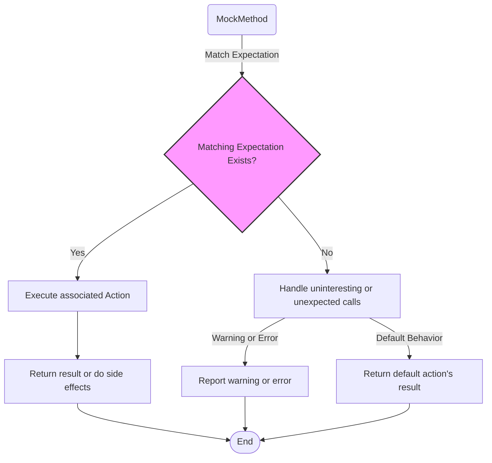

# Custom Actions & Mock Behaviors

GoogleMock (gMock) empowers you to extend the behavior of mock methods beyond returning fixed values by allowing the definition of custom actions. These actions enable simulating complex side effects, composing multiple operations, and creating versatile responses depending on method arguments or internal state.

In this guide, you will explore how to define, combine, and apply custom actions to mock methods, unlocking flexible, powerful mocking patterns that help you precisely control the behavior of your tests.

---

## Understanding Actions in gMock

Actions specify what should happen when a mock method is invoked. Unlike simple return values, actions can:

- Return fixed or dynamic values
- Modify output arguments or global state
- Invoke user-defined functions, functors, or lambdas
- Compose multiple behaviors sequentially

Actions can be attached to mock methods via `EXPECT_CALL()` or `ON_CALL()`, depending on whether you want to set expectations or default behavior.

### Basic Built-in Actions

| Action               | Description |
|---------------------|-------------|
| `Return(value)`      | Return `value` (may convert when expectation is set) |
| `ReturnRef(var)`     | Return a reference to an existing variable |
| `ReturnPointee(ptr)` | Return the value pointed to by `ptr` at the time of call |
| `ReturnNull()`       | Return a null pointer or empty smart pointer |
| `SetArgPointee<N>(val)` | Assign `val` to the pointer referred by argument #N |
| `DoAll(a1, a2, ..., an)` | Perform all actions sequentially, returning the value of the last |
| `Invoke(f)`          | Call function or functor `f` with the mock method arguments |
| `InvokeWithoutArgs(f)`| Call a function or functor `f` that takes no arguments |
| `InvokeArgument<N>(args...)` | Call the N-th argument (must be callable) with given args |

<Info>
All built-in actions are defined in the `::testing` namespace and can be combined to build complex mock behavior.
</Info>

## Defining Custom Actions

If built-in actions do not meet your needs, define your own by writing callable objects:

```cpp
// Define a custom action as a callable (function, functor, or lambda)
struct MultiplyBy {
  int factor;
  template <typename T>
  T operator()(T value) const { return value * factor; }
};

// Usage in EXPECT_CALL
EXPECT_CALL(mock_obj, Method(_))
    .WillOnce(MultiplyBy{7});
```

### Using ACTION Macros

For quick custom actions, gMock provides macros:

```cpp
ACTION(MyAction) {
  // arg0, arg1, ... refer to mock call arguments
  return arg0 + arg1;
}

ACTION_P(MyActionWithParam, n) {
  return arg0 + n;
}
```

These macros generate callable classes behind the scenes and allow you to easily parameterize and reuse actions.

## Chaining Actions Using `DoAll()`

Do you want to perform side effects *and* return a value? Combine multiple actions with `DoAll()`:

```cpp
EXPECT_CALL(mock, Method(_))
    .WillOnce(DoAll(
        SetArgPointee<0>(5),  // side effect
        Return(true)));      // return value
```

Multiple sub-actions except the last must return `void`. The return value of `DoAll()` is the last sub-action's return.

<Tip>
Remember to put `Return()` last in `DoAll()` since only its return value is used.
</Tip>

## Returning Live Values

If you want to return a value that can change between calls, use `ReturnPointee(pointer)` to defer evaluation until the mock method executes:

```cpp
int x = 0;
EXPECT_CALL(mock, GetValue())
    .WillRepeatedly(ReturnPointee(&x));
x = 42;
EXPECT_EQ(mock.GetValue(), 42);
```

Avoid attempting this with `Return(std::ref(x))` as it returns the value of `x` when setting the expectation, not at call time.

## Invoking User Functions, Methods, and Lambdas

For flexible behavior, call existing functions, member methods, or lambdas when a mock is invoked. Use `Invoke()` or its variants:

```cpp
// Invoke a free function
int Add(int a, int b) { return a + b; }
EXPECT_CALL(mock, Sum(_, _))
    .WillOnce(Invoke(Add));

// Invoke a member method
struct Helper {
  int Multiply(int x) { return x * 10; }
};
Helper helper;
EXPECT_CALL(mock, Multiply(_))
    .WillOnce(Invoke(&helper, &Helper::Multiply));

// Invoke a lambda
EXPECT_CALL(mock, IsPositive(_))
    .WillOnce([](int x) { return x > 0; });
```

### Ignoring Arguments in Invoked Functions

If the target function doesn't need all mock arguments, declare unused parameters as `Unused`:

```cpp
using ::testing::Unused;
bool IsPositive(Unused, int x) { return x > 0; }
EXPECT_CALL(mock, Foo)
    .WillOnce(Invoke(IsPositive));
```

## Calling a Callable Argument

If your mock method receives a callable (function pointer, functor, callback) as an argument, you can make the mock invoke it via `InvokeArgument<N>`:

```cpp
EXPECT_CALL(mock, DoWork(_, _))
    .WillOnce(InvokeArgument<1>(5));  // Calls the 2nd argument with 5
```

Wrap arguments with `std::ref()` if references need to be passed:

```cpp
EXPECT_CALL(mock, DoWork(_))
    .WillOnce(InvokeArgument<0>(std::ref(helper)));
```

## Selecting Specific Arguments for an Action

When your action only requires some arguments of the mock method, use `WithArgs<...>(action)` to invoke it with selected arguments:

```cpp
bool CheckXY(bool visible, int x, int y) {
  return visible && x >= 0 && y >= 0;
}
EXPECT_CALL(mock, Foo)
    .WillOnce(WithArgs<0, 2, 3>(Invoke(CheckXY)));
```

Other variants:

- `WithArg<N>(action)` - single argument
- `WithoutArgs(action)` - no arguments

## Ignoring Action Results

Sometimes an action returns a value but you need to ignore it (e.g., for a mock method returning `void`). Use `IgnoreResult()`:

```cpp
EXPECT_CALL(mock, DoSomething())
    .WillOnce(IgnoreResult(Return(42)));
```

Note: You **cannot** ignore result of a void-returning action.

## Setting Side Effects on Output Arguments

Use `SetArgPointee<N>(value)` to set the value of a pointer argument:

```cpp
EXPECT_CALL(mock, WriteValue(_, _))
    .WillOnce(SetArgPointee<1>(10));
```

To set an array output argument, use `SetArrayArgument<N>(first, last)`:

```cpp
int values[] = {1, 2, 3};
EXPECT_CALL(mock, FillArray(_))
    .WillOnce(SetArrayArgument<0>(values, values+3));
```

## Delegating Calls

You can make your mock delegate calls to a real object or a fake implementation to reuse behavior:

```cpp
class FakeFoo : public Foo { ... };

class MockFoo : public Foo {
 public:
  MOCK_METHOD(int, DoWork, (int x), (override));

  void DelegateToFake() {
    ON_CALL(*this, DoWork)
        .WillByDefault([this](int x) { return fake_.DoWork(x); });
  }

 private:
  FakeFoo fake_;
};
```

## Best Practices and Common Pitfalls

- Prefer `ON_CALL()` to specify default action without expectations; use `EXPECT_CALL()` only to verify interactions.
- Use `DoAll()` to combine multiple side effects and final return value.
- `Invoke()` accepts any callable compatible with mock signature.
- Use `InvokeArgument<N>()` to trigger callback arguments.
- Provide detailed failure messages inside custom actions when possible.
- Avoid sharing stateful actions unless intentional.
- Use sequences and `RetiresOnSaturation()` to define call order and to avoid sticky expectations.

<Tip>
Properly layering mock behavior with custom actions lets you simulate complex real-world scenarios for thorough, reliable tests.
</Tip>

---

## Visualizing Action Execution Flow



---

## Further Exploration

For detailed code examples and recipes on actions, consult the [gMock Cookbook](gmock_cook_book.md#using-actions) and the [Actions Reference](reference/actions.md). To master defining expectations and controlling mock method behavior, review the [Defining Expectations](api-reference/mocking-and-matchers/defining-expectations.mdx) and [Mocking Reference](reference/mocking.md).


---

**Related Documentation:**
- [gMock Cookbook](https://google.github.io/googletest/gmock_cook_book.html#using-actions)
- [Actions Reference](https://google.github.io/googletest/reference/actions.html)
- [Mocking Reference](https://google.github.io/googletest/reference/mock.html)
- [Using GoogleMock](https://google.github.io/googletest/guides/getting-started/using-googlemock)
