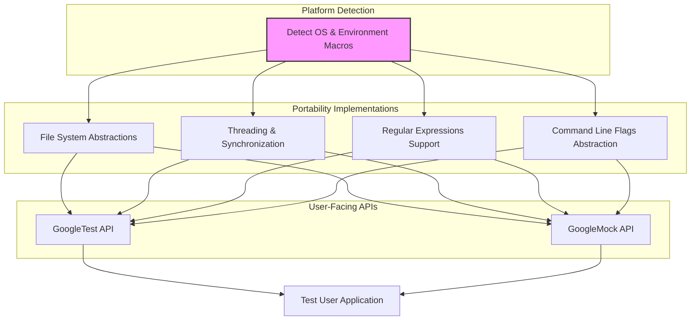

# Portability and Security Model

GoogleTest and GoogleMock are designed to work seamlessly across a vast array of platforms, compilers, and runtime environments. This page demystifies how the framework achieves platform independence through robust platform abstraction layers, while ensuring core security principles in test execution. Understanding these concepts equips users to confidently build and run tests that are both portable and secure.

---

## Platform Abstraction Layers: Ensuring Portability

### Why Platform Abstraction Matters

C++ projects often need to support multiple platforms: Windows, Linux, MacOS, embedded devices, and more. Each has different system APIs, compiler capabilities, threading models, and file systems. Without abstraction, test frameworks must constantly rework code to handle these idiosyncrasies.

GoogleTest and GoogleMock solve this challenge by introducing portability layers—modular abstractions that detect the compilation environment and adapt accordingly, providing a unified interface for testing utilities.

### How Abstraction Works in Practice

1. **Platform Detection**: Low-level macros identify the target OS, architecture, and specific environments (e.g., Android, Windows Desktop, MinGW).
2. **Conditional Compilation**: Based on these detections, the framework includes or excludes platform-specific code sections.
3. **Unified API Exposure**: Users interact with consistent testing APIs that behave identically from their perspective, freeing them from writing platform-specific test code.

For example, file system operations, threading primitives, and environment variable access all have layered implementations encapsulated behind consistent interfaces, automatically selected by platform.

<Info>
GoogleTest’s `gtest-port-arch.h` and `gtest-port.h` headers form the cornerstone of this abstraction, harboring detection macros and utility implementations that shield the rest of the framework from platform variability.
</Info>

### Supported Platforms and Features

GoogleTest supports an extensive range of platforms including but not limited to:

- Desktop OSes: Windows (Desktop, MinGW, Mobile variants), Linux, Mac OS X, FreeBSD.
- Embedded and specialized platforms: Android, Windows Phone, QNX, and others.

Within these platforms, key features such as POSIX regular expressions, threading support, exception handling, RTTI availability, and stream redirection are detected and enabled or disabled as appropriate.

<Tip>
For detailed platform-specific macros and feature availability, see the `gtest-port-arch.h` header.
</Tip>

---

## Security Principles Underlying Test Isolation and Safety

### Test Isolation for Reliability and Security

A fundamental principle of GoogleTest is that tests must be independent and isolated. Isolation prevents tests from inadvertently influencing each other, ensuring reproducibility and robust validation.

- **Separate Fixture Instances**: Each test has its own fixture object, guaranteeing state isolation.
- **No Shared Mutable State**: Tests avoid static or global mutable variables that can cause unintended side effects.

<Note>
Isolation is key not just for reliability but also for security. Tests that run in isolation reduce the risk that one test inadvertently leaks sensitive state or corrupts shared resources, helping detect vulnerabilities early.
</Note>

### Safe Assertions and Checks

GoogleTest differentiates between fatal (`ASSERT_`) and non-fatal (`EXPECT_`) assertion macros. This distinction is vital for safety:

- Fatal assertions stop the current test immediately, preventing further execution that could cause undefined behavior.
- Non-fatal assertions log failures but allow test continuity to collect multiple issues simultaneously.

This model helps maintain test safety by limiting error propagation.

### Mock Enforcement and Behavioral Control

GoogleMock introduces wrappers like `NiceMock`, `NaggyMock`, and `StrictMock` to control how uninteresting or unexpected mock method calls are handled.

- **StrictMock**: Enforces that only expected calls occur, failing tests on unexpected calls.
- **NiceMock**: Silences warnings for uninteresting calls, useful for focusing on relevant behaviors.
- **NaggyMock**: Warns (but does not fail) on unexpected calls, reminding developers to update their mocks.

This enforcement enhances both test correctness and security by validating that mocks behave as intended and do not silently mask errors.

---

## Working with Platform Flags and User Customization

### Command-Line Flags and Their Portability

GoogleMock uses a flexible flag system to allow test behavior customization without code changes. Flags such as `--gmock_verbose` or `--gmock_default_mock_behavior` adjust logging levels and default mock behavior.

- Flags are declared and used via macros abstracted over different flag libraries (e.g., Abseil's `absl::flags` if available).
- The `gmock-port.h` file manages flag definitions, declarations, and access macros, ensuring uniform usage regardless of underlying implementation.

<Tip>
Use the `GMOCK_DEFINE_bool_`, `GMOCK_DECLARE_bool_`, and related macros to declare flags in custom configurations.
</Tip>

### Customizing Platform Behavior

For highly specialized environments, users can define custom versions or overrides of portability utilities in the `custom/` subdirectory. This provides fine control without changing core framework code.

---

## Troubleshooting Portability and Security Issues

### Common Pitfalls

- **Unsupported Platform or Compiler**: Verify your platform macros are recognized. GoogleTest requires at least C++17 support and specific OS/compiler combinations.
- **Incorrect Flag Usage**: Ensure recognized flags use the `--gmock_` prefix and are parsed by `InitGoogleMock()`.
- **Incorrect Threading Model**: On platforms without pthread support, threading and assertions may not be thread-safe.

### Best Practices

- Always initialize GoogleTest/GoogleMock with `InitGoogleMock()` or `InitGoogleTest()` before running tests.
- Use `StrictMock` to catch unexpected mock calls that may hide bugs.
- Avoid global or static mutable state in tests to maintain isolation and security.

---

## Diagram: Platform Abstraction Flow

This diagram illustrates how detected platform features feed into portability implementations, which then support consistent user-facing APIs for tests and mocks.

---

## Summary

This guide detailed how GoogleTest and GoogleMock achieve portability through platform abstraction layers and ensure secure, isolated test execution. Understanding the role of environment detection, conditional compilation, safe assertion checks, and mock enforcement empowers users to write reliable and maintainable tests that work across diverse environments.

---

## Further Reading and References

- [GoogleTest Primer](https://google.github.io/googletest/primer.html) — for foundational test concepts
- [Platform Abstractions and Portability](https://google.github.io/googletest/api-reference/infrastructure-and-internals/platform-abstractions.html) — for technical details
- [Mocking Concepts and Expectations](https://google.github.io/googletest/concepts/test-models-and-workflows/mocking-concepts.html) — to understand mock enforcement
- `gtest-port-arch.h` and `gmock-port.h` headers — source for platform detection and portability macros
- Customization documentation in `googlemock/include/gmock/internal/custom/README.md` for advanced users

<TestRunnerInitializationGuide>Learn about test runner initialization for correct flag parsing and test execution sequencing.</TestRunnerInitializationGuide>
