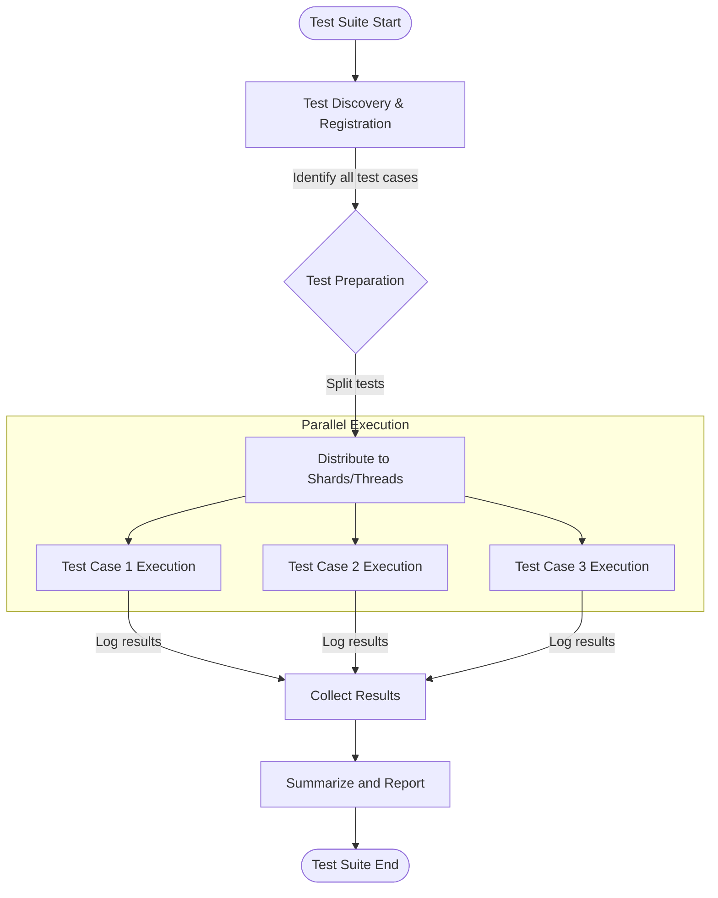

# Scalability and Performance Characteristics

Explore how GoogleTest and GoogleMock handle scalability and performance challenges to empower your testing workflows for projects of any size. This page details how the framework manages large and complex test suites, overcomes performance bottlenecks, enables parallel test execution, and supports diagnostic tools for identifying slow tests. Additionally, it provides practical advice to write efficient, maintainable tests that contribute to faster feedback and more productive development.

---

## Managing Large Test Suites

As your project grows, so does your test suite. GoogleTest and GoogleMock are designed to remain responsive and manageable even as the number of tests scales into the thousands.

- **Minimal Overhead per Test**: Each test runs in isolation with fresh instances of test fixtures, keeping memory usage efficient and ensuring test independence.
- **Smart Test Discovery**: Tests are automatically registered via macros and discovered dynamically, reducing setup time and manual maintenance.
- **Selective Test Execution**: Command-line filters allow running subsets of tests by name or traits, focusing test runs on relevant parts and saving time.

**Tip:** Organize tests into suites and fixtures to maximize shared setup and teardown efficiency. This organization complements scalable test execution by grouping logically related tests.

## Identifying and Diagnosing Performance Bottlenecks

Timely feedback is critical for effective testing. GoogleTest offers tools and workflows to help you pinpoint slow tests and bottlenecks.

- **Verbose Output and Tracing**: Use `--gtest_print_time` to show individual test durations.
- **Per-test Time Reporting**: Isolate problematic tests by duration to prioritize optimization.
- **Scoped Traces**: Use `SCOPED_TRACE` to get richer context in failures, assisting diagnosis especially for flaky or slow tests.

**Best Practice:** Profile your tests regularly during development to detect performance regressions early. Consider writing smaller, focused tests rather than monolithic ones.

## Enabling Parallel Test Execution

Parallelism is a fundamental technique for reducing test suite runtime. GoogleTest provides robust support for parallel test runs.

- **Test Sharding & Jobs**: Tests can be distributed across multiple shards (processes) using environment variables like `GTEST_TOTAL_SHARDS` and `GTEST_SHARD_INDEX`. This strategy is especially useful in CI systems.
- **Thread-Safe Test Runners**: GoogleTest's internal components are thread-safe, allowing concurrent execution of different tests or mocks without data races.
- **Mock Thread-Safety**: GoogleMock supports concurrent calls on different mock objects safely, ensuring mock verification remains reliable across threads.

<Tip>
Distribute tests to maximize load balancing. Avoid skew by grouping slower tests evenly across shards.
</Tip>

## Optimizing Test Design for Efficiency

Performance is not only about framework capabilities but also about test design. Consider the following guidelines:

- **Keep Tests Small and Focused**: Tests that do one thing well run quickly and provide clearer feedback.
- **Minimize External Dependencies**: Use mocks extensively to avoid expensive interactions like databases or file IO.
- **Use ON_CALL Wisely**: Define default mock behaviors that apply generally, reserving EXPECT_CALL for behavior verification. This avoids unnecessary test failures and overhead.
- **Tune Expectation Strictness**: Use `NiceMock` or `StrictMock` to control logging noise and unpredictability, which impacts test runtime and diagnosis focus.

## Diagnosing Slow or Flaky Tests

Slow or non-deterministic tests undermine trust in your suite. GoogleTest provides features to assist:

- **SCOPED_TRACE for Contextual Debugging**: Adds context to failures, making it easier to find root causes.
- **Test Fixtures Setup/TearDown Timing**: Investigate Setup and TearDown methods for heavy operations impacting runtime.
- **Heap Checker Integration**: Detects leaks that slow down or destabilize tests.

**Best Practice:** Automate detection of flaky tests using nightly runs and verbose logging (`--gtest_repeat=10`), then isolate and refactor.

## Runtime Flags Controlling Behavior and Output

Various command-line flags can control test run behavior and output verbosity for better performance tuning or debugging:

- `--gtest_break_on_failure`: Stops test launch on failure to focus debugging.
- `--gtest_filter`: Run specific tests only.
- `--gtest_repeat`: Repeat tests multiple times for stability checks.
- `--gmock_verbose=[info|warning|error]`: Controls mock call logging verbosity.

Using these flags strategically during development and CI integration can balance speed and diagnostic depth effectively.

---

## Summary

GoogleTest and GoogleMock together provide a performant and scalable testing infrastructure that handles large-scale C++ projects with ease. By leveraging parallel execution, careful test organization, mock strictness tuning, and diagnostic tooling, users can achieve fast feedback and maintain high confidence in test results.

---

## Additional Resources

- [GoogleTest Primer](https://github.com/google/googletest/blob/main/docs/primer.md): Learn core GoogleTest practices for writing efficient and maintainable tests.
- [gMock Cookbook](https://github.com/google/googletest/blob/main/docs/gmock_cook_book.md): Recipes for mocking patterns that improve test speed and clarity.
- [Performance & Large-Scale Testing Guide](https://github.com/google/googletest/blob/main/guides/real-world-testing-scenarios/performance-and-large-scale-testing.mdx): Deep dive into optimizing test suites in CI and large codebases.
- [Mocking Reference](https://github.com/google/googletest/blob/main/docs/reference/mocking.md): Detailed guide on mock configuration and controlling behavior.

---

## Mermaid Diagram: Parallel Test Execution Flow

This diagram illustrates how GoogleTest distributes tests among parallel jobs or threads, runs them independently, collects, and summarizes the results, enabling scalable performance improvements.

---

## Troubleshooting Tips

- If you observe unexpectedly slow tests, use `--gtest_print_time` to identify these.
- Unbalanced shards can cause parallel execution inefficiencies; manually adjust test shard distributions if necessary.
- Mock-related thread safety issues typically stem from modifying expectations concurrently – ensure expectation setting and clearing happen in a single thread before or after parallel execution.

---

Harness the full potential of GoogleTest and GoogleMock's performance and scalability features by following the above guidance and integrating these practices into your test development lifecycle.