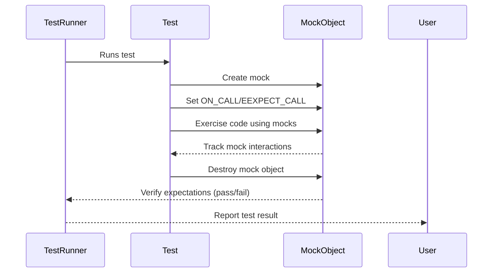

# Integration with Test Runners and Tools

Explore patterns for integrating GoogleTest’s mocking framework, gMock, into diverse test runners, development environments, and build systems. Understand the extensibility points that ease continuous integration and complex build workflows.

---

## Overview

GoogleTest and gMock are designed not only as a powerful C++ testing and mocking framework but also to seamlessly integrate with various test runners, IDEs, build tools, and CI pipelines. This page guides you through how these integrations work, highlighting the points where gMock enables smooth adoption into complex environments.

Whether you want to automate your tests on a CI server, run them inside your favorite IDE, or extend existing test runners, the extensibility provided by gMock ensures you can fit it naturally into your workflow.


## Key Integration Concepts

### Mock Registration and Verification Hooks

At its core, gMock registers mock objects and their expectations globally when created or when `ON_CALL` / `EXPECT_CALL` macros are invoked. This registration supports automatic verification when mocks are destructed, enabling standard test runners to detect test failures caused by unmet expectations without extra instrumentation.

This design means any test runner that runs your tests and observes their pass/fail outcome automatically incorporates gMock’s assertion reporting as part of its process.

### Configurable Verbosity for Diagnostic Outputs

To aid diagnostics during integration, gMock supports the `--gmock_verbose` flag with levels such as `info`, `warning`, and `error`. This flag controls the detail level of logging for mock calls, aiding integration scenarios where you may want increased insight (verbose logs) or suppress output (cleaner CI logs).

### Support for Custom Event Reporting

gMock’s failure messages include precise source locations and description of unmet expectations, facilitating IDEs or test runners that parse test output to present rich diagnostics, including clickable stack traces or aggregated failure summaries.


## Common Integration Scenarios

### Running Tests in Build Systems and CI Pipelines

GoogleTest, and by extension gMock tests, are commonly integrated into build systems such as CMake or Bazel and executed within CI environments.

- To integrate gMock tests, ensure your build targets link against `gmock` or `gmock_main` libraries.
- Use your build system's test runner integration to register test executables as runnable tests.
- gMock's built-in automatic verification ensures that failed mock expectations cause tests to fail appropriately.

<Info>
For detailed guidance on continuous integration setup with GoogleTest, refer to the [Integration With Build Systems and CI Workflows](../guides/advanced-usage-integration/integration-cicd) guide.
</Info>

### Using gMock with IDEs and Test Runners

Popular IDEs support GoogleTest’s test discovery and execution through parsing test metadata or observing the executable’s output.

- gMock seamlessly integrates here as well since it piggybacks on GoogleTest’s test framework.
- IDEs can report mock failures directly thanks to gMock’s detailed assertion and error messages.

### Custom Test Runners and Wrappers

Organizations may build proprietary test runners or wrappers around GoogleTest.

- gMock’s registration and verification infrastructure supports manual calls to `Mock::VerifyAndClearExpectations` or `Mock::VerifyAndClear` to explicitly verify mocks at desired test lifecycle points.
- You can also control mock leak detection behavior to integrate with different resource management policies.


## Extensibility Points in gMock for Integration

### The `Mock::AllowLeak` API

Allows you to declare mock objects intentional to leak (e.g., owned outside the lifetime of the test) to suppress leak detection failures. This is helpful to adapt gMock to environments where mock destruction timing cannot be guaranteed.

### Controlling Mock Behavior Strictness

By using `NiceMock`, `NaggyMock`, and `StrictMock` wrappers, you can influence how uninteresting mock method calls are treated during test execution.

- **NiceMock**: Suppresses warnings on uninteresting calls.
- **NaggyMock**: Default behavior, warns on uninteresting calls.
- **StrictMock**: Converts uninteresting calls into test failures, useful for enforcing strict interaction contracts.

This flexibility helps to tune integration tightness with existing test runners and continuous integration policies.

### Test Execution and Initialization

Initialize gMock in your tests by calling `::testing::InitGoogleMock()`.

- This registers internal frameworks and ensures the hooks to monitor mocks and expectations are established.
- Custom main functions can be written if required by the test runner, but typically the provided main from `gmock_main` suffices.


## Practical Examples

### Using Mock Objects within Test Suites

```cpp
#include <gmock/gmock.h>
#include <gtest/gtest.h>

using ::testing::Return;

class MockDatabase {
 public:
  MOCK_METHOD(int, GetRecordCount, (), (const));
};

TEST(DatabaseTest, ReturnsExpectedCount) {
  MockDatabase mock_db;
  EXPECT_CALL(mock_db, GetRecordCount())
      .WillOnce(Return(42));

  EXPECT_EQ(42, mock_db.GetRecordCount());
}
```

This test integrates directly with any standard GoogleTest runner, which can be executed under any CI or IDE system supporting GoogleTest.

### Controlling Test Behavior in CI

You might want suppress verbosity in CI runs to keep logs clean:

```bash
./my_test_executable --gmock_verbose=error
```

Or enable verbose logging for debugging:

```bash
./my_test_executable --gmock_verbose=info
```


## Best Practices for Integration

- **Set expectations before exercising mocks**: Always define `EXPECT_CALL` statements before your code uses the mock objects to avoid undefined behavior.
- **Use `NiceMock` for noisy tests**: When you don't care about certain calls and want to avoid verbose warnings, prefer `NiceMock<T>`.
- **Explicitly verify mocks if necessary**: For custom test runners, explicitly call `Mock::VerifyAndClearExpectations()` after test execution.
- **Watch for leaked mocks**: If your environment leads to leaked mock objects, consciously use `Mock::AllowLeak()` to suppress false positives.
- **Control uninteresting call handling**: Use `StrictMock` in critical tests to enforce interaction discipline.


## Troubleshooting Integration Issues

<AccordionGroup title="Common Issues in Test Runner Integration">
<Accordion title="Unmet Expectations After Test Execution">
Check if your test runner runs destructors of mock objects or explicitly calls verification APIs.
</Accordion>
<Accordion title="Unexpected Mock Function Call Warnings in CI">
Consider using `NiceMock` or suppress warnings with `--gmock_verbose=error` to reduce noise.
</Accordion>
<Accordion title="Leaked Mock Object Errors At Program Exit">
Use `Mock::AllowLeak()` for mocks intentionally kept alive beyond test lifetime.
</Accordion>
</AccordionGroup>


## Further Reading and References

- [gMock for Dummies](../docs/gmock_for_dummies.md): Beginner-friendly introduction to mocking.
- [Mocking Reference](../docs/reference/mocking.md): Complete reference for mock definitions and expectations.
- [gMock Cookbook](../docs/gmock_cook_book.md): Recipes for advanced mock usages.
- [Setting Strictness Modes](../guides/mocking-best-practices/mock-strictness-modes.mdx): Control warnings and strictness.
- [Integration with Build Systems and CI Workflows](../guides/advanced-usage-integration/integration-cicd.mdx): Automating GoogleTest with build tools.


---

### Visual Summary: Mock Lifecycle Interaction with Test Runner



This flow showcases how mock objects integrate within test execution and reporting.


---

<Check>
Make sure your test runner captures and returns exit statuses from your tests.
Failure to do so will mask mock failures.
</Check>


---

By leveraging the structured extensibility mechanisms described here, GoogleTest’s mocking framework adapts fluidly into complex build, test, and CI ecosystems, providing robust validation and developer productivity enhancements.


---