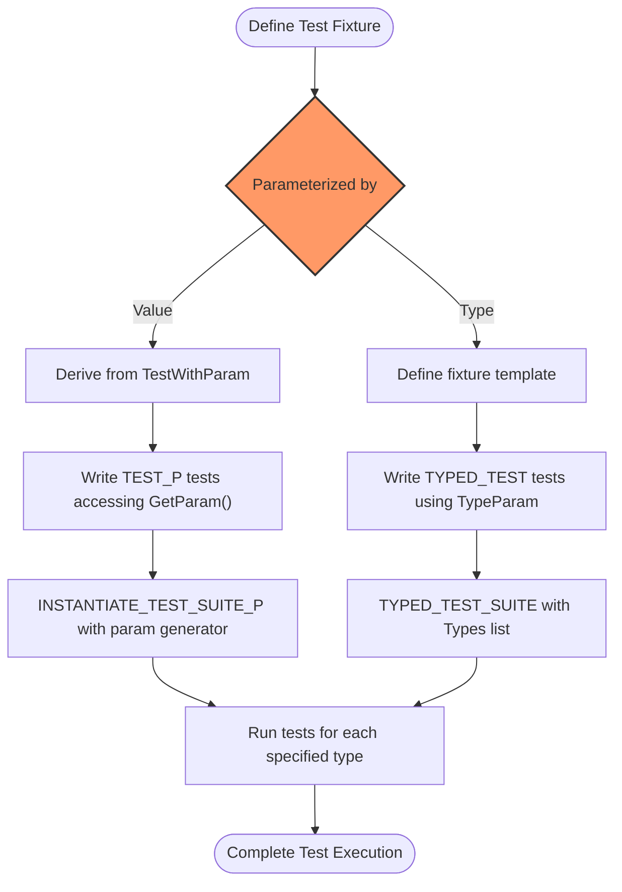

# Parameterized and Typed Tests

GoogleTest empowers you to run your tests across a broad spectrum of input data and types without duplicating test code. This page explains how value-parameterized and type-parameterized tests help you **systematically verify your code's behavior over diverse inputs and type variations**. You'll learn why these techniques are essential for comprehensive testing, how they operate, and best practices for applying them.

---

## Why Parameterized and Typed Tests?

Imagine you're testing a function that computes a result differently based on input values or types. Writing separate, almost identical tests for each input or type quickly becomes unwieldy and error-prone.

**Value-parameterized tests** let you write one test logic and run it repeatedly with different input values. Similarly, **type-parameterized tests** run the same test logic across multiple data types.

These approaches:

- **Reduce redundancy**: Write a test once, run it many times.
- **Expand coverage**: Validate all relevant inputs and types systematically.
- **Improve maintainability**: Changes impact one place instead of multiple repetitive tests.

By embracing parameterized and typed tests, your tests evolve from brittle, repetitive cases into elegant, comprehensive suites.

---

## Value-Parameterized Tests

### Concept Overview

Value-parameterized tests enable you to define a test fixture that uses a parameter value, and then instantiate multiple tests with different values.

- You define a test fixture class that inherits from `testing::TestWithParam<T>`, where `T` is the parameter type.
- Tests are defined using the `TEST_P` macro instead of `TEST_F`.
- Each test accesses its parameter via `GetParam()`.
- You instantiate the test suite using `INSTANTIATE_TEST_SUITE_P`, supplying a parameter generator.


### User Flow

1. **Create a Fixture with Parameter Support**: Derive your test fixture from `TestWithParam<T>`.
2. **Write Parameterized Tests Using `TEST_P`**: Define tests using `TEST_P(FixtureName, TestName)`.
3. **Specify Input Values via Generators**: Instantiate your tests using `INSTANTIATE_TEST_SUITE_P` and provided generators (e.g., `Values()`, `Range()`).
4. **Run Your Tests**: GoogleTest runs the same test logic repeatedly, once per parameter.

### Example

```cpp
class MathTest : public ::testing::TestWithParam<int> {};

TEST_P(MathTest, IsEvenTest) {
  int n = GetParam();
  EXPECT_EQ(n % 2, 0);
}

INSTANTIATE_TEST_SUITE_P(EvenNumbers, MathTest, ::testing::Values(2, 4, 6, 8));
```

Here, the test `IsEvenTest` runs four times with parameters 2, 4, 6, and 8.

### Parameter Generators

GoogleTest provides multiple parameter generators to produce values for instantiation:

| Generator          | Behavior                                                                                       |
| ------------------ | ----------------------------------------------------------------------------------------------|
| `Range(begin, end [, step])` | Yields values starting at `begin`, incremented by `step` (default 1), up to but excluding `end`.  |
| `Values(v1, v2, ..., vN)`    | Yields the fixed set of values supplied.                                                    |
| `ValuesIn(container)` or `ValuesIn(begin, end)` | Yields values from arrays, containers, or iterator ranges.                                 |
| `Bool()`                     | Yields `{false, true}` for boolean values.                                                    |
| `Combine(g1, g2, ..., gN)`   | Produces a Cartesian product of input generators, yielding tuples of combined values.         |
| `ConvertGenerator<T>(g)` or `ConvertGenerator(g, func)` | Converts generator values to desired type `T` using optional callable `func`.            |

### Using a Name Generator

You can supply a custom function or functor to generate descriptive test name suffixes for each parameter value, making it easier to distinguish test instances.

Example:

```cpp
INSTANTIATE_TEST_SUITE_P(
    MyTests, MathTest,
    ::testing::Values(2, 4, 6),
    [](const ::testing::TestParamInfo<int>& info) {
      return "Number_" + std::to_string(info.param);
    });
```

### Best Practices

- Prefer parameter generators over hardcoding values inside tests.
- Use descriptive test instance names with name generators to improve test output readability.
- Use `EXPECT_*` assertions inside parameterized tests unless test failure must stop the test immediately.
- Limit parameter list size reasonably to keep test runtime manageable.

---

## Type-Parameterized Tests

### Concept Overview

Type-parameterized tests allow you to reuse the same test logic for multiple types — ideal for template-heavy code or interfaces.

- You create a test fixture template class parameterized by a type `T`.
- Define tests using the `TYPED_TEST_SUITE` macro to associate a list of types.
- Use `TYPED_TEST` instead of `TEST_F` or `TEST_P` to define your test functions.
- Inside tests, use `TypeParam` to refer to the current type parameter.


### User Flow

1. **Define a Fixture Template**: Template your fixture class with the type parameter.
2. **Associate Types via `TYPED_TEST_SUITE`**: Bind a list of types to the fixture.
3. **Write Tests Using `TYPED_TEST`**: Define tests that will run for each type.
4. **Run Tests**: GoogleTest instantiates tests for each type in the list.

### Example

```cpp
template <typename T>
class StackTest : public ::testing::Test {
 protected:
  Stack<T> stack;
};

using MyTypes = ::testing::Types<int, double>;
TYPED_TEST_SUITE(StackTest, MyTypes);

TYPED_TEST(StackTest, IsEmptyInitially) {
  EXPECT_TRUE(this->stack.empty());
}

TYPED_TEST(StackTest, CanPushAndPop) {
  this->stack.push(TypeParam(42));
  EXPECT_EQ(this->stack.top(), TypeParam(42));
}
```

This runs the two tests with `int` and `double` types.

### Type-Parameterized Test Suite Registration

You can also use the type-parameterized interface (with `_P` suffix macros) when the types are not known upfront. This involves:

- Using `TYPED_TEST_SUITE_P()`, `TYPED_TEST_P()`, and `REGISTER_TYPED_TEST_SUITE_P()`.
- Then instantiating suites with `INSTANTIATE_TYPED_TEST_SUITE_P()`.

This allows more modular and reusable test definitions.

---

## Combining Value and Type Parameterization

For advanced scenarios, GoogleTest supports mixing value-parameterized tests and typed-tests through test fixtures that inherit from both `TestWithParam` and type parameters. This enables broad coverage across types and input values simultaneously.

---

## Summary

Parameterized and typed tests provide powerful abstractions to transform repetitive and verbose test code into comprehensive, maintainable, and expressive test suites. This approach aligns testing with your production code polymorphism and input variability, increasing confidence and debugging efficiency.

---

## Additional Tips and Practical Guidance

- **Always name your test suites and tests following C++ naming conventions, avoiding underscores to ensure compatibility.**
- **Use descriptive parameter names and type lists to clarify intent and simplify debugging.**
- **Limit cardinality of test parameters to keep the test suite runtime acceptable.**
- **Leverage provided parameter generators (`Values`, `Range`, `Bool`, `Combine`) from the `::testing` namespace for most use cases.**
- **Custom name generators make test results easier to interpret and track.**
- **Review the full reference in the Testing Reference page under macros `TEST_P`, `INSTANTIATE_TEST_SUITE_P`, `TYPED_TEST_SUITE`, etc.**

---

## See Also

- [Testing Reference - TEST_P and Parameterized Tests](../reference/testing.md#TEST_P)
- [Testing Reference - INSTANTIATE_TEST_SUITE_P](../reference/testing.md#INSTANTIATE_TEST_SUITE_P)
- [Testing Reference - TYPED_TEST and TYPED_TEST_SUITE](../reference/testing.md#TYPED_TEST)
- [GoogleTest Primer](docs/primer.md) — foundational testing concepts
- [GoogleMock Cookbook](docs/gmock_cook_book.md) — for mocking best practices
- [Mocking Reference](docs/reference/mocking.md) — defining expectations

---

## Diagram: How Parameterized and Typed Tests Work Together



This reflects the high-level workflow users undertake to create parameterized and typed tests.

---

<Tip>
If you want to test a function or class template across several data types, **start with type-parameterized tests**. If you want to test logic over multiple input values, **use value-parameterized tests**. You can combine both for utmost coverage.
</Tip>

<Warning>
Don't mix underscores in your test suite and test names in `TEST_P` and `TYPED_TEST`, as GoogleTest mandates no underscores for proper name resolution.
</Warning>

---