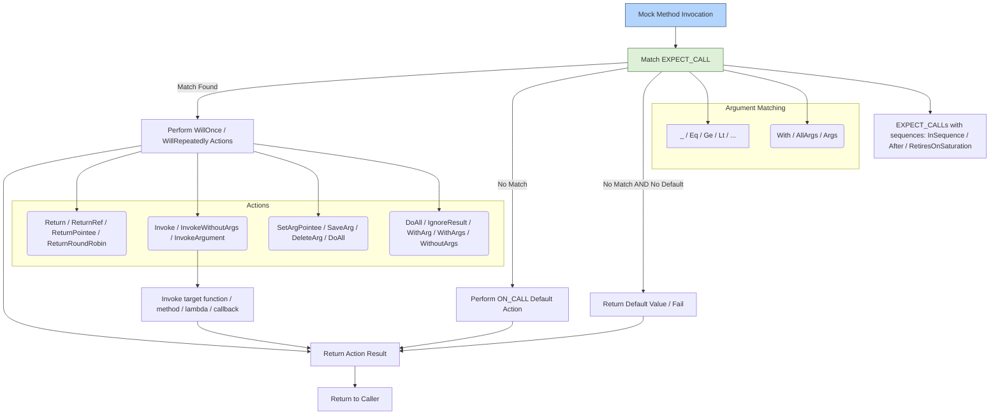

# Advanced Mocking: Actions and Invocation Patterns

Explore the sophisticated meta-programming concepts that empower GoogleMock to customize mock behaviors deeply. This guide unveils how action templates, argument matching, and invocation handlers work in unison to provide advanced and flexible mocking capabilities.

---

## Introduction

At the heart of creating powerful tests lies the ability to control and respond to mock method invocations precisely. GoogleMock extends beyond simple expectations to offer mechanisms such as:

- **Action Templates**: Reusable and parameterized behaviors executed when a mock method is called.
- **Argument Matching Patterns**: Techniques to selectively match arguments and customize calls.
- **Handler Invocation**: Flexible ways to invoke functions, methods, functors, callbacks, or lambdas as responses.

This guide journeys through these concepts, helping you harness GoogleMock’s full potential in crafting intricate test scenarios.

## What Are Actions and How They Drive Mock Behavior?

Actions specify what a mock method should do each time it is invoked. Whether returning a value, modifying arguments, invoking callbacks, or performing a sequence of steps, actions define the “response” behind expectations set with `EXPECT_CALL` or behaviors set with `ON_CALL`.

### Common User Goals with Actions

- Return different values conditionally or sequentially.
- Mutate pointer or reference arguments to simulate stateful effects.
- Trigger callbacks passed as function arguments.
- Combine multiple side effects into a single response.

By understanding actions, you gain precise control over how your mocks behave and interact.

## Action Templates: Building Blocks of Complex Mock Responses

GoogleMock supports **action templates** to define parameterized and reusable behaviors for mock invocations.

### Defining Actions Through Lambdas or Functors

Rather than being restricted to fixed return values, users can create custom actions as callable objects:

```cpp
EXPECT_CALL(mock, Compute(_))
    .WillOnce([](int x) { return x * 2; })
    .WillRepeatedly([](int x) { return x + 1; });
```

Here, the lambda defines dynamic behavior based on input, enabling flexible logic.

### Legacy Macro-Based Actions


gMock also provides the *ACTION* and *ACTION_P* macros for defining quick custom actions:

```cpp
ACTION(IncrementArg1) {
  return ++(*arg1);
}
EXPECT_CALL(mock, Modify(_)).WillOnce(IncrementArg1());
```

These give you an easy way to write reusable behavior snippets by accessing mock arguments directly via `argN`.

### Generic Parameterized Actions

You can define action templates with explicit parameters and template types using `ACTION_TEMPLATE`, allowing sophisticated, type-safe reactions adaptable to various argument types.

## Argument Matching and Invocation Patterns

The key to advanced mocking is the ability to precisely specify **which calls** trigger **which actions**.

### Argument Matching with Multi-Argument Matchers

GoogleMock passes all arguments as a tuple, letting you apply tuple-based matchers via the `.With()` clause:

```cpp
EXPECT_CALL(my_mock, SetPosition(_, _))
    .With(Lt())  // First arg less than second
    .WillOnce(Return(true));
```

This pattern allows expressing complex relations between multiple arguments.

### Flexible Invocation of Callbacks or Member Functions

Sometimes your mocks receive callback arguments that you want to invoke dynamically:

```cpp
EXPECT_CALL(foo, DoThis(_, _))
    .WillOnce(InvokeArgument<1>(42));  // Calls 2nd argument as a function with 42
```

The `InvokeArgument<N>()` action calls the N-th argument (0-based), passing specified parameters. Use `std::ref()` to pass references instead of copies.

### Selective Argument Passing to Actions

If your action expects fewer arguments than the mock method receives, use `WithArgs<>` and `WithArg<>` to pass only desired arguments:

```cpp
EXPECT_CALL(mock, ComplexMethod(_, _, _))
    .WillOnce(WithArgs<0, 2>(Invoke(MyFun)));
```

Here, only the 1st and 3rd arguments are forwarded to `MyFun`.

### Ignoring Arguments in Actions

If your action function doesn't care about some arguments, declare those as `Unused` to express intent clearly:

```cpp
double DistanceToOrigin(Unused, double x, double y) {
  return sqrt(x * x + y * y);
}
EXPECT_CALL(mock, Foo(_, _, _)).WillOnce(Invoke(DistanceToOrigin));
```

This reduces boilerplate and improves readability.

## Built-in and Composite Actions

GoogleMock ships with a rich library of built-in actions, summarized here:

| Action                 | Purpose                                                   |
|------------------------|-----------------------------------------------------------|
| `Return(value)`        | Return the specified value from the mock method.          |
| `ReturnRef(variable)`  | Return reference to a variable.                           |
| `ReturnPointee(ptr)`   | Return the value pointed by a pointer.                    |
| `SetArgPointee<N>(val)`| Set the pointed to value of N-th argument to `val`.      |
| `Assign(&var, val)`    | Assign `val` to the specified variable.                   |
| `Invoke(f)`            | Call a function/functor/lambda with the mock arguments.   |
| `InvokeWithoutArgs(f)` | Call a callable with no arguments.                         |
| `InvokeArgument<N>(...)`| Call the N-th mock argument (a callable) with parameters. |
| `DoAll(a1, ..., aN)`    | Perform multiple actions in sequence; return last action's result. |
| `IgnoreResult(a)`      | Perform action `a` but ignore its return value.           |
|

### Combining Actions

Use `DoAll()` to chain multiple effects; for example, setting an output argument and returning a value:

```cpp
EXPECT_CALL(mock, Mutate(_))
    .WillOnce(DoAll(SetArgPointee<0>(5), Return(true)));
```

This allows side effects and return values in one expectation.

## Controlling Expectation Lifecycles with Retiring

Expectations are "sticky" by default, meaning they remain active even after being satisfied (saturated). GoogleMock offers `.RetiresOnSaturation()` to automatically deactivate an expectation once fully used.

For example:

```cpp
EXPECT_CALL(foo, GetValue())
    .WillOnce(Return(1))
    .WillOnce(Return(2))
    .RetiresOnSaturation();
```

This effect prevents oversaturation failures and helps manage sequences cleanly.

## Handling Move-Only Types in Actions

GoogleMock supports mocking functions that accept and/or return move-only types such as `std::unique_ptr<T>`. Use lambdas or functors in actions to create and return new objects each time if needed:

```cpp
EXPECT_CALL(mock, MakeBuzz(_))
    .WillRepeatedly([](StringPiece text) {
      return std::make_unique<Buzz>(AccessLevel::kInternal);
    });
```

Note that using `Return(std::move(...))` repeatedly is invalid as it moves from an object only once.

## Delegation Patterns in Advanced Mocking

GoogleMock facilitates delegation to real or fake objects by wiring default actions in the mock:

```cpp
ON_CALL(*this, DoThis)
    .WillByDefault([this](int n) { return real_obj.DoThis(n); });
```

This pattern lets you combine real implementations with mock expectations.

## Summary Diagram of Advanced Mocking Invocation Flow


```

## Troubleshooting Advanced Invocation Patterns

- **Unexpected calls** occur when no matching `EXPECT_CALL` exists. They always fail your test.
- **Uninteresting calls** occur when no `EXPECT_CALL` is set for a method. They trigger warnings by default but not failures.
- Remember to set expectations before exercising mocks; late expectations result in undefined behavior.
- Use `RetiresOnSaturation()` to avoid saturation failures when expectations naturally expire.
- For noisy uninteresting call warnings, consider wrapping your mock in `NiceMock<>` or explicitly allowing calls.

## Best Practices for Using Advanced Actions

- Prefer expressive argument matchers combined with `.With()` for complex argument relations.
- Use lambdas or functors for actions with dynamic behavior, especially for move-only types.
- Delegate to real or fake implementations sparingly, only when necessary to reuse logic.
- Structure sequences and use `InSequence` and `.After()` to enforce call ordering selectively.

---

For further mastery, consult these guides:

- [Mocking Reference](../reference/mocking.md)
- [Actions Reference](../reference/actions.md)
- [gMock Cookbook](../gmock_cook_book.md)
- [gMock for Dummies](../gmock_for_dummies.md)

Understanding these advanced concepts will equip you to write mocks that verify precise complex interactions with clear, maintainable tests.
