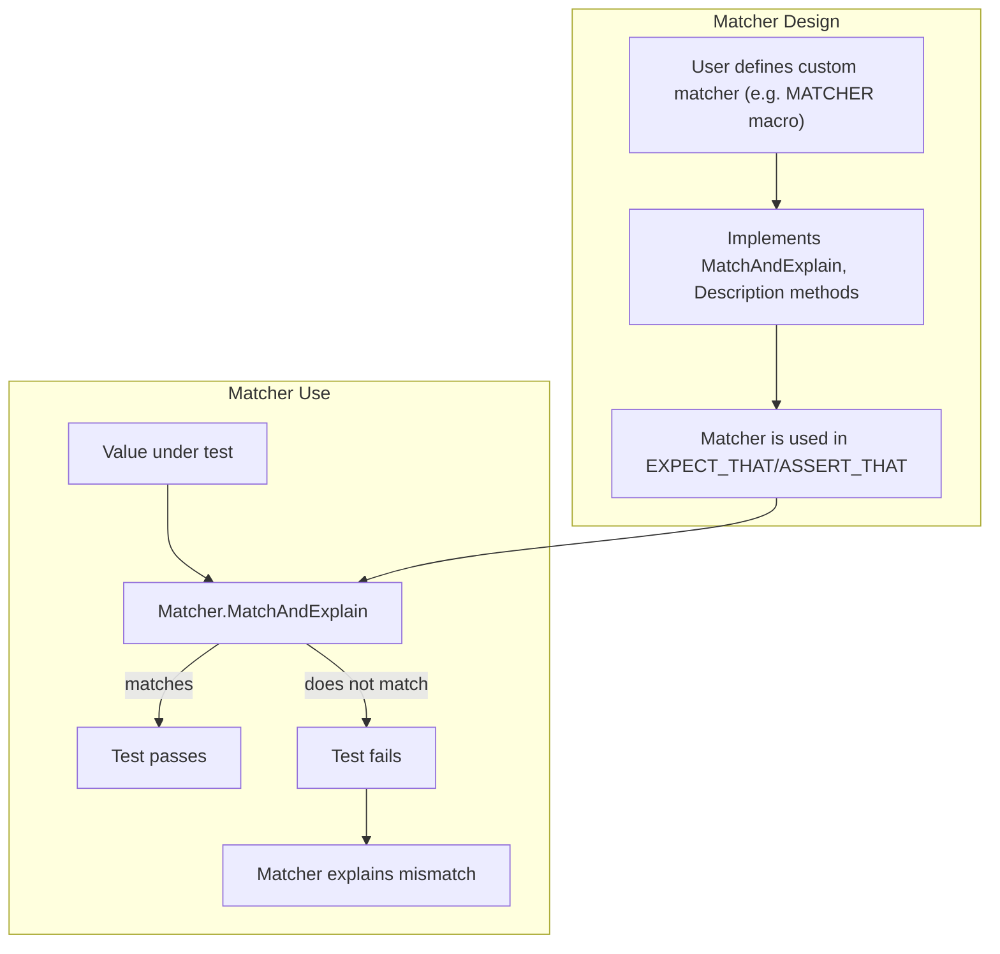

# Custom Assertions and Matchers

Explore how to extend GoogleTest by defining your own assertions and matchers tailored to your test domain. This guide helps you understand the design and implementation principles behind custom matchers and assertions, focusing on matching interfaces, composition of matchers, and assertion macros that GoogleTest offers to balance expressivity with type safety and readability.

## Why Extend GoogleTest with Custom Matchers?

GoogleTest provides a rich set of built-in assertions and matchers to verify test conditions. However, real-world testing demands often require more expressive or domain-specific checks that aren’t covered out-of-the-box. Defining your own custom matchers allows you to:

- Write clear and descriptive assertions matching your domain concepts.
- Improve test readability by replacing complex boolean expressions with semantic matchers.
- Generate detailed and helpful failure messages when expectations are unmet.
- Compose existing matchers for richer logical conditions.

By mastering custom assertions and matchers, you reduce boilerplate, enhance test diagnostics, and keep your tests maintainable and expressive.

## Matching Interfaces and How They Work

In GoogleTest, a **matcher** is a predicate that determines whether a value meets a certain condition. Internally, matchers implement a consistent interface that supports:

- **Match checking** — evaluating if a value satisfies the matcher.
- **Description** — producing human-readable text describing what the matcher tests.
- **Negation description** — explaining the opposite of what the matcher tests.

Match implementations often support explanation output, which enriches test failure reports with contextual details.

### Polymorphism and Type Safety

Matchers in GoogleTest are **statically typed** and heavily templated. This ensures:

- Compile-time checking of matcher types against the argument type they apply to.
- Prevention of accidental type mismatches in tests.

At the same time, GoogleTest supports polymorphic matchers that can apply to multiple argument types by using template conversion operators, enabling great flexibility.

## Creating a Simple Custom Matcher

The simplest way to create a matcher is using the `MATCHER` macro, which generates all the boilerplate based on your predicate expression.

### Example: A Matcher to Check Even Numbers

```cpp
MATCHER(IsEven, "checks if a number is even") {
  return (arg % 2) == 0;
}
```

Use this matcher in your test:

```cpp
EXPECT_CALL(mock, Method(IsEven()));
EXPECT_THAT(value, IsEven());
```

When a test fails, the message will indicate that the value was expected to be even but was not.

## Parameterized Matchers

Complex matchers often require parameters. GoogleTest supports parameterized matchers using macros like `MATCHER_P` (single parameter), `MATCHER_P2` (two parameters), up to `MATCHER_P10`.

### Example: Absolute Value Matcher

```cpp
MATCHER_P(HasAbsoluteValue, expected_abs, "") {
  return std::abs(arg) == expected_abs;
}
```

Usage:

```cpp
EXPECT_THAT(value, HasAbsoluteValue(10));
```

The failure message will include the parameter value, helping clarify test expectations.

## Composing Matchers

Matchers can be composed for expressive logic:

- `AllOf()` requires all sub-matchers to match.
- `AnyOf()` requires any sub-matcher to match.
- `Not()` negates a matcher.

You can combine custom and built-in matchers to build rich assertion predicates.

## Advanced Matcher Implementation

For greater control beyond the `MATCHER` macros, you can implement matcher classes manually by providing:

- `MatchAndExplain(const T& value, std::ostream* listener)` — checks the match and writes explanations.
- `DescribeTo(std::ostream* os)` / `DescribeNegationTo(std::ostream* os)` — outputs descriptive text.

This approach enables:

- Polymorphic matchers applicable on multiple types with template methods.
- Handling partial matches with detailed failure explanations.
- Integrating matcher state or caching if needed.

## Designing Assertions Using Matchers

GoogleTest provides assertions like `EXPECT_THAT(value, matcher)` and `ASSERT_THAT(value, matcher)` that leverage the matcher interface for verifying test conditions.

### Benefits of Custom Assertions

- They produce clearer and more precise error messages.
- They decouple assertion logic from test flow control.
- They integrate seamlessly with GoogleTest’s non-fatal and fatal failure mechanisms.

When writing custom matcher classes, ensure they are _functionally pure_ — they must have no side effects and consistent outcomes for the same inputs.

## Matcher Composition Pattern

The ability to compose matchers enables powerful and reusable assertion logic:

```cpp
EXPECT_THAT(container, AllOf(Contains(Gt(5)), Each(Lt(100))));
```

Here,

- `Contains(Gt(5))` asserts the container has at least one element greater than 5.
- `Each(Lt(100))` asserts every element is less than 100.
- `AllOf(...)` ensures both conditions.

This gets rendered into informative failure messages indicating which part(s) failed.

## Writing Macros for Custom Assertions

While GoogleTest handles most assertion needs via existing macros, you can create your own assertion macros wrapping custom matchers. For example:

```cpp
#define EXPECT_IS_EVEN(val) EXPECT_THAT(val, IsEven())
```

This improves readability and encapsulates repetitive assertion logic.

## Best Practices

- **Start simple:** Begin with `MATCHER` macros to create clear, minimal matchers.
- **Use parameters:** Leverage `MATCHER_P` macros for flexible conditions.
- **Focus on clarity:** Write matcher descriptions that clearly express intent.
- **Compose thoughtfully:** Build complex matcher logic from reusable components.
- **Keep performance in mind:** Write matchers without expensive side effects.
- **Use explanation output:** Provide failure context to ease debugging.
- **Test matchers themselves:** Unit test your custom matchers to ensure correctness.

## Common Pitfalls and Troubleshooting

- **Overly complex matchers:** Break them down to simpler components.
- **Side effects in matchers:** Avoid changing program state during matching.
- **Incorrect matcher descriptions:** Always provide meaningful messages.
- **Misuse of parameter types:** Ensure template parameters align correctly to avoid compilation errors.
- **Ignoring matcher purity:** Failing to keep matchers pure can cause flaky tests.

## Related Concepts

- **Matcher Macros:** Refer to `MATCHER`, `MATCHER_P`, and `MATCHER_Pn` macros for basic custom matchers.
- **Monomorphic vs. Polymorphic Matchers:** Understand when and how to write matchers for specific or general types.
- **Actions and Invocation:** For mocking behavior, see custom actions guide.

## References and Further Reading

- [gMock Cookbook](https://google.github.io/googletest/gmock_cook_book.html) — Practical recipes including custom matchers.
- [Matchers Reference](https://google.github.io/googletest/reference/matchers.html) — Complete list and details of built-in matchers.
- [Assertions Reference](https://google.github.io/googletest/reference/assertions.html) — Using matchers in assertions.
- [Writing New Matchers Quickly](https://google.github.io/googletest/gmock_cook_book.html#NewMatchers) — Quick tutorial on MATCHER macros.

## Summary

Custom assertions and matchers enable you to tailor GoogleTest’s powerful verification capabilities to your specific testing needs. Through flexible matcher interfaces and composable macros, you can write readable, robust tests with descriptive failure messages.

Mastering these extensions will elevate your test quality by making assertions more expressive and maintainable.

---

# Example Usage

```cpp
#include <gmock/gmock.h>

using ::testing::MATCHER;
using ::testing::MATCHER_P;

// Matcher to check if an integer value is even.
MATCHER(IsEven, "is even") {
  return (arg % 2) == 0;
}

// Parameterized matcher to check if absolute value equals expected.
MATCHER_P(HasAbsoluteValue, expected_abs, "") {
  return std::abs(arg) == expected_abs;
}

// Sample test using matchers
TEST(MyMatcherTest, CustomMatchers) {
  int value = 4;
  EXPECT_THAT(value, IsEven());
  EXPECT_THAT(-10, HasAbsoluteValue(10));
}
```

---

# Troubleshooting

- If the compiler reports errors involving `MATCHER` macros, verify that your matcher code compiles standalone by isolating the logic.
- Use streaming to `result_listener` inside matchers to clarify failure reasons.
- Wrap complex logical conditions in smaller reusable matchers rather than a big one.
- If you see unexpected matcher failures, enable verbose logging (`--gmock_verbose=info`) to trace matching steps.

# Visual Summary of Matcher Flow



This simple flow highlights the input value being checked via the matcher’s logic, which returns matched/not matched and provides an explanation on failure.

---

This page helps you take full advantage of custom assertions and matchers within GoogleTest, enabling clear, readable, and powerful test validations tailored to your project's domain.
