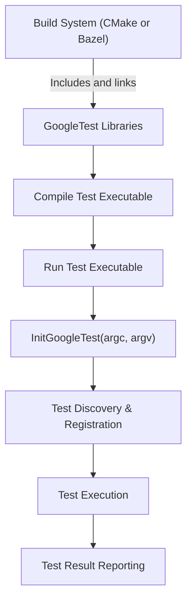

# Build System and Platform Integration

This guide explores how GoogleTest integrates with various build environments and achieves platform portability. Understanding these approaches will empower you to smoothly embed GoogleTest into your projects and ensure consistent test execution across diverse systems.

---

## Integration Approaches with Build Environments

GoogleTest is designed to work seamlessly with popular build systems, catering to a variety of project configurations and developer preferences.

### CMake Integration

CMake is the most widely used build system for C++ projects, and GoogleTest provides official support and best practices for integration:

- **Incorporation as External Project or Subdirectory**: You may include GoogleTest either by fetching it externally during your build or by adding it as a subdirectory to your project. 

- **Target Names**: GoogleTest installs targets such as `gtest` and `gtest_main`, facilitating correct linking against the test libraries.

- **Configuration Variables**: GoogleTest leverages CMake's configuration variables to set up compiler flags, runtime options, and dependencies.

- **Example CMakeLists Usage:**

```cmake
# Add GoogleTest as a subdirectory
add_subdirectory(googletest)

# Create your test executable
add_executable(my_test test.cpp)

target_link_libraries(my_test PRIVATE gtest_main)

# Enable CTest integration
include(GoogleTest)
gtest_discover_tests(my_test)
```

> This integration ensures your tests build with the correct flags and are automatically registered for running.

### Bazel Integration

For projects using Bazel, GoogleTest offers build integration:

- **WORKSPACE and BUILD Files**: GoogleTest can be imported via Bazel’s `http_archive` or linked as a local repository.

- **Bazel Test Rules**: Use the `cc_test` rule to define test targets that link against GoogleTest libraries.

- **Example BUILD File:**

```python
cc_test(
    name = "my_test",
    srcs = ["my_test.cc"],
    deps = ["@com_google_googletest//:gtest_main"],
)
```

> This approach provides consistent test building and execution within Bazel's sandboxed environment.

## Platform Portability Utilities

GoogleTest includes several mechanisms to ensure portability across operating systems and compilers:

- **Platform Detection Macros**: Through internal macros, GoogleTest detects the target OS and compiler, enabling conditional compilations.

- **Cross-Platform Threading Abstractions**: Thread and mutex implementations are abstracted to maintain consistent behavior on Windows, Linux, macOS, and other supported platforms.

- **Flag Handling and Command-Line Parsing**: GoogleTest supports standardized command-line flags with consistent parsing logic on all platforms.

- **File System and Environment Utilities**: Utilities handle file system operations like temp directory creation and environment variable access uniformly.

> These utilities enable GoogleTest to run unmodified on a wide range of systems.

## Configuration, Flags, and Initialization

Effective configuration is key to smooth integration and test execution.

- **Initialization**: `testing::InitGoogleTest(&argc, argv);` sets up internal state, parses flags, and prepares the test environment.

- **Build-time Flags**: CMake or Bazel integration automatically configures compiler definitions related to threading, exceptions, and other environment-dependent features.

- **Runtime Flags**: Allow control over test behavior such as test filtering, output format, and verbosity.

- **Portability of Flags**: GoogleTest’s unified flag parsing ensures flags behave consistently on all supported platforms.

## Best Practices for Build and Integration

- Always link against `gtest_main` or provide an explicit `main()` in your test executable.

- Leverage CMake's `gtest_discover_tests` or Bazel’s native test runners to enable consistent test execution.

- Use platform detection macros sparingly in your test code to maintain portability.

- Initialize GoogleTest properly at the start of your test program.

- Encapsulate GoogleTest in your build system to isolate version control and dependency management.

## Troubleshooting Common Integration Issues

| Issue                         | Solution                                                                |
|-------------------------------|-------------------------------------------------------------------------|
| Linking errors with GoogleTest | Ensure GoogleTest libraries are included in your target's link list.   |
| Missing pthread on Linux       | Link `-lpthread` if your build system does not do it automatically.     |
| Tests not discovered           | Confirm usage of discovery macros like `gtest_discover_tests` (CMake). |
| Runtime flags ignored          | Confirm `InitGoogleTest` is called before the first test runs.          |

## Summary Diagram: Typical Build and Test Flow



## References and Further Reading

- [GoogleTest CMake Integration Guide](https://github.com/google/googletest/blob/main/googletest/README.md#cmake-integration)
- [Bazel GoogleTest Integration](https://docs.bazel.build/versions/master/tutorial/cpp.html#writing-the-test)
- [GoogleTest Portability Utilities](https://github.com/google/googletest/blob/main/googletest/include/gtest/internal/gtest-port.h)
- [_Initialization and Configuration_](https://github.com/google/googletest/blob/main/googletest/include/gtest/gtest.h#L275)

---

By mastering these integration patterns, you ensure your tests are consistently built and executed in any environment, making GoogleTest a robust and portable choice for your C++ testing needs.
