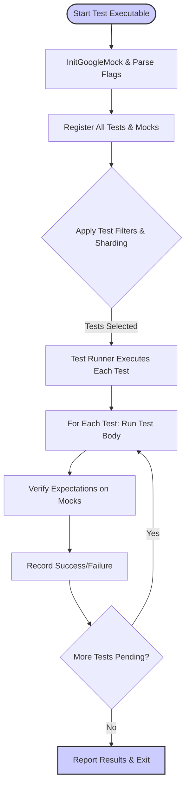

# Test Execution, Performance, and Scalability

GoogleTest and GoogleMock empower C++ developers to write robust, maintainable tests across projects ranging from small modules to large-scale codebases. This guide unpacks how test execution orchestrates within GoogleTest, delving into key features like test discovery, death tests, parallel execution, and performance tactics that ensure fast feedback and smooth scaling.

---

## Test Discovery and Execution Flow

GoogleTest simplifies the test lifecycle by automatically discovering and executing tests based on the registration system initialized during startup.

- **Automatic Registration:** Each test case and mock setup registers itself via static initialization, enabling GoogleTest to know about all tests even before the test executable runs.
- **Initialization:** Calling `testing::InitGoogleMock(&argc, argv)` initializes both GoogleMock and GoogleTest, parsing command-line flags that control test discovery, filtering, verbosity, and execution behavior.
- **Test Runner:** Once initialized, `RUN_ALL_TESTS()` executes all registered tests, tracking success or failure.

This automated orchestration means you can focus on writing tests while GoogleTest manages execution order, including respecting ordering constraints and dependencies you configure.

## Death Tests

GoogleTest provides built-in support for *death tests* — tests that assert your code exits or crashes under certain conditions. These tests help you verify unsafe or failure scenarios explicitly.

- **Isolation:** Death tests run in a subprocess to protect the parent test process from crashes or aborts.
- **Usage:** Use the `EXPECT_EXIT`, `ASSERT_DEATH`, and related macros to write death tests.
- **Considerations:** Since death tests spawn processes, they are inherently slower. It’s best to isolate them and avoid mixing with non-death tests when possible.

Death tests are integral for verifying behavior on fatal errors or signals, enabling confident testing of error handling and crash paths.

## Parallel and Selective Test Execution

To scale testing across large codebases and speed up feedback, GoogleTest supports executing tests in parallel and selectively running test subsets.

- **Test Filtering:** Select tests via command-line filters (e.g., `--gtest_filter=TestSuiteName.TestName`) to run only relevant tests.
- **Sharding:** GoogleTest supports test sharding via environment variables or command-line arguments to split tests across multiple processes or machines.
- **Integration with Build Systems:** Common build tools like Bazel and CMake integrate GoogleTest’s test listing and filtering features to run tests concurrently.

These mechanisms let teams run only what matters for the code change in the fastest way possible, optimizing test cycle times.

## Performance Strategies and Considerations

Maintaining fast feedback is essential for productivity. GoogleTest and GoogleMock provide multiple features and recommended practices:

- **Default Actions:** Setting appropriate default actions (using `ON_CALL`) avoids unnecessary failures and improves test stability.
- **Expectation Ordering:** Use sequences (`InSequence`) and `RetiresOnSaturation()` to properly retire completed expectations, avoiding sticky constraints that could cause failures.
- **Verbose Logging:** Use `--gmock_verbose` levels (`info`, `warning`, `error`) wisely to tune output detail during test runs for debugging without overwhelming logs.
- **Heap Checker:** Enabling heap checkers prevents memory leaks in dynamically allocated mocks, ensuring resource hygiene.
- **Selective Use of NiceMock and StrictMock:**
  - `NiceMock` objects mute warnings on unexpected calls, useful during development.
  - `StrictMock` treats unexpected calls as failures to catch unintended usage.

Follow best practices in mock design, including delegating to fakes or reusing real implementations as needed to balance fidelity and test speed.

## Scaling from Small Modules to Large Codebases

GoogleTest’s flexible design and integration ecosystem makes it suitable for projects of all sizes:

- **Modular Tests:** Tests and mocks can be defined alongside or separately from implementation, allowing incremental onboarding.
- **Mock Classes Reuse:** Define reusable mocks, delegate default behavior to real or fake classes, and manage expectations precisely.
- **Advanced Ordering:** Use complex ordering with `After` and `InSequence` to control test flows without brittleness.
- **Build System Compatibility:** GoogleTest works seamlessly with Bazel, CMake, Makefiles, and continuous integration systems to scale test execution.

Teams can tune verbosity, filtering, and test orchestration to keep tests maintainable, efficient, and informative, regardless of project scale.

## Practical Tips for Maintaining Fast Feedback Cycles

- Write tests with focused expectations, avoiding over-specification that causes brittle tests.
- Use `ON_CALL` to set defaults and `EXPECT_CALL` selectively when verifying interactions.
- Structure tests to limit the side effects and lower setup times.
- Utilize parallel execution and sharding in your CI to minimize total test wall-time.
- Regularly verify and clear mock expectations (`Mock::VerifyAndClearExpectations()`).
- Use `Mock::AllowLeak()` judiciously to handle ownership lifetimes without false leak reports.

## Troubleshooting Common Test Execution Issues

- **Unexpected Calls:** Usually caused by missing or incorrect expectations; using `--gmock_verbose=info` helps trace matching.
- **Excessive Calls:** Occur when a method is called more times than expected; adjust cardinalities or retire expectations early.
- **Uninteresting Calls Warning:** Suppress by adding catch-all expectations or using `NiceMock`.
- **Mock Lifecycles:** Mocks must be deleted properly to trigger verification and avoid leaks; consider heap checking tools.
- **Deadlocks in Multi-threaded Tests:** Follow thread safety guidelines—initialize and set expectations before test run; actions run in calling thread.

---

# Additional Resources

- [gMock Cheat Sheet](../docs/gmock_cheat_sheet.md) — Quick reference on macros and matchers.
- [Mocking Reference](../docs/reference/mocking.md) — Complete details on mocking syntax.
- [gMock Cookbook](../docs/gmock_cook_book.md) — Recipes for advanced mocking and test workflows.
- [Getting Started: Running Tests](../getting-started/first-test-run-validation/running-tests.md) — How to execute and debug tests.
- [Best Practices: Performance](../guides/best-practices/performance.md) — Tactics to improve test speed and reliability.

This guide focuses specifically on understanding how GoogleTest orchestrates test execution and techniques for maintaining performant, scalable test suites. For broader foundational knowledge, consult the Core Concepts and Mocking Basics in the Getting Started section.

---

## Diagram: Typical Test Execution Flow

---