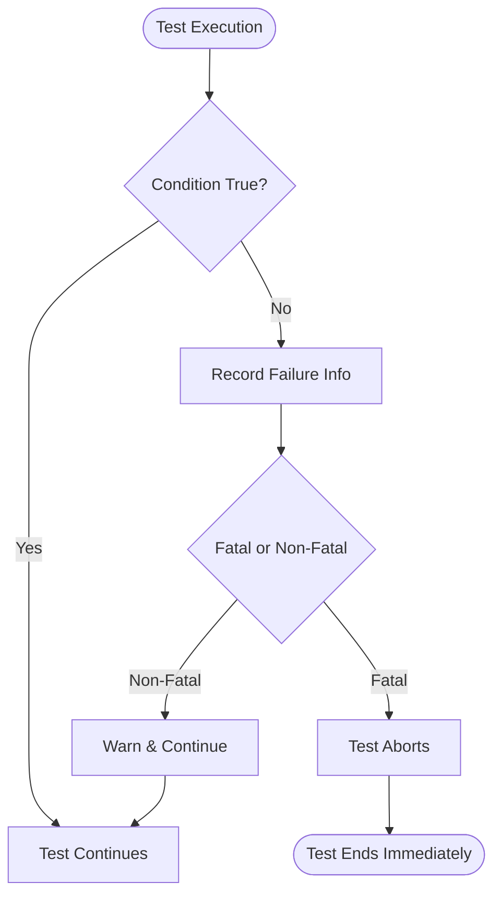

# Assertion Mechanics

## Introduction

Assertions are fundamental to verifying program behavior in tests. Both GoogleTest and GoogleMock utilize a robust assertion infrastructure to check conditions, report failures, and control test flow. Understanding this mechanism helps users interpret test results and write more effective tests.

This page explains how assertion macros operate under the hood, detailing value comparisons, error recording, and handling of fatal and non-fatal failures.

---

## Key Components of Assertion Infrastructure

### 1. Assertion Evaluation

Assertions in GoogleTest and GoogleMock are expressed as macros such as `EXPECT_EQ`, `ASSERT_TRUE`, etc. Each macro represents a condition check between actual and expected values or expressions. When processed by the compiler, these macros expand to calls into core assertion functions that perform the evaluation, generate detailed failure messages, and manage control flow.

### 2. Value Comparison

Comparison assertions require mechanisms to verify if two values meet the specified relation (e.g., equality, inequality, greater than). The framework uses operator overloads or matchers to determine this. If the comparison fails, detailed diagnostics are generated to aid debugging.

### 3. Failure Recording and Reporting

When an assertion fails, GoogleTest records the failure information, which includes:

- Assertion type (fatal vs non-fatal failure)
- File and line number where failure happened
- Human-readable failure message with expected and actual values
- Stack trace (optional, controlled by verbosity settings)

Failures are reported in the test output, and whether the test continues or aborts depends on the assertion type.

### 4. Fatal vs Non-Fatal Failures

- **Fatal failures** (`ASSERT_` macros) immediately abort the current test function, preventing any further code in that function from executing.
- **Non-fatal failures** (`EXPECT_` macros) record failure but allow the test to continue, enabling multiple checks within the same test.

This distinction allows users to decide whether a failure is critical enough to stop the test or if further checks should proceed.

---

## How Assertions Work Under the Hood

Each assertion macro expands into a call to internal functions that:

1. Evaluate the test expression(s).
2. If false, gather information about the values involved.
3. Format a descriptive error message to explain what was expected and what was actually found.
4. Record the failure details into the test framework's internal state.
5. Depending on severity, either continue or abort execution.

This design ensures consistent failure messages and simplifies test debugging across GoogleTest and GoogleMock.

---

## Example: Translating an Assertion Macro

Consider the assertion:

```cpp
EXPECT_EQ(value1, value2);
```

- The macro evaluates whether `value1 == value2`.
- If they are not equal, the framework formats an error message including the actual values and their expressions.
- The failure is recorded as non-fatal, allowing the test to proceed.

Internally, this macro expands to something like:

```cpp
if (!internal::EqHelper(value1, value2)) {
  RecordFailureAt(__FILE__, __LINE__, "Expected equality", value1, value2);
}
```

Similar mechanisms exist for other assertion macros and matcher-based assertions.

---

## Logging and Verbosity

GoogleTest allows controlling how much detail assertion failures report through verbosity flags:

- Stack traces can be included to help pinpoint where failures happened.
- The amount of argument printing (especially in GoogleMock) can be customized.

This helps users balance between noise and diagnostic detail when running large test suites.

---

## Assertion Macros Summary

| Macro Prefix | Behavior                                             |
|--------------|------------------------------------------------------|
| `EXPECT_`    | Records a non-fatal failure and continues test       |
| `ASSERT_`    | Records a fatal failure and aborts current function  |
| `ADD_FAILURE`| Records a non-fatal failure without condition         |
| `FAIL`       | Records a fatal failure immediately                    |
| `SUCCEED`    | Explicitly generates a success (no failure)           |

---

## Practical Tips for Users

- Use `ASSERT_` macros when a failed assertion means the rest of the test function cannot proceed safely.
- Use `EXPECT_` macros when you want to verify multiple things in one test and continue even on failure.
- You can attach custom failure messages for more meaningful diagnostics.
- Understanding assertion failure messages helps in quickly pinpointing issues.
- Refer to the [Assertions Reference](../api-reference/core-apis/test-assertions) for complete assertion macros and examples.

---

## Troubleshooting Assertion Failures

- **Unexpected failures:** Check actual vs expected values printed in the failure messages.
- **Test continues after failure:** Confirm you used `EXPECT_` instead of `ASSERT_` if you intended to abort.
- **Silent failures:** Ensure you are not accidentally swallowing test results or that the test framework is configured correctly.
- **Verbose output:** Use verbosity flags to get more insight during test failures.

---

## Related Topics

Users who want to build a deep understanding of test automation with GoogleTest and GoogleMock should also consult:

- [Assertions Reference](../api-reference/core-apis/test-assertions) — full list of assertion macros.
- [Mocking Reference](../api-reference/core-apis/mocking-core) — integrating assertions in mock object expectations.
- [Using Matchers for Flexible Validation](../guides/core-testing-workflows/using-matchers) — how matchers integrate with assertions.

---

## Summary

The assertion infrastructure is the backbone that provides clear, consistent validation and reporting of test conditions in GoogleTest and GoogleMock. Mastery of this mechanism empowers users to write robust tests capable of precise validation and quick failure diagnosis.


---

### Diagram: Assertion Failure Handling Flow



---

<Info>
For full details on available assertions, their usage patterns, and advanced features such as predicate and death assertions, consult the [Assertions Reference](../api-reference/core-apis/test-assertions).
</Info>

---

## Code Snippet: Writing Custom Failure Messages

```cpp
// A test that checks a complex condition and adds context on failure.
TEST(MyTestSuite, ComplexConditionTest) {
  int actual = ComputeValue();
  int expected = 42;
  EXPECT_EQ(actual, expected) << "ComputeValue() returned unexpected result.";
}
```

This technique enhances failure messages, making troubleshooting more effective.

---

## Best Practices

- Use assertions to express the *contract* of your code under test precisely.
- Prefer non-fatal `EXPECT_` assertions when you want to verify multiple independent conditions.
- Employ fatal `ASSERT_` assertions to guard against invalid test states.
- Attach clear, concise custom messages to assertions to aid future maintainers.
- Leverage verbosity settings during test development and debugging phases.
- Regularly review failure outputs to improve test resilience and specificity.

---

## Troubleshooting Common Issues

<AccordionGroup title="Common Problems with Assertions">
<Accordion title="Test Fails Without Clear Message">
Make sure to provide custom failure messages with the `<<` operator to clarify intent.
</Accordion>
<Accordion title="Test Continues Despite Critical Failure">
Check whether you accidentally used `EXPECT_` instead of `ASSERT_`. Fatal failures stop test functions immediately.
</Accordion>
<Accordion title="Assertion Failure Location Hard to Trace">
Use `--gtest_stack_trace_depth` and `--gmock_verbose` to enable stack trace reporting and detailed logs.
</Accordion>
<Accordion title="Unexpected Assertion Results with Complex Objects">
Ensure that types used in comparisons provide meaningful output via `operator<<` to enable readable failure messages.
</Accordion>
</AccordionGroup>

---

## Summary Table of Assertion Macros

| Macro       | Description                                        | Continues Test? |
|-------------|--------------------------------------------------|-----------------|
| `EXPECT_EQ` | Expect equal, report non-fatal failure            | Yes             |
| `ASSERT_EQ` | Assert equal, report fatal failure and abort       | No              |
| `EXPECT_TRUE` | Expect condition true, non-fatal failure          | Yes             |
| `ASSERT_TRUE` | Assert condition true, fatal failure               | No              |
| `FAIL`      | Immediately generates fatal failure                | No              |
| `ADD_FAILURE` | Generates non-fatal failure without a condition   | Yes             |
| `SUCCEED`   | Generates explicit success mark                    | Yes             |

---

## Final Notes

GoogleTest and GoogleMock's assertion mechanisms are designed for clarity, precision, and flexibility. Whether validating simple values or complex predicates, they provide rich feedback and rigorous control flow management to help ensure the robustness of automated tests.


---