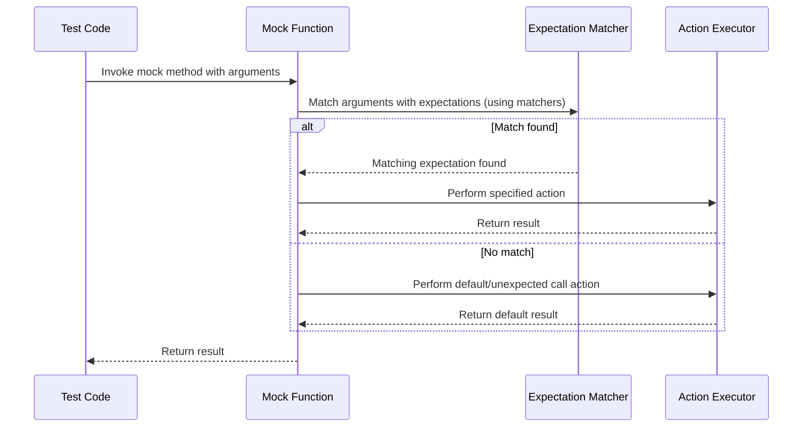

# Matcher & Action Architecture

GoogleTest’s expressive testing capabilities are powered by its flexible and extensible **Matcher** and **Action** systems. Together, these APIs allow you to precisely specify how mocked functions should be called and what they should do in response, making tests both readable and powerful.

---

## Matchers: Validating Function Call Arguments

A *matcher* defines the criteria that arguments to a mocked function must satisfy for a call to be considered a match. Matchers enable flexible, composable validation of argument values beyond simple equality.

### Core Matcher Concepts

- **Match Predicate**: A matcher internally evaluates a predicate on a given argument to decide if it matches.
- **Description**: Matchers provide human-readable descriptions used in failure messages, making them self-explanatory.
- **Polymorphic vs Monomorphic Matchers**: 
  - *Monomorphic* matchers work with a single argument type.
  - *Polymorphic* matchers can adapt to match multiple argument types, such as `Eq(5)`, which matches any numeric type equal to 5.

### Using Matchers

Matchers are used inside `EXPECT_CALL()` or `ON_CALL()` to specify the arguments expected or accepted. For example:

```cpp
using ::testing::Lt;
using ::testing::_;

EXPECT_CALL(mock_object, Method(Lt(5), _));
```

This expects the first argument to be less than 5 and the second to be anything.

### Built-in and Custom Matchers

GoogleTest provides many built-in matchers like:

- `_` (wildcard matcher)
- `Eq()`, `Ne()`, `Lt()`, `Gt()`, etc. for basic comparisons
- `NotNull()`, `Pointee()` for pointer-related validations
- Container matchers like `ElementsAre()`, `UnorderedElementsAre()`

You can also define **custom matchers** with:

- `MATCHER(name, description)` for simple cases
- `MATCHER_P`, `MATCHER_P2`, etc. for parameterized matchers
- Fully custom matcher classes implementing `MatchAndExplain()`, `DescribeTo()`, and `DescribeNegationTo()` for advanced scenarios

### Composing Matchers

Matchers can be combined logically using:

- `AllOf()` to require all conditions
- `AnyOf()` to require at least one condition
- `Not()` to negate a matcher

They can be applied to multiple arguments or nested objects via `With()` clauses or utilities like `Field()` and `Property()`.

---

## Actions: Specifying Mock Method Behavior

An *action* defines what a mock method does when called — whether it returns a value, modifies arguments, throws, calls a callback, or executes custom code.

### Default Action

By default, a mock method returns a suitable default (e.g., 0 for numbers, `false` for bools, or a default-constructed object if available).

You can specify default behavior using `ON_CALL()` with `.WillByDefault()`, and override expected-call behaviors using `EXPECT_CALL()` with `.WillOnce()` or `.WillRepeatedly()`.

### Common Built-in Actions

| Action                      | Description                                         |
|----------------------------|-----------------------------------------------------|
| `Return(value)`             | Return a specified value                             |
| `ReturnRef(variable)`       | Return a reference to a variable                    |
| `ReturnPointee(ptr)`        | Return the value pointed to by a pointer            |
| `ReturnNew<T>(args...)`     | Return a pointer to a dynamically created object    |
| `SetArgPointee<N>(value)`  | Assign a value to the pointed-to `N`-th argument   |
| `DeleteArg<N>()`            | Delete the pointer passed as the `N`-th argument   |
| `Invoke(f)`                 | Call a callable with the mock’s arguments           |
| `InvokeWithoutArgs(f)`      | Call a no-argument callable                          |
| `InvokeArgument<N>(args...)`| Invoke the callable passed as the N-th argument    |
| `DoAll(a1, ..., an)`        | Performs multiple actions in sequence                |
| `IgnoreResult(a)`           | Runs an action, ignores its return value             |

### Defining Custom Actions

You may define actions as:

- Lambdas or functors matching the signature of the mock function
- Legacy `ACTION` macros for simpler cases
- Full action classes implementing `ActionInterface<F>` when more control is needed
- Polymorphic actions usable with multiple function signatures via `MakePolymorphicAction`

Example (lambda action):

```cpp
EXPECT_CALL(mock, DoSomething())
    .WillOnce([](int x) { return x * 42; });
```

### Action Adapters

- `WithArgs<N1,...>`: Adapt a multi-argument mock function to call an action with only selected arguments
- `WithoutArgs()`: Call an action ignoring any arguments
- `WithArg<N>()`: Call an action with a single selected argument

### Sequencing Behavior

You can combine multiple actions in sequences using `WillOnce()` chained calls or `DoAll()`. The former allows different responses on successive calls.

Example:

```cpp
EXPECT_CALL(mock, GetValue())
    .WillOnce(Return(1))
    .WillOnce(Return(2))
    .WillRepeatedly(Return(3));
```

---

## Interplay of Matchers and Actions in Mocks

The typical life cycle of a mock function call involves:

1. Matching call arguments against expectations with matchers.
2. Selecting an action from the matched expectation (or a default action).
3. Performing the action (returning values, side effects).
4. Verifying that all expectations were met upon mock destruction.

Set your expectations clearly with `EXPECT_CALL()`, specifying matchers for arguments and chaining actions for behavior.

Use `ON_CALL()` to specify general fallback behavior without creating call expectations.

---

## Best Practices and Tips

- Prefer `ON_CALL()` for general default behavior, reserving `EXPECT_CALL()` for calls you want to verify.
- Use simple matchers (`_`) liberally to avoid brittle tests.
- Compose matchers when multiple argument properties must be validated jointly.
- Use `InSequence` or `After` clauses to enforce call order when necessary.
- Define custom matchers/actions to improve test intent clarity and reusability.
- Take care to avoid side effects in matchers — they must be purely functional.
- Apply `ReturnPointee()` to return live-updated values, rather than fixed copies.
- Leverage `Invoke()` for calling real functions or delegating default behavior.

---

## Examples

### Simple Expectation with Matcher and Return

```cpp
using ::testing::Return;
using ::testing::_;

EXPECT_CALL(mock_foo, GetSize())
    .WillOnce(Return(5));

EXPECT_CALL(mock_foo, Process(_, 3))
    .WillRepeatedly(Return(true));
```

### Using Composite Matcher

```cpp
using ::testing::AllOf;
using ::testing::Ge;
using ::testing::Le;

EXPECT_CALL(mock, SetValue(AllOf(Ge(10), Le(20))));
```

### Custom Matcher Example

```cpp
MATCHER(IsEven, "is even") { return (arg % 2 == 0); }
EXPECT_CALL(mock, DoSomething(IsEven()));
```

### Chaining Actions

```cpp
EXPECT_CALL(mock, GetNext())
     .WillOnce(Return(1))
     .WillOnce(Return(2))
     .WillRepeatedly(Return(3));
```

### Default Behavior Override with ON_CALL

```cpp
ON_CALL(mock, Compute(_)).WillByDefault(Return(42));
```

---

## Related Topics

- [Matchers Reference](reference/matchers.md) for deep dive into available matchers.
- [Actions Reference](reference/actions.md) for comprehensive actions catalog.
- [Mocking Reference](reference/mocking.md) for full mock usage.
- [gMock for Dummies](guides/getting-started/first-mock-example) for practical beginner guide.
- [gMock Cookbook](docs/gmock_cook_book.md) for advanced patterns and recipes.

---

**Summary diagram of the matcher-action call flow:**



---

This architecture is the cornerstone enabling expressive and maintainable mock-based tests, letting you focus on expressing intent rather than mocking mechanics.
