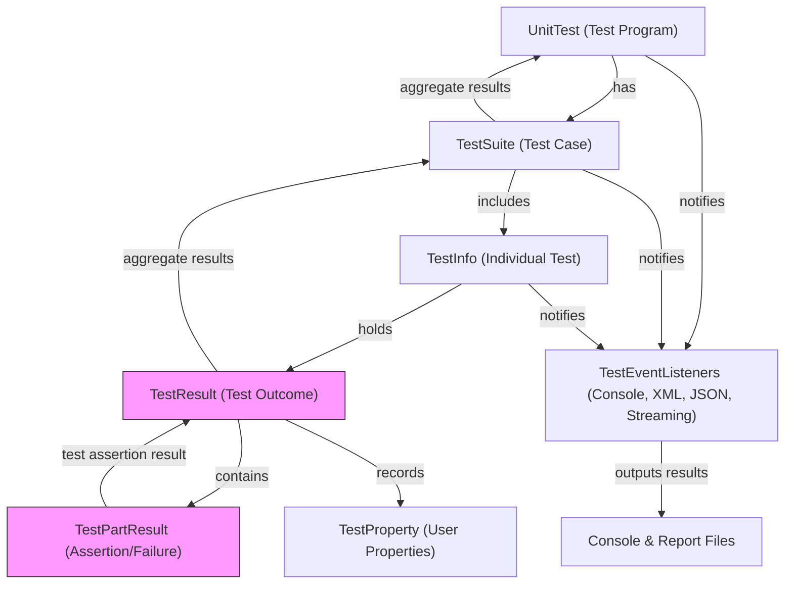

# Test Result & Data Reporting Model

GoogleTest communicates test results and metadata through a meticulously structured data model that supports various output formats like console logs, XML, and JSON reports. This model encapsulates test outcomes, individual failures, execution metadata, and user-provided properties, providing a comprehensive and extensible reporting infrastructure.

---

## Overview

When you run tests using GoogleTest (e.g., via `RUN_ALL_TESTS()`), the framework aggregates results at multiple levels: individual test assertions, tests, test suites, and the entire test program. This data is represented and reported through well-defined objects such as `TestPartResult`, `TestResult`, `TestInfo`, `TestSuite`, and `UnitTest`.

These objects capture success, failure, skipped test information, timings, and detailed failure messages—including file names, line numbers, and stack traces when applicable.


## Key Components of the Reporting Model

### TestPartResult

- Represents the outcome of a test part, typically an assertion or explicit result (`FAIL()`, `SUCCEED()`, `ADD_FAILURE()`).
- Each `TestPartResult` includes:
  - **Type**: Success, non-fatal failure, fatal failure, or skipped.
  - **Source Location**: File name and line number where the assertion occurred.
  - **Message**: Detailed failure message.
  - **Summary**: Extracted concise failure message without stack trace.

This granular unit allows GoogleTest to track the detailed state of each check in test executions.

### TestResult

- Aggregates all `TestPartResult` objects for a single test.
- Captures additional details such as:
  - Elapsed execution time.
  - Start timestamp (milliseconds since UNIX epoch).
  - User-recorded properties (key-value pairs) that provide extensible metadata.
  - Count of death tests inside the test.
- Provides functions to query if the test passed, skipped, or failed, and whether it contains fatal or non-fatal failures.

### TestInfo

- Represents an individual test within a suite.
- Holds:
  - Test suite name and individual test name.
  - Parameter types/names for parameterized or typed tests.
  - Source file and line number.
  - Flags such as whether the test should run or is disabled.
  - A `TestResult` object capturing the test’s outcome.

### TestSuite

- Represents a collection of tests grouped logically (previously “TestCase”).
- Aggregates the results of all tests it contains.
- Maintains:
  - Suite name and optional parameterization type.
  - Counts of passed, skipped, failed, and disabled tests.
  - Start timestamp and elapsed time.
  - Ad-hoc test results for setup/teardown failures outside individual tests.

### UnitTest

- Singleton representing the entire test program.
- Holds all `TestSuite` objects.
- Tracks aggregate statistics across all suites and tests, including counts of passed, failed, skipped, and disabled tests/suites.
- Provides access to event listeners and coordinates execution and result reporting including repeat runs, sharding, filtering, and output formatting.

---

## Reporting Flows and Data Aggregation

1. **During Test Execution:**
    - Each assertion generates a `TestPartResult` (success, failure, skip).
    - These are appended to the current `TestResult` for the running test.
    - The `TestInfo` object stores this `TestResult`.

2. **Per Test:**
    - `TestInfo::Run()` handles creation and invocation of the test object.
    - Timing and start timestamp are recorded.
    - Upon test completion, failures, skips, and successes are fixed in `TestResult`.

3. **Per Test Suite:**
    - The `TestSuite` collects all `TestInfo` objects.
    - Aggregates test counts of passes, failures, skips, and disabled.
    - Records setup/teardown failures separately in `ad_hoc_test_result_`.

4. **Global Aggregation:**
    - `UnitTest` retains all suites and collates their results.
    - Total counts, elapsed time, and other metadata are calculated.

5. **Output:**
    - Listeners (e.g., `PrettyUnitTestResultPrinter`, `XmlUnitTestResultPrinter`) subscribe to test lifecycle events and log formatted results.
    - XML or JSON reporters generate well-structured machine-readable output containing test, suite, and assertion-level details.

---

## User-Visible Data & Property Recording

GoogleTest offers a way to record user-defined properties (key-value pairs) attached to tests, test suites, or globally:

- When invoked within a test, properties are attached to that test’s `TestResult` and appear as attributes in the `<testcase>` XML element.
- When invoked during a test suite setup/teardown, properties attach to the `TestSuite`'s ad-hoc results and appear in the `<testsuite>` element.
- When invoked outside tests or suites (e.g., global environment), properties apply globally to the `<testsuites>` element.

Attempting to use reserved keys (e.g., `name`, `file`, `time`) triggers a non-fatal failure.


## Skipped Tests Handling

- Tests or parts of tests can be marked as skipped.
- Skipped results are distinct from failures and successes.
- `TestPartResult` keeps skipped status.
- `TestResult::Skipped()` returns true if a test has skip results but no failure.

---

## Example: Inspecting Test Results Programmatically

After running tests, you can access outcome details programmatically for customized reporting or further inspection:

```cpp
UnitTest& unit_test = *UnitTest::GetInstance();
for (int i = 0; i < unit_test.total_test_suite_count(); ++i) {
  const TestSuite* test_suite = unit_test.GetTestSuite(i);
  for (int j = 0; j < test_suite->total_test_count(); ++j) {
    const TestInfo* test_info = test_suite->GetTestInfo(j);
    const TestResult* result = test_info->result();

    if (result->Failed()) {
      std::cout << "Test Failed: " << test_suite->name() << "." << test_info->name() << "\n";

      for (int k = 0; k < result->total_part_count(); ++k) {
        const TestPartResult& part = result->GetTestPartResult(k);
        if (part.failed()) {
          std::cout << "  Failure at " << part.file_name() << ":" << part.line_number() << " - " << part.message() << "\n";
        }
      }
    }
  }
}
```

---

## Reporting Output Formats Supported

- **Console text output:** Summarizes tests run, showing `[  PASSED  ]` or `[  FAILED  ]` with test names and elapsed time.
- **XML output (`--gtest_output=xml`):** Structured XML file with `<testsuites>`, `<testsuite>`, and `<testcase>` elements, including detailed failure information.
- **JSON output (`--gtest_output=json`):** JSON file with equivalent structure for integration with external tooling.
- **Streaming output:** Via `--gtest_stream_result_to=host:port` sends results to external servers.

### XML & JSON Attributes Examples

Common attributes on `<testcase>`:
- `name`: Test name
- `classname`: Test suite name
- `status`: `run` or `notrun`
- `result`: `completed`, `skipped`, or `suppressed`
- `time`: Elapsed test time
- `timestamp`: Start time in ISO 8601 or RFC3339 format

Failure elements include message and full failure details including stack traces.

---

## Best Practices & Tips

- **Use `RecordProperty()` to enrich test results** with key-value pairs for additional context.
- Track failures and skips distinctly to better understand test conditions.
- Use GoogleTest event listeners for customized reporting or output.
- Exploit the user-friendly APIs to inspect and process test results programmatically.
- Keep in mind reserved property keys to avoid silent issues.

---

## Troubleshooting Common Issues

- Ensure tests are properly filtered and included to appear in reports.
- Verify no conflicts between `disabled` and `also_run_disabled_tests` flag affecting `should_run()` behavior.
- When using parameterized or typed tests, check that they are correctly instantiated to appear in reports.
- For output formatting issues, confirm correct usage of `--gtest_output` flag and file/directory paths.

---

## Additional Resources

For a deeper understanding and to build on this data model for custom workflows, explore:

- [UnitTest Class Overview](https://github.com/google/googletest/blob/main/docs/reference/testing.md#unittest)
- [TestResult and TestPartResult Classes](https://github.com/google/googletest/blob/main/docs/reference/testing.md#testresult)
- [TestEventListener Interface](https://github.com/google/googletest/blob/main/docs/reference/testing.md#testeventlistener)
- [XML Output Format Internals](https://github.com/google/googletest/blob/main/googletest/src/gtest.cc) (search for `XmlUnitTestResultPrinter`)


---

This model lays the foundation for GoogleTest’s robust and flexible reporting that integrates with CI pipelines, IDEs, and tools for test analysis.

---

# Diagram: Test Result Reporting Flowchart



---
