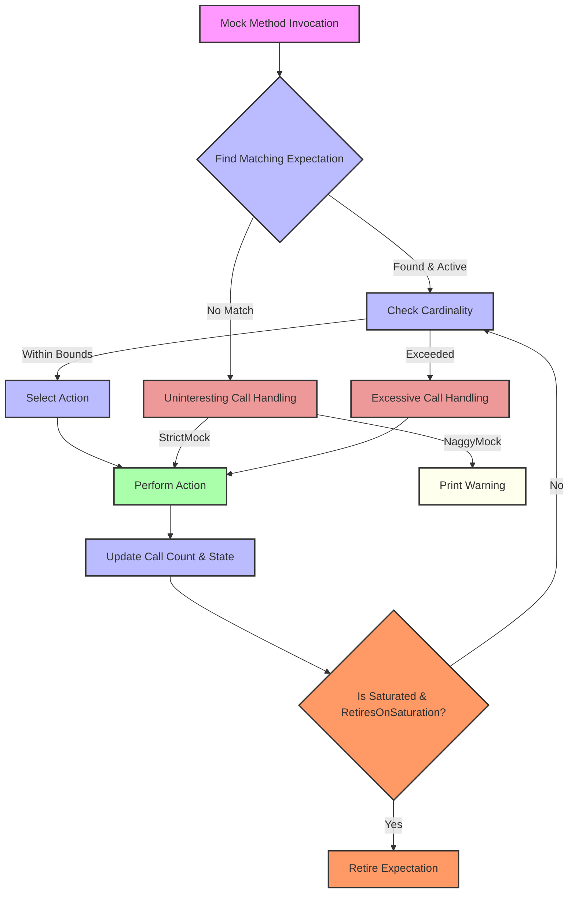

# Core Components and Their Interaction

Explore the essential components that empower GoogleMock to define expectations, validate behavior, and automate testing through powerful abstractions like matchers, actions, and cardinalities. This guide breaks down their individual roles and unpacks how they collaborate seamlessly to bring clarity and control in your testing workflows.

---

## 1. Matchers: Defining What Arguments Are Expected

Matchers serve as predicates that precisely specify the conditions under which mock methods should respond to calls. They control how arguments passed into a mock method are evaluated for an expectation or default behavior.

### What is a Matcher?
A matcher expresses the criteria that a particular argument should meet. Rather than hardcoding explicit values, matchers allow flexible and expressive testing of function parameters.

```cpp
// Expects turtle moves forward exactly 100 units
EXPECT_CALL(turtle, Forward(100));

// Using a matcher to expect any number greater or equal to 100
EXPECT_CALL(turtle, Forward(Ge(100)));

// Wildcard matcher matches any argument
EXPECT_CALL(turtle, GoTo(_, _));
```

### Compound Matching
Matchers can be combined for complex validation, for example, enforcing relationships between multiple arguments using `.With()`:

```cpp
// Expects the first argument less than the second argument
EXPECT_CALL(mock, SetPosition(_, _)).With(Lt());
```

### Overloaded Methods and Matchers
For overloaded methods, using explicit matchers for arguments ensures the correct overload is expected. Omitting parameters can cause ambiguity.

---

## 2. Actions: Specifying What Happens When Calls Are Made

While matchers constrain *when* a mock method reacts to a call, **actions** specify *how* the mock method should behave in response.

### Default Actions via `ON_CALL`
Use `ON_CALL()` to provide default behaviors for mock methods when they are called without specific expectations:

```cpp
ON_CALL(my_mock, Greet())
    .WillByDefault(Return("hello"));
```

If no matching `EXPECT_CALL` applies, `ON_CALL`'s behavior is used.

### Defining Expected Behavior with `EXPECT_CALL`
Within expectations, actions fully describe the function's behavior:

- `.WillOnce()` defines the action for one-time calls.
- `.WillRepeatedly()` defines repeated call behavior after `.WillOnce()`s are exhausted.

Example:

```cpp
EXPECT_CALL(turtle, GetX())
    .WillOnce(Return(100))
    .WillOnce(Return(200))
    .WillRepeatedly(Return(300));
```

This specifies return values for the first two calls and a repeated return for subsequent calls.

### Customizing Actions
Actions can be anything from returning values (`Return()`, `ReturnRef()`), invoking callbacks (`Invoke()`), modifying arguments (`SetArgPointee()`), to chaining multiple actions (`DoAll()`). Lambdas and functors can also be used to define complex behaviors.

---

## 3. Cardinalities: Controlling How Many Times Calls Are Expected

Cardinalities define quantitative expectations regarding how many times a mock method call with specific arguments should occur.

### Built-in Cardinalities
GoogleMock provides flexible cardinality specifications:

| Cardinality          | Meaning                                         |
|---------------------|------------------------------------------------|
| `AnyNumber()`        | Called any number of times                       |
| `AtLeast(n)`         | Called at least _n_ times                        |
| `AtMost(n)`          | Called at most _n_ times                         |
| `Between(m, n)`      | Called between _m_ and _n_ times (inclusive)   |
| `Exactly(n)` or `n`  | Called exactly _n_ times                         |

### Inferring Cardinality
If you omit `.Times()`, gMock infers cardinality based on actions:

- No `WillOnce` or `WillRepeatedly`: Cardinality = `Exactly(1)`
- `n` `WillOnce` clauses and no `WillRepeatedly`: Cardinality = `Exactly(n)`
- `n` `WillOnce` clauses with one `WillRepeatedly`: Cardinality = `AtLeast(n)`

### Disallowing Calls
A cardinality of 0 (`Times(0)`) means the call must never happen, and any actual call will trigger a test failure.

---

## 4. Expectations and Their Ordering

Expectations set on mocks capture the calls you expect to happen during the test execution.

### Sticky Expectations
Expectations remain "sticky" by default, meaning they are always active even after the number of calls reaches the upper bound, causing errors on excessive calls unless explicitly retired.

### Retiring Expectations
Use `.RetiresOnSaturation()` to make expectations inactive once their call count saturates, preventing excessive call errors:

```cpp
EXPECT_CALL(mock, Func()).Times(2).RetiresOnSaturation();
```

### Ordered Calls with Sequences
`InSequence` and `Sequence` objects allow enforcing the order of expectations:

```cpp
{
  InSequence s;
  EXPECT_CALL(mock, FirstCall());
  EXPECT_CALL(mock, SecondCall());
}
```

The calls must occur exactly in the declared order.

### Partial Ordering with `After` Clause
You can specify that one expectation should only be matched after another has been satisfied:

```cpp
Expectation e1 = EXPECT_CALL(mock, Init());
EXPECT_CALL(mock, Work()).After(e1);
```

---

## 5. Uninteresting, Unexpected, and Excessive Calls

Understanding call types and GoogleMock's responses prevents many common test pitfalls.

| Call Type       | Behavior                                                                                       |
|-----------------|-----------------------------------------------------------------------------------------------|
| **Uninteresting** | A method call with no expectation is neither expected nor explicitly disallowed. Causes warnings unless suppressed by `NiceMock`. |
| **Unexpected**    | A method call with expectations but no matching expectation for the given arguments. Triggers test failures.                     |
| **Excessive**     | A call to a method exceeding the expected call count. Triggers test failures.                                        |

### Mock Modes
- **NaggyMock (default):** Warns on uninteresting calls.
- **NiceMock:** Silences uninteresting call warnings.
- **StrictMock:** Treats uninteresting calls as test failures.

---

## 6. Working Flow of Components

When a mock method is called, GoogleMock follows a structured process:

1. **Match Call to Expectations:** Searching from the newest to oldest, it finds the first matching active expectation based on its matchers and conditions.
2. **Evaluate Cardinality:** Checks if the call count exceeds the allowed number of invocations (considering sticky or retired expectations).
3. **Select Action:** Takes the action defined by the expectation (`WillOnce`, `WillRepeatedly`, or `ON_CALL` default action).
4. **Perform Action:** Executes the specified behavior, such as returning a value, invoking a callback, or even calling a parent class method.
5. **Update Expectation State:** Increments call count, retires the expectation if it is saturated and `.RetiresOnSaturation()` is set.
6. **Report Warnings or Failures:** Depending on the call type and mock mode, issues warnings, logs traces, or fails the test immediately.

---

## 7. Practical Tips and Best Practices

- **Use Matchers Judiciously:** Declare only necessary argument constraints to avoid brittle tests.
- **Prefer `ON_CALL` for Defaults:** Use `ON_CALL` to set common default behaviors, reserving `EXPECT_CALL` for specific verified interactions.
- **Handle Overloaded Methods with Care:** Always specify argument matchers for overloaded mocks to avoid ambiguity.
- **Control Expectation Stickiness:** Use `.RetiresOnSaturation()` in sequences or when multiple calls are expected to avoid confusing excessive call errors.
- **Use `NiceMock` to Silence Noise:** When uninteresting calls are acceptable and non-failures, employ `NiceMock<T>` for calmer test outputs.
- **Utilize `Sequence` and `After` for Ordering:** Explicitly specify call ordering where needed to verify interaction sequences.

---

## 8. Component Interaction Diagram



---

# Troubleshooting Common Issues

### Why Is My Expectation Not Matched?
- Confirm the argument matchers align with actual calls.
- Use `--gmock_verbose=info` to trace matcher evaluations and mock invocations.

### Why Do I Get Excessive Call Errors?
- Verify `.Times()` or inferred cardinalities.
- Consider adding `.RetiresOnSaturation()` or sequencing calls with `InSequence`.

### Uninteresting Call Warnings Are Noisy
- Use `NiceMock` or `.Times(AnyNumber())` for calls you want to ignore.

### Ambiguous Overloads
- Specify arguments explicitly with matchers for overloaded methods.

### Mock Destructor Not Virtual
- Always ensure the base class has a virtual destructor to avoid memory leaks.

---

# Summary

Understanding the interplay between matchers, actions, and cardinalities empowers you to write precise and expressive expectations. These core components collaborate dynamically to match calls accurately, define behaviors flexibly, and enforce call count and ordering constraints robustly.

Harnessing these constructs effectively enables powerful, maintainable, and reliable unit tests using GoogleMock.

---

# Related Documentation

- [gMock Cookbook](https://google.github.io/googletest/gmock_cook_book.html) — recipes for mocking strategies and patterns.
- [Mocking Reference](https://google.github.io/googletest/reference/mocking.html) — formal reference on mocking macros and classes.
- [Matchers Reference](https://google.github.io/googletest/reference/matchers.html) — detailed matcher information.
- [Actions Reference](https://google.github.io/googletest/reference/actions.html) — action types and usage.
- [Expectations and Sequences](https://google.github.io/googletest/reference/mocking-apis/expectations-sequences.html) — ordering and cardinalities explained.

---