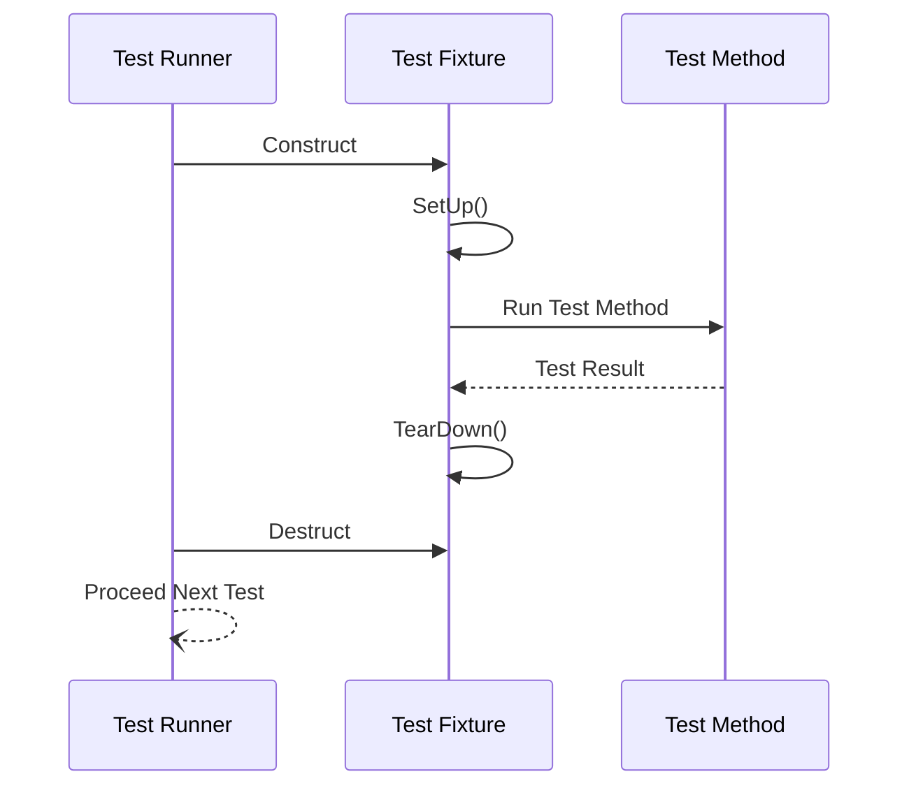

# The xUnit Model and Test Lifecycle

GoogleTest implements a robust and extensible xUnit testing paradigm tailored for C++ development. This guide explains how the xUnit model is realized in GoogleTest, covering how tests and test fixtures are defined, how setup and teardown phases ensure test isolation, and how the overall lifecycle promotes consistent, maintainable, and reliable testing.

---

## Introduction to the xUnit Model in GoogleTest

At its core, GoogleTest follows the classical xUnit architecture, familiar from JUnit and other unit testing frameworks. Every test is part of a suite (often called a test case) grouping logically related tests. Test fixtures provide a way to share common setup and cleanup among those tests.

This design ensures:

- **Isolation:** Each test runs independently with a fresh environment.
- **Repeatability:** Tests can be run repeatedly without side effects.
- **Maintainability:** Grouping and fixtures encourage organized test code.

## Test Case and Test Fixture Definition

### Defining Tests

Tests are defined using macros:

- `TEST(TestSuiteName, TestName)` – a simple stateless test.
- `TEST_F(TestFixtureClass, TestName)` – a test using a test fixture.

**Example:**
```cpp
TEST(MathTest, SimpleAddition) {
  EXPECT_EQ(1 + 1, 2);
}

class StackTest : public testing::Test {
protected:
  void SetUp() override {
    stack_.push(42);
  }
  std::stack<int> stack_;
};

TEST_F(StackTest, TopIs42) {
  EXPECT_EQ(stack_.top(), 42);
}
```

The `TEST_F` macro lets tests share an instance of a fixture class which provides common setup/teardown.

### The Role of Test Fixtures

Test fixtures are C++ classes that inherit from `testing::Test` and provide:

- **SetUp():** Initialization before each test.
- **TearDown():** Cleanup after each test.
- Any member variables or helper methods shared by tests.

This object-oriented approach allows multiple related tests to reuse expensive initialization and offers an intuitive organization for complex testing scenarios.

## Test Setup and Teardown Lifecycle

Each test execution follows a strict lifecycle for consistency and safety:

<Steps>
  <Step title="Test Fixture Construction">
    GoogleTest instantiates a new fixture object for the test.
  </Step>
  <Step title="SetUp() Method Call">
    The test environment is prepared, allocating resources and setting initial conditions.
  </Step>
  <Step title="Test Method Execution">
    The test function body runs, performing assertions.
  </Step>
  <Step title="TearDown() Method Call">
    Resources created in SetUp() or the test are released.
  </Step>
  <Step title="Test Fixture Destruction">
    The test fixture object is destructed, finalizing cleanup.
  </Step>
</Steps>

This lifecycle guarantees that tests do not interfere and that side effects are minimized.

<Tip>
When designing tests, always ensure your SetUp() and TearDown() manage resource lifetimes carefully to avoid leaks or cascading failures.
</Tip>

## Test Discovery and Execution Flow

GoogleTest automatically discovers all tests defined via the `TEST()` or `TEST_F()` macros before execution. When you invoke `RUN_ALL_TESTS()`, GoogleTest:

1. Enumerates all registered tests.
2. Filters tests based on command-line flags specified (e.g., `--gtest_filter`).
3. For each selected test:
   - Constructs its fixture.
   - Calls `SetUp()`.
   - Runs the test method.
   - Calls `TearDown()`.
   - Destructs the fixture.
4. Reports success or failure with detailed output.

This sequence is automatic and requires no manual intervention.

## How the xUnit Model Promotes Consistency and Maintainability

By adhering to the xUnit lifecycle:

- **Consistent Initialization:** Code in SetUp() is always executed before tests, ensuring known starting states.
- **Repeatable Tests:** Tests run with independent fixtures.
- **Clear Test Organization:** Logical grouping via test suites and fixtures reflects code structure.
- **Easy Debugging:** Failures localize to individual tests.

These aspects reduce flaky tests and make scaling large test suites manageable.

## Practical Example: Writing a Test Fixture

Consider you are testing a `DatabaseConnection` class. You want each test to start with a fresh connection and close it afterwards.

```cpp
class DatabaseTest : public testing::Test {
protected:
  void SetUp() override {
    db_.open("test_db");
  }

  void TearDown() override {
    db_.close();
  }

  DatabaseConnection db_;
};

TEST_F(DatabaseTest, CanInsertRecord) {
  EXPECT_TRUE(db_.insertRecord("foo", 123));
}

TEST_F(DatabaseTest, CanDeleteRecord) {
  db_.insertRecord("bar", 456);
  EXPECT_TRUE(db_.deleteRecord("bar"));
}
```

In these tests, you achieve:
- Automatic opening and closing of the database for each test
- Independent, isolated test executions

## Tips and Best Practices

- **Use Test Fixtures for Shared Context:** Avoid repeating setup code by using fixtures.
- **Keep Tests Independent:** Do not share state between tests; fixtures are reconstructed for every test.
- **Match Fixture Naming with Test Suites:** Use meaningful names to clarify purpose.
- **Avoid Heavy Operations in the Constructor:** Prefer overriding `SetUp()` and `TearDown()` for better control and error reporting.
- **Use `TEST_F()` for Tests That Need Fixtures:** Reserve `TEST()` for small, stateless tests.

## Common Pitfalls and Troubleshooting

<AccordionGroup title="Common Issues in Test Lifecycle">
<Accordion title="Forgotten SetUp() or TearDown() Override">
Ensure your fixture class overrides the `SetUp()` and `TearDown()` methods exactly, or they won't be called.
</Accordion>
<Accordion title="Sharing State Between Tests">
Avoid sharing mutable state between tests unless managed carefully via static/global objects or external fixtures, as test runs may interfere.
</Accordion>
<Accordion title="Assuming Fixture Persistence Across Tests">
Remember that each `TEST_F()` runs on a fresh fixture object. Do not assume any member variables retain values across tests.
</Accordion>
<Accordion title="Errors in Fixture Constructor or Destructor">
Heavy work or assertions in fixture constructors/destructors can cause unreported failures; prefer to put such logic in `SetUp()` and `TearDown()`.
</Accordion>
</AccordionGroup>

## Visualizing the Test Lifecycle



This sequence diagram captures the repeated lifecycle for each individual test.

## Summary

The xUnit testing model as implemented in GoogleTest is a battle-tested, consistent framework enabling users to produce reliable and maintainable C++ test suites. By defining tests and fixtures, specifying setup and teardown routines, and leveraging automatic test discovery and sequencing, GoogleTest abstracts away boilerplate and allows users to focus on crafting meaningful tests.

---

For further learning, explore [Test Cases and Fixtures](/api-reference/core-test-api/test-case-structures), [Test Execution and Lifecycle](/api-reference/core-test-api/test-lifecycle), and conceptual architecture insights in [Test Discovery, Registration, and Execution](/concepts/framework-architecture/test-discovery-execution).

-----

# Additional Resources

- [GoogleTest Primer](../overview/welcome-introduction/what-is-googletest)
- [Writing & Running Your First Test](../../guides/getting-started/first-test)
- [Best Practices for Reliable and Maintainable Tests](../../guides/real-world-practices/best-practices)

<Check>
GoogleTest’s xUnit model guarantees isolated, repeatable tests by constructing a fresh test fixture for each test, invoking user-defined setup and teardown methods, running the test code, and cleaning up. Use test fixtures whenever tests share setup to ensure maintainability.
</Check>
