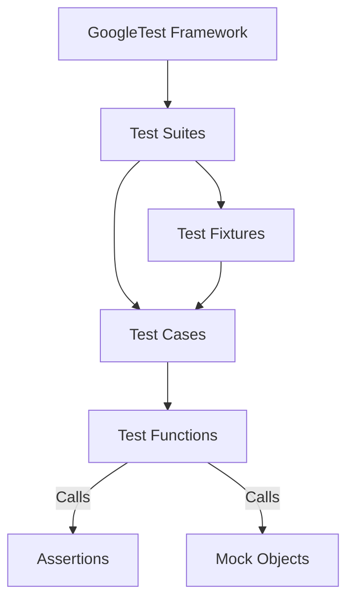

# xUnit Design and Test Organization

GoogleTest is built on the well-established xUnit testing architecture, providing a powerful and flexible model for writing, organizing, and running automated tests in C++. Understanding the xUnit design within GoogleTest is key to mastering test discovery, execution, and reporting, enabling scalable test suites that grow with your project.

---

## The xUnit Architecture in GoogleTest

At its core, GoogleTest adopts the classical xUnit structure familiar to developers from frameworks like JUnit and NUnit, incorporating the concepts of **test cases**, **test suites**, and **test fixtures**. This architecture balances simplicity with extensibility, making it straightforward to write focused tests while supporting complex test scenarios.

### Test Cases and Test Suites

- **Test Case (Test Suite)**: In GoogleTest terminology, a test case or test suite groups a collection of related **test functions** (test methods). Typically, a test case corresponds to a unit or component of your system under test. Grouping related tests together simplifies navigation and execution.
- **Individual Tests**: Each test is a discrete function that contains specific assertions and exercises part of the component's behavior.

For example, you might have a test suite named `StackTest` consisting of multiple tests that verify different stack operations:

```cpp
TEST(StackTest, PushIncreasesSize) {
  Stack s;
  s.Push(42);
  EXPECT_EQ(s.Size(), 1);
}

TEST(StackTest, PopReturnsLastPushedElement) {
  Stack s;
  s.Push(1);
  s.Push(2);
  EXPECT_EQ(s.Pop(), 2);
}
```

Here, `StackTest` is the test suite grouping tests `PushIncreasesSize` and `PopReturnsLastPushedElement`.

### Test Fixtures (`TEST_F`)

Test fixtures extend this grouping by allowing shared setup and teardown logic for a suite of tests. Declared using the `TEST_F` macro, a fixture class encapsulates common resources (like objects or configurations) to initialize before each test and clean up afterward.

Example:

```cpp
class StackTest : public testing::Test {
 protected:
  void SetUp() override {
    stack_.Push(10);
  }

  Stack stack_;
};

TEST_F(StackTest, IsNotEmptyAfterPush) {
  EXPECT_FALSE(stack_.IsEmpty());
}

TEST_F(StackTest, ReturnsCorrectTopElement) {
  EXPECT_EQ(stack_.Top(), 10);
}
```

This pattern avoids duplication and improves maintainability by centralizing shared preparation logic.

### Test Execution Flow

GoogleTest controls the discovery and execution of tests as follows:

1. **Test Discovery:** Upon initialization (usually through `RUN_ALL_TESTS()` macro), GoogleTest locates all defined test cases and tests compiled into the binary.
2. **Test Registration:** Each test is registered with its case and fixture if any.
3. **Execution:** GoogleTest runs tests in an order aligned with its configuration (can be serial or parallel).
4. **Reporting:** Results of each test’s execution, including passed assertions and failures, are reported in a structured format.

### Test Naming and Execution Order

- Test suites and test names must be unique.
- Test execution order is not guaranteed unless explicitly ordered using extensions such as `InSequence`, or by organizing test dependencies.

---

## Interaction Between Tests, Fixtures, and Assertions

GoogleTest tests revolve around user-written assertions, which verify program behavior during execution of a test.

- **Assertions** confirm expected conditions (e.g., equality, inequality, exceptions).
- **Tests** use assertions to capture correctness logic.
- **Fixtures** support tests by establishing and cleaning test state required for assertions to be valid.

This separation clarifies test structure; users focus test logic on the _what_ (assertions and expectations), while fixtures focus on the _how_ (environment setup and tearing down).

---

## User Workflow with xUnit in GoogleTest

The following narrative illustrates how a user typically engages with the xUnit design when writing tests:

1. **Identify a Unit to Test:** For instance, a `Calculator` class.
2. **Group Related Tests:** Create a test suite (`CalculatorTest`) and decide if shared state or initialization is needed.
3. **Create a Fixture if Needed:** If setup is complex, implement a fixture class.
4. **Write Test Methods:** Using `TEST()` or `TEST_F()`, author individual tests encapsulating distinct validation points.
5. **Run Tests:** Use built-in test runners to execute the entire suite or subsets with filters.
6. **Analyze Results:** Review structured test reports highlighting passed, failed, or skipped tests.

---

## Practical Example: Organizing Tests with Fixtures

Suppose you are testing a network connection component which requires setting up a connection before each test and cleaning it up afterward.

```cpp
class ConnectionTest : public testing::Test {
 protected:
  void SetUp() override {
    connection_.Open("server.example.com");
  }

  void TearDown() override {
    connection_.Close();
  }

  Connection connection_;
};

TEST_F(ConnectionTest, ConnectsSuccessfully) {
  EXPECT_TRUE(connection_.IsOpen());
}

TEST_F(ConnectionTest, SendsData) {
  connection_.Send("Hello");
  EXPECT_EQ(connection_.BytesSent(), 5);
}
```

By centralizing connection establishment and teardown, each test remains concise and focused on behavior.

---

## Best Practices and Common Pitfalls

- **Keep Tests Independent:** Avoid interdependence to ensure robustness and ease of debugging.
- **Use Test Fixtures Wisely:** Share only what is necessary to avoid hidden test side effects.
- **Name Tests Descriptively:** Clear naming helps recognize intent and discover failures faster.
- **Avoid Over-Specification:** Don’t assert irrelevant conditions; focus on the behavior being tested.
- **Properly Initialize and Clean Up Resources:** Use fixtures to prevent resource leaks and inconsistent states.

---

## Integration with GoogleMock (Brief Overview)

GoogleTest’s xUnit architecture works harmoniously with GoogleMock for interaction-based testing. Mock classes integrate cleanly into tests and fixtures, empowering verification of function calls and behaviors seamlessly.

---

## Diagram: xUnit Structure in GoogleTest



This high-level diagram captures how GoogleTest organizes tests and integrates fixtures and mocks.

---

## Troubleshooting Tips

- **Tests Not Discovered:** Ensure tests use proper TEST or TEST_F macros and are linked correctly.
- **Fixture Setup Issues:** Confirm all required setup steps complete without errors.
- **Unexpected Test Failures:** Use verbose output or run tests with `--gtest_break_on_failure` to diagnose.
- **Resource Leaks:** Verify TearDown methods release resources to prevent cascade failures.

---

## Related Pages

- **[What is GoogleTest?](../overview/product-intro-value/what-is-googletest.md):** Introduction to the framework
- **[Core Concepts and Terminology](../overview/architecture-core/core-concepts.md):** Definitions setting the foundation for tests
- **[Mocking with GoogleMock](../guides/advanced-testing/mocking-with-googlemock.md):** Working with mocks in tests
- **[Writing Your First Test](../guides/getting-started/writing-your-first-test.md):** A practical introductory tutorial


---

With these insights into the xUnit patterns GoogleTest embraces, you will be equipped to organize your tests efficiently, scale your test suites reliably, and accelerate your path to confident code quality verification.
