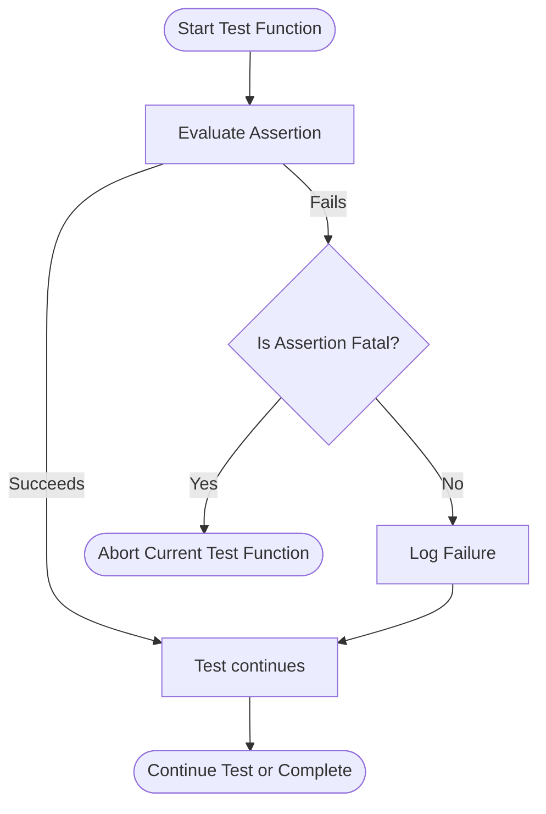

# Assertions and Test Failures

This guide explores the principles behind various types of assertions in GoogleTest, explains how assertion mechanisms impact test outcomes, and clarifies the distinction between fatal and non-fatal failures. Understanding assertions is crucial for writing reliable test suites that verify program correctness effectively.

---

## Understanding Assertions in GoogleTest

Assertions in GoogleTest are the fundamental building blocks that test the correctness of your code. They verify conditions and signal test failures when expectations are not met.

GoogleTest provides a rich set of assertion macros categorized mainly by:

- Behavior on failure: **Fatal** vs. **Non-fatal**
- Condition type: Boolean conditions, comparisons, predicates, exceptions, etc.

### Fatal vs Non-Fatal Failures

- **Fatal Failures (`ASSERT_*` macros)**
  - Abort the current function immediately upon failure.
  - Use when continuing test execution after failure is unsafe or meaningless.

- **Non-Fatal Failures (`EXPECT_*` macros)**
  - Report the failure but allow the test function to continue running.
  - Useful when you want multiple checks in the same test without stopping at the first failure.

### Why Different Behavior Matters

Using fatal assertions ensures that tests do not execute in invalid or undefined states, preventing cascading errors. Non-fatal assertions allow you to gather more information about multiple failures before test termination.

---

## Categories of Assertions

### 1. Explicit Success and Failure

- `SUCCEED()` — generates a success explicitly, useful for documenting that a code path is intentionally executed.
- `FAIL()` — generates a fatal failure, typically used when you want to express an unexpected code path.
- `ADD_FAILURE()` and `ADD_FAILURE_AT(file, line)` — generate non-fatal failures at a specific code location.


### 2. Boolean Condition Assertions

- `EXPECT_TRUE(condition)` / `ASSERT_TRUE(condition)` — verify that a condition is true.
- `EXPECT_FALSE(condition)` / `ASSERT_FALSE(condition)` — verify that a condition is false.

### 3. Binary Comparison Assertions

These verify relationships between two values. They evaluate each argument once and provide informative failure messages if the check fails.

| Assertion | Meaning                                 |
|-----------|-----------------------------------------|
| `EXPECT_EQ(val1, val2)` / `ASSERT_EQ` | Checks `val1 == val2`                 |
| `EXPECT_NE` | Checks `val1 != val2`                    |
| `EXPECT_LT` | Checks `val1 < val2`                     |
| `EXPECT_LE` | Checks `val1 <= val2`                    |
| `EXPECT_GT` | Checks `val1 > val2`                     |
| `EXPECT_GE` | Checks `val1 >= val2`                    |

**Tip:** Use `EXPECT_STREQ` and related macros for comparing C strings by value rather than by pointer.

### 4. String Comparison Assertions

Specialized assertions compare C-style strings (`const char*`, wide strings) by their content, ignoring their memory addresses.

- `EXPECT_STREQ` / `ASSERT_STREQ` — content equality.
- `EXPECT_STRNE` / `ASSERT_STRNE` — content inequality.
- `EXPECT_STRCASEEQ` / `ASSERT_STRCASEEQ` — case-insensitive equality.
- `EXPECT_STRCASENE` / `ASSERT_STRCASENE` — case-insensitive inequality.

### 5. Floating-Point Comparison Assertions

Due to the nature of floating-point arithmetic, exact equality is rare. GoogleTest provides special assertions that verify approximate equality within a tolerance.

- `EXPECT_FLOAT_EQ` / `ASSERT_FLOAT_EQ` — approximate equality for `float`, within 4 ULPs (units in last place).
- `EXPECT_DOUBLE_EQ` / `ASSERT_DOUBLE_EQ` — approximate equality for `double`, within 4 ULPs.
- `EXPECT_NEAR(val1, val2, abs_error)` / `ASSERT_NEAR` — checks if the difference between `val1` and `val2` is less than or equal to `abs_error`.

### 6. Exception Assertions

Verify that certain code throws or does not throw exceptions.

- `EXPECT_THROW(statement, exception_type)` / `ASSERT_THROW` — verifies an exception is thrown of a given type.
- `EXPECT_ANY_THROW(statement)` / `ASSERT_ANY_THROW` — verifies any exception is thrown.
- `EXPECT_NO_THROW(statement)` / `ASSERT_NO_THROW` — verifies no exceptions are thrown.

**Example:**
```cpp
EXPECT_NO_THROW({
  int n = 5;
  DoSomething(&n);
});
```

### 7. Predicate Assertions

Allows testing complex conditions with predicates that accept multiple arguments, offering clearer failure messages.

- `EXPECT_PREDn(pred, val1, val2, ..., valn)` / `ASSERT_PREDn` — verifies that predicate `pred` returns true.
- `EXPECT_PRED_FORMATn(pred_formatter, val1, val2, ..., valn)` / `ASSERT_PRED_FORMATn` — uses a predicate-formatter for custom failure messages.

**Example:**
```cpp
bool MutuallyPrime(int m, int n) { ... }
EXPECT_PRED2(MutuallyPrime, a, b);
```

### 8. Windows HRESULT Assertions

Specifically for Windows COM programming, verifying HRESULT success or failure.

- `EXPECT_HRESULT_SUCCEEDED(expression)` / `ASSERT_HRESULT_SUCCEEDED` 
- `EXPECT_HRESULT_FAILED(expression)` / `ASSERT_HRESULT_FAILED`

### 9. Death Assertions

Verify that code causes the process to terminate.

- `EXPECT_DEATH(statement, matcher)` / `ASSERT_DEATH`
- Variants: `EXPECT_DEATH_IF_SUPPORTED`, `EXPECT_DEBUG_DEATH`, `EXPECT_EXIT`

These run the code in a separate process to detect abnormal termination and verify stderr output.

**Example:**
```cpp
EXPECT_DEATH(DoSomething(42), "My error");
```

---

## How Assertions Shape Test Outcomes

- Assertions control test flow — fatal assertions abort the test function.
- Non-fatal assertions report failure but allow deeper analysis in the test.
- Properly choosing assertion types improves test clarity and debuggability.
- Assertion messages include location, expression values, and failure reasons to aid diagnosis.

---

## Practical Tips and Best Practices

- Prefer non-fatal assertions (`EXPECT_*`) when multiple checks should be performed in a test.
- Use fatal assertions (`ASSERT_*`) when failure makes further test steps invalid.
- Stream custom messages to assertions to provide context:

  ```cpp
  EXPECT_TRUE(ptr != nullptr) << "Pointer 'ptr' must not be null";
  ```

- Use predicate assertions for complex conditions to produce clearer failure messages.
- Use `EXPECT_THROW` family checks to validate exception safety and error handling.
- For floating-point comparisons, avoid `EXPECT_EQ`; use `EXPECT_NEAR` or `EXPECT_FLOAT_EQ`.
- Use death assertions to test conditions that should cause program termination.

---

## Common Failure Scenarios and Troubleshooting

- **Fatal assertion causes premature test exit:** Check the proper use of `EXPECT_` vs `ASSERT_`.
- **Multiple failures hidden behind first failure:** Use non-fatal assertions to surface more failures.
- **Unexpected exceptions:** Use exception assertions to detect.
- **Incorrect floating-point comparisons:** Switch to approximate comparison assertions.
- **Death tests fail unexpectedly:** Ensure process termination behavior matches expectations and platform supports death tests.

---

## Summary Diagram of Assertion Flow



---

## Further Reading and References

- See the [Assertions Reference](docs/reference/assertions.md) for full macro lists and detailed usage.
- Learn about [Writing and Running Tests](api-reference/core-testing-apis/writing-tests.md) to understand how assertions fit in test workflows.
- Explore [GoogleTest Advanced Concepts](concepts/fundamentals/assertion-principles.md) for deeper technical theory.
- Consult the [gMock Cookbook PDF](docs/gmock_cook_book.md) for usage of assertions in mocking scenarios.

---