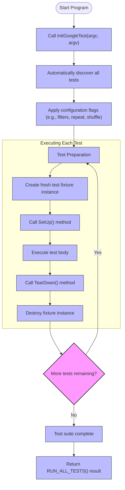

# Test Discovery and Execution Lifecycle

GoogleTest simplifies the process of running C++ tests by automatically discovering tests in your code and managing their execution lifecycle. This page explains how GoogleTest finds tests, the configurable options that govern execution, and the detailed lifecycle each test undergoes from setup through teardown. Understanding this helps you write isolated, reproducible tests and leverage GoogleTest's power to maintain reliable suites.

---

## Automatic Test Discovery

GoogleTest automatically discovers all tests defined in your linked code without any manual registration. By using the `TEST()` and `TEST_F()` macros, each test is registered globally with the GoogleTest framework at static initialization time.

- **Test Suites and Tests:** Tests are logically grouped into test suites (previously called test cases). Each suite contains one or more tests.
- **Global Registration:** Upon program startup, all tests and fixtures declared with macros are registered in a centralized registry.
- **No Manual Enumeration Needed:** You don’t need to list your tests anywhere explicitly; GoogleTest handles discovery automatically.

This automatic discovery allows seamless expansion of test coverage without additional bookkeeping.

<Tip>
Always use the recommended `TEST()` and `TEST_F()` macros to define tests correctly, enabling discovery. Avoid defining tests manually to prevent registration issues.
</Tip>

## Initializing the Test Framework

Before running tests, call `testing::InitGoogleTest(&argc, argv)` in your `main` function. This call:

- Parses GoogleTest-specific command-line flags.
- Removes recognized flags from `argv` so they won’t interfere with your application or other libraries.
- Configures internal data structures based on flags and environment.

You can then call `RUN_ALL_TESTS()` to start execution. For GoogleMock users, `InitGoogleMock()` handles both GoogleMock and GoogleTest initialization.

```cpp
int main(int argc, char **argv) {
  testing::InitGoogleTest(&argc, argv);
  return RUN_ALL_TESTS();
}
```

<Note>
Always call `InitGoogleTest()` before `RUN_ALL_TESTS()`. Skipping initialization results in unrecognized flags and incorrect test behavior.
</Note>

## Configuration Options and Flags

GoogleTest provides a rich suite of command-line flags that allow you to configure the scope and behavior of test discovery and execution. Some key flags include:

- `--gtest_filter=` — Select which tests to run via wildcard patterns (e.g., `MySuite.*` or `*-MySuite.SkipThisTest`).
- `--gtest_repeat=` — Run the whole test suite multiple times to catch flaky tests.
- `--gtest_shuffle` — Execute tests in random order to detect unintended dependencies.
- `--gtest_break_on_failure` — Halt execution immediately on first assertion failure.
- `--gtest_output=` — Choose output format (e.g., XML) for integration with CI pipelines.

These options affect test discovery and execution order, helping you isolate failures and integrate tests efficiently.

<Tip>
Use `--gtest_filter` to run individual or subsets of tests, which improves debugging speed and reduces test time during development.
</Tip>

## The Test Execution Lifecycle

Each test follows a well-defined execution flow to guarantee test isolation and consistent setup/cleanup.

<Steps>
<Step title="Test Fixture Creation">
For tests using a fixture (`TEST_F`), GoogleTest creates a fresh instance of the fixture class for every test method executed.
</Step>
<Step title="SetUp() Method Invocation">
GoogleTest calls `SetUp()` on the fixture instance to initialize common test data or resources.
</Step>
<Step title="Test Method Execution">
The actual test body runs, executing assertions to verify behavior.
</Step>
<Step title="TearDown() Method Invocation">
`TearDown()` executes to clean up resources allocated during the test.
</Step>
<Step title="Fixture Destruction">
Finally, the fixture instance is destroyed, ensuring no state carries over between tests.
</Step>
</Steps>

This rigorous lifecycle guarantees that tests are isolated and repeatable.

<Note>
GoogleTest intentionally creates and destroys a new fixture object for each test — shared state between tests is not preserved.
</Note>

## Test Discovery and Execution Flowchart



## Handling Test Isolation and Reproducibility

Because each test runs in a fresh environment, GoogleTest ensures:

- **No side-effects across tests:** Fixture destruction resets state.
- **Consistent initial conditions:** Setup always starts the same.
- **Reproducibility:** Tests don’t have hidden dependencies on previous tests.

To verify isolation:

- Use the `--gtest_repeat` flag to run tests multiple times.
- Use `--gtest_shuffle` to randomize test order.

Both help catch dependencies and setup omissions early.

## Practical User Flow Example

Imagine you have the following test suite:

```cpp
TEST_F(DatabaseTest, ConnectsSuccessfully) {
  ASSERT_TRUE(db.Connect());
}

TEST_F(DatabaseTest, ReturnsExpectedData) {
  db.Connect();
  auto data = db.Query("SELECT * FROM users");
  EXPECT_EQ(data.size(), 3);
}
```

When you run your test binary:

1. `InitGoogleTest` processes flags like `--gtest_filter=DatabaseTest.*`.
2. GoogleTest locates both tests in the `DatabaseTest` suite.
3. For `ConnectsSuccessfully`:
   - Creates a fresh `DatabaseTest` instance.
   - Calls `SetUp()` (if defined).
   - Runs the test body.
   - Calls `TearDown()`.
   - Destroys the instance.
4. For `ReturnsExpectedData`, the same lifecycle repeats with a new fixture.

Through this process, each test is guaranteed a clean slate.

## Common Pitfalls and Troubleshooting

<AccordionGroup title="Common Issues and Their Solutions">
<Accordion title="Tests Not Being Discovered">
- Ensure `TEST()` or `TEST_F()` macros are properly used.
- Confirm the test source files are linked into the test binary.
- Check that initialization `InitGoogleTest()` is called properly.
</Accordion>
<Accordion title="Flags Not Taking Effect">
- Verify flags are passed before the test binary executes.
- Run with `--help` to confirm flag parsing.
- Confirm no conflicting frameworks or flag parsers are interfering.
</Accordion>
<Accordion title="Test Failures Due to Shared State">
- Confirm tests do not rely on static or global mutable state.
- Use fixtures and proper setup/teardown.
- Use `--gtest_shuffle` and `--gtest_repeat` to catch flaky interdependencies.
</Accordion>
</AccordionGroup>

## Summary

GoogleTest’s automatic test discovery and comprehensive lifecycle management empower you to write well-structured, isolated, and reproducible tests without tedious manual configuration. By understanding how tests are found, configured, and executed, you can debug failures faster and structure your suites for maximum clarity and reliability.

---

## Additional Resources

- [Getting Started: Writing Your First Test](https://github.com/google/googletest/tree/main/docs/guides/core-workflows/getting-started)
- [Core Concepts & Terminology](https://github.com/google/googletest/tree/main/docs/overview/product-intro-core-concepts/core-concepts-terminology)
- [Assertions Reference](https://github.com/google/googletest/tree/main/docs/api-reference/core-testing-apis/assertions)
- [Mock Objects and Expectations Guide](https://github.com/google/googletest/tree/main/docs/guides/mocking-and-advanced-testing/mock-objects)
- [Command Line Flags Documentation](https://github.com/google/googletest/blob/main/googletest/docs/API.md#command-line-options)

---

## See Also

- [Test Fixtures and Shared Setup](https://github.com/google/googletest/tree/main/docs/guides/core-workflows/getting-started#test-fixtures-using-the-same-data-configuration-for-multiple-tests)
- [Writing and Running Tests](https://github.com/google/googletest/tree/main/docs/api-reference/core-testing-apis/writing-tests)
- [GoogleMock Integration](https://github.com/google/googletest/tree/main/googlemock)

---

## Troubleshooting Setup

If tests do not run as expected:

- Ensure `main()` is implemented correctly or link with `gtest_main`.
- Double-check command line arguments for misconfiguration.
- Confirm all test source files are compiled and linked.

If you write a custom `main()`, it must return the value from `RUN_ALL_TESTS()`.

---

This page equips you with a foundational understanding of how GoogleTest manages test discovery and orchestrates test execution. Knowing these concepts enables writing robust, maintainable C++ test suites that perform reliably across platforms and environments.
