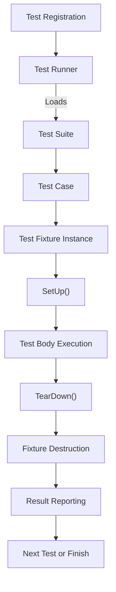

# Testing Architecture Overview

GoogleTest is built upon the well-established xUnit architecture pattern, providing a structured and extensible design for writing, grouping, discovering, and running C++ unit tests. This page introduces the core architectural concepts underlying GoogleTest, helping you understand how your tests are organized and executed, and how the framework ensures reliability and ease of use.

---

## Understanding the xUnit Architecture in GoogleTest

At its foundation, GoogleTest follows the xUnit family design principles familiar to many developers from JUnit, PyUnit, and similar frameworks. This pattern introduces a consistent test structure that fosters scalability, maintainability, and automation.

### Key Architectural Concepts

### 1. Test Cases and Test Suites

- **Test Suite (formerly Test Case):** A named collection of related tests designed to check various behaviors of a particular component or class. Grouping tests logically helps in organization, reporting, and running subsets of tests efficiently.
- **Test:** An individual function that exercises a specific aspect or path of your code, implemented as a method or standalone function.

> _Analogy_: Think of a test suite as a "folder" in your filing cabinet, containing files (tests) on related topics.

### 2. Test Fixtures

- **Test Fixture:** A class that encapsulates the shared test environment, setup, and teardown logic for tests within the same suite.
- Each test gets a fresh test fixture instance, ensuring tests run independently without shared mutable state that could cause flaky or non-deterministic outcomes.

> _User Journey_: You set up your common context once in the fixture; each test runs within a clean clone of that context, improving reliability.

### 3. Test Registry and Discovery

- GoogleTest automatically registers each test during static initialization.
- No manual enumeration is needed to run tests; the **test runner** dynamically discovers, filters, and executes tests.

> _Practical Outcome_: Write tests anywhere, and GoogleTest will find and run them all, or a specific subset with filters.

### 4. Test Runner

- Orchestrates test execution, invoking setup/teardown hooks
- Aggregates results and reports outcomes
- Supports parallel and sequential execution

### 5. Assertions and Failures

- Assertions are the verification points within tests.
- GoogleTest supports fatal and nonfatal assertions to control test flow depending on severity.

---

## How Tests Are Structured and Grouped

Each test is defined using macros that associate it with a test suite:

```cpp
TEST(TestSuiteName, TestName) {
  // Test code and assertions here
}
```

- `TestSuiteName` groups related tests.
- `TestName` identifies individual test cases.

For tests requiring shared setup or tear-down logic, you use test fixtures:

```cpp
class MyFixture : public ::testing::Test {
 protected:
  void SetUp() override {
    // Shared setup code
  }

  void TearDown() override {
    // Cleanup code
  }
  // Shared data members
};

TEST_F(MyFixture, FirstTest) {
  // Test code using fixture
}
```

### What Happens At Runtime?

1. GoogleTest’s automatic registration records the tests and fixtures.
2. When you run `RUN_ALL_TESTS()`, the test runner performs:
  - Instance creation of test fixtures for each test.
  - Execution of `SetUp()` before test body.
  - Running test code.
  - Execution of `TearDown()` after test.
  - Recording pass/fail results.

---

## Test Discovery and Execution Lifecycle

GoogleTest minimizes manual configuration through automatic discovery and execution lifecycle management.

### Test Discovery

- Tests are registered through static initialization at program startup.
- Naming conventions support dynamic filtering (e.g., run only tests in a certain suite).

### Execution Lifecycle

A linear sequence per test:

1. **Instance Creation:** A new fixture instance is created.
2. **Setup:** `SetUp()` runs to prepare the test environment.
3. **Test Body:** The test function runs.
4. **Teardown:** `TearDown()` executes for cleanup.
5. **Fixture Destruction:** The test fixture object is destroyed.
6. **Result Collection:** The status is recorded.

If any fatal assertion fails, the test aborts immediately, skipping subsequent steps, but other tests continue to run.

---

## Extensibility & Consistency Benefits

This architecture brings the following user benefits:

- **Consistency:** Standardized test setup, execution, and reporting.
- **Isolation:** Fixtures prevent state bleed between tests, avoiding flaky tests.
- **Automation:** No need to register or enumerate tests manually.
- **Extensibility:** Supports a rich ecosystem like mocking with GoogleMock, parameterized tests, and complex test hierarchies.

---

## Practical Tips & Best Practices

- Use **test fixtures** to avoid code duplication in setup/teardown.
- Name test suites and tests clearly to allow intuitive filtering.
- Keep tests independent to enable isolated debugging.
- Leverage GoogleTest’s filtering flags to focus on affected test suites during development.

---

## Visualizing the Core Testing Architecture



This flow shows how each test is instantiated, run, cleaned up, and reported.

---

For detailed instruction on writing tests using this architecture, see the [GoogleTest Primer](../../getting-started/guides/core-workflows/getting-started) and the [Core Concepts & Terminology](../../overview/product-intro-core-concepts/core-concepts-terminology) document.


## Troubleshooting Common Pain Points

- **Non-isolated tests:** Fixtures isolate tests. Avoid shared mutable state outside fixtures.
- **Misnamed test suites causing unknown tests:** Follow naming conventions strictly.
- **Tests not discovered:** Ensure tests use supported macros (`TEST`, `TEST_F`).


---

## Summary

The xUnit-based testing architecture in GoogleTest ensures a familiar, reliable, and scalable framework for C++ unit testing. Through automatic registration, test fixtures, and a consistent execution lifecycle, you can build robust tests that integrate seamlessly into your workflow.

---

## Related Documentation

- [Writing and Running Tests (API Reference)](/api-reference/core-testing-apis/writing-tests): How to define and execute tests.
- [Core Concepts & Terminology](/overview/product-intro-core-concepts/core-concepts-terminology): Definitions of key testing terms.
- [GoogleTest Primer](../../docs/primer.md): A beginner-friendly walkthrough of test writing.
- [Mock Objects and Expectations](../mock-objects-overview): Advanced work with mocks on top of this architecture.

---