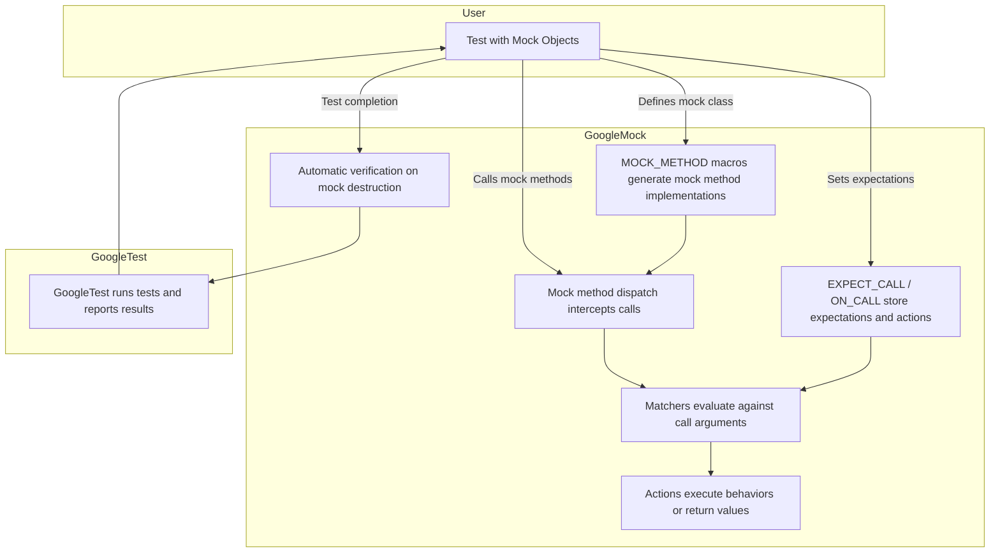

# Mocking Fundamentals and GoogleMock Architecture

GoogleMock (gMock) is a C++ framework designed to facilitate the creation and use of mock objects in unit tests. Mocking is essential when you want to isolate the behavior of components by simulating interactions with their dependencies in a controlled way. This page dives into the core mocking concepts behind GoogleMock, explaining its motivation, the mechanisms it employs (like macros and code generation), and how it integrates tightly with GoogleTest to enable comprehensive testing.

---

## Why Mock?

Imagine you are developing a complex system with components that depend on each other. When you write unit tests for one component, you often want to avoid reliance on the actual behavior of its collaborators. Reasons for this include:

- **Isolation:** Focusing on testing only the component of interest.
- **Speed:** Avoiding expensive operations like database queries or network calls.
- **Determinism:** Simulating rare or error conditions that are difficult to reproduce.
- **Verification:** Ensuring that interactions with dependencies happen as expected (e.g., certain methods are called with specified arguments).

Mock objects provide a way to achieve this by imitating the behavior of real objects while giving you fine-grained control over their interfaces and interactions.

---

## GoogleMock Approach to Mocking

### Declarative Mock Class Definitions with Macros

GoogleMock dramatically simplifies mock class creation using the `MOCK_METHOD` family of macros. These macros declare mock methods that:

- Override virtual functions of the base (real) interface or class.
- Generate all the necessary scaffolding to track calls, match arguments, and apply user-defined behaviors.

For example, mocking a simple interface looks like this:

```cpp
class FooInterface {
 public:
  virtual ~FooInterface() = default;
  virtual int GetSize() const = 0;
  virtual void SetName(const std::string& name) = 0;
};

class MockFoo : public FooInterface {
 public:
  MOCK_METHOD(int, GetSize, (), (const, override));
  MOCK_METHOD(void, SetName, (const std::string& name), (override));
};
```

Because `MOCK_METHOD` accepts the method signature and qualifiers explicitly, it allows mocking sophisticated cases including:

- Methods with overloaded signatures
- Const and non-const variations
- `noexcept` specifications
- Calling conventions like `STDMETHODCALLTYPE` on Windows
- Reference qualifiers (`&` and `&&`)
- Return types and argument types containing commas (handled via parentheses or type aliases)

This macro-based approach ensures all mocking machinery is generated consistently and correctly, freeing users from writing complex boilerplate.


### Automatic Verification & Actions

GoogleMock automatically verifies that all expectations on mock methods are satisfied at test teardown. Additionally, it enables specifying how mock methods should behave when called, with:

- **EXPECT_CALL:** Defines expectations with argument matchers, call counts, and return actions.
- **ON_CALL:** Specifies default behaviors without setting call count expectations.

You write expressions like:

```cpp
EXPECT_CALL(mock_foo, GetSize())  // Expect GetSize() call
    .Times(2)                     // Exactly twice
    .WillOnce(Return(3))          // Return 3 first time
    .WillOnce(Return(5));         // Return 5 second time
```

This declarative style makes tests highly expressive and readable.


### Behavioral Policies: Nice, Naggy, and Strict Mocks

Depending on your needs, you can control how GoogleMock reacts to **uninteresting calls** (calls to mock methods without expectations):

- **NiceMock:** Suppresses warnings for unmentioned method calls, making tests less chatty.
- **NaggyMock:** Prints warnings for uninteresting calls (this is the current default behavior).
- **StrictMock:** Treats any uninteresting call as a test failure.

These policies are implemented as template wrappers around your mock class, inheriting its constructors so you can substitute them with identical usage:

```cpp
NiceMock<MockFoo> nice_mock;  // Ignores uninteresting calls
NaggyMock<MockFoo> naggy_mock;  // Warns on uninteresting calls
StrictMock<MockFoo> strict_mock;  // Fails on uninteresting calls
```

Using the appropriate policy helps you balance testing strictness vs. convenience.


---

## GoogleMock Architecture Overview

At a high level, GoogleMock consists of:

### 1. Mock Function Mocker Classes

Each `MOCK_METHOD` invocation expands into a mock function implementer that:

- Tracks each call to the mock method
- Matches the arguments against expectations
- Executes the correct defined action
- Supports chaining of behaviors for consecutive calls

This machinery is implemented by function mockers internally using templates and various helper classes.

### 2. Expectation and Spec Builder APIs

GoogleMock provides expressive APIs to set expectations (`EXPECT_CALL`) and specify behaviors (`ON_CALL`). These create internal representations of matchers, actions, and cardinalities (how many times the method is expected to be called). They are evaluated in reverse registration order so that later expectations can override earlier ones.

### 3. Call Handling & Routing

When your test code calls a mock method, GoogleMock:

- Routes the call to the correct mock function handler.
- Searches expectations backwards until it finds one matching the call arguments and is active.
- Executes the corresponding action.
- Tracks call count and saturation.

If no expectation matches, the call is considered uninteresting or unexpected, and GoogleMock reacts based on the mock policy (nice/naggy/strict).

### 4. Integration with GoogleTest

GoogleMock is fully integrated with GoogleTest:

- Mocks are verified automatically when they are destroyed.
- GoogleTest assertion macros report expectation failures.
- GoogleTest test runners execute tests that use mocks seamlessly.

This tight integration produces an excellent developer experience.


---

## Real-World User Flow

Consider a developer writing tests for a class `FileProcessor` that depends on an interface `FileReader`:

1. **Define Mock:** Create `MockFileReader` using `MOCK_METHOD` macros for the `FileReader` interface.
2. **Create Mock Object:** Instantiate `MockFileReader` in the test.
3. **Set Default Behavior:** Use `ON_CALL` to specify default return values.
4. **Set Expectations:** Use `EXPECT_CALL` to specify which file reads are expected, with input and number of times.
5. **Exercise Code:** Run the code under test, which invokes the mock methods.
6. **Verify:** On test completion, GoogleMock automatically verifies all expectations were satisfied.

If any call is unexpected or missing, GoogleMock will report a failure promptly with detailed diagnostics.


---

## Practical Tips & Best Practices

- Always mock **interfaces** or classes with virtual methods; mocking concrete classes tightly couples your tests to implementation details.
- Use `NiceMock` by default to reduce unnecessary warnings; use `StrictMock` when you want your tests to catch unexpected interactions explicitly.
- When mocking overloaded methods, be explicit with `Const()`, `TypedEq<>`, or wrapping argument matchers to resolve ambiguities.
- Wrap complex argument types with parentheses or use type aliases in `MOCK_METHOD` to avoid parsing errors.
- Use `ON_CALL` to define common default behaviors and `EXPECT_CALL` only to set expectations you want verified.
- Take advantage of `Sequence` and `InSequence` for ordered call expectations.
- Beware of _sticky_ expectations—add `.RetiresOnSaturation()` to prevent expectations from persisting beyond their intended usage.
- Delegate calls to real or fake objects when needed for partial mocking or complex behavior reuse.


---

## Common Pitfalls and Troubleshooting

- **Uninteresting call warnings:** Seen when mock methods are called without `EXPECT_CALL` but without suppressing messages explicitly. Use `NiceMock` or add catching expectations.
- **Overly strict tests:** Over-specifying calls or call order can make tests brittle.
- **Mocking non-virtual methods:** Requires advanced dependency injection strategies; GoogleMock provides tricks but generally not straightforward.
- **Const parameter warnings on MSVC:** Const parameters passed by value are ignored by the compiler, so remove top-level const qualifiers to avoid warnings.


---

## Diagram: GoogleMock Mocking Architecture Flow



---

## Summary

GoogleMock revolutionizes C++ mocking by letting you declare mock classes with simple macros, specify expectations and behaviors declaratively, and automatically verify interactions at test teardown. Its tight integration with GoogleTest provides an expressive, robust, and maintainable testing environment.

---

For more detailed instructions on using mocks, see the [Mocking Basics](../../googletest-guides/advanced-mocking/mocking-basics) guide and refer to the [Mocking Reference](../../docs/reference/mocking.md).

To understand how to control mock object strictness, explore the [Mocking Policies and Behaviors](../../googletest-guides/advanced-mocking/mocking-policies-and-behaviors) documentation.

---

### Related Pages
- [What is GoogleTest?](/overview/product-intro/what-is-googletest)
- [GoogleTest Primer](/googletest-guides/getting-started/primer)
- [Mocking Basics](/googletest-guides/advanced-mocking/mocking-basics)
- [System Architecture Overview](/overview/product-intro/architecture-overview)
- [Expectations, Actions, Cardinalities, and Matchers](/googletest-guides/advanced-mocking/expectations-actions-cardinalities-matchers)
- [Mock Classes and Methods API](/api-reference/mocking-actions/mock-classes-methods)
- [Mocking Policies and Behaviors](/googletest-guides/advanced-mocking/mocking-policies-and-behaviors)

---