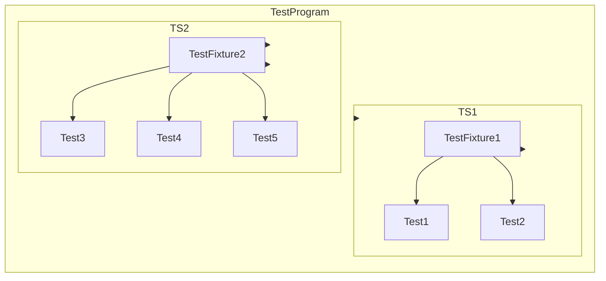

# xUnit Patterns and Test Organization

## Introduction to xUnit Design Patterns

GoogleTest is built upon the well-established xUnit architecture, a family of testing frameworks inspired by the original Smalltalk SUnit framework. These design patterns shape how tests are built, organized, and executed, ensuring clarity, maintainability, and scalability in your C++ test suites.

Understanding these patterns equips you to write tests that integrate seamlessly with GoogleTest and follow best practices consistent with the wider testing community.

## Core xUnit Test Structures

At the heart of xUnit-inspired frameworks like GoogleTest are these concepts:

- **Test**: An individual scenario that exercises a particular piece of code under defined conditions and verifies its behavior. Each test is independent and repeatable.

- **Test Suite (formerly Test Case in GoogleTest)**: A collection of related tests grouped together to logically represent a feature, functionality, or a module of the code under test.

- **Test Fixture**: A shared context for multiple tests within a test suite, setting up and tearing down common objects or state to avoid repetition and ensure consistent starting conditions.

- **Test Runner**: The component that discovers, executes, and reports on tests, managing lifecycle events such as setup, teardown, and results aggregation.

## Organizing Tests for Maintainability

### Grouping Related Tests Into Suites

GoogleTest encourages you to organize your tests into test suites that mirror the structure or logical components of your codebase. This grouping enables:

- Easier navigation and understanding of test coverage
- Shared setup through fixtures when required
- Clear reporting on which domain or feature area has successes or failures

### Using Test Fixtures for Shared Setup and TearDown

When multiple tests need to run with the same initial conditions, GoogleTest provides *test fixtures* to: 

- Establish common objects or state once per test
- Wrap repetitive setup and cleanup code
- Provide utility subroutines for all tests in the suite

By deriving a custom fixture class from `testing::Test` and using `TEST_F()`, you gain easy access to shared resources and improve test code clarity.

### Parameterized and Typed Tests for Scalability

For tests that need to be executed multiple times with different inputs, xUnit patterns include:

- **Value-Parameterized Tests**: Run the same test logic with different values supplied. In GoogleTest, use `TEST_P()` and `INSTANTIATE_TEST_SUITE_P()`.

- **Type-Parameterized Tests**: Run the same tests with different types, enabling compile-time polymorphism in testing. Use `TYPED_TEST_SUITE()` and `TYPED_TEST()` macros.

These constructs increase coverage while reducing code duplication and maintenance effort.

## Practical Implications for Test Scalability

The xUnit approach imbues your test organization with:

- Fine-grained control over test lifecycle and repeated initialization
- Independence between tests to avoid hidden inter-test dependencies
- Structure that aligns tests with code modules, easing onboarding for new developers
- Support for diverse scenarios without cluttering test bodies

## Example: Organizing Tests with Fixtures

```cpp
class CalculatorTest : public testing::Test {
 protected:
  void SetUp() override {
    calculator_.Reset();
  }

  Calculator calculator_;
};

// Uses TEST_F to access the fixture
TEST_F(CalculatorTest, AddsPositiveNumbers) {
  EXPECT_EQ(calculator_.Add(1, 2), 3);
}

TEST_F(CalculatorTest, AddsNegativeNumbers) {
  EXPECT_EQ(calculator_.Add(-1, -3), -4);
}
```

Here, both tests share the same `calculator_` instance, reset before each test.

## Example: Parameterized Test

```cpp
class FactorialTest : public testing::TestWithParam<int> {};

TEST_P(FactorialTest, ComputesFactorials) {
  int n = GetParam();
  EXPECT_GT(Factorial(n), 0);
}

INSTANTIATE_TEST_SUITE_P(
    PositiveNumbers,
    FactorialTest,
    testing::Values(1, 2, 3, 8));
```

This runs the factorial test multiple times with different input values.

## Summary Diagram of Test Organization



## Best Practices for Test Organization

- **Isolate tests**: Ensure each test is independent to avoid side effects and nondeterministic outcomes.
- **Group logically**: Align test suites with components or features for better modularity.
- **Reuse carefully**: Use fixtures to DRY up setup/teardown, but remember that GoogleTest instantiates a fresh fixture per test.
- **Name meaningfully**: Use clear and descriptive names for tests and suites to convey intent.
- **Leverage parametrization**: Utilize parameterized tests for repeated logic with varying inputs.
- **Prefer `TEST_F` over `TEST` when setup is shared**: Use fixtures where common context is necessary.

## Common Pitfalls and Troubleshooting

- **Confusing Test Suite vs Test Names**: Remember `TEST(TestSuiteName, TestName)`; repeated `TestName`s may occur across suites but not within the same one.
- **Fixture misuse**: Test fixtures are created freshly for each test—state is not shared across tests.
- **Mixing terminology**: GoogleTest prefers *Test Suite* over *Test Case* now; maintain clarity to avoid confusion.

## Further Learning and Next Steps

GoogleTest documentation provides deeper exploration on related subjects:

- [GoogleTest Primer](primer.md): Beginner guide with working examples
- [Parameterized and Type-Parameterized Tests](../writing-and-running-tests/parameterized-and-type-parameterized-tests.md)
- [Test Discovery and Execution Lifecycle](test-lifecycle.md): Understand test execution phases
- [Advanced Mocking and Expectations](mocking-basics.md, expectations-actions-cardinalities-matchers.md)

Understanding these xUnit patterns is foundational to utilizing all of GoogleTest’s capabilities effectively, ensuring your tests are well-structured, scalable, and maintainable.

---

## References

- International Software Testing Qualifications Board (ISTQB) Glossary for Test Suite and Test Case definitions: [ISTQB Test Suite](https://glossary.istqb.org/en_US/term/test-suite), [ISTQB Test Case](https://glossary.istqb.org/en_US/term/test-case)
- [GoogleTest Primer](primer.md)
- [GoogleTest Test Lifecycle](test-lifecycle.md)
- [GoogleTest Parameterized Tests](parameterized-and-type-parameterized-tests.md)
- [GoogleMock Basics](mocking-basics.md)

---

*This documentation page focuses solely on the conceptual organization and patterns for tests in GoogleTest, mapping how suites, fixtures, parameterizations, and individual tests interrelate to promote test clarity, reuse, and growth.*