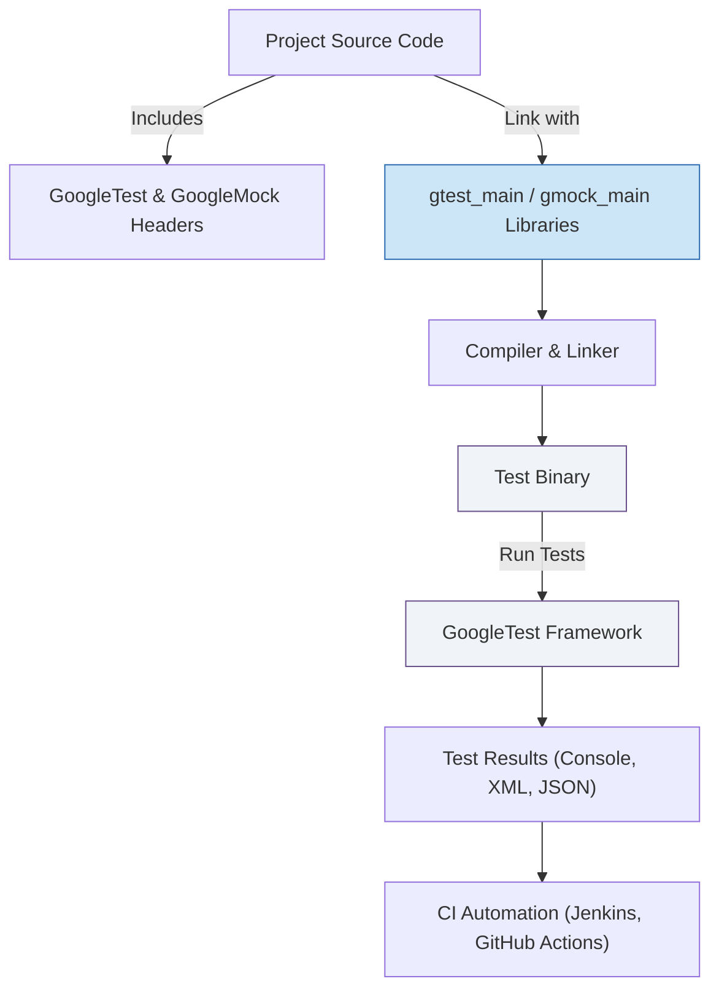

# Framework Integration & Build Systems

Integrating GoogleTest and GoogleMock into your projects involves careful configuration of your build system and environment to ensure smooth adoption and reliable automation. This guide provides step-by-step recommendations for using popular build systems such as CMake and Bazel, as well as guidance for custom build environments. It also covers best practices and key considerations for configuring your project effectively.

---

## Supported Build Systems and Integration Strategies

GoogleTest and GoogleMock are designed to be flexible and portable, supporting a variety of build systems commonly used in C++ development. The two leading methods for integrating these libraries are via CMake and Bazel. If your project uses a custom build system, the guidance below will help you configure appropriately.

### CMake Integration

CMake is the officially recommended build system for GoogleTest and GoogleMock. It provides robust support across platforms and integrates smoothly into your existing C++ workflows.

#### Step-by-Step Setup

1. **Fetch or Include GoogleTest Sources**
   - Clone the repository or add GoogleTest as a submodule to your source tree.

2. **Configure CMakeLists.txt**
   - Use `add_subdirectory()` to pull in GoogleTest and GoogleMock.
   - Link your test targets against `gtest_main` or `gmock_main` to get the main() function automatically.

3. **Example CMakeLists.txt snippet:**

```cmake
include(FetchContent)
FetchContent_Declare(
  googletest
  URL https://github.com/google/googletest/archive/5376968f6948923e2411081fd9372e71a59d8e77.zip
)
set(gtest_force_shared_crt ON CACHE BOOL "" FORCE)  # For Windows runtime compatibility
FetchContent_MakeAvailable(googletest)

add_executable(my_tests test_main.cc foo_test.cc)
target_link_libraries(my_tests gtest_main gmock_main)
add_test(NAME MyTests COMMAND my_tests)
```

4. **Build and Run Tests**

```bash
mkdir build && cd build
cmake ..
make
ctest
```

#### Key Considerations
- **C++ Standard**: Ensure your project is set to compile with at least C++17.
- **Thread Safety**: GoogleTest is thread-safe on pthread-enabled systems. Confirm your environment supports this.
- **Shared vs Static Libraries**: Choose to build GoogleTest/GoogleMock as static or shared libraries according to your project needs (`BUILD_SHARED_LIBS` option).
- **Runtime Compatibility on Windows**: Use `gtest_force_shared_crt` to align runtime libraries.

### Bazel Integration

Bazel is widely used for scalable C++ builds, especially within Google and large projects.

#### Getting Started

1. **Add GoogleTest and GoogleMock dependencies**
   - Use the pre-built Bazel packages `@com_google_googletest//:gtest` and `@com_google_googletest//:gmock`.

2. **Example BUILD file for tests:**

```bazel
cc_test(
    name = "foo_test",
    srcs = ["foo_test.cc"],
    deps = ["@com_google_googletest//:gmock_main"],
)
```

3. **Build and Run**

```bash
bazel test //path/to:foo_test
```

#### Important Notes
- Bazel requires explicit declaration of dependencies.
- GoogleTest/Bazel supports C++17; ensure your toolchain is configured accordingly.
- GoogleMock binaries are bundled with GoogleTest in Bazel.

### Custom Build Systems

If your project does not use CMake or Bazel, you will need to:

- Include GoogleTest and GoogleMock headers in your compiler include paths.
- Compile and link source files `gtest-all.cc` and `gmock-all.cc` from the repository.
- Ensure your test executables link against pthread (on platforms that require it).
- Define the main() method by linking with `gtest_main` or `gmock_main` or providing your own.

Refer to the official build instructions for platform-specific flags and recommended compiler options.

---

## Configuration and Environment Recommendations

To maximize the reliability and maintainability of your testing framework integration, consider the following:

### Compiler and Platform Support

- GoogleTest requires at least a C++17-compatible compiler environment.
- It supports Linux, macOS, Windows (MSVC 2015 and later), and other platforms like FreeBSD.
- Confirm that your compiler flags include proper language standards and exception settings.

### Dependency Management

- Use your package manager or submodule management system to lock versions.
- Avoid mixing dynamic and static CRTs on Windows to prevent runtime conflicts.

### Threading and Parallelism

- GoogleTest supports multi-threaded test execution when pthread is available.
- If developing on Windows, verify thread-safety macros or configure accordingly.

### Linking and Library Visibility

- Prefer linking against `gtest_main`/`gmock_main` to gain automatic main() handling.
- For custom entry points, initialize GoogleTest with `testing::InitGoogleTest()` or `testing::InitGoogleMock()`.

### Build Flags and Optimizations

- Enable compiler warnings and treat them as errors for higher quality.
- Consider splitting mock class constructors and destructors out-of-line to reduce compile times.

---

## Automation and Continuous Integration (CI)

Effective integration implies smooth automation and consistent test execution in CI pipelines.

### Test Discovery and Execution

- Tests are auto-registered and auto-discovered through GoogleTest macros (`TEST()`, `TEST_F()`, etc). No manual enumeration needed.
- Use `RUN_ALL_TESTS()` to execute all registered tests.

### Output Formats

- Use XML or JSON output (e.g., `--gtest_output=xml:path`) for CI systems to parse test results.

### Controlling Verbosity

- Control GoogleMock log verbosity with the flag `--gmock_verbose=LEVEL` using levels `info`, `warning` (default), or `error`.

### Isolated and Repeatable Tests

- Ensure tests do not share mutable state unless explicitly intended.
- Incorporate proper fixture setup and teardown to maintain isolation.

---

## Example Integration Workflow



This model shows how your project source incorporates GoogleTest and GoogleMock components, compiles, links, and produces an executable test binary which runs tests and reports back results, often feeding into a CI system.

---

## Practical Tips and Best Practices

- Use **CMake** or **Bazel** wherever feasible to minimize integration complexity.
- Maintain consistent C++ standards and compiler flags across all targets.
- Prefer linking with `gtest_main` or `gmock_main` to reduce boilerplate.
- Use `ON_CALL` for common default mock behaviors and `EXPECT_CALL` only when verification is required.
- Leverage GoogleTest's verbosity flags for detailed diagnostics when debugging failures.
- Organize mock classes and test sources logically; avoid redefining mock interfaces multiple times.
- Use proper naming conventions in CMake and Bazel targets to clarify which executables are test-only.
- Consider caching compiled GoogleTest and GoogleMock to improve build efficiency.

---

## Troubleshooting Common Integration Issues

- **Linker errors**: Verify library paths and ensure consistent runtime linkage (static vs shared CRT).
- **Conflicting macros**: Define `-DGTEST_DONT_DEFINE_XXX=1` to avoid clashes with other macros.
- **Missing tests at runtime**: Confirm test registration macros (`TEST`, `TEST_F`) are correctly used.
- **Thread safety warnings**: Validate pthread availability or configure GoogleTest accordingly.
- **Slow compilation**: Move mock class constructors/destructors definitions out of headers.


---

For a deeper dive beyond integration, consult the [GoogleTest Primer](../docs/primer.md), [Mocking Reference](../docs/reference/mocking.md), and the [gMock Cookbook](../docs/gmock_cook_book.md).


---

### References

- [GoogleTest Primer](../docs/primer.md)
- [Mocking Reference](../docs/reference/mocking.md)
- [gMock Cookbook](../docs/gmock_cook_book.md)
- [CMake Integration Guide](../getting-started/prerequisites-installation/installation-cmake.md)
- [Bazel Integration Guide](../getting-started/prerequisites-installation/installation-bazel.md)


---

*This page is part of the Concepts Guide > Integration Patterns & Extensibility*


