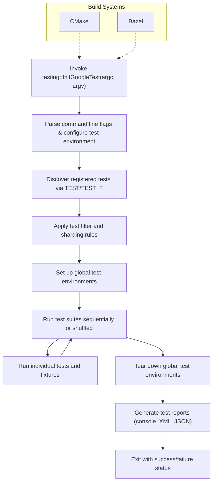

# Integration Patterns with Build and Test Ecosystems

GoogleTest and GoogleMock are designed to integrate seamlessly into a variety of C++ projects and development environments. This guide helps users understand common integration approaches, standard entry points, build system conventions, and compatibility considerations essential for smooth adoption and effective testing workflows.

---

## Standard Entry Points and Test Lifecycle

Every GoogleTest program is ultimately driven by the `RUN_ALL_TESTS()` macro/function, which discovers and runs all registered tests. Initialization is typically done via `testing::InitGoogleTest()`, which processes command-line flags for filtering, sharding, output control, and other runtime behaviors.

### Typical Main Function

Most users do not need to implement a custom main function because linking against the `gtest_main` library provides a default main. However, when customization is necessary, the main function usually looks like this:

```cpp
#include <gtest/gtest.h>

int main(int argc, char** argv) {
  testing::InitGoogleTest(&argc, argv);
  return RUN_ALL_TESTS();
}
```

- `InitGoogleTest()` handles command-line flag parsing, setting up the framework.
- `RUN_ALL_TESTS()` executes all tests respecting filters and configurations.

### Key Behaviors During Test Execution

- Tests are grouped into **test suites**, each with their own fixtures.
- Each test suite and test has well-defined lifecycle hooks (set-up and tear-down).
- Global test environments can be registered to share resources or perform setup/cleanup across test suites.
- Support exists for advanced test types like parameterized tests, typed tests, and death tests.

---

## Build System Conventions and Integration

GoogleTest and GoogleMock have native support and recommended patterns for popular build systems like CMake and Bazel.

### CMake Integration

- Use `FetchContent` or `find_package` to bring in GoogleTest/GoogleMock targets.
- Link test targets against `gtest` or `gtest_main` and `gmock` when mocking is needed.
- Configure test binaries with `add_test()` to enable ctest functionality and CI integration.

Example snippet:

```cmake
FetchContent_Declare(
  googletest
  URL https://github.com/google/googletest/archive/release-1.13.0.tar.gz
)
FetchContent_MakeAvailable(googletest)

add_executable(my_test my_test.cc)
target_link_libraries(my_test PRIVATE gtest_main gmock)
add_test(NAME my_test COMMAND my_test)
```

### Bazel Integration

- Declare `googletest` dependencies from Bazel Central Registry.
- Use `cc_test()` with `gtest` and `gmock` dependencies to define test targets.
- Utilize Bazel’s test sharding and filtering environment variables for parallel execution.

### Continuous Integration

- GoogleTest supports automatic reporting of results using XML or JSON formats.
- Flags like `--gtest_output=xml:<file>` and `--gtest_output=json:<file>` enable generation of reports consumable by CI systems.
- Test sharding allows distributing tests across multiple machines/environments to reduce test duration.

---

## Compatibility and Environment Considerations

### Platform Portability

GoogleTest and GoogleMock are portable across Linux, Windows, macOS, and several other environments. They use detailed platform macros and abstractions to provide consistent APIs.

### Thread Safety and Death Tests

- GoogleTest is thread-safe on pthread-based systems; Windows has partial support.
- Death tests run subprocesses to verify process termination and need discipline regarding thread usage.

### Using GoogleTest Flags

- Flags control test filtering (`--gtest_filter`), disabling tests, repetition, and sharding.
- It is crucial that tests respect flag processing for predictable behavior in various environments.

---

## Practical Tips for Integration Success

- Always use `testing::InitGoogleTest()` before running tests to parse flags and initialize properly.
- Prefer linking against `gtest_main` unless specific main customization is required.
- Set up shared test environments using `::testing::Environment` subclasses for expensive resources.
- Use test filtering and sharding to accelerate test runs in CI.
- Generate XML or JSON reports for detailed CI reporting.
- Avoid mixing `TEST()` and `TEST_F()` with the same test suite names to prevent fixture conflicts.

---

## Troubleshooting Common Scenarios

- **Test not discovered or not running:** Check test registration and proper linking against GoogleTest.
- **Multiple tests with the same suite name but different fixtures:** This will cause runtime errors. Ensure fixtures are consistent per test suite.
- **Failure to parse flags:** Use `testing::InitGoogleTest()` and verify command line correctness.
- **Unexpected skipping of tests:** Check filter settings and environment variable overrides.

---

## Further Exploration

For more in-depth knowledge and advanced integration scenarios, consult the following:

- [Basic Configuration & Project Setup](../getting-started/configuration-first-test/basic-configuration)
- [Using GoogleMock in Tests](../guides/mocking-advanced/getting-started-mocking)
- [Build System Integration Guide](../guides/real-world-integration/build-system-integration)
- [Test Execution Lifecycle](../concepts/architecture-overview/test-execution-lifecycle)

---

## Visualizing the Integration Workflow



---

## Summary

This page covers the typical integration patterns of GoogleTest and GoogleMock into C++ projects, explaining the recommended entry points, test lifecycle, build system usage, environment setup, and common compatibility concerns. Focused on user needs, it guides seamless adoption and efficient testing workflows.

---

<Callout title="Tip">
For robust integration, always prefer linking with `gtest_main` to avoid writing a custom main, and leverage the rich suite of command-line flags to tailor test execution across development and CI environments.
</Callout>

<Callout title="Note">
Generating structured test reports (XML/JSON) is essential for CI pipelines; configure the `--gtest_output` flag accordingly.
</Callout>

---

# Glossary

| Term               | Description                                         |
|--------------------|-----------------------------------------------------|
| `InitGoogleTest`   | Function initializing GoogleTest, parses flags.     |
| `RUN_ALL_TESTS`    | Macro/function that runs all registered tests.       |
| Test Suite         | Grouping of related tests sharing common fixture.   |
| Test Fixture       | A class containing shared setup/teardown for tests. |
| Death Test         | Test checking program termination conditions.       |
| Sharding           | Splitting tests across multiple machines.           |
| `gtest_main`       | Prebuilt library providing a default main function. |

---

## Related Documentation

- [GoogleTest Primer](../docs/primer.md) — Basics of writing tests
- [GoogleMock for Dummies](../docs/gmock_for_dummies.md) — Introduction to mocking
- [Build System Integration](../guides/real-world-integration/build-system-integration.md)
- [Command-Line Flags Guide](../docs/advanced.md#running-test-programs-advanced-options)

---

## Summary
GoogleTest and GoogleMock integrate through a standardized entry point (`InitGoogleTest` + `RUN_ALL_TESTS`), with deep support for toolchains like CMake and Bazel. The frameworks provide powerful flag controls, support for parallel and filtered test runs, and generation of CI-consumable reports. Best practices ensure reliable, predictable test behavior across platforms.

---

# End of Document
