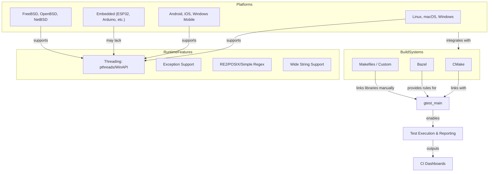

# Supported Platforms and Integration Patterns

GoogleTest is a robust and portable C++ testing framework used widely across diverse platforms and build environments. This documentation provides a comprehensive overview of platform compatibility and integration workflows to help you successfully incorporate GoogleTest into your development lifecycle.

---

## Platform Compatibility Overview

GoogleTest adheres to Google's [Foundational C++ Support Policy](https://opensource.google/documentation/policies/cplusplus-support) and supports numerous compilers, operating systems, and architectures. This wide compatibility ensures that tests you write using GoogleTest can run smoothly across environments ranging from desktop operating systems to embedded platforms.

### Key Supported Platforms

- **Desktop and Server OS:** Linux, macOS, Windows
- **BSD Variants:** FreeBSD, OpenBSD, NetBSD
- **Mobile and Embedded:** Android, iOS, Windows Mobile, embedded RTOSes
- **Cross Platform Toolchains:** MinGW, Cygwin

### Compiler and Language Standards

GoogleTest requires a compiler supporting **C++17 or later**, ensuring modern language features and better type safety. Supported compilers include GCC, Clang, MSVC, and others aligned with this standard.

### Platform Features and Limitations

- **Thread Safety:** Enabled on systems supporting pthreads or Windows threading primitives.
- **Exception Support:** Automatically detected and respected by GoogleTest.
- **Regular Expressions:** Uses RE2, POSIX, or a simple regex engine depending on platform capabilities.
- **Wide Strings:** Availability depends on platform and standard library support.

<Tip>
If your platform is not officially supported or GoogleTest does not automatically detect some features, you can fine-tune the environment by defining overriding macros during your build, as documented in `gtest-port.h`.
</Tip>

---

## Integration with Build Systems

GoogleTest is designed to integrate seamlessly into popular build systems commonly used in C++ projects. This flexibility enables you to adopt GoogleTest without overhauling your build infrastructure.

### CMake Integration

GoogleTest provides official CMake support with a straightforward setup:

1. **Fetch and Include GoogleTest:**

```cmake
include(FetchContent)
FetchContent_Declare(
  googletest
  URL https://github.com/google/googletest/archive/5376968f6948923e2411081fd9372e71a59d8e77.zip
)
FetchContent_MakeAvailable(googletest)
```

2. **Link Against Targets:**

```cmake
add_executable(my_tests test.cpp)
target_link_libraries(my_tests GTest::gtest_main)
add_test(NAME my_tests COMMAND my_tests)
```

3. **Control Runtime Options:**

GoogleTest offers CMake options like `gtest_force_shared_crt` to align runtimes on Windows.

<Tip>
Linking your tests with `gtest_main` makes it unnecessary to write your own `main()` function unless customization is required.
</Tip>

### Bazel Integration

GoogleTest also integrates well with [Bazel](https://bazel.build/), Google's open-source build system.

- Bazel can build and run tests written with GoogleTest natively.
- You can use the provided Bazel rules for test targets to automate compilation and execution.

### Other Build Systems

- For **Makefiles** or custom scripts, compile GoogleTest as a static or shared library and link your test binaries directly.
- Cross-compilation scenarios are supported by adjusting compiler flags and environment variables.

---

## Adaptation for Embedded and Cross-Platform Development

GoogleTest is suitable for embedded environments such as Arduino, ESP32, and other microcontrollers, though platform constraints must be respected.

### Embedded Platforms Considerations

- GoogleTest supports Arduino-like setups where program entry points are `setup()` and `loop()` instead of `main()`.
- On such platforms, GoogleTest initializes in `setup()` and runs tests inside the `loop()` function.
- Some platforms may lack full file systems, wide string support, or exceptions, which may limit certain features.

### Cross-Compilation Tips

- Verify the target platform compiler supports at least C++17.
- Adjust GoogleTest macros such as `GTEST_HAS_PTHREAD` to reflect threading capabilities.
- Use flags like `-DGTEST_HAS_EXCEPTIONS=0` if exception support is disabled on the target.

<Warning>
Not all GoogleTest features are available in constrained environments. Test your setup thoroughly to ensure compatibility.
</Warning>

---

## GoogleTest in Continuous Integration Pipelines

GoogleTest's output formats integrate well with common CI/CD systems, enabling automatic test discovery and reporting.

### Test Reporting

- Supports XML output for integration with CI dashboards.
- Offers reproducible test execution for debugging failed cases.

### Automation

- Can be invoked via standard command-line tools in build pipelines.
- Flags offer control over test filtering and logging verbosity.

### Best Practices

- Link with `gtest_main` for simplicity.
- Call `testing::InitGoogleTest(&argc, argv)` at program start to parse flags.
- Always return the exit value from `RUN_ALL_TESTS()` in your `main()` to signal success or failure.

---

## Summary Diagram: Platform and Integration Overview



---

## Practical Tips for Success

- Always validate platform capabilities during initial setup with small test programs.
- Customize macro definitions in challenging environments using compiler flags to enable or disable features like exceptions and threading.
- Use official CMake and Bazel integration guides for streamlined configuration.
- On embedded platforms, implement platform-specific `setup()` and `loop()` functions following GoogleTest examples.
- Monitor GoogleTest output with enhanced verbosity flags for troubleshooting.

---

## Troubleshooting Common Integration Issues

<AccordionGroup title="Troubleshooting Support">  
<Accordion title="Build and Link Errors">  
When encountering build issues, verify that:

- You include GoogleTest headers and source files correctly.
- Compiler flags enforce at least C++17 standard.
- Flags like `-DGTEST_HAS_PTHREAD=1` or `-DGTEST_HAS_PTHREAD=0` correctly reflect your platform.
- Linking is done against the correct GoogleTest or GoogleMock libraries.

See the [Common Setup Issues](getting-started/troubleshooting-support/common-setup-issues) guide for detailed steps.
</Accordion>  
<Accordion title="Thread Safety Concerns">  
- Ensure your platform supports threading if you rely on it.
- If running on single-threaded or embedded platforms, consider disabling threading with macros.
- GoogleTest provides dummy mutex classes when threading is unavailable, but concurrent assertions are unsafe.
</Accordion>  
<Accordion title="Platform Feature Detection">  
- Inspect macros such as `GTEST_HAS_EXCEPTIONS`, `GTEST_HAS_PTHREAD` to confirm automatic detection was correct.
- Override them via compiler flags when detection fails.
- Log and review platform capabilities during test initialization.
</Accordion>  
</AccordionGroup>

---

## Additional Resources

- [System Requirements and Supported Platforms](/getting-started/prerequisites-installation/system-requirements)
- [Installing with CMake](/getting-started/prerequisites-installation/installation-cmake)
- [Common Setup Issues Troubleshooting](/getting-started/troubleshooting-support/common-setup-issues)
- GoogleTest Source Code: [`gtest-port.h`](https://github.com/google/googletest/blob/main/googletest/include/gtest/internal/gtest-port.h)

---

This documentation page guides you in bringing GoogleTest into your projects with confidence, ensuring platform compatibility and smooth integration within your build and continuous integration workflows.
