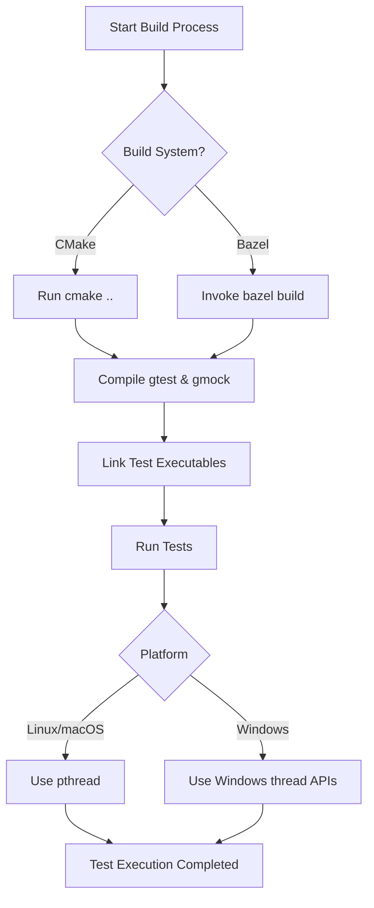

# Build System and Environment Integration

GoogleTest and GoogleMock are designed to integrate smoothly into a variety of build systems and development environments. This page walks you through the conceptual understanding and practical guidelines for incorporating these testing frameworks into your build workflows, covering CMake, Bazel, supported platforms, environment requirements, and common usage patterns.

---

## Overview

Integration with your build system is essential to reap the full benefits of GoogleTest and GoogleMock. Seamless integration enables automatic test discovery, efficient compilation, linking, and reliable execution within your existing development lifecycle.

This guide outlines:

- Supported platforms and compiler requirements
- Environment prerequisites
- Build system integration strategies with CMake and Bazel
- Guidelines for smooth library linking and runtime
- Best practices to avoid integration pitfalls

---

## Platform and Compiler Support

GoogleTest and GoogleMock are built with portability in mind and support a broad range of operating systems and compilers.

### Supported Platforms

- Linux
- macOS
- Windows (including Windows Mobile)
- Embedded platforms like Arduino (with specific adaptations)

### Compiler Requirements

- C++17 standard support is mandatory
- Compatibility with common compilers such as GCC, Clang, MSVC
- Thread-safety requires pthread or equivalent threading library support

### Threading

- Thread safety is guaranteed when pthread support is available
- For environments without pthread, thread safety may be limited or unavailable

---

## Environment Prerequisites

Before integrating, ensure your environment satisfies these requirements:

- **C++17 capable compiler:** Enable C++17 features explicitly if your build system requires it.
- **Build tools:** Install CMake version 3.14 or later for modern build conveniences.
- **Thread library:** For Unix-like platforms, verify pthread availability.
- **Runtime libraries:** Pay attention to C++ runtime linkage, especially on Windows (dynamic vs static linkage).

---

## CMake Integration

CMake is the recommended, flexible build system for integrating GoogleTest and GoogleMock.

### Typical Workflow

1. Clone the GoogleTest repository.

2. Create a separate build directory:

```bash
mkdir build
cd build
```

3. Generate build files with CMake, including GoogleMock by default:

```bash
cmake ..
```

4. To disable GoogleMock, use:

```bash
cmake .. -DBUILD_GMOCK=OFF
```

5. Build the project:

```bash
make
```

6. Optionally, install:

```bash
sudo make install
```

### Using GoogleTest and GoogleMock Libraries

- Link your test binaries against `gtest`, `gtest_main`, `gmock`, or `gmock_main` as appropriate.
- Using targets like `GTest::gtest` and `GTest::gmock` allows you to automatically match compiler and linker settings.

### Integration in Existing Projects

- Use `find_package(GTest CONFIG REQUIRED)` or `find_package(GMock CONFIG REQUIRED)` to locate installed packages.
- Alternatively, embed GoogleTest as a subdirectory and add it with `add_subdirectory()` to use the same compiler settings as your code.
- Use CMake `FetchContent` module to download GoogleTest during configuration, ensuring consistent versions.

### Windows Runtime Linking Consideration

- By default, GoogleTest builds with static runtime linkage (MT), which might conflict with dynamic runtime (MD) linkage of your project.
- Control this behavior with the `gtest_force_shared_crt` CMake option:

```cmake
set(gtest_force_shared_crt ON CACHE BOOL "" FORCE)
```

---

## Bazel Integration

Bazel users can leverage official Bazel build rules for GoogleTest and GoogleMock provided in the repository.

- Use `cc_test` and `cc_library` targets to build test suites.
- Declare dependencies on `@com_google_googletest//:gmock` and `@com_google_googletest//:gtest` as needed.
- Bazel handles transitive dependencies, including thread libraries.

---

## Linking GoogleMock Main Library

Some projects can benefit from linking against `gmock_main`, which provides a precompiled `main()` function to simplify test executable creation.

Example `gmock_main.pc.in` snippet:

```ini
libdir=@CMAKE_INSTALL_FULL_LIBDIR@
includedir=@CMAKE_INSTALL_FULL_INCLUDEDIR@

Name: gmock_main
Description: GoogleMock (with main() function)
Version: @PROJECT_VERSION@
URL: https://github.com/google/googletest
Requires: gmock = @PROJECT_VERSION@
Libs: -L${libdir} -lgmock_main @CMAKE_THREAD_LIBS_INIT@
Cflags: -I${includedir} @GTEST_HAS_PTHREAD_MACRO@
```

Link your test binaries with `-lgmock_main` to avoid defining `main()` manually.

---

## Initialization and Test Execution Flow

When integrating GoogleMock (and GoogleTest), test executables must initialize the framework before running tests.

Typical initialization occurs with:

```cpp
int main(int argc, char** argv) {
  testing::InitGoogleMock(&argc, argv);
  return RUN_ALL_TESTS();
}
```

Alternatively, if using `gmock_main` library, this entry point is provided to you.

Special platform support is included for embedded platforms like Arduino.

---

## Best Practices and Troubleshooting Tips

- **Set Expectations Before Calling Mocks:** Always define `EXPECT_CALL` before exercising the mock to avoid undefined behavior.
- **Avoid Duplicate or Conflicting Expectations:** Expectation order matters; more specific expectations should come after default ones.
- **Use Diagnostic Flags:** Use `--gmock_verbose=info` to obtain detailed diagnostic output when integration issues occur.
- **Handle Threading Considerations:** Ensure no concurrent modifications to mock expectations during test execution.
- **Link Required Thread Libraries:** On some platforms, explicitly link `pthread` or equivalents.

---

## Summary

Integration of GoogleTest and GoogleMock relies on C++17 support, availability of threading primitives, and proper build system configuration. By adopting the recommended CMake or Bazel workflows, you ensure efficient compilation, linking, and runtime behavior. Awareness of platform-specific nuances and initialization requirements will produce stable, maintainable test environments.

---

## Further Reading

Refer to these documentation pages to deepen your understanding and implementation:

- [Supported Platforms & Integration Points](/overview/architecture-audience-integration/platforms-and-integration-points)
- [Installing on Linux, macOS, and Windows](/getting-started/requirements-installation/installing-on-linux-macos-windows)
- [Workspace & Project Configuration](/getting-started/requirements-installation/workspace-configuration)
- [Writing Your First Test Case](/getting-started/first-test-validation/writing-your-first-test)
- [Running & Validating Tests](/getting-started/first-test-validation/running-and-validating-tests)
- [Mocking Basics](/guides/core-testing-workflows/mocking-basics)

---

## References

- Official repository: [https://github.com/google/googletest](https://github.com/google/googletest)
- GoogleMock documentation: [https://google.github.io/googletest/gmock_for_dummies.html](https://google.github.io/googletest/gmock_for_dummies.html)

---

## Example Mermaid Diagram



---

<Check>
Ensure your compiler supports C++17 and your build system properly links GoogleTest and GoogleMock libraries. Use diagnostic flags and maintain proper expectation ordering to avoid integration issues.
</Check>
