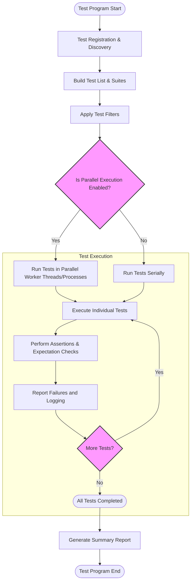

# Scalability and Performance Characteristics

Understanding how GoogleTest scales and performs is essential for integrating it effectively into projects of all sizes. This guide explores how GoogleTest's design supports fast and robust testing cycles through efficient test discovery, assertion strategies, and parallel execution.

---

## Test Discovery and Registration

GoogleTest automatically discovers tests by registering them during static initialization. This design ensures minimal overhead while enabling rapid identification and execution of tests.

- Tests are registered when the test program loads, allowing the framework to build an organized collection of tests before execution.
- The registration mechanism supports multiple test suites and fixtures, ensuring modularity and scalability.

### How Test Discovery Enhances Performance

Test discovery is performed once upfront, avoiding costly overhead during test execution. Users can rely on this for quick startup times, especially in large test suites containing thousands of tests.

**Example:**

```cpp
// Defining tests automatically registers them
TEST(FactorialTest, HandlesZeroInput) {
  EXPECT_EQ(Factorial(0), 1);
}
```

There’s no explicit registration call needed; GoogleTest manages this behind the scenes, keeping discovery performance optimal.


## Assertion Strategies and Execution Efficiency

GoogleTest delivers a broad range of assertion macros that are designed for efficiency:

- Assertions like `EXPECT_*` provide non-fatal failures, allowing tests to continue and detect multiple issues in a single run.
- Fatal assertions (`ASSERT_*`) abort the current test execution early to save time when continuing makes no sense.

### Effective Use of Assertions

Leveraging the right assertion types helps reduce unnecessary test execution time while maximizing diagnostic output.

**Scenario:**

- Use `ASSERT_*` when further test code depends on the assertion passing (e.g., pointer validity to avoid crashes).
- Use `EXPECT_*` when reporting multiple issues at once is beneficial.

### Example

```cpp
TEST(VectorTest, SizeAndContent) {
  std::vector<int> v = {1, 2, 3};
  ASSERT_FALSE(v.empty()) << "Vector should not be empty";
  EXPECT_EQ(v[0], 1);
  EXPECT_EQ(v[1], 2);
}
```

This strategy limits wasted cycles and yields precise, actionable failure reports.


## Parallel Test Execution

GoogleTest supports parallel test execution to accelerate test runs in large projects.

- The framework allows multiple test processes or threads to run tests concurrently, greatly reducing wall clock time.
- Users can leverage external test runners or CI pipelines to shard tests safely.

### Benefits of Parallelism

- Distributes expensive or long-running tests across CPUs/cores.
- Improves feedback speed without changing test code.

### Best Practices for Parallelism

- Ensure tests are independent and do not share mutable global state to avoid race conditions.
- Use proper synchronization if shared resources are involved.

### Example Parallel Workflows

With external tooling:

```bash
# Run tests in 8 parallel shards
bazel test --test_sharding_strategy=explicit --test_shards=8 //...
```

Or with scripts managing test subsets.


## Test Scenario: Handling Large-Scale Test Suites

GoogleTest's internal design is optimized for scalability:

- Test registration is lock-free and efficient, supporting thousands of tests.
- Assertions are lightweight, using macros that minimize runtime overhead.
- Supports filtering and repetition for focused test runs.

### Common Pitfalls and How to Avoid Them

- Avoid too many fatal assertions when non-fatal would suffice, to prevent premature test exit.
- Avoid tests with hidden dependencies that hurt parallel test reliability.
- Monitor test suite startup time, especially with very large numbers of tests.


## Performance Tips and Recommendations

- Use test filtering (`--gtest_filter`) to focus tests during development, speeding up feedback.
- Leverage mock objects to replace expensive dependencies, improving test speed.
- Use `NiceMock` or `StrictMock` wrappers judiciously to balance strictness and test maintainability.
- Move reusable fixture setup to `SetUpTestSuite` for expensive shared initialization.


## Troubleshooting Performance Issues

### Common Scenarios

- **Slow test discovery:** Usually only happens if excessive static initialization is present. Refactor to reduce static construction overhead.
- **Tests affected by global state:** Can cause flaky or slow tests; remediate by isolating or mocking shared components.
- **Unexpected test serialization:** Check for global locks or shared mutable state.

### Diagnostic Tools

- Use `--gtest_list_tests` to verify test registration timing.
- Enable verbose logging with `--gmock_verbose=info` for detailed mock call insights.
- Profile test executions to pinpoint bottlenecks.


## Summary

GoogleTest strikes a balance between scalability and speed by combining effective test discovery, assertion management, and parallelization. This ensures tests remain fast and reliable as their coverage and number grow.

---

## Additional Resources

- [GoogleTest Primer](https://github.com/google/googletest/blob/main/docs/primer.md) - foundational concepts and usage.
- [gMock for Dummies](https://google.github.io/googletest/gmock_for_dummies.html) - basics of mocking for better test performance.
- [Performance Optimization for Test Suites](https://github.com/google/googletest/blob/main/guides/advanced-and-best-practices/performance-optimization.md) - actionable strategies.
- [Test Suite Best Practices](https://github.com/google/googletest/blob/main/guides/advanced-and-best-practices/best-practices.md) - maintainability and speed tips.

For detailed API and advanced topics, see the navigation sections under "Concepts" and "Guides."

---

## Visualizing the Flow of Test Execution and Performance Scaling



This flow highlights how test discovery and filtering happen once before execution, while actual execution can run in parallel or serially depending on the configuration, maximizing performance and scalability.

---

<Info>
GoogleTest's integrated abilities for test discovery, efficient assertions, and parallel execution empower teams to run comprehensive test suites efficiently, supporting continuous integration and large-scale testing demands.
</Info>

<Tip>
For best performance in large projects, isolate tests to avoid shared state, use parallel execution where possible, and leverage filtering to accelerate iterations during development.
</Tip>
